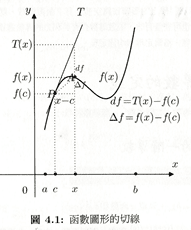
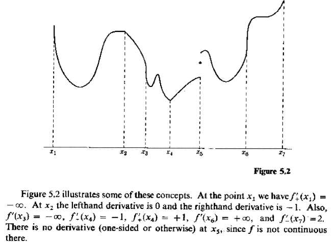
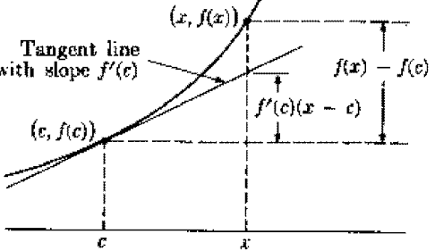
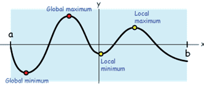
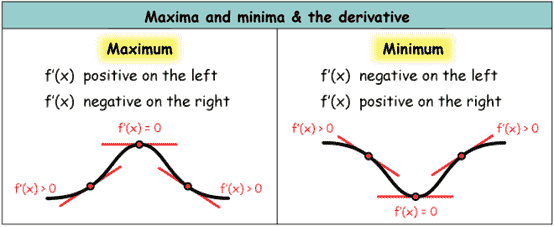
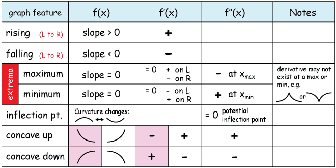

# 微分、導數\(derivative\)

## 瞬時變化率與斜率\(slope\)

* 函數$$f:(a,b) \rightarrow \mathbb{R}$$, $$c,x \in(a,b)$$ 且 $$c<x$$。
* 則當點$$c$$逐漸向點$$x$$靠近時，函數值也在由$$f(c)$$往$$f(x)$$變化。
*  函數$$f$$在區間$$[c,x]$$的平均變化率為 $$\frac{f(x)−f(c)}{(x−c) }$$。
*  若$$\displaystyle \lim_{x \rightarrow c}⁡\frac{f(x)−f(c)}{x−c}$$  存在，則函數$$f$$在點$$c$$的瞬時變化率為 $$\displaystyle \lim_{x \rightarrow c}⁡\frac{f(x)−f(c)}{x−c}$$。

## 切線斜率\(tangent slope\)

* 令平面上點$$P=(c, f(c))$$，點$$A=(x, f(x))$$，則割線$$PA$$的斜率為 $$\tan \theta = \frac{f(x)-f(c)}{x-c}$$。
* 若 $$\displaystyle \lim_{x \rightarrow c}⁡\frac{f(x)−f(c)}{x−c}$$，存在，則點$$P$$的切線斜率為$$\displaystyle \tan \alpha = \lim_{x \rightarrow c} \tan \theta = \lim_{x \rightarrow c} \frac{f(x)-f(c)}{x-c}$$。

## 實值函數在單點可微分

函數$$f$$定義在開區間$$(a,b)$$， 若內點$$c \in (a,b)$$，則
函數$$f$$在點$$c$$可微分若且唯若$$\displaystyle f^{'}(c) \equiv \lim_{x\rightarrow c}⁡\frac{f(x)−f(c)}{x−c}$$  存在，或者$$\displaystyle f^{′}(c) \equiv \lim_{h \rightarrow 0}\frac{f(c+h−f(c)}{h} $$。

*  $$f^{′}$$ 稱為一階導數\(first derivative of function f\)
  。
* 常見符號為 $$f^′ (c)=Df(c)=\frac{df}{dx}(c)=\frac{dy}{dx}|_{x=c}$$。
* $$n \in \mathbb{N}$$，函數$$f$$的$$n$$階導數為 $$f^{(n)} \equiv \frac{df^{(n-1)}}{dx}$$。

## 可微分函數與導函數\(differentiable function and derivative\)

函數$$f:[a,b] \rightarrow \mathbb{R}$$在閉區間$$[a,b]$$的每一點$$x \in [a,b]$$ 均可微分，則稱$$f$$在閉區間$$[a,b]$$為可微分函數。

* 若函數$$f$$在點$$a$$右導數$$f_+^′ (a)$$存在，則稱$$f$$在點$$a$$可微分。
*  函數$$f$$在點$$b$$左導數$$f_−^′ (b)$$存在，稱$$f$$在點$$b$$可微分。
* 而稱$$f^′ (a,b) \rightarrow \mathbb{R}$$ 為函數$$f$$的導函數
  。

## 單邊微分\(one-side derivative\)

前述函數在點$$c$$可微分的定義，是建立在$$c$$為函數$$f$$定義域的內點，現在考慮函數$$f$$定義域的邊界點之微分。

函數$$f$$定義在閉區間$$S$$，$$c \in S$$且函數$$f$$在點$$c$$連續，則

* 函數$$f$$在點$$c$$右側微分（righthand derivative）存在 $$\Leftrightarrow$$
  $$\displaystyle  f_+^′ (c) \equiv  \lim_{x \rightarrow c^+}⁡\frac{f(x)−f(c)}{x−c} \equiv \lim_{h \rightarrow 0^+}⁡\frac{f(x+h−f(x)}{h}$$ 存在（可為$$\pm \infty$$）。
* 函數$$f$$在點$$c$$左側微分（lefthand derivative）存在 $$\Leftrightarrow$$$$\displaystyle f_−^′ (c) \equiv \lim_{x \rightarrow c^− }⁡\frac{f(x)−f(c)}{x−c} \equiv \lim_{h -\rightarrow 0^− }\frac{f(x＋h)−f(x)}{h }$$存在（可為$$\pm \infty$$）。

**微分值為正負無窮大的概念與微分不存在不同**；**微分值為正負無窮大表示函數在該點的切線為垂直線；而微分值不存在是無法確定函數在該點的切線斜率（例如**不連續點或是尖點）。

**由定義可得若**$$c \in S$$**為內點，函數**$$f$$**在點**$$c$$**可微分若且唯若**$$f$$**在點**$$c$$**的左側微分等於點**$$c$$**的右側微分，即** $$f^′ (c)=f_−^′ (c)=f_+^′ (c)$$
**。**

## **函數在一點二階可微\(2nd differentiable at one point\)**

令函數 $$f:(a,b) \rightarrow \mathbb{R}$$ 為可微函數，若導函數$$f^′$$ 在點$$c \in (a,b)$$的極限$$\displaystyle  \lim_{h \rightarrow 0}⁡\frac{f^′ (c+h)−f^′ (c)}{h} $$ 存在，則稱函數$$f$$在點$$c$$二階可微分，記為 $$\displaystyle f^{′′} (c)\equiv f^{(2)}(c) \equiv \frac{d^2 f}{dx^2 }(c) \equiv \lim_{h \rightarrow 0}\frac{f^′ (c+h)−f^′ (c)}{h}$$。

## 二階可微函數與導函數\(2nd differentiable function and 2nd derivative\)

函數 $$f:(a,b) \rightarrow \mathbb{R}$$在每一點$$c \in (a,b)$$ 均為二階可微，則稱$$f$$為二階可微函數，$$f^′′:(a,b) \rightarrow \mathbb{R}$$ 為二階導函數
。

## 函數在一點n階可微函數\(n-th differentiable at one point\)

令函數$$ f:(a,b) \rightarrow \mathbb{R}$$ 為可微函數，若導函數$$f^{(n−1)}$$  在點$$c \in (a,b)$$的極限 $$ lim_{h \rightarrow 0}⁡\frac{f^{(n−1)} (c+h)−f^{(n−1)} (c)}{h} $$ 存在，則稱$$f$$在點$$c$$ $$n$$階可微，記為$$\displaystyle  f^{(n)} (c) \equiv \frac{d^n f}{dx^n}(c) \equiv \lim_{h \rightarrow 0}⁡\frac{f^{(n−1)} (c+h)−f^{(n−1)} (c)}{h}  $$
。

## 連續可微函數的集合

若函數$$f:(a,b) \rightarrow \mathbb{R}$$之導函數$$f^′:(a,b) \rightarrow \mathbb{R}$$ 存在且為一連續函數時，稱$$f$$為$$C^1$$ 函數。
記為$$f \in C^1 (a,b)
$$。

同理可得若$$f \in C^n (a,b)$$ ，即f為$$n$$階可微分且微分函數連續的函數。

若$$\forall n \in \mathbb{N}$$，其$$n$$階導函數$$f^{(n)}:(a,b) \rightarrow \mathbb{R}$$ 均存在且為一連續函數，則稱f為$$C^{\infty}$$ 函數
，記為$$f \in C^{\infty} (a,b)$$。例如：

* $$f(x) = \sin x \in C^{\infty} ( -\pi , \pi)$$
* $$f(x) = \cos x \in C^{\infty} ( -\pi , \pi)$$
* $$f(x)=e^x \in C^{\infty}(\mathbb{R})$$

## 一階微分近似函數\(Taylor series\)

函數$$f:(a,b) \rightarrow \mathbb{R}$$，且在點$$c \in (a,b)$$可微分（即$$f^′ (c)$$存在）， 則存在函數$$f^∗$$（依賴於函數$$f$$與點$$c$$）在點$$c$$連續$$\displaystyle \lim_{x \rightarrow c}f^∗ (x)=f(c)$$ 使得
$$f(x)−f(c)=(x−c) f^∗ (x)$$, $$x∈(a,b)$$  with $$f^∗ (c)=f^′ (c)
$$。

note: 給定點$$c$$，直線$$L(x)$$的斜率 $$f^{*}(x) = \frac{f(x)-f(c)}{x-c}$$

反之若存在函數$$f^∗$$ 在點$$c$$連續且滿足上式，則$$f$$ 在點$$c$$可微分且$$f^′ (c)=f^∗ (c)
$$。

* **幾何解釋為當**$$x$$**相當靠近**$$c$$**時，則函數**$$f$$**在點**$$c$$**附近近似線性**。
* 在最佳化與機器學習領域中，經常使用此線性性質。

## 導數（微分）運算為線性線子

> 函數$$f,g:(a,b) \rightarrow \mathbb{R}$$且在點$$c \in (a,b)$$可微分，則
>
> * $$(sf \pm tg)^{'}(c) = sf^{'}(c) + tg^{'}(c), \ s,t \in \mathbb{R}$$
> * $$(fg)^{'}(c) = f^{'}(c)g(c) + f(c)g^{'}(c)$$
> * $$\big(\frac{f}{g} \big)^{'}(c) = (fg^{-1})(c) = \frac{f^{'}(c)g(c) - f(c)g^{'}(c)}{g^2(c)}, \ g(c) \neq 0$$

加減法用微分的定義可簡單得出，而除法為乘法的特例，因此只證明乘法。

* 使用微分均值定理得
  * $$f(x)=f(c)+(x−c) f^{′} (x) $$
  * $$g(x)=g(c)+(x−c) g^{′} (x) $$
  * $$f(x)g(x)−f(c)g(c)=(x−c)[f(c) g^′ (x)+f^′ (x)g(c)]+(x−c)^2 f^′ (x) g^′ (x)$$
*  同除$$x−c$$後，令$$x \rightarrow c$$可得$$\begin{aligned} (fg)^{′} (c) & =\displaystyle  \lim_{x \rightarrow c}\frac{(f(x)g(x)−f(c)g(c)}{(x−c)}  \\&=\lim_{x \rightarrow c}⁡(f(c) g^{′}(x)+f^{′}(x)g(c)+(x−c) f^{′} (x) g^{′} (x)) \\&=f(c) g^{′} (c)+f^{′} (c)g(c) \end{aligned}$$\(QED\)

也可直接由定義得證$$\begin{aligned} \displaystyle &(f⋅g)^′ (c) \\&=\lim_{h \rightarrow 0}⁡\frac{f(c+h)g(c+h)−f(c)g(c)}{h}\\& =\lim_{h \rightarrow 0}⁡\frac{f(c+h)g(c+h)−f(c)g(c+h)+f(c)g(c+h)−f(c)g(c)}{h}\\&=\lim_{h \rightarrow 0}⁡\frac{f(c+h)−f(c)}{h}g(c+h)+\lim_{h \rightarrow 0}f(c)\frac{  (g(c+h)−g(c)}{h} \\&=f^′ (c)g(c)+f(c) g^′ (c) \end{aligned}$$\(QED\)

## 多項式的導數

> $$\forall c \in \mathbb{R}, \ n \in \mathbb{N} $$
>
> * $$\frac{dc}{dx}=0$$,
> * $$\frac{dx^n}{dx}=nx^{n−1} $$
> * $$\frac{d}{dx} (a_0+a_1 x+a_2 x^2+⋯+a_n x^n )=a_1+2a_2 x+ + 3a_3 x^2+ \ldots +na_n x^{n−1} $$

* $$\frac{dc}{dx} = \lim_{h \rightarrow 0} \frac{f(x+h) - f(x)}{h} =  \lim_{h \rightarrow 0} \frac{0-0}{h} = 0$$\(QED\)
* $$\begin{aligned} \frac{dx^n}{dx} &= \lim_{h \rightarrow 0} \frac{(x+h)^n - x^n}{h} \\&= \lim_{h \rightarrow 0} \frac{\sum_{i=0}^n \binom{n}{i}h^i x^{n-i}-x^n }{h} \\&= nx^{n-1} \end{aligned}$$\(QED\)

#### 範例

* $$f(x)=x^5$$, $$f^{'}(x)=5x^4$$
* $$f(x)=x^{-\frac{3}{2}}$$, $$f^{'}(x)=-\frac{3}{2}x^{-\frac{5}{2}}$$

## 指數的導數

> * $$\frac{d e^x}{dx}=e^x$$
> * $$\frac{d \ln x}{dx} = \frac{1}{x}$$

## 導數鏈法則（chain rule）

> 函數$$f$$定義在開區間S，且函數$$g$$定義在區間$$f(S)$$，則組合函數$$(g \circ f)(x) \equiv g(f(x))  $$。
>
> • 假設點$$c \in S$$ 且$$f(c)$$為$$f(S)$$的內點（interior point）。若函數$$f$$在點$$c$$可微分且函數$$g$$在點$$f(c)$$可微分，則
>
> $$ (g∘f)^′ (c)=g^′ (f(c)) f^′ (c)
$$
>
> 可使用符號方便記憶 
>
> * $$z(y)=g(y)=(g \circ f)(x), ~ y(x)=f(x) $$
> * $$\frac{dz}{dx}=\frac{dz}{dy}\frac{dy}{dz} $$

* 因為$$f$$在點$$c$$可微分，所以一階線性近似$$f(x)−f(c)=(x−c) f^{∗}(x)  $$,$$\forall x \in S$$
* 同理可得一階線性近似$$ g(y)−g(f(c))=(y−f(c)) g^∗ (y)$$, $$\forall y \in T \subseteq f(S), f(c) \in T$$
* 選$$x \in S$$且滿足$$y=f(x) \in T$$，則
  		$$g(f(x))−g(f(c))=(f(x)−f(c)) g^∗ (f(x))=(x−c) f^∗ (x) g^∗ (f(x))
  $$	
* $$\displaystyle \lim_{x \rightarrow c}⁡\frac{g(f(x))−g(f(c))}{(x−c)}=\lim_{x \rightarrow c}⁡ f^∗ (x) g^∗ (f(x))=f^′ (c) g^′ (f(c))$$  \(QED\)

## 局部極值\(local extreme value\)

> $$(M,d)$$為度量空間，令$$a \in S \subseteq M$$, 函數$$f:S \rightarrow \mathbb{R}$$, 則
>
> * 函數$$f$$在點$$a$$有局部極大值\(local maximum\) 若 $$\exists  \text{ ball } B(a) \ni f(x) \leq f(a),   ~ \forall x \in B(a) \cap S$$
> * 函數$$f$$在點$$a$$有局部極小值\(local minimum\) 若 $$\exists \text{ ball } B(a) \ni f(x) \geq f(a), ~ \forall x \in B(a) \cap S$$
> * 函數$$f$$在點$$a$$的局部極大\(小\)值，是相對於點$$x \in B(a)\cap S$$，如果$$B(a)=S$$時，則為全局極大\(小\)值。

