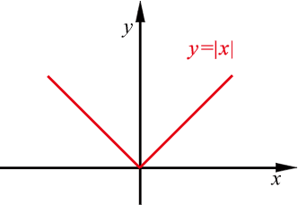

# 導數連續性質

## 導數點態連續(derivative pointwise continuous)

> * 函數$$f:(a,b) \rightarrow \mathbb{R}$$ 在點$$c \in (a,b)$$均可以微分，則$$f$$在點$$c$$連續。
> * 此為可微分必連續的充分條件（sufficient condition）。
>
> 可得若$$\forall c \in (a,b)$$, 函數$$f$$均可微分，則函數$$f$$在區間$$(a,b)$$為連續函數。
>
> 函數的定義域限制在開集合是因為邊界點通常無法保證可微分或是只有單邊可微。

* $$f(x)=f(c)+ \frac{f(x) - f(c)}{x-c}(x-c)$$
* $$\displaystyle \lim_{x \rightarrow c}f(x)=f(c) + \lim_{ x\rightarrow c}(\frac{f(x)-f(c)}{x-c}) \cdot \lim_{ x\rightarrow c}{x-c}=f(c)+f^{'}(c)\cdot 0=f(c)$$(QED)

### 連續不一定可微分

> $$f(x)=|x|$$在$$x=0$$連續，但微分不存在。

$$\displaystyle \lim_{x \rightarrow 0^{-}} |x| = \lim_{x \rightarrow 0^{+}} |x|=0$$，所以在$$x=0$$連續。

$$\displaystyle \lim_{x \rightarrow 0^{-}} \frac{|x| - 0}{x} = -1$$，$$\lim_{x \rightarrow 0^{+}} \frac{|x| - 0}{x} = 1$$，左導數不等於右導數，所以在$$x=0$$不可微分。

## 左右導數點態連續

> 函數$$f:(a,b) \rightarrow \mathbb{R} , c \in (a,b)$$
>
> * 若$$f$$在點$$c$$的左導數和右導數存在（不必相等），則$$f$$在點$$c$$連續。
> * 若$$\forall c \in (a,b)$$, 函數$$f$$的左、右導數均存在，則函數$$f$$在區間$$(a,b)$$為連續函數。

$$\displaystyle \lim_{x \rightarrow c^− }⁡(f(x)−f(c))= \lim_{x \rightarrow c^− }⁡ \frac{f(x)−f(c)}{(x−c)} (x−c)=\lim_{x \rightarrow c^−}\frac{f(x)−f(c)}{(x−c)} \cdot \lim_{x \rightarrow c^−} ⁡(x−c)=f_−^′ (c)⋅0=0$$

$$\displaystyle \lim_{x \rightarrow c^− }⁡(f(x)−f(c))= \lim_{x \rightarrow c^+ }⁡ \frac{f(x)−f(c)}{(x−c)} (x−c)=\lim_{x \rightarrow c^+}\frac{f(x)−f(c)}{(x−c)} \cdot \lim_{x \rightarrow c^+} ⁡(x−c)=f_+^′ (c)⋅0=0$$

則$$\lim_{x \rightarrow c} f(x)=f(c)$$ (QED)
