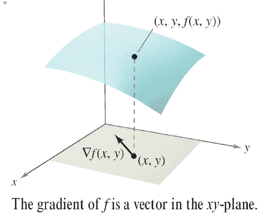

# 方向導數與梯度

## 方向導數

> 令 $$f(x,y)$$為雙變數函數，$$u=\cos \theta i + \sin \theta j$$為單位向量。
>
> 若極限存在$$\lim_{t \rightarrow 0} \frac{f(x_0 + t \cos \theta, y_0 + t \sin \theta)-f(x_0, y_0)}{t}$$，則記方向導數為$$D_uf$$。

假設$$z=f(x,y)$$為一曲面，$$(x_0, y_0) \in \mathrm{dom}f$$為定義域中一點。

單位向量$$u=\cos \theta i + \sin \theta j$$，$$\theta$$是此向量與$$x$$軸的正向夾角，可表示為對任何方向導數的方向。

求函數$$f$$沿方向$$u$$的斜率(導數）。作一個通過$$P$$, 平行於方向$$u$$的垂直平面。該垂直平面與曲面$$z=f(x,y)$$相交於曲線$$C$$。

曲面在點$$(x_0, y_0, f(x_0, y_0))$$沿著$$u$$方向的斜率就是曲線$$C$$在點$$(x_0,y_0, f(x_0, y_0))$$的斜率。

### 偏微分求方向導數

> 令 $$f(x,y)$$為雙變數函數，
>
> * 則函數$$f$$沿著單位向量$$u=\cos \theta i + \sin \theta j$$的方向導數是：$$D_uf(x,y)= \frac{\partial f(x,y)}{\partial x} \cos \theta  + \frac{\partial f(x,y)}{\partial y} \sin \theta$$
> * 函數$$f$$沿單位向量$$u=u_1i + u_2 j$$的方向導數是\
>   $$D_uf(x,y)= \frac{\partial f(x,y)}{\partial x} u_1 + \frac{\partial f(x,y)}{\partial y} u_2$$

#### 範例

* $$f(x,y)=x^2 + xy$$在點$$(1,2)$$ 沿向量$$u=(\frac{1}{\sqrt{2}}) i + (\frac{1}{\sqrt{2}})j$$的方向導數。
* $$\frac{\partial f(x,y)}{\partial x}=2x+y$$
* $$\frac{\partial f(x,y)}{\partial x}=y$$
* $$D_uf(x,y)= \frac{\partial f(x,y)}{\partial x} \cos \theta + \frac{\partial f(x,y)}{\partial y} \sin \theta = (2x+y) \frac{\sqrt{2}}{2} + y \frac{\sqrt{2}}{2}$$
* $$\therefore D_u(1,2)=\frac{5\sqrt{2}}{2}$$(QED)

## &#x20;梯度(gradient)

> 令$$f(x,y)$$為雙變數函數，且$$\frac{\partial f}{\partial x}$$與$$\frac{\partial f}{\partial x}$$均存在，則梯度為$$\nabla f=\frac{\partial f}{\partial x}i + \frac{\partial f}{\partial y}j$$。

### 方向導數為梯度與單位向量的內積

> * 方向導數：$$D_uf(x,y)= \frac{\partial f(x,y)}{\partial x} \cos \theta  + \frac{\partial f(x,y)}{\partial y} \sin \theta$$
> * 可寫成　$$\begin{aligned} & D_uf(x,y) \\  &= [\frac{\partial f(x,y)}{\partial x}i + \frac{\partial f(x,y)}{\partial y}j ] \cdot [\cos \theta i + \sin \theta j] \\ & = \nabla f(x,y) \cdot u  \end{aligned}$$
> * 方向導數為梯度與單位向量的內積

#### 範例

$$f(x,y)=3x^2 - 2y^2$$在點$$(-\frac{3}{4}, 0)$$沿$$v=\frac{3}{4}i + 1j$$的方向導數。

* 正規化方向向量$$u=\frac{v}{\|v\|}=\frac{3}{5}i + \frac{4}{5}j$$
* 梯度為$$\nabla f(x,y)=6xi - 4yj$$
* 所以在點$$(-\frac{3}{4},0)$$的方向導數為$$D_u f(-\frac{3}{4}, 0) = (-\frac{9}{2}i+0j) \cdot (\frac{3}{5} i + \frac{4}{5}j)=-\frac{27}{10}$$(sol)

### 梯度的性質

> 令函數$$f$$在點$$(x,y)$$可微分
>
> 1. 若梯度$$\nabla f(x,y)=0$$，則所有的方向導數$$D_u f(x,y)=0$$。
> 2. 函數值增加最多的方向是梯度方向$$\nabla f(x,y)$$
> 3. 函數值減小最多的方向是負梯度方向$$-\nabla f(x,y)$$

proof 1:

* 如果向量(x,y)的梯度$$\nabla f(x,y)=0$$
* 則方向導數$$D_u f(x,y) = \nabla f(x,y) \cdot u = 0 \cdot u = 0, ~ \forall u \in \mathbb{R}^2$$ (QED)

proof 2, 3:

* 令梯度$$\nabla f(x,y) \neq 0$$，且令$$\theta$$為梯度向量$$\nabla f(x,y)$$與單位向量$$u$$的夾角，則：
* $$\begin{aligned} D_u f(x,y) & = \nabla f(x,y) \cdot u \\     & = \| \nabla f(x,y) \| \|u \| \cos \theta \\     & = \| \nabla f(x,y) \cos \theta   \end{aligned}$$
* 因此當$$\cos \theta = 1$$時，$$D_u f(x,y)$$最大值發生。因此當$$\theta =0$$時，$$u, ~ \nabla f(x,y)$$同方向是函數值增加最多的方向。
* 而當$$\cos \theta = -1$$h , $$D_u f(x,y)$$最小值發生，因此當$$\theta = \pi$$時, $$\nabla f(x,y)$$反方向是函數值減少最多的方向。(QED)

### 梯度為函數等高線的法向量

> 令函數$$f$$在點$$(x_0, y_0)$$可微分，且$$\nabla f(x_0, y_0)\neq 0$$，則$$\nabla f(x_0, y_0)$$會與通過$$f(x_0, y_0)=c$$的等高線(level curve)垂直，

