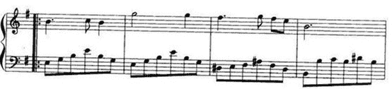

# 傅立葉分析(Fourier analysis)

## 什麼是頻率域(frequency domain)?

觀察世界都以時間貫穿，如股票的走勢、人的身高、汽車的軌跡都會隨著時間發生改變。這種以時間作為參照來觀察動態世界的方法我們稱其為時域分析。

而我們也想當然的認為，世間萬物都在隨著時間不停的改變，並且永遠不會靜止下來。但如果用另一種方法來觀察世界的話，你會發現世界是永恆不變的，這個靜止的世界就叫做頻域。

一段音樂的波型如下，這是我們對音樂最普遍的理解，一個隨著時間變化的震動。

.png>)

傅立葉分析中，任何週期函數，都可以看作是不同振幅，不同相位正弦波的疊加。在第一個例子裡我們可以理解為，利用對不同琴鍵不同力度，不同時間點的敲擊，可以組合出任何一首樂曲。

而貫穿時域與頻域的方法之一，就是傅立葉分析。傅立葉分析可分為傅立葉級數和傅立葉轉換。

