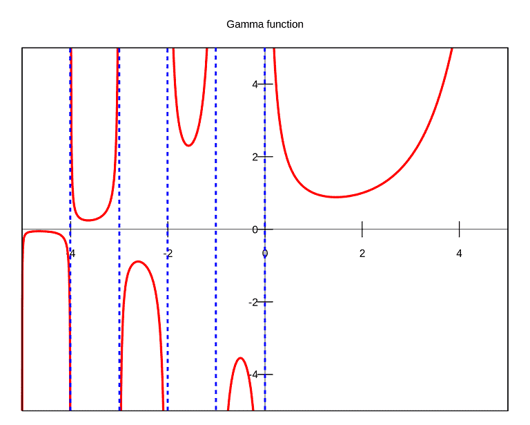

# 分數微積分\(fractional calculus\)

## 簡介

分數微積分的想法與指數類似。比如說$$2^{0.25}$$ 可解釋為某值乘積$$1/0.25=4$$次後得到$$2$$這個值。同理$$\frac{d}{dx}^{0.25}$$ 可解釋為某變數積分$$4$$次後可得到變數$$x$$。

* 所謂分數微分或積分，不是指一個分數或一個分式函數的微積分或微分，而是指微分的階數和積分的次數不是整數，它可以是任意實數。乃至於複數。當然就目前而言，在實際問題中還沒有出現階或次數為複數的情形。
* 1695 年, 德國數學家 Leibniz 和法國數學家 L'Hospital 就曾以書信的方式探討過把整數階導數 $$\frac{d^n}{dx^n} f(x)$$擴展到非整數的情況。 1819 年後,Lacroix首次給出了這一問題的正確解答: $$\frac{d^{\frac{1}{2}}}{dx^{\frac{1}{2}} } x=\frac{2}{\sqrt{2}}\sqrt{x}$$ 。
* N.H. Abel 在 1823年求解一個積分方程的過程中涉及到了分數階微積分。1832 年 Liouville 才給出了分數階導數的第一個合理的定義，而 Riemann 在 1847 年對分數階微積分的定義作了進一步的補充， 再以後又有 Weyl, Erdelyi, Osler 等數學家對分數階微積分進行過專門的研究。概括的說，分數微積分最早有系統化的研究是由 Liouville \(1832\)，Riemann\(1853\) 與 Holmgren \(1864\) 在 19 世紀初期和中葉完成。但 Grunwald 與 Krug 最先統一了 Liouville 與 Riemann積分的定義。後來又針對分數階微積分提出不同的定義如 Grunwald, Weyl-Marchand, Caputo 等分數階微積分。由於分數階微積分理論與通常的整數階微積分理論相左，又沒有實際應用背景，在此後的一百多年裡一直發展緩慢，直到 1983 年 Mandelbort 首次指出自然界及許多科學技術領域中存在大量的分數維事實，且在整體與局部之間存在自相似現象以後，作為分形幾何和分數維的動力學基礎，分數微積分才重新獲得了新的發展而成為當前國際上的一個熱點研究課題。
* 與整數階導數定義只有一種不同，數學家從不同的角度出發，給出了分數階導數的多種定義，**Riemann-Liouville 導數和Caputo 導數**是其中應用比較廣泛的兩種。\(還有Grunwald-Letnikov導數\(與RL導數等價\)等\)。

  * 對於非整數$$\alpha$$階Riemann-Liouville 導數而言，是先求$$m−\alpha$$次積分\( 相當於$$−(m−\alpha)$$ 階導數\) ，再求$$m$$ 階導數，可大致理解為**先積再微**。
  * 而對非整數$$\alpha$$ 階Caputo 導數而言，是先求$$m$$階導數，再求$$m−\alpha$$次積分\( 相當於$$−(m−\alpha)$$階導數\) ，可理解為**先微再積**。
  * 引入Riemann － Liouville\(RL\)導數定義，可以簡化分數階導數的計算； 引入Caputo 導數定義，讓其拉普拉斯變換式更簡潔，有利於分數階微分方程的討論。
  * 當$$α \in \mathbb{Z}$$ 時，這兩類分數階導數與通常的整數階導數一致。 
  * 同樣，這兩類分數階導數和整數階導數一樣也有線性性質。 另外，對函式$$f(x)$$先求$$\alpha$$次積分再求$$\alpha$$階導數，它的值仍然是f\(x\)； 但是它們之間還是有很大的區別。 **整數階導數反映的是函式在某一點的區域性性質，而分數階導數從定義上看實際上是一種積分，它與函式過去的狀態有關，反映的是函式的非區域性性質。**分數階導數的這種性質使得它非常適合構造具有記憶、遺傳等效應的數學模型。

## \(整數\)微分算子

> 考慮一般微分算子 $$D_t^n, n \in \mathbb{N}$$ （或$$\frac{d^n f(t)}{dt^n}$$），對於可微分函數$$f,g$$此算子定義如下：
>
> * $$D_t^n \cdot D_t^m [f(t)]=D_t^{n+m} [f(t)]$$ （$$\frac{d^n}{dt^n} \cdot \frac{d^m}{dt^m }f(t)=\frac{d^{n+m}}{dt^{n+m}} f(t)$$）
> * 
>   \[常數與微分算子獨立\] $$D_t^n [cf(t)]=cD_t^n [f(t)]$$ \($$\frac{d^n [cf(t)]}{dt^n}=c\frac{d^n f(t)}{dt^n}$$\), $$c \in \mathbb{R}$$
>
> * \[分配律\]  $$D_t^n [f(t) \pm g(t)]=D_t^n [f(t)] \pm D_t^n [g(t)]$$  \($$\frac{d^n [f(t) \pm g(t)]}{dt^n}=\frac{d^n f(t)}{dt^n } \pm \frac{d^n g(t)}{dt^n }$$\)
> * \[Leibniz rule\]  $$\begin{aligned} \displaystyle D_t^n [f(t)g(t)] & = \sum_{k=0}^n  \binom{n}{k}D_t^{n-k}[f(t)]D_t^k[g(t)]\\ &= \sum_{k=0}^n  \binom{n}{k}D_t^{n-k}[g(t)]D_t^k[f(t)] \end{aligned}$$
>   * $$(fg)^{'} = f^{'}g + fg^{'}$$
>   * $$(f^{'}g + fg^{'})^{'}=f^{(2)}g+2f^{(1)}g^{(1)} +fg^{(2)}$$
>   * $$(f^{(2)}g+2f^{(1)}g^{(1)} +fg^{(2)})^{'} = f^{(3)}g + 3 f^{(2)}g^{(1)}+3f^{(1)}g^{(2)}+fg^{(3)}$$
> *  $$\begin{aligned} D_t^n [t^m ] & =m(m−1)(m−2)\cdots (m−n+1) t^{m−n} \\ &=\frac{m!}{(m−n)!} t^{m−n} \\ &=\frac{\Gamma(m+1)}{\Gamma(m−n+1)  }t^{m−n}, ~ \forall m>n \end{aligned}$$

* $$n!=n \times (n−1)!$$ 在$$n \in \mathbb{N} \setminus \{1\}$$時很容易定義；而擴充到$$n \in \mathbb{R}$$時，需使用gamma function定義。
* 
  $$D_t^{1/2} D_t^{−1/2} [f(t)]=D_t^0 [f(t)]=f(t)$$ **\[負數的微分為積分**\]

* 
  對於常數$$c$$的分數階微分不一定為0。

## 迦瑪函數\(gamma function\)

> $$\displaystyle \Gamma(x) =\int_0^\infty \frac{t^{x-1}}{e^t} dt, ~x>0$$或$$(\mathrm{Re}(x) >0, x \in \mathbb{C}$$\)
>
> * $$\Gamma(z+1)=z\Gamma(z) ~ \forall z >0$$
> * 可得 $$\Gamma(n+1)=n!, ~\forall n \in \mathbb{N}$$
>
>  因此迦瑪函數為階乘的一般化版本。

### 迦瑪函數的遞迴性質

> $$\Gamma(z+1)=z \times \Gamma(z), ~\forall z>0$$

Proof:

* 分部積分 $$\int u(t)v^{′}(t) dt=u(t)v(t)−∫u^{′} (t)v(t)dt$$
* $$\Gamma (x+1)=\int_0^{\infty} \frac{t^x}{e^t} dt$$
* 令$$u=t^x, v^′=\frac{1}{e^t} \Rightarrow u^′=xt^{x−1}, v=\frac{−1}{e^t }$$
*  $$\displaystyle \therefore \int_0^\infty \frac{t^x}{e^t}  dt=\frac{​−t^x}{e^t } \bigg|_0^\infty +\int_0^\infty  \frac{xt^{x−1}}{e^t}  dt=0+\int_0^\infty \frac{(xt^(x−1)}{e^t}  dt$$
* 根據L'Hospital rule, $$\displaystyle \lim_{t \rightarrow \infty}⁡\frac{−t^x}{e^t} = \lim_{t \rightarrow \infty}⁡ \frac{xt^{x−1}}{e^t} =\ldots =\lim_{t \rightarrow \infty}  \frac{(x−1)\cdot 0}{e^t} =0$$
* $$\displaystyle \therefore \int_0^\infty  \frac{t^x}{e^t}  dt=x \int_0^\infty \frac{t^{x−1}}{e^t}  dt \Leftrightarrow \Gamma(x+1)=x \Gamma(x), ~ x>0$$ \(QED\)

* $$\displaystyle \Gamma(0)=\int_0^\infty \frac{t^{−1}}{e^t}  dt$$ 不收斂
* $$\displaystyle \Gamma(1)=\int_0^\infty \frac{1}{e^t}  dt=-\frac{​ 1}{e^t }\bigg|_0^\infty=1$$
* $$\displaystyle \Gamma(2)=\int_0^\infty \frac{t}{e^t}  dt= \frac{-t-1}{e^t } \bigg|_0^\infty=1=1\times \Gamma(1)$$
* $$\displaystyle \Gamma(3)=\int_0^\infty \frac{t^2}{e^t}  dt=​ \frac{−t^2−2t−2}{e^t} \bigg|_0^\infty=2=2 \times \Gamma(2)$$
* $$\Gamma(4)=\int_0^\infty \frac{t^3}{e^t}  dt=\frac{ ​ −t^3−3t^2−6t−6}{e^t}  \bigg|_0^\infty=6=3 \times \Gamma(3)$$
* $$\displaystyle \Gamma(0.01)=\int_0^\infty \frac{t^{−0.99}}{e^t } dt=99.4326 $$
* 
  $$\displaystyle \Gamma(1.01)=\int_0^\infty\frac{t^{0.01}}{e^t}  dt=0.994326=0.01\times \Gamma(0.01)$$

* $$\displaystyle \Gamma(0.5)=\int_0^\infty \frac{t^{−0.5}}{e^t}  dt=1.77245$$
* $$\Gamma(1.5)=\int_0^\infty \frac{t^{0.5}}{e^t } dt=0.886227=0.5 \times \Gamma(0.5)$$
* $$\Gamma(2.5)=\int_0^\infty \frac{t^{1.5}}{e^t } dt=1.32934=1.5 \times \Gamma(1.5)$$

## 使用迦瑪函數定義分數微分

> 定義微分算子$$D_t^\alpha,  ~ \alpha \in \mathbb{R}$$如下：
>
> * $$D_t^\alpha [t^\beta ] \equiv \frac{d^\alpha}{dt^\alpha} [t^\beta ]=\frac{\Gamma(\beta+1)  }{\Gamma(\beta+1−\alpha)}  t^{\beta−\alpha}$$
> * $$\beta+1 \neq0,−1,−2,\ldots,−n$$

### 分數階微分為整數階微分的一般化

* $$D_t^3 [t^5 ]=\frac{\Gamma(5+1)}{\Gamma(5+3−1) } t^{5−3}=\frac{5!}{2!} t^2=(5\times 4\times 3) \times t^2$$

### 分數階微分的Leibniz rule

> * $$\begin{aligned} \displaystyle D_t^\alpha [f(t)g(t)] & = \sum_{k=0}^\infty  \binom{\alpha}{k}D_t^{\alpha-k}[f(t)]D_t^k[g(t)]\\ &= \sum_{k=0}^\infty  \binom{\alpha}{k}D_t^{\alpha-k}[g(t)]D_t^k[f(t)] \end{aligned}$$
> * $$\displaystyle \binom{\alpha}{k} = \frac{\Gamma(\alpha+1)}{\Gamma(k+1)\Gamma(\alpha +1 -k)}$$
>
> 因為$$\alpha$$非整數，所以為無窮項之和
>
> 若$$f(t)$$或$$g(t)$$為常數時，令$$g(t)=c$$，則 $$\displaystyle  D_t^\alpha [cf(t)]=\sum_{k=0}^\infty \binom{\alpha}{k} D_t^{\alpha−k} [f(t)] D_t^k [c]=cD_t^\alpha [f(t)]$$

## 參考資料

* Kenneth S. Miller and Bertram Ross, " An introduction to the fractional calculus and fractional differential equations, "  Wiley, 1993.

