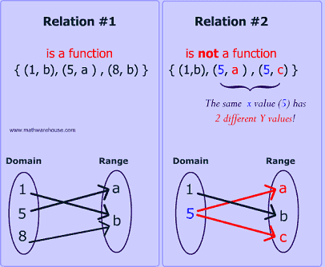
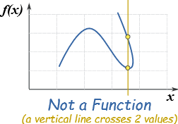
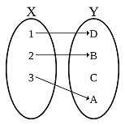
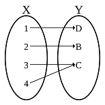

# 函數\(function\)

## 關係\(relation\)

> $$X$$為一集合，若$$\mathbf{R}\subseteq X \times X$$，稱$$\mathbf{R}$$為集合$$X$$的一個關係。
>
> 若$$(x,y)\in \mathbf{R}$$，稱$$x$$與$$y$$具有$$\mathbf{R}$$的關係，記為$$x\mathbf{R}y$$。

note: relation比function更一般化，因為可為一對多的對應。

### 等價關係\(equivalence relation\)

> 令$$\mathbb{R}$$為集合$$X$$的關係，且滿足
>
> * \[反身性, reflexive\] $$\forall x \in X,\ x \mathbf{R}x$$
> * \[對稱性, symmetric\] $$x,y\in X, \ x\mathbf{R}y \Leftrightarrow y \mathbf{R}x$$
> * \[遞移性, transitive\] $$x,y,z \in X, \  x \mathbf{R}y\ \land \ y \mathbf{R} z \Rightarrow x  \mathbf{R} z $$

e.g. $$ n \in \mathbb{N},\ X \in \mathbb{Z}, \mathbf{R} = \{ (x-y) \ \vert \ n(x-y) \}$$為等價關係。

## 函數 \(function\)

> $$X,Y$$為兩集合\(相同或相異均可\)，函數$$f: X \rightarrow Y$$定義對於$$X$$中的每一個元素$$x$$，均存在唯一的函數值$$f(x) \in Y$$。$$\forall x \in X, \exists! y \in Y \ni f(x)=y$$
>
> * $$X$$為函數$$f$$的定義域\(domain\)。
> * $$Y$$為函數$$f$$的對應域\(codomain\)。
> * $$f(X) = \{ f(x), x\in X \} \subseteq Y$$為函數$$f$$的值域，其中等號成立於$$f$$為映成函數。

• 以$$x$$軸做垂直線，如果一個映射$$f$$對映的$$f(x)$$
有兩點以上，則$$f$$不滿足函數的定義。

### 一對一與映成函數\(one-to-one and mapping function\)

一對一和映成函數可判斷兩集合\(定義域和對應域\)的勢，詳見[基數](set/cardinal-number.md#shi-yong-han-shu-pan-duan-ji-he-shi-de-da-xiao)。

* 一對一函數\(單射\)\(one-to-one function, injection\)
  * $$\forall x,y\in X, \ f(x)=f(y) \Rightarrow x = y$$
  * 等價於 $$\forall x,y \in X, x\neq y \Rightarrow f(x) \neq f(y)$$
  * 可保證值域和定義域等勢，$$|f(X)| = |X|$$，因此對應域的勢大於等於定義域，即 $$ |X| \leq |Y|$$。

* 映成函數\(滿射\)\(onto function,  surjection\)
  * $$\forall y \in Y \ \exists x \in X \ni f(x)=y$$
  * 等價於 $$\forall y \in Y, f^{-1}(y) \subseteq X \neq \emptyset$$
  * 對應域中每一個元素都被對應到，因此值域等於對應域，即$$|f(X)| = |Y|$$。
  * 可保證對應域每一個元素都被對應，但可能是多對一的關係，因此定義域的勢大於等於對應域，即$$|X| \geq |Y|$$。

由上述條件可知當$$f$$為一對一且映成函數時，定義域與對應域等勢，即$$|X|  = |Y|$$。

