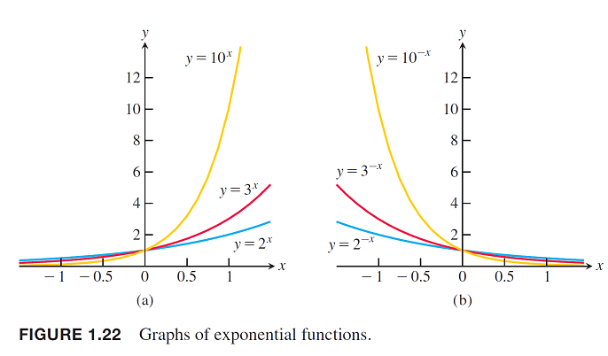

# 函數(function)

函數的定義與集合的性質

詳見 [函數中的集合](../set/function.md)。

函數只能是定義域與值域之間，多對一或是一對一的關係。

## 奇函數與偶函數（odd and even function）

> 實值函數$$f: X \rightarrow \mathbb{R}$$稱為
>
> * 奇函數，若$$f(-x)=-f(x)$$，對稱於原點。
> * 偶函數，若$$f(x) = f(-x)$$，對稱於$$y$$軸。
>
> 註：奇、偶函數的名稱是來自於$$x$$的冪次方函數，$$y=x^n$$，當$$n$$為奇數與偶數時有此性質。
>

<figure><figcaption><p>奇函數與偶函數</p></figcaption></figure>

<details>

<summary>plot code</summary>

```python
# -*- coding: UTF-8 -*-
import matplotlib.pyplot as plt
import numpy as np

def odd_even_function():
    xs = np.arange(-2, 2, 0.01)
    y1s = xs * xs
    y2s = y1s * xs

    fig, ax = plt.subplots()
    ax.plot(xs, y1s, color="blue", label="Odd Function")
    p1, p1m = (1, 1), (-1, 1)
    ax.plot(*p1, 'bo')
    ax.text(*p1, "(x,y)", {"fontsize": 18})
    ax.plot(*p1m, 'bo')
    ax.text(*p1m, "(-x,y)", {"fontsize": 18})
    ax.plot([p1[0], p1m[0]], [p1[1], p1m[1]], color="blue", linestyle='--')

    ax.plot(xs, y2s, color="green", label="even Function")
    p2, p2m = (1.5, 3.375), (-1.5, -3.375)
    ax.plot(*p2, 'go')
    ax.text(*p2, "(x,y)", {"fontsize": 18})
    ax.plot(*p2m, 'go')
    ax.text(*p2m, "(-x,y)", {"fontsize": 18})
    ax.plot([p2[0], p2m[0]], [p2[1], p2m[1]], color="green", linestyle='--')

    ax.set_title("odd function: $ y = x^2$, even function: $ y = x^3$")

    ax.axhline(y=0, color='black')
    ax.axvline(x=0, color='black')
    plt.grid()
    plt.show()


if __name__ == '__main__':
    odd_even_function()
```

</details>

## 常見的函數

### 線性函數（linear function）


### 冪函數（power function）


### 多項式函數(polynomial function)&#xD;


### 有理函數(rational function)&#xD;


### 代數函數(algebraic function)&#xD;


### 三角函數(trigonometric function)&#xD;


### 指數函數(exponential function)&#xD;



### 對數函數(logarithmic function)


函數的四則運算


$$f,g:[a,b] \rightarrow \mathbb{R}$$為兩（任意）函數，則$$\forall x \in [a,b], s,t \in \mathbb{R}$$

* 函數和法則：$$(f+g)(x)=f(x)+g(x)$$，函數$$f+g$$為函數$$f$$與函數$$g$$的和。
* 函數差法則： $$(f−g)(x)=f(x)−g(x)$$，函數$$f−g$$為函數$$f$$與函數$$g$$的差。
* 函數齊法則：$$(tf)(x)=tf(x)$$， 函數$$tf$$為函數$$f$$與實數$$t$$的係數積（scalar multiplication）。
* 函數積法則：$$(fg)(x)=f(x)g(x)$$，函數$$fg$$為函數$$f$$與函數$$g$$的點態積（pointwise multiplication）。
* 函數商法則：若$$g(x) \neq 0$$, 則$$(f/g)(x)=f(x)/(g(x))$$，函數$$f/g$$為函數$$f$$與函數$$g$$的商。
* 函數線性法則：$$(sf+tg)(x)=sf(x)+tg(x)$$，函數$$sf+tg$$為函數$$f$$與函數$$g$$的線性組合（linear combination）。
* 函數不等法則：若$$\forall x \in [a,b], f(x) \geq g(x)$$，則記為$$f \geq g$$。

## 合成函數（composite function）

> $$f:A \rightarrow B, g:B \rightarrow C$$為兩函數，則合成函數$$g \circ f: A \rightarrow C$$定義為
> $$\forall x \in A, (g \circ f)(x)=g(f(x))$$
>
> 註：合成函數無交換性，即 $$g \circ f \neq f \circ g$$


函數的位移
（shift of functions）
--------------------

> * 垂直移動：$$y=f(x)+k$$
>   * $$k>0$$時，向上移動$$k$$單位。
>   * $$k<0$$時，向下移動$$|k|$$單位。
> * 水平移動：$$y=f(x+h)$$
>   * $$h>0$$時，向左移動$$h$$單位。
>   * $$h <0$$時，向右移動$$h$$單位。


## 函數水平與垂直的縮放與映射（scaling and reflecting）

> * 縮放 $$\forall c > 1$$
>   * $$y=cf(x)$$，以係數$$c$$垂直拉伸函數圖形。
>   * $$y=\frac{1}{c}f(x)$$，以係數$$c$$垂直壓縮函數圖形。
>   * $$y=f(cx)$$，以係數$$c$$水平壓縮函數圖形。
>   * $$y = f(\frac{x}{c})$$，以係數$$c$$水平拉伸函數圖形。
> * 映射，$$c=-1$$
>   * $$y=-f(x)$$，對稱於$$x$$軸的映射函數。
>   * $$y=f(-x)$$，對旁於$$y$$軸的映射函數。


