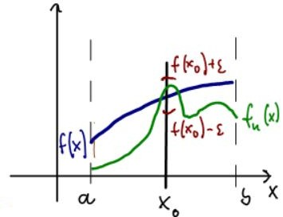
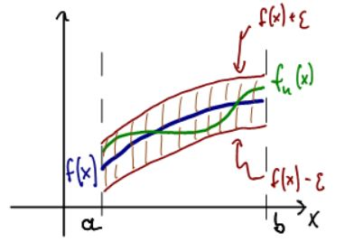

# 函數序列

## 簡介

* 點態收斂、逐點收斂(pointwise convergence)
  * <mark style="color:red;">點態收斂無法保證連續函數收斂為連續函數</mark>，但能保證收斂為處處連續函數。
  * <mark style="color:red;">點態收斂無法保證可微分函數收斂為可微分函數</mark>。
  * <mark style="color:red;">點態收斂無法保證函數序列(Riemann)積分收斂到函數極限的積分</mark>。
  * <mark style="color:blue;">因此連續函數在極限運算下不滿足封閉性</mark>。
* 一致收斂、均勻收斂(uniform convergence)
  * 均勻收斂保連續函數收斂為連續函數
  * <mark style="color:red;">均勻收斂可保證函數序列Riemann積分收斂至函數序列極限的積分</mark>。
* 一致有界(uniformly bounded)
* 無窮序列函數級數的一致收斂
* Riemann-Stieltjes積分與一致收斂

## 函數序列

令$$S \subseteq \mathbb{R}^n$$為歐式空間非空集合，$$\forall n \in \mathbb{N}$$，給定函數$$f_n: S \rightarrow \mathbb{R}$$，則$$\{f_n\}_{n \in \mathbb{N}}$$為定義在集合$$S$$的函數序列。

#### 範例

* $$S=[0,1]$$, $$f_n(x)=x^n$$
* $$S=[0,1], f_n(x)=nx(1-x^2)^n$$
* $$S=[-\pi, \pi], a_n, b_n \in \mathbb{R}$$, $$f_n(x)=a_n \cos(nx) + b_n \sin(nx)$$

## 函數數列的點態(逐點)收斂

> 給定同一定義域的實數(複數)函數數列$$\{f_n\}$$，若函數$$f$$滿足 $$\displaystyle \lim_{n \rightarrow \infty} f_n(x) = f(x), ~ x \in S$$，則稱函數$$f$$為函數數列的<mark style="color:red;">極限函數(limit function)</mark>，且稱<mark style="color:red;">函數數列</mark>$$\{f_n\}$$<mark style="color:red;">逐點收斂至集合</mark>$$S$$。
>
> $$\forall x \in S$$, $$\forall \epsilon > 0 \exists n_0 \in \mathbb{N} \ni d(f_n(x) - f(x)) < \epsilon ~\forall n \geq n_0$$
>
> 點態收斂中，$$n_0$$依賴於$$\epsilon$$與$$x$$兩者。(一致收斂只依賴於$$\epsilon$$，而與$$x$$的實際取值無關)。

點態收斂中，每一點$$x$$只考慮$$B_{\epsilon}(x)$$的收斂性，而非集合$$S$$內所有點的收斂性，因此給定$$\epsilon>0$$，當$$x_1 \neq x_2$$時，兩者收斂時所需要的項次$$n_1, n_2$$可能沒有上限。

<mark style="color:red;">點態收斂無法保證連續函數收斂為連續函數，但可保證連續函數收斂為處處連續函數(不收斂的集合測度為0)</mark>。

### 點態收斂的每一點收斂速度相異

$$f_n(x)= \frac{1}{nx^2+1}, ~ x \in \mathbb{R}, ~ n \in \mathbb{N}$$。

* 若 $$x \neq 0$$，則 $$\displaystyle \lim_{n \rightarrow \infty}f_n(x)=0$$。
* 若 $$x=0$$，可得 $$\displaystyle \lim_{n \rightarrow \infty}f_n(x) = 1$$

給定$$\epsilon = 0.5$$，

* 在$$x=0$$時，只要$$n \geq 1$$即可滿足。
* $$x=1$$時，須$$n > 1$$。
* $$x=\frac{1}{100}$$時，需要$$n > \frac{1}{10000}$$。

因此給定$$\epsilon$$值，對相異的$$x$$，收斂所需要$$n$$值大小程度不同(沒有上限)。

#### 範例：點態收斂無法保證連續函數收斂為連續函數

令$$f_n(x)=\frac{x^{2n}}{1+x^{2n}}, ~ x \in \mathbb{R}, ~ n \in \mathbb{N}$$,則$$\displaystyle \lim_{n \rightarrow \infty} f(x) = \left\{ \begin{aligned} 0 & \text{ if } |x| \leq 1, \\ \frac{1}{2} & \text{ if } |x| = 1 \\ 1 & \text{ if } |x| > 1 \end{aligned} \right.$$，由連續函數收斂至非連續函數(但為幾乎處處連續函數)。


<details>

<summary>code，逐點收斂無法保換函數連續性</summary>

```python
# -*- coding: UTF-8 -*-

import numpy as np
import matplotlib.pyplot as plt

def PointwiseConvergeOfsequenceContinuousFunction():
    # 點態收斂無法保證連續函數收斂為連續函數
    xs = np.arange(-1, 1, 0.001)
    ns = range(1, 100)

    for n in ns:
        xs2n = xs**(2*n)
        ys = xs2n/(1+xs2n)
        plt.plot(xs, ys)
    plt.legend()
    plt.show()


if __name__ == '__main__':
    PointwiseConvergeOfsequenceContinuousFunction()
```

</details>

#### 範例：點態收斂無法保證函數可微

$$S=[0,1]$$，$$\displaystyle f_n(x)=\sqrt{\frac{nx^2+1}{n}}$$

可得$$\displaystyle \lim_{n \rightarrow \infty} f_n(x) = \lim_{n \rightarrow \infty} \sqrt{\frac{nx^2+1}{n}} = \lim_{n \rightarrow \infty}\sqrt{x^2+\frac{1}{n}}=\sqrt{x^2}=|x|$$

因此$$f(x)=|x|$$在$$[0,1]$$連續，但是在$$x=0$$不可微分。

#### 範例：點態收斂無法保證函數積分收斂到極限函數的積分

函數序列$$\displaystyle \lim_{n \rightarrow \infty} \int_0^1 f_n(x) dx \neq \int_0^1 \lim_{n \rightarrow \infty} f_n(x)dx$$

令$$f_n(x)=n^2x(1-x)^n, ~ \forall x \in \mathbb{R}$$

若$$0 \leq x \leq 1$$，則$$\displaystyle f(x) = \lim_{n \rightarrow \infty} f(x) = 0$$存在，所以$$\displaystyle \int_0^1 f(x) dx = 0$$

但是$$\displaystyle \int_0^1 f_n(x) dx = n^2 \int_0^1 x(1-x)^n dx = n^2 \int_0^1 (1-t)t^n dt= \frac{n^2}{(n+1)(n+2)}$$

可得 $$\displaystyle \lim_{n \rightarrow \infty }\int_0^1 f_n(x) dx = 1$$

## 一致收斂的定義

> 有二種常見的定義：令函數序列$$\{f_n\}$$在集合$$S$$內一致收斂至函數$$f$$：
>
> 1. $$\forall \epsilon > 0$$ $$\exists n_0 \in \mathbb{N}$$ (只依賴與於$$\epsilon$$的選擇，與$$x$$無關)$$\forall x \in S \ni |f_n(x) - f(x)|< \epsilon, ~\forall n \geq n_0$$ 2.\[範數表示法] $$\displaystyle \forall \epsilon > 0, \exists n_0 \in \mathbb{N} \ni \sup_{x \in S}|f_n(x) - f(x)| < \epsilon~ \forall n \geq n_0$$
>
> 2.1. \[範數表示法] 可表示為 $$\displaystyle \lim_{n \rightarrow \infty} \sup_{x \in S} \| f_n(x) - f(x) \| = 0$$
>
> 2.2. \[範數表示法] 可再改寫為$$\sup_{x \in S}|f_n(x) - f(x)| \leq M_n$$，其中$$\{M_n\}$$為非負值且收斂至0的數列。
>
> 註：範數表示法的名稱是因為 $$\|f\|_{\infty} = \sup\{\|f(x)\| ~|~ x \in S \}$$為函數的上界範數(supremum norm)
>
> 註：一致收斂的充要條件是$$\{f_n\}$$滿足Cauchy條件。

此處$$\epsilon$$的選擇是針定所有的點$$x$$均成立，與點態收斂中$$\epsilon$$可能依$$x$$變化不同。

由2的定義可看出對於$$\forall x \in S$$，只要$$n \geq n_0$$即可保證所有點的收斂速度一致；換句話說，只要$$S$$為閉集合，只要取$$n_0$$為集合內所有點收斂時的最大值即可滿足一致收斂的定義。

一致收斂在極限時可表示為只與$$n$$有關，而與$$x$$無關的函數，見以下範例。

<details>

<summary>proof: epsilon-delta與sup定義的等價性</summary>

proof=>

令$$\{f_n\}\rightarrow f$$在集合$$S$$一致收斂，由定義得給定$$\epsilon =1$$，存在$$n_0 \ni \mathbb{N} \ni |f_n(x) -f(x)|\leq 1 \forall n \geq n_0, \forall x \in S$$。

令$$\displaystyle M_n = \sup_{x_\in S} |f_n(x)-f(x)| \geq 0$$為有限非負值，$$\forall n \geq n_0$$。

定義在$$1\leq n \leq n_0-1$$時，$$M_n \geq 0$$為任意非負值。

由於函數一致收斂，因此$$n \geq n_0$$時，可得$$|f_n(x)-f(x)| < \epsilon$$，可得$$\displaystyle M_n = \sup_{x_\in S} |f_n(x)-f(x)| < \epsilon$$，因此$$\displaystyle \lim_{n \rightarrow \infty }M_n = 0$$ (QED)

proof <=

令$$\{M_n\}$$為非負數列$$\displaystyle \lim_{n \rightarrow \infty }M_n = 0$$，且$$\sup_{x \in S}|f_n(x) - f(x)| \leq M_n ~ \forall n \geq n_0$$

給定$$\epsilon > 0$$由數列收斂得$$\exists n_1 \in \mathbb{N} \ni M_n < \epsilon ~ \forall n \geq n_1$$

取$$n_2 \geq \max(n_0, n_1)+1$$，可得$$\displaystyle \sup_{x \in S}|f_n(x) - f(x)| \leq M_n <\epsilon ~ \forall n \geq n_2$$。

因此可得$$n \geq n_2$$時，$$|f_n(x)-f(x)|< \epsilon ~ \forall x \in S$$，因此為一致收斂(QED)

</details>

### 一致收斂為點斂收斂

> <mark style="color:red;">若</mark>$$\{f_n\} \rightarrow f$$<mark style="color:red;">一致收斂，則</mark>$${f_n} \rightarrow f$$<mark style="color:red;">點態收斂</mark>。

<figure><figcaption><p>點態收態，f與fn的距離在每一點x可能不同</p></figcaption></figure>

<figure><figcaption><p>一致收斂，f與fn在定義域每一點都可保持在相同的距離內</p></figcaption></figure>

#### 範例

$$S=[-5,5]$$，$$f_n(x)=(2xn+(-1)^n x^2)/n$$，則$$\displaystyle \lim_{n \rightarrow \infty} f_n(x)=2x$$ uniformly.

$$\displaystyle \begin{aligned} |f_n(x) - f(x)| & = \left| \frac{2xn+(-1)^n x^2}{n} - 2x \right| \\ & = \left| \frac{(-1)^n x^2}{n} \right| \\ & = \frac{x^2}{n} \\ & \leq \frac{5^2}{n} ~ \because x \in [-5,5] \end{aligned}$$

因此給定$$\epsilon >0$$時，只要取$$n_0 \in \mathbb{N} \ni \frac{5^2}{n_0} < \epsilon$$，$$n_0 > \frac{5^2}{\epsilon}$$即為所求。

#### 範例

$$S=\mathbb{R}$$，$$f_n(x)=\sin(nx)/\sqrt{n}$$，$$f(x)=0$$

$$\displaystyle \begin{aligned} |f_n(x) - f(x)| &= \| \frac{\sin(nx)}{\sqrt{n}} \| \\ &= \frac{|\sin(nx)|}{\sqrt{n}} \\ & \leq \frac{1}{\sqrt{n}} \end{aligned}$$

因此給定$$\epsilon >0$$，只要取$$\frac{1}{n_0} < \epsilon \Rightarrow n_0 > \frac{1}{\epsilon}$$即為所求。

### 連續函數一致收斂後仍為連續函數

> 假設所有的函數$$f_n$$均在點$$c \in S ~ \forall n \in \mathbb{N}$$連續，若$$f_n$$一致收斂至函數$$f$$，則$$f$$也在點$$c \in S$$連續。
>
> 若$$c$$為集合$$S$$的極限點，可得$$\displaystyle \lim_{x \rightarrow c}\lim_{n \rightarrow \infty} f_n(x) = \lim_{n \rightarrow \infty} \lim_{x \rightarrow c} f_n(x)$$
>
> 在一般度量空間$$(S,d)$$也成立

<details>

<summary>proof: 可分c為孤立點和極限點的情形</summary>

若$$c$$為孤立點，則點$$f$$在$$c$$必定連續。

若$$c$$為極限點，由一致連續假設得$$\forall \epsilon >0 \forall x \in S ~\exists n_0 \in \mathbb{N} \ni |f_n(x) - f(x) |< \epsilon$$

因為所有的函數序列均在$$c$$連續，因此存在開球$$B(c, r)$$滿足$$\forall x \in B(c,r) \cap S$$, $$|f_{n_0}(x) - f_{n_0}(c)| < \epsilon$$

由於 $$|f(x)-f(c)| \leq |f(x) - f_{n_0}(x)| + |f_{n_0}(x) - f_{n_0}(c)| + |f_{n_0}(c) - f(c)|$$

且當$$x \in B(c,r) \cap S$$可得$$|f(x) - f(c)|< 3 \epsilon$$ (QED)

</details>

### 一致收斂函數序列在加減法後仍為一致收斂

> $$\{f_n\} \rightarrow f$$ uniformly on $$S$$且$$\{g_n\} \rightarrow g$$ uniformly on $$S$$，則可得$$\{f_n \pm g_n\} \rightarrow f \pm g$$ uniformly on $$S$$。

#### 範例：一致收斂函數序列在乘法時沒有一致收斂的性質

$$f_n(x) = x + \frac{1}{n}, ~ x \in \mathbb{R}$$，則函數序列一致收斂至$$f(x)=x, ~\forall x \in \mathbb{R}$$。

$$g_n(x)=(f_n(x))^2 = x^2 + \frac{2x}{n} + \frac{1}{n^2}, ~ x \in \mathbb{R}$$，則函數序列點態收斂至$$g(x)=x^2, ~\forall x \in \mathbb{R}$$。

但是$$\displaystyle \forall n \in \mathbb{N}~, \sup_{x \in \mathbb{R}}\| g_n(x) - g(x) \| = \infty$$，並非一致收斂。

### 一致收斂與內積

> $$\{f_n: S \rightarrow \mathbb{R}^n \} \rightarrow f$$ uniformly且$$\{g_n: S \rightarrow \mathbb{R}^n\} \rightarrow g$$ uniformly，
>
> 若極限函數$$f,g$$均為有界函數，則內積函數序列$$\{ \langle f_n, g_n \rangle \}$$在$$S$$一致收斂至內積 $$\langle f,g \rangle$$。

## 一致有界(uniformly bounded)

> 定義：函數$$\{f_n\}$$在集合$$S$$稱為一致有界若存在常數$$M > 0, |f_n(x)| \leq M, ~ \forall x \in S, \forall n \in \mathbb{N}$$。

一致有界是對所有$$x \in S$$以及對所有$$f_n$$有共同的上下界，<mark style="color:red;">但點態收斂不保證極限函數會在此上下界中</mark>。

### 無上下界的函數序列仍可一致收斂

$$f_n(x) = x + \frac{1}{n}, ~ x \in \mathbb{R}$$，在$$\forall n \in \mathbb{N}$$均非有界函數。

而極限函數 $$\displaystyle \lim_{n \rightarrow \infty} f_n(x) = \lim_{n \rightarrow \infty} x+ \frac{1}{n} = x$$非有界函數。

$$|f_n(x) - f(x)| = |x+\frac{1}{n} - x|\leq |\frac{1}{n}|$$只與$$n$$有關，因此為一致收斂。

### 一致收致且個別函數有界時可得一致有界

> 令$$\{f_n\} \rightarrow f$$ 在集合$$S$$一致收斂，且$$f_n, ~\forall n \in \mathbb{N}$$在$$S$$上有界，則$$f_n$$在集合$$S$$一致有界。

## 一致收斂的Cauchy條件

> 令$$\{f_n\}$$為定義在集合$$S$$上的函數序列。
>
> 函數序列$$f_n \rightarrow f$$在$$S$$一致收斂 $$\Leftrightarrow$$ $$\forall \epsilon >0 \exists n_0 \in \mathbb{N} \ni |f_m(x)-f_n(x)|<\epsilon, ~\forall m,n >n_0, ~ \forall x \in S$$
>
> 即給定$$\epsilon$$後，集合$$S$$中的所有點只要在$$n \geq n_0$$項之後， 任兩個函數列中的函數均收斂。
>
> 在一般度量空間$$(S,d)$$中也成立

註：可得$$\{f_n\}$$非一致收斂，即存在$$\{f_n\}$$的一個子函數列，以及$$S$$中的一個數列$$\{x_m\}$$使得子函列在$$\{x_m\}$$不收斂於0。

<details>

<summary>proof</summary>

\=> 令$$f_n \rightarrow f$$在點$$S$$上一致收斂，由定義得$$\forall \epsilon >0, ~\forall x \in S, ~\exists n_0 \in \mathbb{N} \ni |f_n(x) - f(x)| < \epsilon/2, ~ \forall n > n_0$$

同樣田定義可得 $$|f_m (x) - f(x) | < \epsilon/2, ~ \forall m > n_0$$

合併上述兩式得$$\forall x s\in S, ~|f_m(x)-f_n(x)|<\epsilon$$ (QED)

<=

由Cauchy條件得$$\forall x \in S, ~\{f_n(x)\}$$收斂，令$$\displaystyle f(x)=\lim_{n \rightarrow \infty} f_n(x),~ x \in S$$。

當$$\epsilon>0$$，$$\forall x \in S$$，由Cauchy條件可得$$|f_n(x) - f_{n+k}(x)| < \epsilon/2, ~k=1,2,\dots$$

因此$$\displaystyle$$$$\displaystyle \lim_{k \rightarrow \infty }|f_n(x) - f_{n+k}(x)| = |f_n(x) - f(x)| < \epsilon/2$$

因此$$\forall n > n_0$$，$$\forall x \in S$$，可得$$|f_n(x) - f(x) | < \epsilon$$ (QED)

</details>

## 判定一致收斂方法: Dini

> 令 $$f_n : S \rightarrow \mathbb{R} ~ S \subseteq \mathbb{R}^n$$，若：
>
> 1. $$S$$為緊致集
> 2. $$\forall x \in S ~ \{f_n(x)\}$$均為收斂的遞減數列，其極限函數為$$f(x)$$
> 3. $$f, f_n, ~\forall n$$均在$$S$$上連續。
>
> 則$$\{f_n\}$$在集合$$S$$上一致收斂至$$f$$。

## 判定一致收斂方法: Polya

> $$\{ f_n: [a,b] \rightarrow \mathbb{R} \}$$，若
>
> 1. 所有$$f_n$$均為遞增函數
> 2. 函數序列$$\{f_n\}$$在$$[a,b]$$逐點收斂於函數$$f: [a,b] \rightarrow \mathbb{R}$$
> 3. 極限函數$$f$$在$$[a,b]$$為連續函數
>
> 則$$\{f_n\}$$在$$[a,b]$$上一致收斂至$$f$$。

## 無窮序列函數級數的一致收斂

> 定義：給定定義在集合$$S$$的函數序列$$\{f_n\}$$。$$\forall x \in S$$，令$$\displaystyle s_n(x)=\sum_{k=1}^n f_k(x), ~n=1,2,\dots,$$。
>
> 若存在函數$$f$$使得$$s_n \rightarrow f$$在集合$$S$$一致收斂，則稱級數$$\sum_n f_n(x)$$在集合$$S$$一致收斂。
>
> 記為 $$\displaystyle \sum_{n=1}^\infty f_n(x) = f(x)$$ uniformly on $$S$$。

### 一致收斂級數的Cauchy條件

> $$\displaystyle \sum_{n=1}^\infty f_n(x) = f(x)$$ uniformly on $$S \Leftrightarrow$$$$\displaystyle \forall \epsilon > 0 ~ \forall x \in S~ \exists \sum_{k=n+1}^{n+p} |f_n(x)|< \epsilon, p=1,2,\dots,$$

### Weierstrass M-test

> 令$$\{M_n\}$$為非負實數序列且滿足$$0 \leq |f_n(x)| \leq M_n, ~n=1,2,\dots, ~\forall x \in S$$
>
> 則$$\displaystyle \sum_n f_n(x)$$在集合$$S$$一致收斂 $$\Leftrightarrow$$ $$\displaystyle \sum_n M_n$$收斂。

### 函數級數一致收斂則函數序列連續時收斂函數也連續

> 令$$\displaystyle \sum_n f_n(x) =f(x)$$在集合$$S$$一致收斂。若$$f_n$$在點$$x_0 \in S$$收斂，則$$f$$在點$$x_0$$也收斂。

若$$x_0$$為集合$$S$$的極限點，則可交換limt與sum的順序，即：$$\displaystyle \lim_{x \rightarrow x_0} \sum_{n=1}^\infty f_n(x) = \sum_{n=1}^\infty \lim_{x \rightarrow x_0} f_n(x)$$。

## 函數序列一致收斂與Riemann-Stieltjes積分

> 令$$\alpha$$在閉區間$$[a,b]$$為有界變差(bounded varation)函數。令實值函數序列$$\{f_n\}$$在閉區間$$[a,b]$$為Riemann可積($$(f_n \in R(\alpha), ~\forall n$$)。
>
> 假設在閉區間$$[a,b]$$，函數序列$$\{f_n\}$$一致收斂至函數$$f$$，且令$$\displaystyle g_n(x)=\int_a^x f_n(t)d\alpha(t),~ x \in [a,b], ~ n =1,2,3\dots$$，則可得：
>
> 1. $$f \in R(\alpha)$$ on $$[a,b]$$
> 2. $$g_n \rightarrow g$$在閉區間$$[a,b]$$一致收斂，$$\displaystyle g(x)=\int_a^x f(t) d\alpha(t)$$

此定理說明了$$\forall x \in [a,b]$$，<mark style="color:red;">在一致收斂時，極限可穿積分符號</mark>：$$\displaystyle \lim_{n \rightarrow \infty} \int_a^x f_n(t) d\alpha(t) = \int_a^x \lim_{n \rightarrow \infty} f_n(t) d \alpha(t)$$

## 函數級數一致收斂與Riemann-Stieltjes積分

> 令$$\alpha$$在閉區間$$[a,b]$$為有界變差函數，且假設$$\displaystyle \sum f_n(x)=f(x)$$在閉區間$$[a,b]$$一致收斂，$$f_n$$為實值函數且在閉區間$$[a,b]$$ Riemann可積($$f_n \in R(\alpha)$$)，則可得：
>
> 1. $$f \in R(\alpha)$$ on $$[a,b]$$
> 2. $$\displaystyle \int_a^x \sum_{n=1}^\infty f_n(t) d \alpha(t) = \sum_{n=1}^\infty \int_a^x f_n(t) d \alpha(t)$$一致收斂
>
> 註：<mark style="color:red;">上式說明一致收斂函數可逐項積分(uniformly convergent sereis can be integrated term by term)</mark>。但反之可逐項積分的函數序列不一定一致收斂。

### 範例：點態收斂函數序列可逐項積分

$$f_n=x^n,~ 0 \leq x \leq 1$$，可得$$\displaystyle \lim_{n \rightarrow \infty} f_n(x) = f(x) =\left\{ \begin{aligned} &0, ~ 0 \leq x < 1 \\ & 1, ~ x = 1 \end{aligned} \right.$$為點態收斂。

函數序列的逐漸積分為$$\displaystyle \int_0^1 f_n(x) dx = \int_0^1 x^n dx = \frac{1}{n+1} \rightarrow 0 \text{ as } n \rightarrow \infty$$

而$$\displaystyle \lim_{n \rightarrow \infty} \int_0^1 f_n(x)dx = \int_0^1 f(x)dx = 0$$

## 有界收斂(bounded convergence)

> 定義：函數序列$$\{f_n\}$$在集合$$S$$若為點斂收斂(至$$f$$)且一致有界($$\exists M >0 \ni |f_n(x) \leq M~\forall x \in S$$)，則稱$$\{f_n\}$$有界收斂。

### Arzela theorem

> 函數序列$$\{f_n\}$$在閉區間$$[a,b]$$有界收斂，且所有的函數$$f_n$$在$$[a,b]$$均為Riemann可積分。
>
> 假設極限函數$$f$$在$$[a,b]$$也為Riemann可積分，則：
>
> $$\displaystyle \lim_{n \rightarrow \infty} \int_a^b f_n(x) dx = \int_a^b \lim_{n \rightarrow \infty} f_n(x) dx = \int_a^b f(x) dx$$

註：存在$$\{f_n\}$$在$$[a,b]$$有界收斂且Riemann可積，但$$f$$在$$[a,b]$$不可積分。

### 範例：函數序列有界收斂且可積分但極限函數不可積分

令$$\{r_1, r_2,\dots\} \subseteq [0,1]$$為有理數集合，令$$f_n(x) = \left\{ \begin{aligned} &1, ~\text{ if } x = r_k, ~k=1,2,\dots,n \\ &0, ~ \text{ otherwise } \end{aligned} \right.$$

可得$$\displaystyle \int_0^1 f_n(x)dx=0, ~ \forall n$$，但$$\lim_{n \rightarrow \infty} f$$在$$[0,1]$$不可Riemann積分(但可Lebesgue積分)。
