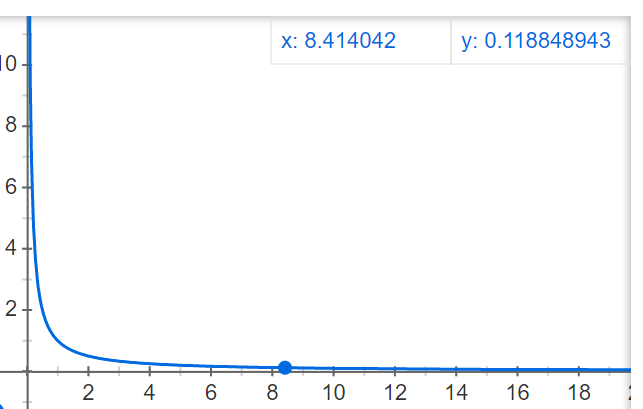

# 函數\(function\)

## 連續函數的條件

對於函數$$f: [a,b] \rightarrow \mathbb{R}$$

* 連續可微分$$\subseteq$$Lipschitz連續$$\subseteq$$均勻連續（uniform continuous）
  * $$\subseteq$$點態連續（pointwise continuous）
* Lipschitz連續$$\subseteq$$絕對連續$$\subseteq$$有界變分$$\subseteq$$幾乎處處可微分

## 點態連續（pointwise continuous）

一般的連續定義，嚴格說來叫 「點態連續」也就是說你要先在定義域內固定一個點，然後討論函數在這個點的連續性，所以這是函數一種區域性性質。

## 均勻連續、一致連續（uniform continuous）

> 定義1：對於函數$$f(x),  x \in (a,b)$$為均勻連續 $$\forall \epsilon > 0 ~ \exists \ \delta(\epsilon) > 0 ~ \ni |f(x_1) - f(x_2)|< \epsilon, ~ \forall |x_1 - x_2| < \delta$$
>
> 此處定義域兩點的距離$$\delta(\epsilon)$$需依值域的距離$$\epsilon$$調整，而與$$x$$所在的位置無關，因此不是局部的性質。

均勻連續是定義在一個集合上。也就是說，只要這個集合上任意兩點的距離足夠小，它們對應的函數值的距離也要足夠小。所以這是函數的一種全局性質。

一致連續函數能把柯西序列對映到柯西序列。而逐點連續函數則不一定，譬如反函數的例子。且在嚴格定義黎曼積分時，需要一致連續函數。

### 點態連續但非均勻連續的函數

$$f(x)=\frac{1}{x},~ x \in (0,1)$$

明顯看出該函數在$$x \rightarrow + \infty$$ 時，函數值趨於$$\infty$$且函數下凸，趨於無窮速度越來越快，因此，直觀的感覺就是該函數是非一致連續的，**換句話說如果某函數的收斂速度能夠得到控制，我們就稱該函數是均勻連續的**。

## 利普希茨（Lipschitz）條件

> 稱函數$$f$$在點$$c$$滿足$$\alpha$$階的利普希茨條件，若
存在常數$$M>0$$\(可能會依賴於$$c$$而不同\)使得 $$|f(x)-f(c)| < M |x-c|^{\alpha}$$, $$x\neq c$$且$$x \in Ball(c)$$
>
> 若對於$$f: S \rightarrow \mathbb{R}$$定義域$$S$$中任意兩點$$a,b$$，若存在常數$$M>0$$滿足$$|f(a)-f(b)|< M|a-b|^{\alpha}~ \forall a,b\in S$$時，稱$$f$$在$$S$$為利普希茨連續。
>
> \[充要條件\] 函數$$f$$可微分且利普希茨連續 $$\Leftrightarrow$$$$f^{'}$$在定義域均為有界。

* 一般應用時是考慮$$α=1$$的條件，即函數$$f$$的斜率為有限值。
* **利普希茨連續，要求函數圖像的曲線上，任意兩點連線的斜率均有界且都小於同一個常數（存在且不可為無窮大），這個常數就是利普希茨常數**。
* 對於利普希茨連續函數$$f$$，滿足條件的最小常數$$M$$稱為其**利普希茨常數，即函數斜率的最大值（最陡的部份）**。
* 若$$M<1$$時，稱$$f$$為收縮映射。

Lipschitz連續對分析復雜函數非常有用，因為它可以近似將最佳化復雜函數的問題，轉化為二次規劃問題。

如果我們有 $$\nabla f$$是Lipschitz連續的，則對於任意的 $$x,y$$ 可得 $$f(y) \leq f(x)+\nabla f(x)^{\top}(y-x)+ \frac{M}{2}\| y-x \|_2^2$$。其中 $$M$$ 為Lipschitz常數。即，可以將最佳化復雜的函數$$f(y)$$ 等價地最佳化它的上界。

### 連續可微分但非利普希茨連續的函數

$$f(x)=\sqrt{x}$$，此函數在$$[0, \infty)$$間連續可微分，$$f^{'}(x)=\frac{1}{2\sqrt{x}}$$，但是任意兩點間的斜率可以無限大（$$x\rightarrow 0$$時斜率往無窮大發散），因此不是利普希茨連續。

