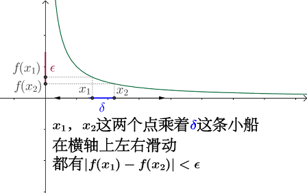

# 函數\(function\)

## 函數的定義與集合的性質

詳見 [函數中的集合](set/function.md)。

## 奇函數與偶函數（odd and even function）

> 實值函數$$f: X \rightarrow \mathbb{R}$$稱為
>
> * 奇函數，若$$f(x)=-f(x)$$，對稱於原點。
> * 偶函數，若$$f(x) = f(-x)$$，對稱於$$y$$軸。
>
> 註：• 奇、偶函數的名稱是來自於$$x$$的冪次方函數，$$y=x^n$$，當$$n$$為奇數與偶數時有此性質。

## 常見的函數

### 線性函數（linear function）

### 冪函數（power function）

### 多項式函數\(polynomial function\)

### 有理函數\(rational function\)

### 代數函數\(algebraic function\)

### 三角函數\(trigonometric function\)

### 指數函數\(exponential function\)

### 對數函數\(logarithmic function\)

## 函數的四則運算

$$f,g:[a,b] \rightarrow \mathbb{R}$$為兩（任意）函數，則$$\forall x \in [a,b], s,t \in \mathbb{R} $$

* 函數和法則：$$(f+g)(x)=f(x)+g(x)$$，函數$$f+g$$為函數$$f$$與函數$$g$$的和。
* 函數差法則： $$(f−g)(x)=f(x)−g(x)$$，函數$$f−g$$為函數$$f$$與函數$$g$$的差。
* 函數齊法則：$$(tf)(x)=tf(x)$$， 函數$$tf$$為函數$$f$$與實數$$t$$的係數積（scalar multiplication）。
* 函數積法則：$$(fg)(x)=f(x)g(x)$$，函數$$fg$$為函數$$f$$與函數$$g$$的點態積（pointwise multiplication）。
* 函數商法則：若$$g(x) \neq 0$$, 則$$(f/g)(x)=f(x)/(g(x))$$，函數$$f/g$$為函數$$f$$與函數$$g$$的商。
* 函數線性法則：$$(sf+tg)(x)=sf(x)+tg(x)$$，函數$$sf+tg$$為函數$$f$$與函數$$g$$的線性組合（linear combination）。

## 合成函數（composite function）

> $$f:A \rightarrow B, g:B \rightarrow C$$為兩函數，則合成函數$$g \circ f: A \rightarrow C$$定義為
$$ \forall x \in A, (g \circ f)(x)=g(f(x)) $$
>
> 註：合成函數無交換性，即 $$ g \circ f \neq f \circ g$$

## 連續函數的條件

對於函數$$f: [a,b] \rightarrow \mathbb{R}$$

* 連續可微分$$\subseteq$$Lipschitz連續$$\subseteq$$均勻連續（uniform continuous）
  * $$\subseteq$$點態連續（pointwise continuous）
* Lipschitz連續$$\subseteq$$絕對連續$$\subseteq$$有界變分$$\subseteq$$幾乎處處可微分

## 點態連續（pointwise continuous）

> 函數$$f$$在點$$c$$連續，則 $$\forall \epsilon >0, ~ \exists\ \delta > 0 \ni |x-c|<\delta \Rightarrow |f(x)-f(c)|<\epsilon$$
>
> 記為 $$\displaystyle \lim_{x \rightarrow c} f(x)=f(c)$$

* 一般的連續定義，嚴格說來叫 「點態連續」也就是說你要先在定義域內固定一個點，然後討論函數在這個點的連續性，所以這是函數一種區域性性質。
* 連續是要求在一個點從兩邊取極限得到的數值相同，從圖像上看就是不能有斷點或跳躍點。

點態連續時，是對每一個在定義域的點$$c$$單獨討論$$\delta$$，因此$$\delta=(x,\epsilon)$$同時依賴於其它點$$x$$與選定的$$\epsilon$$。

## 均勻連續、一致連續（uniformly continuous）

> 定義1：對於函數$$f(x),  x \in (a,b)$$為均勻連續 $$\forall \epsilon > 0 ~ \exists \ \delta(\epsilon) > 0 ~ \ni \forall x_1, x_2 \in (a,b)~ |x_1 - x_2|<\delta \Rightarrow |f(x_1) - f(x_2)|< \epsilon$$
>
> 此處定義域兩點的距離$$\delta(\epsilon)$$需依值域的距離$$\epsilon$$調整，而與$$x$$所在的位置無關，因此不是局部的性質。

均勻連續是定義在一個集合上。也就是說，只要這個集合上任意兩點的距離足夠小，它們對應的函數值的距離也要足夠小。所以這是函數的一種全局性質。

點態連續續和均勻連續的概念大致都可以理解為在$$x$$有微小的變動時$$y$$的變動也不大，但一致連續之所以更嚴格，是因為它要求所有的$$x$$在有微小變動時$$y$$的變動有個上界。

從幾何上看，如果你把連續函數理解為一條不間斷的曲線，要判定一個連續函數是不是均勻連續，就看能不能找出曲線「最陡」的一部分，這個「最陡」的一部分的$$\delta$$和$$\epsilon$$一定能適用於其他所有$$x$$，所謂最難搞定的地方都搞定了，其他的就不在話下，找出來了就是均勻連續。**因此均勻連續函數不會在某些地方出現劇烈的抖動（或者發散）行為**。

* 點態連續：$$\displaystyle \lim_{x \rightarrow c} (f(x)-f(c))=0$$，$$x$$只與$$c$$所在點有關。
  * 點態連續時，是對每一個在定義域的點$$c$$單獨討論$$\delta$$，因此$$\delta=(x,\epsilon)$$同時依賴於其它點$$x$$與選定的$$\epsilon$$。
* 均勻連續：$$\displaystyle \lim_{x_1 \rightarrow x_2} (f(x_1) - f(x_2)) = 0$$，與定義域上任意兩點$$x_1, x_2$$均有關。
  * 均勻連續時，$$\delta = \delta(\epsilon)$$，與$$x$$無關，而是定義域上任意距離為$$\delta$$的兩點，其值域差值都要滿足小於$$\epsilon$$的性質。

一致連續函數能把柯西序列對映到柯西序列。而逐點連續函數則不一定，譬如反函數的例子。且在嚴格定義黎曼積分時，需要一致連續函數。

如下圖所示，如果能夠找到某一個$$\delta$$，且在整個定義域區間，對應的函數差值都不會超過$$\epsilon$$，就是一致連續。

### 均勻連續也是點態連續

### 定義域為閉區間的連續函數，必為均勻連續函數

閉區間上的連續函數也是一致連續的，這一等價性的的本質原因在於閉區間是一個緊集，緊集就意味著任意開覆蓋都有有限子覆蓋，這個有限非常重要。

對於均勻連續，首先函數必須是連續的，其次這是一個區間上的概念，不是對於一個點來說的，他要求在一定小的區間上，函數值的變化是可衡量的，不能是無限大。

在閉區間中，如果函數是連續的，**函數值總會有一個最大值和最小值，那麼他在這個區間上就一定會滿足「函數值變化是有限的」這個條件**，那麼這個函數在這個區間上就一定也均勻連續。

而在開區間中，由於在區間一端無法直接取到，那麼函數值就存在變為無窮的可能性，最簡單的例子就是$$1/x$$在$$(0,+\infty)$$中，當$$x$$趨近於0時，函數值是無窮。

### 點態連續但非均勻連續的函數

$$f(x)=\frac{1}{x},~ x \in (0,1)$$

明顯看出該函數在$$x \rightarrow 0+$$ 時，函數值趨於$$\infty$$且函數下凸，趨於無窮速度越來越快，因此，直觀的感覺就是該函數是非一致連續的，**換句話說如果某函數的收斂速度能夠得到控制，我們就稱該函數是均勻連續的**。

下圖中，當$$x \rightarrow 0+$$時，不論$$\delta$$取多小，$$\epsilon$$的變化會越來越大，因此不是均勻連續。

## 利普希茨（Lipschitz）連續條件

> 稱函數$$f$$在點$$c$$滿足$$\alpha$$階的利普希茨條件，若
存在常數$$M>0$$\(可能會依賴於$$c$$而不同\)使得 $$|f(x)-f(c)| < M |x-c|^{\alpha}$$, $$x\neq c$$且$$x \in Ball(c)$$
>
> 若對於$$f: S \rightarrow \mathbb{R}$$定義域$$S$$中任意兩點$$a,b$$，若存在常數$$M>0$$滿足$$|f(a)-f(b)|< M|a-b|^{\alpha}~ \forall a,b\in S$$時，稱$$f$$在$$S$$為利普希茨連續。
>
> \[充要條件\] 函數$$f$$可微分且利普希茨連續 $$\Leftrightarrow$$$$f^{'}$$在定義域均為有界。

* 一般應用時是考慮$$α=1$$的條件，即函數$$f$$的斜率為有限值。
* **利普希茨連續，要求函數圖像的曲線上，任意兩點連線的斜率均有界且都小於同一個常數（存在且不可為無窮大），這個常數就是利普希茨常數**。
* 對於利普希茨連續函數$$f$$，滿足條件的最小常數$$M$$稱為其**利普希茨常數，即函數斜率的最大值（最陡的部份）**。
* 若$$M<1$$時，稱$$f$$為收縮映射。
* 直覺上，利普希茨連續函數限制了函數改變的速度，符合利普希茨條件的函數的斜率，必小於一個稱為利普希茨常數的實數（該常數依函數而定）。

Lipschitz連續對分析復雜函數非常有用，因為它可以近似將最佳化復雜函數的問題，轉化為二次規劃問題。

如果我們有 $$\nabla f$$是Lipschitz連續的，則對於任意的 $$x,y$$ 可得 $$f(y) \leq f(x)+\nabla f(x)^{\top}(y-x)+ \frac{M}{2}\| y-x \|_2^2$$。其中 $$M$$ 為Lipschitz常數。即，可以將最佳化復雜的函數$$f(y)$$ 等價地最佳化它的上界。

### 利普希茨連續的函數為均勻連續函數

利普希茨連續函數限制了函數改變的速度，符合利普希茨條件的函數的斜率，必小於利普希茨常數的實數。因此函數滿足「函數值變化是有限的」這個條件，那麼這個函數在這個區間上就一定也均勻連續。

### 導函數有界的函數為利普希茨連續函數

> 函數$$f:(a,b) \rightarrow \mathbb{R}$$為可微分函數，若$$f^{'}(x),\ \forall x \in (a,b)$$有界，則$$f$$為利普希茨連續函數。

proof:

* 因為$$f^{'}(x)$$有界，所以存在$$M>0 \ni |f^{'}(x)| < M,~ \forall x \in (a,b)$$
* 由微分均值定理得 $$\exists c \in (a,b) \ni |f(x)-f(y)| = |f^{'}(c)(x-y)| \leq M|x-y|$$\(QED\)

### 有界函數不一定是利普希茨函數

### 連續可微分但非利普希茨連續的函數

$$f(x)=\sqrt{x}$$，此函數在$$[0, \infty)$$間連續可微分，$$f^{'}(x)=\frac{1}{2\sqrt{x}}$$，但是任意兩點間的斜率可以無限大（$$x\rightarrow 0$$時斜率往無窮大發散），因此不是利普希茨連續。

