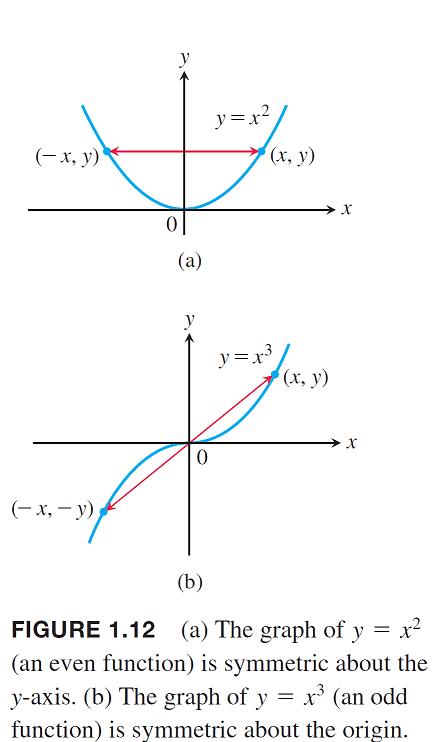
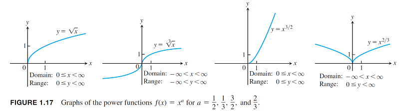
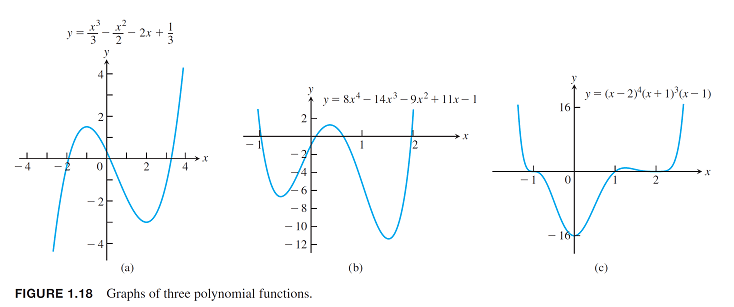
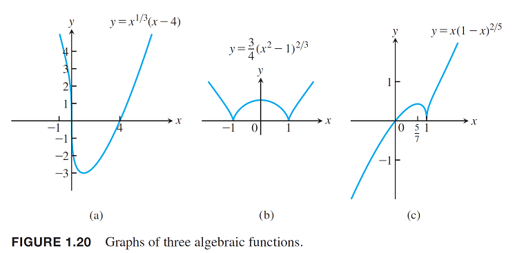
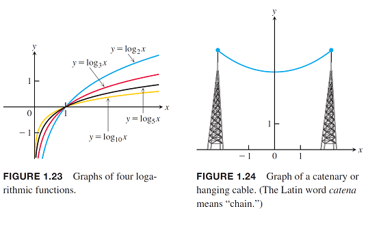

# 函數\(function\)

## 函數的定義與集合的性質

詳見 [函數中的集合](../set/function.md)。

## 奇函數與偶函數（odd and even function）

> 實值函數$$f: X \rightarrow \mathbb{R}$$稱為
>
> * 奇函數，若$$f(-x)=-f(x)$$，對稱於原點。
> * 偶函數，若$$f(x) = f(-x)$$，對稱於$$y$$軸。
>
> 註：• 奇、偶函數的名稱是來自於$$x$$的冪次方函數，$$y=x^n$$，當$$n$$為奇數與偶數時有此性質。

## 常見的函數

### 線性函數（linear function）

### 冪函數（power function）

### 多項式函數\(polynomial function\)

### 有理函數\(rational function\)

### 代數函數\(algebraic function\)

### 三角函數\(trigonometric function\)

### 指數函數\(exponential function\)

### 對數函數\(logarithmic function\)

## 函數的四則運算

$$f,g:[a,b] \rightarrow \mathbb{R}$$為兩（任意）函數，則$$\forall x \in [a,b], s,t \in \mathbb{R} $$

* 函數和法則：$$(f+g)(x)=f(x)+g(x)$$，函數$$f+g$$為函數$$f$$與函數$$g$$的和。
* 函數差法則： $$(f−g)(x)=f(x)−g(x)$$，函數$$f−g$$為函數$$f$$與函數$$g$$的差。
* 函數齊法則：$$(tf)(x)=tf(x)$$， 函數$$tf$$為函數$$f$$與實數$$t$$的係數積（scalar multiplication）。
* 函數積法則：$$(fg)(x)=f(x)g(x)$$，函數$$fg$$為函數$$f$$與函數$$g$$的點態積（pointwise multiplication）。
* 函數商法則：若$$g(x) \neq 0$$, 則$$(f/g)(x)=f(x)/(g(x))$$，函數$$f/g$$為函數$$f$$與函數$$g$$的商。
* 函數線性法則：$$(sf+tg)(x)=sf(x)+tg(x)$$，函數$$sf+tg$$為函數$$f$$與函數$$g$$的線性組合（linear combination）。
* 函數不等法則：若$$\forall x \in [a,b], f(x) \geq g(x)$$，則記為$$f \geq g$$。

## 合成函數（composite function）

> $$f:A \rightarrow B, g:B \rightarrow C$$為兩函數，則合成函數$$g \circ f: A \rightarrow C$$定義為
$$ \forall x \in A, (g \circ f)(x)=g(f(x)) $$
>
> 註：合成函數無交換性，即 $$ g \circ f \neq f \circ g$$

## 函數的位移
（shift of functions）

> * 垂直移動：$$y=f(x)+k$$
>   * $$k>0$$時，向上移動$$k$$單位。
>   * $$k<0$$時，向下移動$$|k|$$單位。
> * 水平移動：$$y=f(x+h)$$
>   * $$h>0$$時，向左移動$$h$$單位。
>   * $$h <0$$時，向右移動$$h$$單位。

## 函數水平與垂直的縮放與映射（scaling and reflecting）

> * 縮放 $$\forall c > 1$$
>   * $$y=cf(x)$$，以係數$$c$$垂直拉伸函數圖形。
>   * $$y=\frac{1}{c}f(x)$$，以係數$$c$$垂直壓縮函數圖形。
>   * $$y=f(cx)$$，以係數$$c$$水平壓縮函數圖形。
>   * $$y = f(\frac{x}{c})$$，以係數$$c$$水平拉伸函數圖形。
> * 映射，$$c=-1$$
>   * $$y=-f(x)$$，對稱於$$x$$軸的映射函數。
>   * $$y=f(-x)$$，對旁於$$y$$軸的映射函數。

