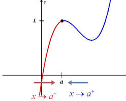
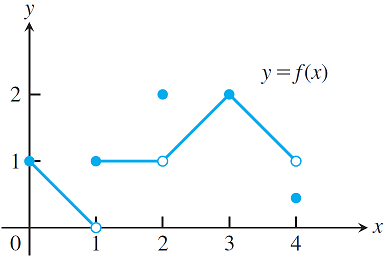

# 實值函數的左、右極限

## 定義域為實數區間的實值函數

$$f: I \rightarrow \mathbb{R}, I \subseteq \mathbb{R}$$

* 給定$$c \in \mathbb{R}$$，函數的左極限（lefthand limit）是指函數的定義域從$$x<c$$這一側逼近，記為$$x→c^{−}$$。
  * $$\displaystyle \lim_{x \rightarrow c^{-}} f(x)=L \Leftrightarrow$$$$\forall \espilon > 0 ~ \exists \delta > 0 \ni |f(x) - L|< \epsilon \forall c - \delta < x < c$$$$\forall \epsilon >0 ~ \exists \delta >0 \ni |f(x)-L| < \epsilon, ~\forall\ c - \delta < x < c$$
* 給定$$c \in \mathbb{R}$$，函數的右極限（righthand limit）指函數的定義域從$$x>c$$這一側逼近，記為$$x→c^{+}$$。
  * $$\displaystyle \lim_{x \rightarrow c^{+}} f(x)=L \Leftrightarrow$$$$\forall \epsilon >0 ~ \exists \delta >0 \ni |f(x)-L| < \epsilon, ~\forall c  < x < c + \delta$$
* 若$$\displaystyle \lim_{x \rightarrow c^{-}}f(x) = \lim_{x \rightarrow c^{+}} f(x)$$，則$$\displaystyle \lim_{x \rightarrow c}f(x)$$，即左極限等於右極限時，函數$$f(x)$$在點$$c$$連續。

* 若左極限不存在，則$$ \exists \epsilon >0, \forall \delta >0 \ni |f(x)-L|\geq \epsilon , c-\delta < x < c$$
* 若右極限不存在，則$$\exists \epsilon >0, \forall \delta >0 \ni |f(x)-L|\geq \epsilon , c < x < c+\delta$$

範例

* 在點$$x=0$$
  * $$\displaystyle \lim_{x \rightarrow 0^{-}}f(x)$$不存在，因為$$f(x)$$在$$x<0$$未定義。
  * $$\displaystyle \lim_{x \rightarrow 0^{+}}f(x)=1$$
  * $$\displaystyle \lim_{x \rightarrow 0}f(x)=1$$，在端點時，函數值有定義。
* 在點$$x=1$$
  * $$\displaystyle \lim_{x \rightarrow 1^{-}}f(x)=0$$
  * $$\displaystyle \lim_{x \rightarrow 1^{+}}f(x)=1$$
  * $$\displaystyle \lim_{x \rightarrow 1}f(x)$$不存在，因為左極限不等於右極限
* 在點$$x=2$$
  * $$\displaystyle \lim_{x \rightarrow 2^{-}}f(x)=1$$
  * $$\displaystyle \lim_{x \rightarrow 2^{+}}f(x)=1$$
  * $$\displaystyle \lim_{x \rightarrow 2}f(x)=1$$\(此極限值與$$f(2)=2$$不同\)
* 在點$$x=3$$
  * $$\displaystyle \lim_{x \rightarrow 3^{-}}f(x)=\displaystyle \lim_{x \rightarrow 3^{+}}f(x)=\displaystyle \lim_{x \rightarrow 3}f(x)=f(3)=2$$
* 在點$$x=4$$
  * $$\displaystyle \lim_{x \rightarrow 4^{-}}f(x)=1$$
  * $$\displaystyle \lim_{x \rightarrow 4^{+}}f(x)$$不存在
  * $$\displaystyle \lim_{x \rightarrow 4}f(x)=1$$

