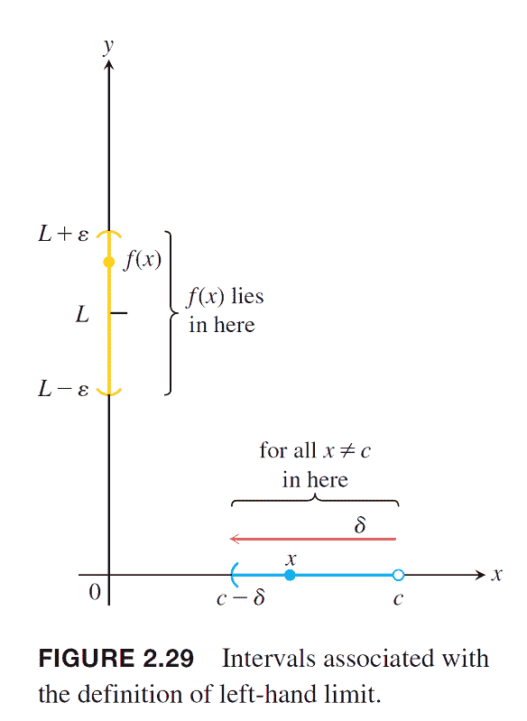
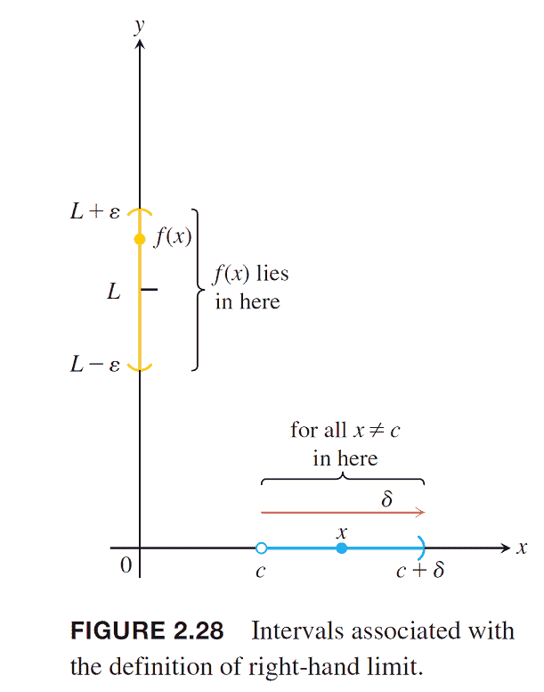
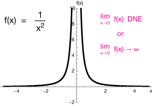
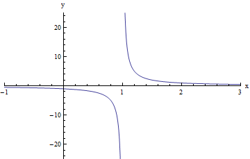
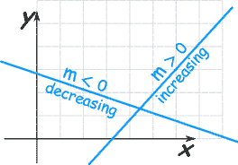

# 實值函數的左、右極限

## 定義域為實數區間的實值函數

$$f: I \rightarrow \mathbb{R}, I \subseteq \mathbb{R}$$

* 給定$$c \in \mathbb{R}$$，函數的左極限（lefthand limit）是指函數的定義域從$$x<c$$這一側逼近，記為$$x→c^{−}$$。
  * $$\displaystyle \lim_{x \rightarrow c^{-}} f(x)=L \Leftrightarrow$$$$\forall \espilon > 0 ~ \exists \delta > 0 \ni |f(x) - L|< \epsilon \forall c - \delta < x < c$$$$\forall \epsilon >0 ~ \exists \delta >0 \ni |f(x)-L| < \epsilon, ~\forall\ c - \delta < x < c$$
* 給定$$c \in \mathbb{R}$$，函數的右極限（righthand limit）指函數的定義域從$$x>c$$這一側逼近，記為$$x→c^{+}$$。
  * $$\displaystyle \lim_{x \rightarrow c^{+}} f(x)=L \Leftrightarrow$$$$\forall \epsilon >0 ~ \exists \delta >0 \ni |f(x)-L| < \epsilon, ~\forall c  < x < c + \delta$$
* 若$$\displaystyle \lim_{x \rightarrow c^{-}}f(x) = \lim_{x \rightarrow c^{+}} f(x)$$，則$$\displaystyle \lim_{x \rightarrow c}f(x)$$，即左極限等於右極限時，函數$$f(x)$$在點$$c$$連續。

#### 範例

* 在點$$x=0$$
  * $$\displaystyle \lim_{x \rightarrow 0^{-}}f(x)$$不存在，因為$$f(x)$$在$$x<0$$未定義。
  * $$\displaystyle \lim_{x \rightarrow 0^{+}}f(x)=1$$
  * $$\displaystyle \lim_{x \rightarrow 0}f(x)=1$$，在端點時，函數值有定義。
* 在點$$x=1$$
  * $$\displaystyle \lim_{x \rightarrow 1^{-}}f(x)=0$$
  * $$\displaystyle \lim_{x \rightarrow 1^{+}}f(x)=1$$
  * $$\displaystyle \lim_{x \rightarrow 1}f(x)$$不存在，因為左極限不等於右極限
* 在點$$x=2$$
  * $$\displaystyle \lim_{x \rightarrow 2^{-}}f(x)=1$$
  * $$\displaystyle \lim_{x \rightarrow 2^{+}}f(x)=1$$
  * $$\displaystyle \lim_{x \rightarrow 2}f(x)=1$$\(此極限值與$$f(2)=2$$不同\)
* 在點$$x=3$$
  * $$\displaystyle \lim_{x \rightarrow 3^{-}}f(x)=\displaystyle \lim_{x \rightarrow 3^{+}}f(x)=\displaystyle \lim_{x \rightarrow 3}f(x)=f(3)=2$$
* 在點$$x=4$$

  * $$\displaystyle \lim_{x \rightarrow 4^{-}}f(x)=1$$
  * $$\displaystyle \lim_{x \rightarrow 4^{+}}f(x)$$不存在
  * $$\displaystyle \lim_{x \rightarrow 4}f(x)=1$$

## 左、右極限不存在

> * 若左極限不存在，則$$ \exists \epsilon >0, \forall \delta >0 \ni |f(x)-L|\geq \epsilon , c-\delta < x < c$$
> * 若右極限不存在，則$$\exists \epsilon >0, \forall \delta >0 \ni |f(x)-L|\geq \epsilon , c < x < c+\delta$$

## 極限存在的充要條件為左極限等於右極限

> 區間$$I \subset \mathbb{R}$$，點$$c \in I$$，實值函數$$f: I \rightarrow \mathbb{R}$$，則$$\displaystyle \lim_{x \rightarrow c} f(x)=L \Leftrightarrow$$$$\displaystyle \lim_{x \rightarrow c^{-}} f(x)=\displaystyle \lim_{x \rightarrow c^{+}} f(x) =L$$
>
> 若以下條件之一成立時，函數$$f$$在點$$c$$極限不存在，：
>
> * $$f(c+)$$或$$f(c-)$$不存在。
> * $$f(c+)$$且$$f(c-)$$存在，但兩者之間不相同。
> * $$f(c+)$$與$$f(c-)$$成立且相等，但$$f(c+)=f(c-)\neq f(c)$$

proof:

* $$\displaystyle lim_{x \rightarrow c} f(x)= L \Leftrightarrow \forall \epsilon >0 ~ \exists \delta >0 \ni |f(x)-L| < \epsilon～\forall  c-\delta < x < c +\delta$$
* 由定義可得 $$\displaystyle \lim_{x \rightarrow c^{-}} f(x) = L$$且 $$\displaystyle \lim_{x \rightarrow c^{+}} f(x) = L$$\(QED\)

## 遞增（減）函數與單調函數

> $$(X,d)$$為度量空間,  $$f:X \rightarrow \mathbb{R}$$為一函數
>
> * $$\forall x,y\in X, ~(f(x)−f(y))(x−y) \geq 0$$時，（即$$x−y \geq 0$$可得$$(f(x)−f(y)) \geq 0 $$）則稱函數$$f$$在$$X$$為遞增函數\(increasing function\)。
> * $$\forall x,y \in X,~ x \neq y, ~ (f(x)−f(y))(x−y)>0$$時，稱函數$$f$$在$$X$$為嚴格遞增函數\(strictly increasing function\)。
> * $$\forall x,y \in X, (f(x)−f(y))(x−y) \leq 0$$時，則稱函數$$f$$在$$X$$為遞減函數\(decreasing function\)。
> * $$\forall x,y \in X, ~ x \neq y,~ (f(x)−f(y))(x−y)<0$$時，稱函數$$f$$在$$X$$為嚴格遞減函數\(strictly decreasing function\)。
> *  若函數$$f$$為一遞增函數或是遞減函數時，稱$$f$$為單調函數\(monotone function\)。
> * 若函數$$f$$為一嚴格遞增函數或是嚴格遞減函數時，稱$$f$$為嚴格單調函數\(strictly monotone function\)。

>

### 有上（下）界遞增函數收斂於上（下）確界

> * $$f:[a,b] \rightarrow \mathbb{R}$$為一遞增函數，若$$f$$有上界$$M \in \mathbb{R}$$，即$$\forall x \in [a,b],~ f(x) \leq M $$，則$$\displaystyle \lim_{x \rightarrow b^{−} }⁡f(x)=h $$, 此處$$\displaystyle h=\sup_{x \in [a,b]} f(x)$$
> *  $$f:[a,b] \rightarrow \mathbb{R}$$為一遞減函數，若$$f$$有下界$$m \in \mathbb{R}$$，即$$\forall x \in [a,b], m \leq f(x) $$，• 則$$\displaystyle \lim_{x→a^{+} }f(x)=l $$, 此處 $$\displaystyle l=\inf_{x \in [a,b]} f(x)$$

proof:

* 因為$$\forall x \in [a,b], f(x) \leq M$$，由實數的最小上界性質令$$\sup_{x \in [a,b]}f(x)=h$$存在。
* $$\sup_{x \in [a,b]}f(x)=h \Leftrightarrow \forall \epsilon >0 ~ \exists y < b \ni h - \epsilon < f(y)$$，即$$h$$只要降低一點點就不再是$$f$$的上界。
* 因為$$f$$為遞增函數，若$$y < x < b$$，則可得$$f(y)\leq f(x) < h + \epsilon $$。
* 可得$$h - \epsilon \leq f(x) \leq h+\epsilon \Leftrightarrow |f(x) -h| < \epsilon$$，因此$$\lim_{x \rightarrow b^{-}}f(x)=h$$ \(QED\)

