# 函數的極限

## 平均變化與割線
\(average rate of change and secant\)

> 函數$$y=f(x)$$在區間$$[x_1, x_2]$$的平均變化率為 $$\frac{\Delta y}{\Delta x}=\frac{f(x_2) - f(x_1)}{x_2 - x_1}=\frac{f(x_1+h) -f(x_1)}{h}, ~ h \neq 0$$

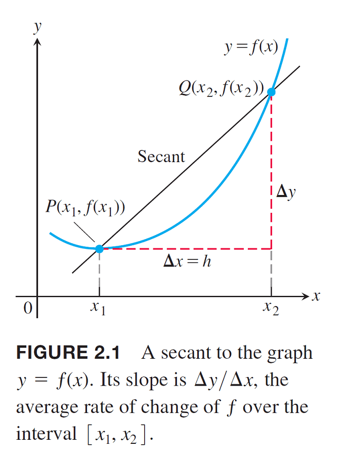

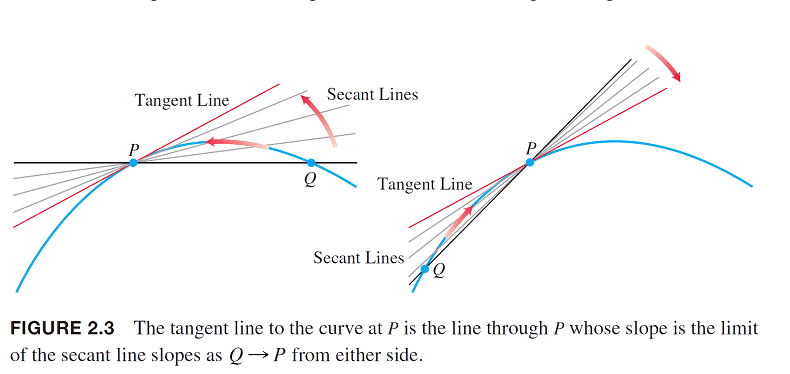

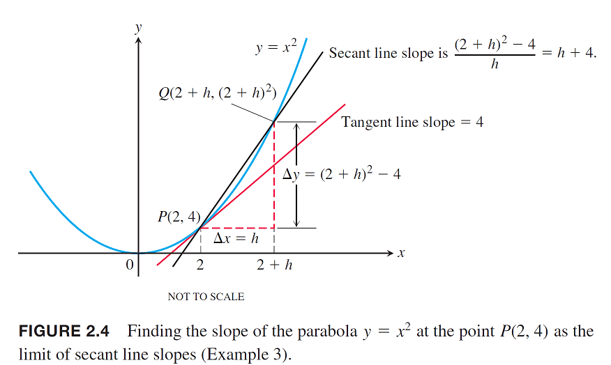

## 函數的極限

> 函數$$f: \mathbb{R} \rightarrow \mathbb{R}$$：$$\displaystyle \lim_{x \rightarrow c}⁡f(x)=L $$，	• 若從定義域左側、右側逼近得到的函數值與函數在該點的函數均相同時，稱函數在該點連續。
>
> 給定度量空間$$(X,d)$$，函數$$f: X \rightarrow \mathbb{R}$$為實值函數，點$$c \in X$$,$$L \in \mathbb{R}$$，則$$\displaystyle \lim_{x \rightarrow c} f(x)=L$$定義為：
>
> * $$\forall \epsilon > 0 ~ \exists \delta > 0 \ni |f(x) -L| < \epsilon, ~ \forall d(x, c) < \epsilon$$
> * 極限存在時，則$$x$$從任意方向逼近$$c$$時，其函數值也都會趨近於$$L$$。
> * 極限存在不代表連續，只有在$$f(c)=L$$時才為連續。
>
> 更一般化的函數定義為給定度量空間$$(S, d_s ), (T,d_T )$$，函數$$f:S \rightarrow T$$，$$A \subseteq S$$，$$c \in A$$為極限點，$$L \in T$$，則$$\lim_{ x \rightarrow c} f(x) = L$$ 若且唯若 $$\forall \epsilon > 0 ~ \exists \delta > 0 \ni d_T(f(x), L) < \epsilon $$ whenever $$pc\neq x, x\in A, d_S(x,c) <\delta$$。
>
> 也可以用球來定義，$$f(x)\in B_{T}(L, \epsilon)$$ whenever $$x \in B_S(c, \delta) \cap A, ~ x \neq p$$

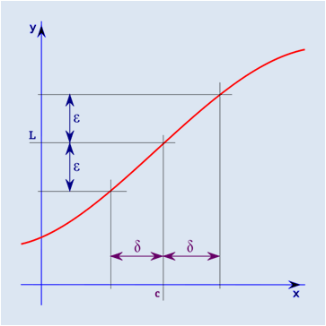

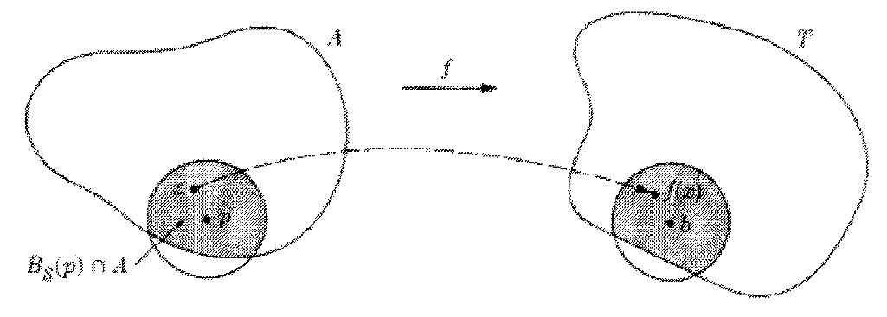

### epsilon-delta逼進的過程

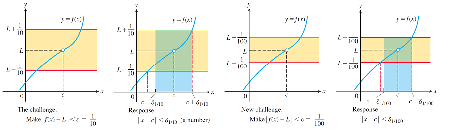

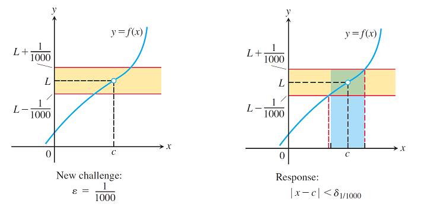

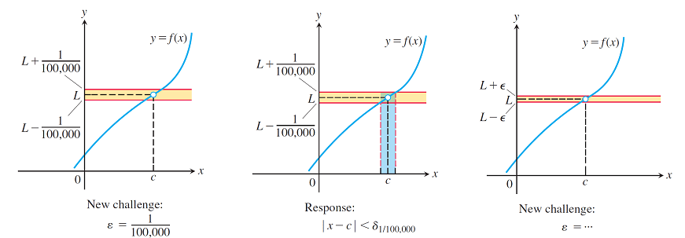

### 函數極限不存在

> $$\exists \epsilon > 0 ~ \forall \delta > 0 \ni |f(x) - L| \geq \epsilon , \forall d(x, c) < \delta$$時，稱函數$$f$$在點$$c$$的極限不存在。
>
> 即$$x$$從任意方向逼近於$$c$$時，其函數值不一定趨近於$$L$$。
>
> 更一般化的函數定義$$f: S \rightarrow T$$, $$ p \in A \subseteq S$$的極限不存在，即 $$\exists \epsilon > 0~ \forall \delta > 0 \ni d_T(f(c), L) \geq \epsilon, \forall d_S(x, c) < \delta$$。

### 函數極限存在的狀態

討論函數極限是否存在，是討論$$x\neq c$$時但$$d(x,c) \rightarrow 0$$的收斂情形，因此可分為$$\displaystyle \lim_{x \rightarrow c}f(x) $$與$$f(c)$$的存在性討論。

| 編號 | 函數 | 極限 | 備註 |
| :--- | :--- | :--- | :--- |
|  | $$f(c)$$ | $$\displaystyle \lim_{x \rightarrow c} f(x)$$ |  |
| 1 | 存在 | 存在，$$\displaystyle \lim_{x \rightarrow c} f(x) =f(c)$$ | 連續函數 |
| 2 | 存在 | 存在，但 $$\displaystyle \lim_{x \rightarrow c} f(x) \neq  f(c)$$ | $$f(c)$$為單獨的跳躍點 |
| 3 | 存在 | 不存在 | $$f(c)$$為跳躍點 |
| 4 | 不存在 | 存在 | $$f(c)$$為斷點 |
| 5 | 不存在 | 不存在 | 函數在$$c$$未定義或發散 |

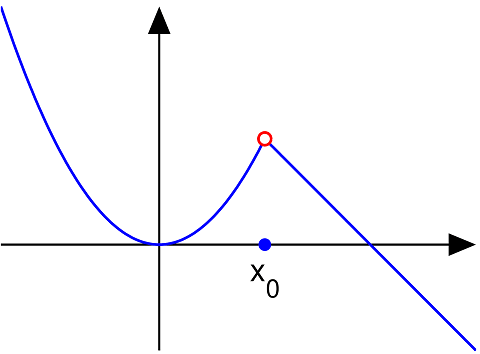

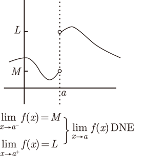

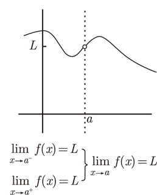

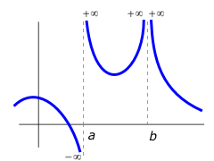

## 函數與數列極限的充要關係

> $$(X,d)$$為度量空間，$$f: X \rightarrow \mathbb{R}$$為函數，$$c \in X$$，則
>
> $$ \displaystyle \lim_{x \rightarrow c} f(x) = L$$$$\Leftrightarrow$$對任意數列 $$\{x_n\} \subseteq X$$，若滿足 $$\displaystyle \lim_{ n \rightarrow \infty }x_n = c$$，則$$ \displaystyle \lim_{ n \rightarrow \infty} f(x_n) = L$$
>
> 給定度量空間 $$(S, d_S), (T, d_T)$$，$$c \in A \subseteq S$$為極限點，$$a \in T$$，更一般化的函數$$f: S \rightarrow T$$，
>
> $$\displaystyle \lim_{x \rightarrow c}f(x) = L$$$$\Leftrightarrow$$$$\displaystyle \lim_{n \rightarrow \infty} f(x_n) = L$$或 $$\displaystyle \lim_{n \rightarrow \infty} f(x_n)=f(\lim_{n \rightarrow \infty} x_n)$$

proof =&gt;

* $$\displaystyle  \lim_{x \rightarrow c}⁡f(x)=L\Leftrightarrow  \forall \epsilon >0~  \exists \delta >0 \ni |f(x)−L|< \epsilon ~ \forall d(x,c)<\delta $$
* 若$$\lim_{n \rightarrow \infty}⁡x_n =c $$，則$$ \exists n_0 \in \mathbb{N} \ni d(x_n,c)< \delta, \forall n \geq n_0 $$
* 因此在$$n \geq n_0$$ 時，由於$$d(x_n,c)<\delta$$，可得$$|f(x_n )−L|<\epsilon$$，即$$\lim_{n \rightarrow \infty}⁡f(x_n)=L$$ \(QED\)

proof &lt;=

* 若$$ \lim_{x \rightarrow c} ⁡f(x) \neq L$$ 則 $$\exists \epsilon>0 ~\forall \delta>0 \ni |f(x)−L| \geq \epsilon,~ d(x,c)< \delta $$
* 若 $$\lim_{n \rightarrow \infty} x_n=c $$，則$$ \exists n_0 \in \mathbb{N} \ni d(x_n,c)<\delta, ~ \forall n \geq n_0 $$
* 因此在$$n \geq n_0$$ 時，由於$$d(x_n,c)< \delta$$，存在$$\epsilon >0 \ni |f(x_n )−L| \geq \epsilon$$, 即$$\lim_{n \rightarrow \infty}⁡f(x_n)  \neq L$$ \(QED\)

## 函數極限非零效應（nonzero effect for limits）

> 當函數極限存在，且$$x$$逐漸逼近$$c$$時，則函數值絕對值必定大於收斂點絕對值一半以上。
>
> $$(X,d)$$為度量空間，$$f:X \rightarrow \mathbb{R}$$為一函數，$$c \in X$$滿足$$\displaystyle \lim_{x \rightarrow c}⁡ f(x)=L $$
>
> 1. 若$$L>0$$，則$$ \exists \delta >0,~ 0<d(x,c)<\delta \Rightarrow f(x) \geq \frac{L}{2} $$
> 2. 若$$ L<0$$，則$$ \exists \delta>0, ~ 0<d(x,c)< \delta \Rightarrow f(x) \leq \frac{L}{2} $$
> 3. 若$$ L \neq 0$$，則$$\exists \delta>0,~ 0<d(x,c)<\delta \Rightarrow|f(x)|\geq \frac{|L|}{2} $$

proof:

* $$\displaystyle \lim_{x \rightarrow c}f(x)=L \Leftrightarrow \forall \epsilon>0 ~\exists \delta >0 \ni |f(x)−L|<\epsilon ~\forall d(x,c)<\delta $$

1. 給定$$\epsilon=L/2$$, 

* 則存在 $$\delta>0 \ni |f(x)−L|<L/2,~ 0<d(x,c)<\delta $$
* $$f(x)−L|<L/2 \Leftrightarrow −L/2<f(x)−L<L/2  \text{ and } L>0  $$
* $$\therefore f(x) \geq L/2$$  \(QED\)

同理可證明2,3。

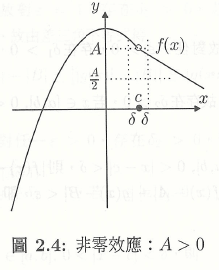

## 函數極限的四則運算

> 令函數$$\displaystyle \lim_{x \rightarrow c} f(x)=L$$, $$\displaystyle  \lim_{x \rightarrow c }f(x)=M$$, $$k \in \mathbb{R}$$，則
>
> * $$\displaystyle \lim_{x \rightarrow c} f(x) \pm g(x)=L \pm M$$
> * $$\displaystyle \lim_{x \rightarrow c} k f(x)=kL$$
> * $$\displaystyle \lim_{x \rightarrow c} f(x) g(x)=LM$$
> * $$\displaystyle \lim_{x \rightarrow c} \frac{f(x)}{g(x)}=\frac{L}{M}, ~ M \neq 0$$
> * $$\displaystyle \lim_{x \rightarrow c} (f(x))^n=L^n, ~ n \in \mathbb{N}$$
> * $$\displaystyle \lim_{x \rightarrow c} (f(x))^{\frac{1}{n}}=L^{\frac{1}{n}}, ~ n \in \mathbb{N}$$

* 使用極限的$$\epsilon-\delta$$定義可證明。

proof 極限的加、減法：

* $$ |f(x)+g(x)−L−M| \leq |f(x)−L|+|g(x)−M| $$
* $$ \lim_{x \rightarrow c}f(x)=L\Leftrightarrow \forall \epsilon>0 ~ \exists \delta_1>0 \ni |f(x)−L|<\epsilon ~\forall d(x,c)<\delta_1 $$
* $$\lim_{x \rightarrow c}g(x)=M \Leftrightarrow \forall \epsilon >0 ~ \exists \delta_2>0 \ni |g(x)−b|<\epsilon ~ \forall d(x,c)<\delta_2 $$
* 取$$\delta =\min⁡\{\delta_1, \delta_2 \}$$，當$$d(x,c)< \delta$$時，得$$|f(x)−L|<\epsilon/2$$ 且$$|g(x)−M|< \epsilon/2 $$。
* $$|f(x)+g(x)−L−M| \leq |f(x)−L|+|g(x)−M|<\epsilon /2+ \epsilon /2=\epsilon \text{ if } d(x,c)<\delta $$
* $$\displaystyle \therefore \lim_{x \rightarrow c}⁡(f(x)+g(x))=\lim_{x \rightarrow c}⁡ f(x)+\lim_{x \rightarrow c}⁡ g(x)=L+M$$ \(QED\)

Proof 極限與常數的乘積:

* $$\lim_{x \rightarrow c}f(x)=L \Leftrightarrow \forall \epsilon>0~ \exists \delta>0 \ni |f(x)−L|<\epsilon ~ \forall d(x,c)<\delta $$
* 可得 $$\forall \epsilon>0,|kf(x)−kL|=|k||f(x)−L|<\epsilon/|k| , d(x,c)<\delta $$
* $$\therefore \forall k \in \mathbb{R}, \lim_{x \rightarrow c}(kf(x))=k \lim_{x \rightarrow c}⁡f(x)=kL $$\(QED\)

Proof 極限乘法:

* $$|f(x)g(x)−LM|=|f(x)g(x)−Lg(x)+Lg(x)−LM| \leq |f(x)−L||g(x)|+|L||g(x)−M|$$
* $$\because \lim_{x \rightarrow c}⁡g(x)=M \Leftrightarrow \text{ given } \epsilon=1 ~ \exists \delta_1>0 \ni |g(x)−M|<1, ~\forall d(x,c)<\delta_1 $$ 
* $$\therefore |g(x)|−|M|≤|(|g(x)|−|M|)|≤|g(x)−M|<1 $$
*  即$$|g(x)|≤|M|+1 $$
* $$ \lim_{x\rightarrow c} g(x)=M \Leftrightarrow \forall \epsilon >0 ~ \exists \delta_2>0 \ni |g(x)−M|<\epsilon/(2|L|+1) ~ \forall d(x,c)<\delta_2 $$
* $$ \lim_{x \rightarrow c}⁡ f(x)=L \Leftrightarrow \forall \epsilon >0 ~\exists \delta_3>0 \ni |f(x)−L|<\epsilon/(2|M|+1)  ∀d(x,c)<\delta_3 $$
* 取$$\delta=\min \{ \delta_1, \delta_2, \delta_3\}$$，若$$ d(x,c)<\delta$$則
* $$\begin{aligned} |f(x)g(x)−LM| &=|f(x)g(x)−Lg(x)+Lg(x)−LM| \\& \leq |f(x)−|L||g(x)|+|L||g(x)−M|  \\ & \leq \epsilon(|M|+1)/2(|M|+1) +|L|\epsilon/2(|L|+1) \\&=\epsilon \end{aligned}$$ \(QED\).

Proof 極限除法:

* $$|\frac{f(x)}{g(x)} −\frac{a}{b}|=\frac{|bf(x)−ag(x)|}{|b||g(x)|} =\frac{|bf(x)−ab+ab−ag(x)|}{|b||g(x)|} \leq \frac{(|b||f(x)−a|+|a||b−g(x)|)}{|b||g(x)| }$$
* $$\lim_{x \rightarrow c}⁡ g(x)=b \neq 0 \Leftrightarrow \forall \epsilon>0 ~\exists \delta_1>0 \ni |g(x)−b|< \epsilon, ~\forall d(x,c)<\delta_1$$
* 取$$\epsilon=b \Rightarrow |g(x)| \geq \frac{|b|}{2}  , ~\forall d(x,c)<\delta_1 $$
* 則在$$d(x,c)<\delta_1$$ 時，得 $$|\frac{f(x)}{g(x)} −\frac{a}{b}| \leq \frac{2|f(x)−a|}{|b|} +\frac{2|a||g(x)−b|}{|b|^2 }$$
* $$\lim_{x \rightarrow c} f(x)=a\Leftrightarrow \forall \epsilon>0 ~\exists \delta_2>0 \ni |f(x)−a|<\epsilon ~ \forall d(x,c)<\delta_2$$
* 所以可得$$|f(x)−a|< \frac{|b|\epsilon}{4}, ~\forall d(x,c)<\delta_2$$
* $$\lim_{x \rightarrow c} g(x)=b \Leftrightarrow \forall \epsilon >0 ~\exists \delta_3>0 \ni |g(x)−b|<\epsilon~ \forall d(x,c)<\delta_3$$
* 所以可得$$|g(x)−b|<\frac{(|b|^2 \epsilon )}{((4|a|+1) )}, \forall d(x,c)<\delta_3$$
* 取$$\delta =\min⁡\{\delta_1,\delta_2, \delta_3 \}$$, 則當$$d(x,c)<\delta$$時，得$$ | \frac{f(x)}{g(x)} −\frac{a}{b}|<\epsilon$$ \(QED\)

### 多項式的極限（limits of polynomials ）

> 給定多項式$$P(x)=a_n x^n + a_{n-1}x^{n-1}+\ldots + a_1 x + a_0$$，則$$\displaystyle \lim_{x \rightarrow c} P(x)=P(c)=a_nc^n+a_{n-1}c^{n-1}+\ldots + a_1 c+ a_0$$

### 有理函數的極限（limits of rational functions）

> 給定$$P(x)$$與$$Q(x)$$均為多項式函數，則$$Q(x)\neq 0$$，則$$\displaystyle \lim_{x \rightarrow c} \frac{P(x)}{Q(x)}=\frac{P(c)}{Q(c)}$$

## 絕對值的極限

> $$(X,d)$$為度量空間，$$f,g:X \rightarrow \mathbb{R}$$為兩函數，$$c \in X$$滿足$$\lim_{x \rightarrow c} f(x)=L$$，則$$\lim_{x \rightarrow c} |f(x)|=|L|$$。
>
> 即$$ \displaystyle \lim_{x \rightarrow c} |f(x)| = | \lim_{x \rightarrow c} f(x)|$$

proof:

* $$\displaystyle  \lim_{x \rightarrow c} f(x)=L  \Leftrightarrow \forall \epsilon>0~ \exists \delta >0 \ni |f(x)−L|<\epsilon ~ \forall d(x,c)<\delta$$
* $$|(|f(x)|−|L|)| \leq |f(x)−L|<\epsilon ~ \forall d(x,c)<\delta \Rightarrow \lim_{x \rightarrow c}⁡|f(x)|=|L|$$ \(QED\)
* 
## 零值的極限

> $$(X,d)$$為度量空間，$$f: X \rightarrow \mathbb{R}$$為一函數，$$c \in X$$，則$$\displaystyle \lim_{ x \rightarrow c} f(x)=0 \Leftrightarrow  \lim_{ x \rightarrow c} |f(x)| = 0$$

Proof =&gt;

* 由絕對值的極限得$$\displaystyle \lim_{x \rightarrow c}⁡|f(x)|=|\lim_{x \rightarrow c} f(x) |=|0|=0 $$ \(QED\)

Proof &lt;=

* $$\displaystyle \lim_{x \rightarrow c}⁡|f(x)|=0 \Leftrightarrow \forall \epsilon>0~ \exists \delta>0 \ni |(|f(x)|−0)|< \epsilon ~\forall d(x,c)<\delta$$
* $$\because |(|f(x)|−0)|=|f(x)−0|< \epsilon$$
* $$\therefore \forall \epsilon>0~ \exists \delta>0 \ni |f(x)−0|<\epsilon ~ ∀d(x,c)<\delta \Leftrightarrow \lim_{x \rightarrow c} f(x)=0$$ \(QED\).

