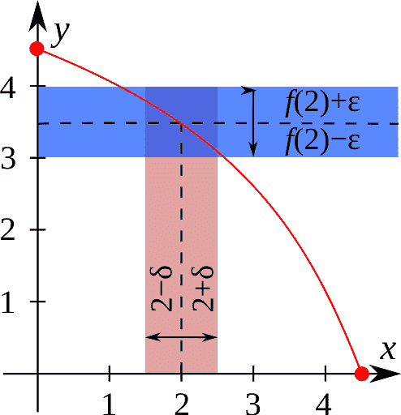
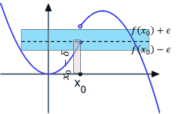
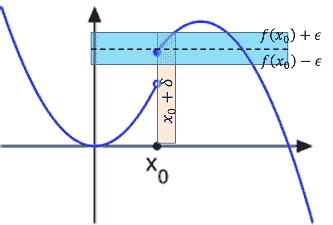
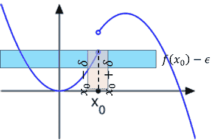
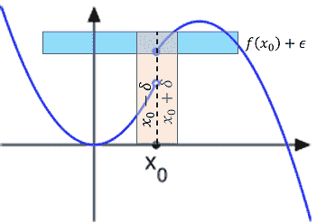

# 半連續函數\(semi-continuity function\)

## 簡介

* $$f: \mathbb{R} \rightarrow \mathbb{R}$$的左連續和右連續是在定義域考慮函數是否在值域連續，因此函數是否為上、下半連續與左、右連續無關。
*  左、右連續是由定義域定義函數是否連續、而上、下連續是由值域定義函數是否連續。
* 半連續的條件比連續弱；即函數在點$$c$$連續則在點$$c$$半連續，反之不成立。
* 函數連續簡單的概念是當$$x$$非常接近$$c$$時，函數值$$f(x)$$也會接近$$f(c)$$；而半連續的概念是$$f(x)$$從上方或下方接近$$f(c)$$。

## 上\(下\)半連續

> 給定函數$$f: \mathbb{R} \rightarrow \mathbb{R}$$，
>
> * 函數$$f$$在點$$c$$左連續：$$\forall \epsilon>0 ~\exists \delta >0 \ni \forall x \in (c−\delta,c), |f(x)−f(c)|<\epsilon $$
> * 函數$$f$$在點$$c$$右連續：$$\forall \epsilon>0 ~\exists \delta >0 \ni \forall x \in (c,c+\delta), |f(x)−f(c)|<\epsilon $$

> 由定義域單側左（右）側逼近時，可從值域上、下方同時逼近值域
。
>
> * 函數$$f$$在點$$c$$下半連續：$$\forall \epsilon>0~ \exists \delta>0 \ni \forall x \in (c−\delta,c+\delta),f(c)−\epsilon \leq  f(x) $$
> * 函數$$f$$在點$$c$$上半連續： $$\forall \epsilon>0 ~\exists \delta>0 \ni \forall x \in (c−\delta,c+\delta), f(x)\leq f(c)+\epsilon $$
>
> 由定義域左（右）側同時逼近時，可從值域單側上（下）方逼近值域。

