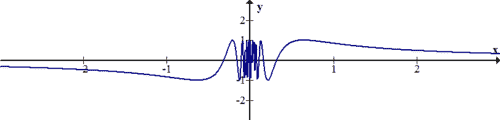

# 半連續函數(semi-continuity function)

## 簡介

* $$f: \mathbb{R} \rightarrow \mathbb{R}$$的左連續和右連續是在定義域考慮函數是否在值域連續，因此函數是否為上、下半連續與左、右連續無關。
* &#x20;左、右連續是由定義域定義函數是否連續、而上、下連續是由值域定義函數是否連續。
* 半連續的條件比連續弱；即函數在點$$c$$連續則在點$$c$$半連續，反之不成立。
* 函數連續簡單的概念是當$$x$$非常接近$$c$$時，函數值$$f(x)$$也會接近$$f(c)$$；而半連續的概念是$$f(x)$$從上方或下方接近$$f(c)$$。

## 上(下)半連續

> 給定函數$$f: \mathbb{R} \rightarrow \mathbb{R}$$，
>
> * 函數$$f$$在點$$c$$左連續：$$\forall \epsilon>0 ~\exists \delta >0 \ni \forall x \in (c−\delta,c), |f(x)−f(c)|<\epsilon$$
> * 函數$$f$$在點$$c$$右連續：$$\forall \epsilon>0 ~\exists \delta >0 \ni \forall x \in (c,c+\delta), |f(x)−f(c)|<\epsilon$$

> 由定義域單側左（右）側逼近時，可從值域上、下方同時逼近值域
> 。
>
> * 函數$$f$$在點$$c$$下半連續(lower semi-continuous)：$$\forall \epsilon>0~ \exists \delta>0 \ni \forall x \in (c−\delta,c+\delta),f(c)−\epsilon \leq  f(x)$$
> * 函數$$f$$在點$$c$$上半連續(upper semi-continuous)： $$\forall \epsilon>0 ~\exists \delta>0 \ni \forall x \in (c−\delta,c+\delta), f(x)\leq f(c)+\epsilon$$
>
> 由定義域左（右）側同時逼近時，可從值域單側上（下）方逼近值域。
>
> 度量空間的定義：
>
> 給定函數$$f: X \rightarrow \mathbb{R} \cup \{-\infty, \infty\}$$，則
>
> * 在點$$x_0$$上半連續，若$$f(x_0) > -\infty$$，則$$\forall \epsilon > 0, \exists \text{ neightborhood } N(x_0)\ni f(x) \leq f(x_0)+ \epsilon, \forall x \in N(x_0)$$

### 左、右、上半、下半均不連續的函數

$$f(x)=\left\{  \begin{align}& x^2 -4,& x < 1 \\ &-1 ,& x=1\\& -\frac{1}{2}x+1,& x >1\end{align} \right.$$

* 取$$\epsilon = 0.4$$，不存在$$\delta >0 \ni \forall x \in (1 -\delta, 1+\delta), f(x)\leq f(1)+0.4=0.6$$
* 取$$\epsilon = 0.4$$，不存在$$\delta >0 \ni \forall x \in (1 -\delta, 1+\delta), f(x)\geq f(1)-0.4=-1.6$$

### 上半連續、但左、右不連續的函數

$$f(x)=\left\{  \begin{align}& 1,& x < 1 \\ &2 ,& x=1\\& -\frac{1}{2},& x >1\end{align} \right.$$

則$$f$$在$$x=1$$上半連續（但左、右不連續），因為$$\forall  x \in N(1)$$，所有的函數值都小於2。$$\forall \epsilon >0$$，$$\exists x \in N(1) \ni f(x) \leq f(1) + \epsilon$$。

$$f(x) = \left \{ \begin{align} &\sin (\frac{1}{x}),& x \neq 0\\ &1, &x = 0  \end{align}  \right.$$

在$$f$$在$$x=0$$上半連續（左、右極限不存在）。因為$$\sin(\frac{1}{x}) \leq 1, \forall x \in \mathbb{R}$$，所以在$$x=0$$的鄰域均小於1。

