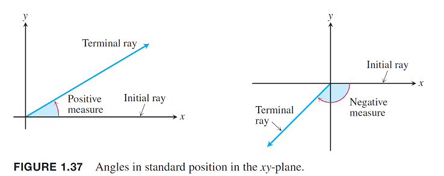
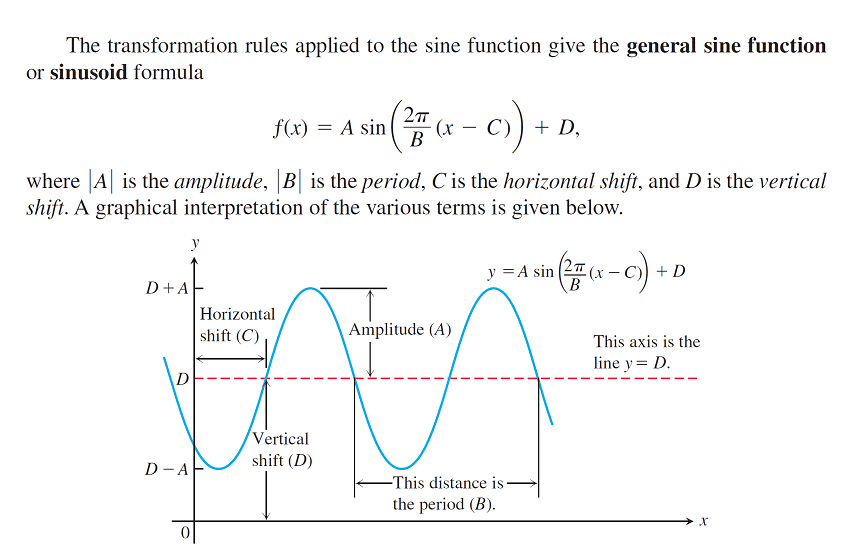
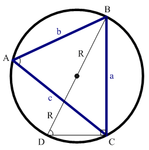
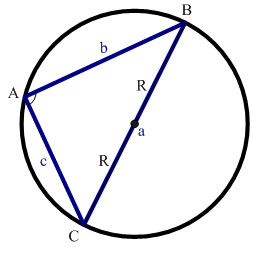
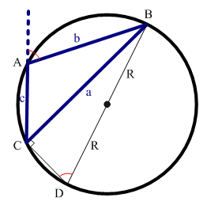

# 三角函數

## 徑度與弧度（radius and arc）

* 徑度\(radians\)等於弧長\(arc\)除以半徑\(radius\)
  ，$$\theta = \frac{s}{r}$$

### 角度與徑度的對應關係

* 徑度$$\pi$$等於角度$$180\degree$$。
* 一正圓內，角度$$0\degree \sim 180 \degree$$是以逆時鐘方向看，對應徑度$$0 \sim \pi$$。而角度$$0\degree \sim -180 \degree$$是以順時鐘方向看，對應徑度$$0 \sim -\pi$$。

## 三角函數

* hypotenuse: 斜邊，opposite: 對邊，adjacent: 鄰邊。

* $$\sin \theta = \frac{y}{r}$$, $$\cos \theta = \frac{x}{r}$$
* $$\tan \theta = \frac{y}{x}$$, $$\cot \theta = \frac{x}{y}$$
* $$\sec \theta = \frac{r}{x}$$, $$csc \theta = \frac{r}{y}$$

可得關係：

* $$\tan \theta =  \frac{\sin \theta} {\cos \theta}$$, $$\cot \theta = \frac{1}{\tan \theta} = \frac{\cos \theta} {\sin \theta}$$
* $$\sec \theta = \frac{1}{\cos \theta}$$, $$\csc \theta = \frac{1}{\sin \theta}$$

## 三角函數的圖形

## ASTC規則

ASTC="All Student Take Calculus"，說明四個象限中，三角函數的正負值。

* 第一象限內任何一個角的四種三角函數值\(all\)都是「+」；
* 第二象限內只有正弦\(sine\)是「+」，其餘全部是「-」；
* 第三象限內只有正切\(tan\)是「+」，其餘全部是「-」；
* 第四象限內只有餘弦\(cos\)是「+」，其餘全部是「-」。

## 週期函數（periodic function）

> $$f(x)$$稱為週期函數若存在$$p>0$$滿足$$f(x+p)=f(x), ~ \forall x$$，則滿足此最條件的最小$$p$$值稱為函數$$f$$的週期（period）。

### 三角函數的週期

* 週期為$$\pi$$：
  * $$\tan (x + \pi) = \tan(x)$$
  * $$\cot(x + \pi ) =\cot (x)$$
* 週期為$$2\pi$$：
  * $$\sin(x+2\pi) = \sin(x)$$
  * $$\cos(x + 2\pi) = \cos(x)$$
  * $$\sec(x+2\pi) = \sec(x)$$
  * $$\csc(x + 2\pi) = \csc(x)$$
* 奇函數：\($$f(-x)=-f(x)$$，對稱於原點）
  * $$\sin(-x) = - \sin(x)$$
  * $$\tan(-x) = -\tan(x)$$
  * $$\csc(-x) = - \csc(x)$$
  * $$\cot(-x) =  -\cot(x)$$
* 偶函數：（$$f(-x) = f(x)$$，對稱於$$y$$軸）

  * $$\cos(-x) = \cos(x)$$
  * $$\sec(-x) = \sec(x)$$

## 三角函數的等式

> $$\sin^2(x)+\cos^2(x)=1$$

> $$1+ \tan^2(x)=\sec^2(x)$$

* $$\tan(x)=\frac{\sin(x)}{\cos(x)}$$，$$\sec(x)=\frac{1}{\cos(x)}$$
* $$\begin{aligned} 1+\tan^2(x) & = 1+ \frac{\sin^2(x)}{\cos^2(x)} \\ & = \frac{\cos^2(x)+\sin^2(x)}{\cos^2(x)} \\ &= \frac{1}{\cos^2(x)}\\ &=\sec^2(x) \end{aligned}$$\(QED\)

> $$1+ \cot^2(x)=\csc^2(x)$$

* $$\cot(x) = \frac{\cos(x)}{\sin(x)}$$, $$\csc(x)=\frac{1}{\sin(x)}$$
* $$\begin{aligned} 1+ \cot^2(x) & = 1+ \frac{\cos^2(x)}{\sin^2(x)} \\&= \frac{\sin^2(x)+\cos^2(x)}{\sin^2(x)} \\ &=\frac{1}{\sin^2(x)} \\ &=\csc^2(x) \end{aligned}$$\(QED\)

## 和角公式

> * $$\sin(x+y)=\sin(x)\cos(y)+\cos(x)\sin(y)$$
> * $$\cos(x+y)=\cos(x)\cos(y) - \sin(x)\sin(y)$$

可用複數乘法等於兩複數角度和得出

* 由棣美弗定理得 $$e^{ix} = \cos(x)+i \sin(x)$$
* $$\begin{aligned} e^{i(x+y)}& =e^{ix} e^{iy} \\&=(\cos(x) + i \sin(x))(\cos(y) + i \sin(y)) \\ & =(\cos(x)\cos(y)-\sin(x)\sin(y))+\\ &i(\sin(x)\cos(y) + \cos(x)\sin(y)) \end{aligned}$$
* \(QED\)

## 倍角公式

> * $$\sin(2x)=2\sin(x)\cos(x)$$
> * $$\cos(2x)=\cos^2(x)-\sin^2(x)$$

* $$\begin{aligned} \sin(2x) & = \sin(x+x) \\ &= \sin(x)\cos(x)+\cos(x)\sin(x)\\ &=2\sin(x)\cos(x) \end{aligned}$$\(QED\)
* $$\cos(2x) = \cos(x+x) = \cos^2(x) - \sin^2(x)$$ \(QED\)

## 半角公式

> * $$\sin^2(x) = \frac{1 - \cos(2x)}{2}$$
> * $$\cos^2(x)=\frac{1+ \cos(2x)}{2}$$

* $$\cos(2x) = \cos^2(x) - \sin^2(x) = 1 - \sin^2(x) - \sin^2(x)$$
* 移項可得  $$2 \sin^2(x) = 1 - \cos(2x)$$ \(QED\)
* 同理
* $$\cos(2x)=\cos^2(x)-\sin^2(x) = \cos^2(x) - (1 - \cos^2(x))$$
* 移項可得 $$2 \cos^2(x) = 1 + \cos(2x)$$ \(QED\)

## 餘弦定理（the law of cosine）

> 給定任意三角形三邊長$$a,b,c$$，對應的角度分別為$$\alpha, \beta, \gamma$$，則可得關係式：
>
> * $$c^2 = a^2 + b^2 - 2ab \cos \gamma $$
> * $$b^2 = a^2 + c^2 - 2ac \cos \beta$$
> * $$a^2 = b^2 +c ^2 - 2bc \cos \alpha$$
>
> 當知道三角形的兩邊和一角時，餘弦定理可被用來計算第三邊的長，或是當知道三邊的長度時，可用來求出任何一個角

**proof：**

* 在邊$$c$$上投影可得 $$c = a \cos\beta + b \cos \alpha$$，所以$$c^2 = ac \cos \beta + bc \cos \alpha$$
* 同理可得
  * $$a^2 = ac \cos \beta + ab \cos \gamma$$
  * $$b^2 = bc \cos \alpha + ab \cos \gamma$$
* $$\begin{aligned} \therefore a^2 +b ^2 & =  ac \cos \beta + ab \cos \gamma +  bc \cos \alpha + ab \cos \gamma \\& = (ac \cos \beta + bc \cos \alpha)+ (ab \cos \gamma + ab \cos \gamma) \\ &=c^2  + 2 ab  \cos \gamma \end{aligned}$$
* 移項後可得 $$c^2 = a^2 + b^2 - 2ab \cos \gamma$$ \(QED\)

## 正弦定理（the law of sine）

> 對於任意三角形$$ABC$$，令$$r$$為外接圓的半徑，三邊$$a,b,c$$對應的角度分別為$$\alpha , \beta , \gamma$$，則有：
>
> $$\frac{a}{\sin \alpha} = \frac{b}{\sin\beta} = \frac{c}{\sin\gamma}= 2r$$

proof part 1：

* 做一個邊長為$$a,b,c$$的三角形，對應角分別是$$A,B,C$$。從角$$C$$向$$c$$邊做垂線，得到一個長度為$$h$$的垂線和兩個直角三角形。
* 可得 $$\sin A = \frac{h}{b}$$, $$\sin B = \frac{h}{a}$$，所以$$h = b \sin A = a \sin B$$，整理後得 $$\frac{\sin A}{a} = \frac{\sin B}{b}$$。
* 同理可得 $$\frac{\sin B}{b} = \frac{\sin C}{c}$$，所以$$\frac{\sin A}{a} = \frac{\sin B}{b} = \frac{\sin C}{c}$$。\(QED\)

proof part 2：

作$$\triangle ABC$$的外接圓，設半徑為$$R$$。

角$$A$$為銳角時：

* 取點$$D$$使得$$BD$$為通過外接圓心的直徑。
* 角$$A$$與$$D$$對應到的弧均為$$BC$$，因此$$\angle A = \angle D$$。
* 由於直線$$BD= 2R$$，角$$\angle BCD = \frac{\pi}{2}$$，得
  * $$\sin \angle D = \frac{a}{2R}$$, $$\sin \angle A = \frac{a}{2R}$$
  * $$\therefore  \frac{a}{\sin \angle A} = 2R$$ \(QED\)

角$$A$$為直角：

* 可得直線$$BC=2R$$為直徑，因此 $$\sin \angle A = \sin \frac{\pi}{2} = 1$$。
* 可得$$\sin \angle A = \frac{a}{2R}=1$$，即$$\frac{a}{\sin \angle A}=2R$$ \(QED\)

角$$A$$為鈍角：

* 線段$$BD=2R$$為外接圓的直徑，因為根據圓內接四邊形對角互補的性質，可得$$\angle D = \pi - \angle BAC$$，所以$$\sin \angle D = \sin \angle BAC$$。
* 因為$$\sin \angle D = \frac{a}{2R}$$，所以$$\sin  \angle BAC = \frac{a}{2R}$$
* 整理可得$$\frac{a}{\sin \angle BAC} = 2R$$ \(QED\)

## 海龍公式（Heron's formula）

> 給一個三角形的三邊長，可以用海龍公式計算出這個三角形的面積。
>
> 給定$$\triangle ABC$$的三邊長$$a,b,c$$，令$$s=\frac{a+b+c}{2}$$，則面積$$A=\sqrt{s(s-a)(s-b)(s-c)}$$。
>
> 中國古代數學家秦九韶的公式為：$$A = \sqrt{\frac{1}{4}[a^2 c^2  - (\frac{a^2+c^2-b^2}{2})^2]}, ~ a \geq b \geq c$$

proof（餘弦定理）：

* $$\cos C = \frac{a^2 + b^2 - c^2}{2ab}$$
* 由$$\sin^2 x+ \cos^2 x = 1$$得 $$\sin C = \sqrt{1 - \cos^2 C}$$
* 整理後可得 $$\sin C = \frac{2}{ab}\sqrt{s(s-a)(s-b)(s-c)}$$, $$s=\frac{a+b+c}{2}$$。
* 三角形的面積
* $$\begin{aligned} A &= \frac{1}{2} ab \sin C \\&= \frac{ab}{2} \frac{2}{ab} \sqrt{s(s-a)(s-b)(s-c}\\&=\sqrt{s(s-a)(s-b)(s-c} \end{aligned}$$\(QED\)

## 特殊的三角不等式

> * $$-|x| \leq \sin(x) \leq |x|$$
> * $$-|x| \leq 1 - \cos(x) \leq |x|$$

