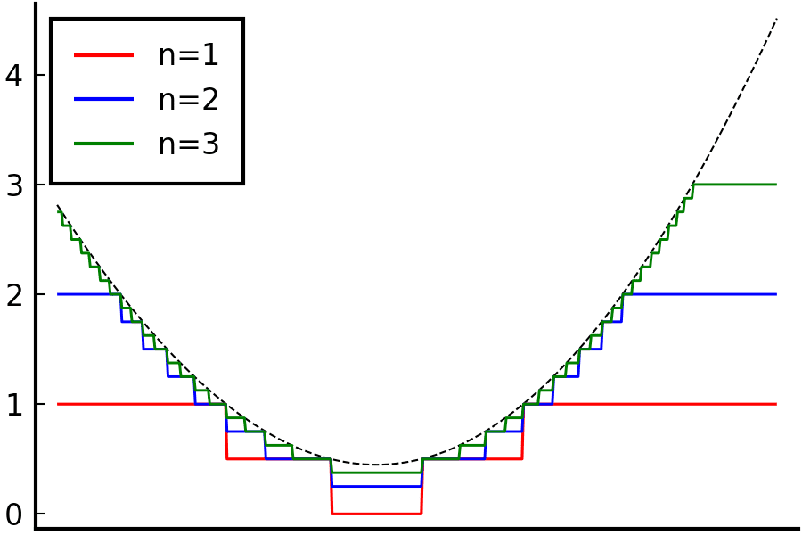

# 非負可測函數的積分

## 簡介

非負可測函數的積分若存在，則一般函數的積分可用$$f=f^{+}-f^{-}$$定義之。

函數絕對值可積分若且唯若函數可積分，因為$$|f|=f^{+}+f^{-}, ~ f=f^{+} -f^{-}$$。

* <mark style="color:red;">單調收斂定理(MCT)：非負可測遞增函數序列，極限與積分的次序可交換</mark>。
* <mark style="color:red;">Fatou's Lemma：下極限函數積分小於等於函數序列積分的下極限</mark>。

Fatou's Lemma和單調收斂定理(MCT)不僅可以各自單獨被證明，還可以進行互推導（即在已知Fatou's Lemma的條件下證MCT，反之亦然，但不可循環論證。

* 若$$f_n \rightarrow f$$且$$f_n$$可積，無法保證$$f$$可積。
* 若$$f_n \rightarrow f$$且$$f_n, f$$可積也無法保證$$\int f_n \rightarrow \int f$$。

$$\displaystyle \lim_{n \rightarrow \infty} f_n(x)=f(x) \text{ a.e. or in measure }$$ ，需要再加什麼條件，才能保證$$f$$ 可積且$$\displaystyle \lim_{n \rightarrow \infty }\int_E f_n dx =\int_E f dx$$  呢？或何時極限和積分可交換次序，即$$\displaystyle \lim_{n \rightarrow \infty }\int_E f_n dx =\int_E \lim_{n \rightarrow \infty } f_n dx$$ ？

答案是只需再加以下其中一個條件即可：

(a) $$\{f_n\}$$是Cauchy in mean；

(b)（控制收斂定理）：$$\forall n \in \mathbb{N}, ~|f_n| \leq g$$ , 且$$g$$可積分；

(c)（單調收斂定理）： $$0\leq f_n \leq f_{n+1}$$非負單調遞增，幾乎處處收斂於$$f$$ 。

可積分函數積分上/下極限不等式：

$$\displaystyle  \int_E \liminf_{n \rightarrow \infty} f_n(x)dx \leq  \liminf_{n \rightarrow \infty} \int_E f_n(x) dx \leq  \limsup_{n \rightarrow \infty} \int_E f_n(x) dx \leq \int_E \limsup_{n \rightarrow \infty} f_n(x)dx$$

## 非負可測函數的積分

> 函數$$f(x): E\rightarrow [0,\infty]$$(可取值至無窮大)在集合$$E \subseteq \mathbb{R}^n$$為非負可測函數，定義函數$$f$$在集合$$E$$上的積分為：$$\displaystyle \int_E f(x)dx = \sup_{h(x) \leq f(x), \forall x \in E} \left\{  \int_E h(x)dx\equiv \sum_{i=1}^p c_i m(E \cap E_i) ~| ~ h(x): \mathbb{R}^n \rightarrow [0,\infty) \text{ is simple non-negative function } \right\}$$注意此處定義的積分值可為$$\infty$$。這裡的$$h(x) \leq f(x)$$大小關係是對定義域的每個點都成立。\[[簡單函數h(x)必存在](../measure/simple-function-approximation.md)]
>
> <mark style="color:red;">若</mark>$$\displaystyle \int_E f(x)dx < \infty$$<mark style="color:red;">，則稱</mark>$$f$$<mark style="color:red;">在集合</mark>$$E$$<mark style="color:red;">可積，或稱</mark>$$f(x)$$<mark style="color:red;">為集合</mark>$$E$$<mark style="color:red;">上的可積函數</mark>。常記為$$f \in L(E)$$。

此處[非負可測函數$$f(x)$$是用簡單函數序列極限$$h(x)$$逼近](../measure/simple-function-approximation.md)。(<mark style="color:blue;">因為</mark>$$L^1(E)$$<mark style="color:blue;">為可分空間，可用連續函數或簡單函數逼近給定的函數</mark>)。

切割值域方法：

* $$\forall k \in \mathbb{N}$$，可將(值域)閉區間$$[0,k]$$分為$$k \cdot 2^k$$等長區間。
* 閉區間$$[0,k]$$的第$$j$$個定義域區間(長度均為$$1/2^k$$)為$$E_{k,j}=\{x \in E ~|~ \frac{j-1}{2^k} \leq f(x) < \frac{j}{2^k}\}, j=1,2,\dots, k2^k$$
* 函數值大於等於$$k$$的區間記為$$E_k=\{x \in E ~|~ f(x) \geq k\}$$。
* 簡單函數序列：$$\displaystyle h_k(x)=k \cdot \chi_{E_k}(x) + \sum_{j=1}^{k \cdot 2^k} \frac{j-1}{2^k}\chi_{E_{k,j}}(x), ~ x \in E$$
* 可得$$\displaystyle \lim_{k \rightarrow \infty} h_k(x) = f(x), ~ \forall x \in E$$。

因為函數$$f$$的取值可為$$\infty$$，只要前像的測度$$m(f^{-1}\{\infty\})=0$$就可積分，不必像Riemann瑕積分必須分開討論。

與Riemann積分切定義域不同，Lebesgue積分是切非負簡單函數的值域，當值域切的越細時，$$h(x)$$能夠越接近$$f(x)$$，此時積分值也會隨之變大，當切分到極限時，若簡單函數的積分值有限時，則$$f$$為可積分函數。

我們必須證明這個積分與上面定義在簡單函式集合上的積分相符。此外還有這個積分定義是否與黎曼積分的概念有對應關係的問題。事實上可以證明這兩個問題的答案都是肯定的。

Lebesgue積分的分割方式很特定，每一段都是$$1/2^n$$的區間，所以較大的$$n$$ 除了取值為$$\infty$$的$$f(x)$$ 外，都是較小的細分。

<figure><figcaption>
簡單函數逼近可測函數。切值域而非定義域
</figcaption></figure>

### 非負可測函數若被可積函數控制(dominated)時為可積分函數

> $$f(x), g(x): E\rightarrow [0,\infty]$$在集合$$E \subseteq \mathbb{R}^n$$為非負可測函數。
>
> 若$$f(x) \leq g(x) ~ \forall x \in E$$，則可得積分單調性：$$\displaystyle \int_E f(x) dx \leq \int_E g(x) dx$$。
>
> 註：<mark style="color:blue;">此處積分值可能為</mark>$$\infty$$<mark style="color:blue;">。即</mark>$$f(x), g(x)$$<mark style="color:blue;">可能不是可積分函數</mark>。
>
> <mark style="color:red;">反之如果</mark>$$g(x)$$<mark style="color:red;">為</mark>$$E$$<mark style="color:red;">的可積分函數，則</mark>$$f(x)$$<mark style="color:red;">為</mark>$$E$$<mark style="color:red;">的可積分函數</mark>。
>
> <mark style="color:red;">因此條件可弱化為若</mark>$$g$$<mark style="color:red;">可積分，</mark>$$f$$<mark style="color:red;">為可測函數，且</mark>$$f \leq g$$<mark style="color:red;">則</mark>$$f$$<mark style="color:red;">為可積分函數(類似DCT的敘述)。</mark>

proof: 上確界的單調性

令$$h(x): \mathbb{R}^n \rightarrow [0,\infty]$$為非負簡單函數，且$$h(x) \leq f(x)~ \forall x \in E$$。

則由$$f(x) \leq g(x)$$可得$$h(x) \leq g(x) ~ \forall x \in E$$。

由積分定義得$$\displaystyle \int_E h(x) \leq \int_E g(x) dx$$。

而$$\displaystyle \int_E f(x) dx = \sup_{h(x) \leq f(x)}\{ \int_E h(x) dx\} \leq \int_E g(x) dx$$

如果$$g(x)$$在$$E$$可積分，依定義得$$\int_E g(x) dx < \infty$$，因此$$\int_E f(x) dx < \infty$$，即$$f(x)$$在$$E$$可積分 (QED)。

### 非負可測函數子集合積分的單調性

> $$f(x): E\rightarrow [0,\infty]$$在集合$$E \subseteq \mathbb{R}^n$$為非負可測函數.&#x20;
>
> 若$$F \subseteq E$$為可測集合，則：
>
> $$\displaystyle \int_F f dx \leq \int_E f dx$$。

### 非負可測且值域有限的函數在有限測度集合上可積分

> $$f(x): E\rightarrow [0,\infty]$$在集合$$E \subseteq \mathbb{R}^n$$為非負可測函數。
>
> <mark style="color:red;">如果</mark>$$f(x)$$<mark style="color:red;">在</mark>$$E$$<mark style="color:red;">有界，且</mark>$$m(E) < \infty$$<mark style="color:red;">，則</mark>$$f(x)$$<mark style="color:red;">為</mark>$$E$$<mark style="color:red;">的可積分函數</mark>
>
> <mark style="color:red;">即有限值域的函數在有限測度集合必可積分。</mark>

proof

簡單函數$$h(x)=\sum_{i=1}^p a_i \chi_{A_i}(x), ~ \bigcup_{i=1}^p A_i = E, ~ A_i \cap A_j = \emptyset ~ \forall i \neq j$$

如果$$f(x)$$在$$E$$上有界，即$$f(x)<\infty, ~\forall x \in E$$，則簡單函數$$h(x)$$的在$$E$$的值域有上界，即$$a_i < \infty, \forall i$$。

因為積分值為$$\displaystyle \int_E h(x) dx \equiv \sum_{i=1}^p a_i m(E \cap A_i)$$

當$$m(E) < \infty$$且$$a_i< \infty$$時，可保證$$\displaystyle \int_E h(x) dx < \infty$$。

因此可得$$\displaystyle \int_E f(x) dx = \sup_{h(x) \leq f(x)}{ \int_E h(x) dx} < \infty$$ (QED)

### 非負可測函數於可測子集的積分

> $$f: E \rightarrow [0,\infty]$$在集合$$E \subseteq \mathbb{R}^n$$為非負可測函數。
>
> 若$$A \subseteq E$$為可測子集合，則可得：$$\displaystyle \int_A f(x) dx = \int_E f(x) \chi_A(x) dx$$。
>
> 注意：<mark style="color:blue;">此處積分值可能為</mark>$$\infty$$<mark style="color:blue;">，即</mark>$$f$$<mark style="color:blue;">可能在集合</mark>$$A$$<mark style="color:blue;">上非可積分函數</mark>。

proof

令$$h(x):E \rightarrow [0,\infty]$$為非負簡單函數，且$$h(x) \leq f(x)~ \forall x \in A$$。

由積分定義得$$\displaystyle \int_A f(x) dx = \sup_{h(x) \leq f(x), ~ \forall x \in A} \int_A h(x) dx$$

因為$$\displaystyle  \chi_A(x)= \left\{ \begin{aligned} 1 &, \text{ if } x \in A, \\ 0 &, \text{ if } x \notin A, \end{aligned} \right.$$，

因此可改寫為$$\displaystyle \begin{aligned}  \sup_{h(x) \leq f(x), ~ \forall x \in A} \int_A h(x) dx & =  \sup_{h(x)\chi_A(x) \leq f(x)\chi_A(x), ~ \forall x \in E} \int_A h(x) dx \\ & = \int_E f(x)\chi_A(x) dx  \end{aligned}$$

(QED)

### 非負可測函數於可測遞增集合序列聯集的積分

> $$f: E \rightarrow [0,\infty]$$在集合$$E \subseteq \mathbb{R}^n$$為非負可測函數。
>
> 若$$\displaystyle E = \bigcup_{k=1}^\infty E_k, ~ E_k \subseteq E_{k+1}$$，則：$$\displaystyle  \int_E f(x) dx =  \lim_{k \rightarrow \infty} \int_{E_k} f(x)dx$$。

### 非負可測函數幾乎處處為0若且唯若積分值為0

> $$f: E \rightarrow [0,\infty]$$在集合$$E \subseteq \mathbb{R}^n$$為非負可測函數。
>
> 可得$$f(x) = 0, \text{ a.e. on } E$$$$\Leftrightarrow$$$$\displaystyle \int_E f(x)dx =0$$。
>
> 註：$$f(x) = 0, \text{ a.e. on } E$$即$$\exists F \subseteq E \ni f(x)=0, \forall x \in E-F$$且$$m(F)=0$$。
>
> <mark style="color:blue;">因為</mark>$$0\cdot \infty=0$$<mark style="color:blue;">因此可得</mark>$$m(E)=0 \Rightarrow \int _E f(x)dx=0$$<mark style="color:blue;">。</mark>

proof

\=>

令$$h(x): E\rightarrow [0,\infty]$$為非負簡單函數，且$$h(x) \leq f(x)~ \forall x \in E$$。

$$h(x)=\sum_{i=1}^p a_i \chi_{A_i}(x), ~ \bigcup_{i=1}^p A_i = E, ~ A_i \cap A_j = \emptyset ~ \forall i \neq j$$。

$$\displaystyle \int_E h(x) dx \equiv \sum_{i=1}^p a_i m(E \cap A_i)$$

因為$$\exists F \subseteq E \ni f(x)=0, \forall x \in E-F$$且$$m(F)=0$$。

可改寫為$$F \cup F^c = E$$。

由集合分配率得$$(F\cup F^c) \cap A = (F \cap A) \cup (F^c \cap A)$$且$$(F \cap A) \cap (F^c \cap A) = \emptyset$$

由測度定義得$$m((F \cap A) \cup (F^c \cap A)) = m(F \cap A) + m(F^c \cap A)$$

因為$$m(F)=0$$且$$m(F \cap A) \leq m(F)$$，所以$$m(F\cap A) = 0$$。

因此$$m((F \cap A) \cup (F^c \cap A)) = m(F^c \cap A)$$ -- (1)

由(1)可得$$\displaystyle \int_E h(x) dx = \int_{F \cup F^c} h(x) dx = \sum_{i=1}^p a_i m(F^c \cap A_i)$$--(2)

$$\displaystyle  \begin{aligned} \int_{F \cup F^c} f(x) dx & = \sup_{h(x) \leq f(x), ~ x \in E}\{ \int_{F \cup F^c} h(x) dx\}  \\  & = \sup_{h(x) \leq f(x), ~ x \in F^c}\{ \int_{F^c} h(x) dx\}    \end{aligned}$$--(3)

因為$$f(x) =0$$且$$h(x) \leq f(x) ~ \forall x \in F^c$$，因此可得(3) =0 (QED)

<=

令集合$$E_k = \{x \in E~|~ f(x) > 1/k\}$$。

可得$$\displaystyle \frac{1}{k} \cdot m(E_k) = \int_{E_k} \frac{1}{k} dx \leq \int_{E_k} f(x) dx \leq \int_E f(x)dx = 0$$

因此$$m(E_k)=0, k=1,2,\dots$$

因為$$\displaystyle \{x \in E ~|~ f(x) > 0\} = \bigcup_{k=1}^\infty E_k$$

由遞增集合序列的可測性得$$\displaystyle \lim_{k \rightarrow \infty }m(E_k) = m(\bigcup_{k=1}^\infty E_k)=0$$ (QED)

## 非負可積函數幾乎處處有限

> $$f(x): E\rightarrow [0,\infty]$$在集合$$E \subseteq \mathbb{R}^n$$為非負可積函數，即$$\displaystyle \int_E f(x)dx < \infty$$。
>
> 則$$f(x)$$在$$E$$幾乎處處有限，即$$\exists E \subseteq F \ni f(x) < \infty, ~\forall x \in E-F$$且$$m(F)=0$$。
>
> <mark style="color:blue;">註：簡單的說，如果函數可積分，則函數值為無窮大的前像集合的測度必須為0</mark>。

proof: 遞減函數序列極限等於交集

令$$E_k=\{x \in E ~|~ f(x) > k\}$$

因為$$E_k \supseteq E_{k+1}$$為遞減集合序列，因此$$\displaystyle \lim_{k \rightarrow \infty} E_k = \{x \in E ~|~ f(x)=\infty\}=\bigcap_{k=1}^\infty E_k$$.&#x20;

對於每個$$k$$，可得不等式$$\displaystyle k \cdot m(E_k) \leq \int_{E_k} f(x) dx \leq \int_E f(x) dx < \infty$$

因為$$k > 0$$，因此可得$$\displaystyle \lim_{k \rightarrow \infty }m(E_k)=0$$ (QED)

## 可積分函數序列上/下極限積分不等式

> 給定可積分函數$$f$$與非負可積分函數序列$$\{f_n\}$$且滿足$$0 \leq f_n \leq f \text{ a.e.}$$ (在$$|f_n(x)| \leq f(x) \text{ a.e. }$$也成立)，則：
>
> $$\displaystyle  \int_E \liminf_{n \rightarrow \infty} f_n(x)dx \leq  \liminf_{n \rightarrow \infty} \int_E f_n(x) dx \leq  \limsup_{n \rightarrow \infty} \int_E f_n(x) dx \leq \int_E \limsup_{n \rightarrow \infty} f_n(x)dx$$

## Beppo Levi非負遞增函數序列的積分(單調收斂定理, Monotone Convergence Theorem, MCT)

> 令非負可測且在集合$$E$$上遞增的函數序列$$f_k: E \rightarrow [0, \infty]$$，$$0 \leq f_1(x) \leq f_2(x) \leq \dots \leq f_k(x) \leq \dots~\leq \infty, \forall x \in E$$.，
>
> 且函數序列(點態)收斂(或幾乎處處收斂)：$$\displaystyle \lim_{k \rightarrow \infty} f_k(x) = f(x), ~ \forall x \in E$$\[可能為$$\infty$$]
>
> 則可得$$\displaystyle \lim_{k \rightarrow \infty} \int_E f_k(x) dx = \int_E f(x)dx$$。(積分可能為$$\infty$$，但若積分存在時則相等)
>
>
>
> <mark style="color:red;">註：對於非負可測遞增函數序列，極限與積分的次序可交換</mark>。
>
> 點態收斂可放寬為幾乎處處收斂，因為測度0的定義域集合不影響積分值。
>
> 點態收斂條件可得$$\displaystyle  f(x) = \lim_{k \rightarrow \infty} f_k(x) = \liminf_{k \rightarrow \infty} f_k(x) = \limsup_{k \rightarrow \infty} f_k(x)$$
>
> 遞增函數序列條件可得：$$\displaystyle  0 \leq \int_E f_1(x)dx \leq \int_E f_2(x)dx \leq \dots \leq \infty$$

> 此定理證明可分為使用或不使用Fatou's lemma兩種，也可用DCT證明。
>
> \[[單調有界定理(實數中的有界單調數列必收斂)](../sequence/monotonic-sequence.md#chan-diao-you-jie-ding-li-shi-shu-zhong-de-you-jie-chan-diao-shu-lie-bi-shou-lian)]固定$$x \in E$$時，可將$$\{f_k(x)\}$$視為遞增序列，則此序列有極限(可能為$$\infty$$)，如果序列有界時，則極限有界。

proof: 使用定義直接證明

給定$$x \in E$$，因為$$f_k(x) \leq f_{k+1}(x)$$為遞增序列，且對於所有的$$x \in E$$均成立，由單調函數的性質知$$f(x)$$為非負可測函數且可定義積分$$\int_Ef(x)dx$$(但可能為$$\infty$$)。

因為$$f_k(x) \leq f_{k+1}(x) ~\forall k \in \mathbb{N}$$且為非負可測函數，因此可得$$\displaystyle \int_E f_k(x) dx \leq \int_E f_{k+1}(x) dx , ~ k \in \mathbb{N}$$。所以$$\displaystyle \lim_{k \rightarrow \infty} \int_E f_k(x)dx$$有定義(但可能為$$\infty$$)。

由遞增函數積分的單調性得$$\displaystyle \lim_{k \rightarrow \infty} \int_E f_k(x)dx \leq \int_E f(x)dx$$--(1)

令$$0 < c < 1$$且$$h(x)$$為$$E$$上任一非負可測簡單函數，且$$h(x) \leq f(x), ~ x \in E$$。

記$$E_k = \{ x \in E ~|~ f_k(x) \geq c\cdot h(x)\}, k \in \mathbb{N}$$，則$$E_k \subseteq E_{k+1}$$為遞增可測集合，$$\displaystyle \lim_{k \rightarrow \infty} E_k= E$$。

由\[非負簡單函數於遞增可測集合序列的積分] 得$$\displaystyle  \lim_{k \rightarrow \infty}c\dot \int_{E_k} h(x) dx = c \int_E h(x) dx$$--(2)

得不等式$$\displaystyle \int_E f_k(x)dx \geq \int_{E_k} f_k(x) dx \geq \int_{E_k} ch(x)dx =c \int_{E_k} h(x)dx$$--(3)

由(1,2,3)得$$\displaystyle \lim_{k \rightarrow \infty} \int_E f_k(x) \geq c\int_E h(x)dx$$--(4)

令$$c \rightarrow 1$$時。上式可得$$\displaystyle \lim_{k \rightarrow \infty} \int_E f_k(x) \geq \int_E h(x)dx$$

由非負函數積分定義得$$\displaystyle \lim_{k \rightarrow \infty} \int_E f_k(x) \geq \int_E f(x)dx$$--(5)

由(1,5)得$$\displaystyle \lim_{k \rightarrow \infty} \int_E f_k(x)dx = \int_E f(x)dx$$ (QED)

proof: 使用Fatou's Lemma下極限函數積分小於等於函數序列積分的下極限。

由Fatou's lemma得$$\displaystyle \int_E \liminf_{n \rightarrow \infty} f_n dx\leq \liminf_{n \rightarrow \infty} \int_E f_n dx$$

由於函數序列點態收斂，可得：$$\displaystyle \lim_{k \rightarrow \infty} f_k(x) =\liminf_{k \rightarrow \infty} f_k(x) = f(x), ~ \forall x \in E$$

因此$$\displaystyle \int_E \lim_{n \rightarrow \infty} f_n dx\leq \liminf_{n \rightarrow \infty} \int_E f_n dx$$--(1)

由於$$\{f_k\}$$為遞增函數序列，因此$$f_n \leq f, ~\forall n$$，由積分單調性得$$\displaystyle \int_E f_n dx \leq \int_E f dx$$。

可得$$\displaystyle \limsup_{n \rightarrow \infty} \int_E f_n dx \leq \int_E f dx$$--(2)

由(1,2)得$$\displaystyle \limsup_{n \rightarrow \infty} \int_E f_n dx \leq \int_E \lim_{n \rightarrow \infty} f_n dx\leq \liminf_{n \rightarrow \infty} \int_E f_n dx$$--(3)

因於一般的函數序列必滿足$$\displaystyle  \liminf_{n \rightarrow \infty} \int_E f_n dx \leq \int_E \lim_{n \rightarrow \infty} f_n dx\leq \limsup_{n \rightarrow \infty} \int_E f_n dx$$--(4)

由(3,4)得$$\displaystyle \int_E \lim_{n \rightarrow \infty} f_n dx = \lim_{n \rightarrow \infty} \int_E f_n dx$$

(QED)

proof: 以dominated control theorem證明

若$$f$$可積分，且$$0\leq f_n \leq f, \forall n$$，由DCT得$$\displaystyle \lim_{k \rightarrow \infty} \int_E f_k(x) dx = \int_E f(x)dx$$(QED)

以下證明$$f$$不可積分時，則$$\displaystyle \int_E f(x)dx=\infty$$，

不論$$f$$是否可積分(如果$$f$$不可積分，則$$\displaystyle \int_E f(x)dx=\infty$$)，因為$$f_n \leq f$$，

依積分單調性得$$\displaystyle \int_E f_n(x)dx \leq \int_E f(x)dx, ~ \forall n$$--(1)。

因此$$\displaystyle \lim_{n \rightarrow \infty} \int_E f_n(x) dx \leq \int_E f(x)dx$$--(2)

若$$m \leq n$$，由函數單調性得$$f_m \leq f_n$$，由積分單調性得：$$\displaystyle  \begin{aligned} \int_E |f_n(x) - f_m(x)|dx & = \int_E f_n(x) - f_m(x) dx \\ & =\int_E f_n(x) dx - \int_E f_m(x)dx  \end{aligned}$$

#### 範例

$$f: E \rightarrow [0,\infty]$$為非負可測函數，則$$\displaystyle \lim_{n \rightarrow \infty} \int_E n \log \left(1+\frac{f}{n} \right)dx = \int_E f dx$$

令$$f_n =n \log \left( 1 + \frac{f}{n}\right) = \log \left( 1+ \frac{f}{n}\right)^n$$

因為$$f_n \geq 0$$且可測，而且$$f_n \leq f_{n+1}, \forall n$$

由自然數定義得：$$\displaystyle \lim_{n \rightarrow \infty }f_n(x) = \lim_{n \rightarrow \infty }\left( 1+ \frac{f}{n} \right)^n = \log e^{f(x)} = f(x)$$

由MCT得$$\displaystyle \lim_{n \rightarrow \infty} \int_E f_n dx = \int_E f dx$$。

## Dini's theorem

> 給定在緊緻集合$$E$$上遞增的連續函數序列$$f_n: E \rightarrow \mathbb{R}$$$$f_1(x) \leq f_2(x) \leq \dots \leq f_k(x) \leq \dots~, \forall x \in E$$
>
> 且函數序列(點態)收斂至連續函數：$$\displaystyle \lim_{k \rightarrow \infty} f_k(x) = f(x), ~ \forall x \in E$$
>
> 則此收斂為一致收斂。
>
> 註：此為MCT的連續函數版本，單調連續函數若在緊緻集收斂則為一致收斂。
>
> 同條件下，若$$f_n$$為Riemann可積，可得$$\displaystyle \lim_{n \rightarrow \infty}\int_E f_n dx = \int_E f dx$$。

## Fatou's lemma

> 給定非負可測且在集合$$E$$上的函數序列$$f_n: E \rightarrow [0, \infty], ~ n \in \mathbb{N}$$.
>
> 令函數$$f: E \rightarrow [0,\infty]$$為函數序列的下極限(必定存在，但可能函數值為$$\pm \infty$$)，即$$\displaystyle f(x) = \liminf_{n \rightarrow \infty} f_n(x), ~\forall x \in E$$。(可放寬為a.e.不影響積分)
>
> 則$$f$$為可測函數且$$\displaystyle \int_E f dx  \equiv \int_E \liminf_{n \rightarrow \infty} f_n dx\leq \liminf_{n \rightarrow \infty} \int_E f_n dx$$(積分可能為$$\infty$$)。
>
>
>
> <mark style="color:blue;">註：下極限函數的積分小於等於函數序列積分的下極限</mark>。
>
> <mark style="color:blue;">Fatou 引理中可得點態收斂不見得能保留函式的(Lebesgue)積分值，因此考慮其他方式的收斂</mark>。
>
> 可用於判斷極限函數的可積性，如$$E$$上的非負可測函數序列滿足$$\displaystyle \int_E f_n(x) dx \leq M, ~ n \in \mathbb{N}$$時，可得到$$\displaystyle \int_E \liminf_{n \rightarrow \infty} f_n(x) dx \leq M$$。

proof: 使用MCT遞增函數的積分極限等於極限函數的積分

令$$g_n(x)=\inf\{f_k(x), ~k\geq n\}$$，由下確界定義得$$\displaystyle g_n(x) \equiv \inf_{n \geq k}f_k(x) \leq f_n(x), ~\forall n \in \mathbb{N}$$。

可得$$g_n(x) \leq g_{n+1}(x), \forall n \in \mathbb{N}$$為遞增函數。

由下極限定義得：$$\displaystyle f(x)=\liminf_{n \rightarrow \infty} f_n(x)=\lim_{n \rightarrow \infty} \inf_{k \geq n} f_k(x) = \lim_{n \rightarrow \infty} g_n(x)$$，因此$$f$$為可測函數。

因為$$g_n$$為遞增函數，由MCT得：

$$\displaystyle  \begin{aligned} & \int_E \liminf_{n \rightarrow \infty} f_n(x) dx  \\ & = \int_E  \lim_{n \rightarrow \infty} g_n(x) dx \\ 	& = \lim_{n \rightarrow \infty} \int_E g_n(x) dx ~ \text{ [by MCT] } \\ 	& = \liminf_{n \rightarrow \infty} \int_E g_n(x) dx ~ \text{ [極限存在時，上極限=下極限] } \\ 	& \leq \liminf_{n \rightarrow \infty} \int_E f_n(x) dx  ~ \text{ because } g_n \leq f_n, ~ \forall n  \end{aligned}$$

(QED)

### 範例：極限函數的積分小於函數積分序列的極限

令$$f_n(x)=\begin{cases} \chi_{(1,2]}, & \text{ if } n \text{ is even } \\ \chi_{[0,1]}, & \text{ if } n \text{ is odd } \end{cases}$$

因為$$(1,2], [0,1]$$都是可測集，因此$$f_n$$為可測函數。

當$$n$$為奇數或偶數時，$$\displaystyle \int_0^1 f_n(x) dx=\int_1^2 f_n(x)dx=1$$

因為極限存在，因此可得$$\displaystyle \liminf_{n \rightarrow \infty}\int_{\mathbb{R}} f_n(x)dx=1$$--(1)

而$$\displaystyle \liminf_{n \rightarrow \infty} f_n(x)=0$$，所以$$\displaystyle \int_\mathbb{R} \liminf_{n \rightarrow \infty} f_n(x) dx =0$$--(2)

由(1,2)得積分不相等。

### 範例：極限函數的積分小於函數序列極限的積分2

$$\displaystyle  f_n(x) =  \begin{cases} 0, & x = 0, \\ n, & 0 < x < \frac{1}{n}, \\ 0, & \frac{1}{n} \leq x \leq 1 \end{cases} ~, n \in \mathbb{N}$$

因此得$$\displaystyle \lim_{n \rightarrow \infty} f_n(x)=0, ~ x \in [0,1]$$

而$$\displaystyle \int_{[0,1]} \lim_{n \rightarrow \infty} f_n(x)dx = 0 < 1 = \lim_{n \rightarrow \infty} \int_{[0,1]} f_n(x)dx$$.&#x20;

## Reverse Fatou's lemma

> 給定非負可測且在集合$$E$$上的函數序列$$f_n: E \rightarrow [0, \infty], ~ n \in \mathbb{N}$$.
>
> <mark style="color:blue;">若存在</mark>$$E$$<mark style="color:blue;">的可積函數</mark>$$g$$(即$$\displaystyle \int_E gdx < \infty$$)，且滿足$$f_n \leq g, ~\forall n \in \mathbb{N}$$。
>
> 則：$$\displaystyle \limsup_{n \rightarrow \infty} \int_E f_ndx \leq \int_E \limsup_{n \rightarrow \infty} f_n dx$$

## 參考資料

* [https://en.wikipedia.org/wiki/Monotone\_convergence\_theorem](https://en.wikipedia.org/wiki/Monotone\_convergence\_theorem)
* [https://www.cnblogs.com/chetianjian/articles/16294322.html](https://www.cnblogs.com/chetianjian/articles/16294322.html)
* [https://math.stackexchange.com/questions/2332476/showing-that-the-fatous-lemma-inequality-can-be-strict](https://math.stackexchange.com/questions/2332476/showing-that-the-fatous-lemma-inequality-can-be-strict)
* [https://zhuanlan.zhihu.com/p/37364245](https://zhuanlan.zhihu.com/p/37364245)
* [https://zhuanlan.zhihu.com/p/64459030](https://zhuanlan.zhihu.com/p/64459030)
* [https://zhuanlan.zhihu.com/p/65966051](https://zhuanlan.zhihu.com/p/65966051)
