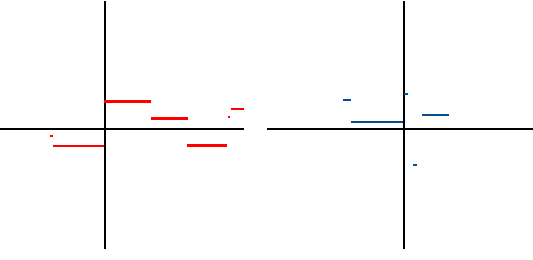

# 非負可測簡單函數

## 簡介

函數的定義域$$\{E_i\}$$為實數上的分割，且相異集合的函數取值相異$$f(\{x \in E_i\})=c_i$$，此可計算測度值$$m(E \cap E_i)$$與函數$$f(x)=c_i, x \in E_i$$在各個分割的乘積。全部分割的乘積總和即為積分值。

可知若$$m(E \cap E_i) < \infty$$且$$f(x)=c_i < \infty$$, $$i=1,2,\dots, p$$時，則函數$$f$$必定可積分。

## 非負可測簡單函數

> 定義：非負可測簡單函數(nonnegative simple function)
>
> 函數$$f(x): \mathbb{R}^n \rightarrow [0, \infty)$$為非負可測簡單函數，其定義域在可測集合$$E_i \subseteq \mathbb{R}^n,~i=1,2,\dots, p$$分別為取值為$$c_i \in \mathbb{R}$$：
>
> $$\displaystyle f(x)=\sum_{i=1}^p c_i \chi_{E_i}(x)$$，$$\bigcup_{i=1}^p E_i = \mathbb{R}^n$$，$$E_i \cap E_j = \emptyset, ~\forall i \neq j$$。

<mark style="color:blue;">由定義可知簡單函數為值域個數為有限值的函數</mark>。

而$$E_i$$在定義域中並不一定是連續的區間，因為函數可為多對一的映射。

<figure><figcaption>
簡單函數範例
</figcaption></figure>

### 非負可測簡單函數的積分

> 定義：非負可測簡單函數的積分
>
> 給定歐式空間上的σ域$$\Sigma$$，若可測集合$$E \in \Sigma$$，定義非負簡單函數在$$E$$的積分為：
>
> $$\displaystyle \int_E f(x) dx \equiv \sum_{i=1}^p c_i m(E \cap E_i)$$。
>
> 其中$$dx$$是$$\mathbb{R}^n$$上Lebesgue測度的標誌，若是可測空間可使用$$dm(x)$$或$$d\mu(x)$$。
>
> <mark style="color:blue;">上述定義的積分可能為</mark>$$\pm \infty$$，<mark style="color:blue;">因為測度可取值為</mark>$$\pm \infty$$。要<mark style="color:blue;">注意擴充實數中，定義</mark>$$0 \cdot \infty = 0$$。

## 指示函數的積分

> $$1_{A}=\begin{cases} 1,& \text{ if } x \in A \\ 0, & \text{ otherwise } \end{cases}$$。
>
> 令$$A \in \Sigma$$，則可定義積分為：\
> $$\displaystyle \int_E 1_A dx = 1\cdot m(E \cap A) + 0 \cdot m(E \cap A^c) = m(E \cap A)$$

### 範例：Dirichlet函數的積分

$$\displaystyle  f(x)=\chi_{\mathbb{Q}}(x)=  \left\{ \begin{aligned} & 1,& ~ x \in \mathbb{Q} \\ & 0,& ~ x \notin \mathbb{Q}  \end{aligned} \right.$$

因此值域取值為0(無理數)或1(有理數)。而有理數集合為可數集，因此其測度為$$m(\mathbb{Q})=0$$，無理數集合的測度為$$\infty$$。

可得積分為$$\int_\mathbb{R} f(x)dx = 0 \cdot \infty + 1 \cdot 0 = 0$$。

### 範例：骰子

令隨機變數$$X$$為丟一顆骰子的點數，令集合$$E$$為丟出偶數的事件，則$$\mathrm{E}(X)=1 \cdot 0 + 2 \cdot 1/2 + 3 \cdots 0 + 4 \cdot 1/2 + 5 \cdot 0 + 6 \cdot 1/2= 6$$。

## 非負簡單函數積分線性性質

> $$f, g: \mathbb{R}^n \rightarrow [0,\infty)$$為非負可測簡單函數。
>
> $$f(x)=\sum_{i=1}^p a_i \chi_{A_i}(x), ~ \bigcup_{i=1}^p A_i = \mathbb{R}^n, ~ A_i \cap A_j = \emptyset ~ \forall i \neq j$$。
>
> $$g(x)=\sum_{i=1}^q b_i \chi_{B_i}(x), ~ \bigcup_{i=1}^q B_i = \mathbb{R}^n, ~ B_i \cap B_j = \emptyset ~ \forall i \neq j$$。
>
> 給定歐式空間上的σ域$$\Sigma$$，集合$$E \in \Sigma$$，
>
> 1. 若$$c > 0$$，可得$$\displaystyle \int_E c\cdot f(x) dx = c \int_E  f(x) dx$$。
> 2. $$\displaystyle \int_E [f(x)+g(x)] dx =  \int_E  f(x) dx +  \int_E  g(x) dx$$

proof: 有限元素的級數和

1. 由定義可直接得證。
2. $$f(x)+g(x)$$在集合$$A_i \cap B_j$$上的值為$$a_i + b_j$$。

可得 $$\displaystyle \begin{aligned}  \int_E [f(x)+g(x)] dx &= \sum_{i=1}^p \sum_{j=1}^q (a_i + b_j) m(E \cap A_i \cap B_j) \\ 	& = \sum_{i=1}^p a_i \sum_{j=1}^q m(E \cap A_i \cap B_j) + \sum_{j=1}^q b_j \sum_{i=1}^p m(E \cap A_i \cap B_j) \\ 	& = \sum_{i=1}^p a_i m(E  \cap A_i) + \sum_{j=1}^q b_j m(E \cap B_j) \\ 		& = \int_E f(x) dx + \int_E g(x) dx  \end{aligned}$$

(QED)

## 非負簡單函數於遞增可測集合序列的積分

> $$E_1 \subseteq E_2 \subseteq  \dots \subseteq \mathbb{R}^n$$為遞增可測集合序列且$$f(x): \mathbb{R}^n \rightarrow [0,\infty)$$為非負可測簡單函數，則：
>
> $$\displaystyle \int_E f(x)dx = \lim_{k \rightarrow \infty} \int_{E_k} f(x)dx, ~ E=\bigcup_{k=1}^\infty E_k$$

proof: 遞增集合極限的測度等於聯集的測度

由[遞增集合極限的測度(continuity of measure)](../measure.md#di-zeng-ji-he-ji-xian-de-ce-du-continuity-of-measure)可得$$\displaystyle \lim_{k \rightarrow \infty} m(E_k) = m(\lim_{k \rightarrow \infty} E_k) = m(\bigcup_{k \in \mathbb{N}} E_k)=m(E)$$。

令函數$$f(x)=\sum_{i=1}^p a_i \chi_{A_i}(x), ~ \bigcup_{i=1}^p A_i = \mathbb{R}^n, ~ A_i \cap A_j = \emptyset ~ \forall i \neq j$$

則$$\displaystyle \begin{aligned}  \lim_{k \rightarrow \infty} \int_{E_k} f(x) dx  	& = \lim_{k \rightarrow \infty} \sum_{i=1}^p a_i m(E_k \cap A_i) \\ 	& = \sum_{i=1}^p a_i m(E \cap A_i) \\ 	& = \int_E f(x) dx  \end{aligned}$$

(QED)

## 參考資料

* [https://naturale0.github.io/2020/12/19/PTE-1.4-Lebesgue-integral](https://naturale0.github.io/2020/12/19/PTE-1.4-Lebesgue-integral)
