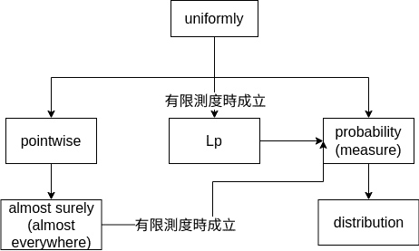

# 可測函數收斂的定義與關係

## Littlewood three principles \[[wiki](https://en.wikipedia.org/wiki/Littlewood's_three_principles_of_real_analysis)]

> 1. 每個（可測）集合幾乎就是一些區間(interval)的有限聯集(有限和)；&#x20;
> 2. 每個（$$L^k$$可積的）函數幾乎就是連續函數；
> 3. 每個點態收斂的函數列幾乎就是一致收斂的。
>
> 實變函數就是為了說明這些“幾乎(almost)”的意義。

## 測度空間函數序列收斂關係

測度$$\mu: E \rightarrow [0, \infty]$$，因此要考慮有限或無限測度的條件。

* <mark style="color:blue;">\[</mark>[<mark style="color:blue;">證明</mark>](convergence-ae.md#ji-hu-chu-chu-yi-zhi-shou-lian-bao-zheng-ji-hu-chu-chu-shou-lian)<mark style="color:blue;">]在有限或無限測度空間時，幾乎一致收斂的定義可得幾乎處處收斂</mark><mark style="color:red;">。</mark>
* <mark style="color:red;">\[</mark>[<mark style="color:red;">證明</mark>](relationship-of-convergence.md#egoroff-ding-li-ji-hu-chu-chu-shou-lian-zai-you-xian-ce-du-tiao-jian-xia-wei-ji-hu-yi-zhi-shou-lian)<mark style="color:red;">]如果為有限測度空間時，Egoroff定理證明了幾乎處處收斂可保證幾乎一致收斂</mark>。
* \[證明]如果為有限測度空間時，幾乎處處收斂可得測度收斂。

<figure><figcaption>
測度空間可測函數收斂的關係
</figcaption></figure>

### 機率空間隨機變數收斂關係

<figure><figcaption>
機率空間隨機變數收斂關係
</figcaption></figure>

機率空間為有限測度空間，而分佈收斂為機率空間中特有的收斂方式。

<mark style="color:red;">註：測度空間中定義可測函數的收斂性時，大多使用可測函數的值來定義；而機率空間中定義隨機變數(機率空間中的可測函數)的收斂性時，通常使用隨機變數前像集合的機率測度來定義</mark>。

以大數定律為例，假設對樣本的均值有一個精度為$$\delta$$的要求。幾乎處處收斂是說只要樣本數量$$n$$大於一個確定的數量$$n(\delta)$$，樣本均值一定可以(機率1)在精度要求內。

而依機率收斂還附加了一個$$\epsilon$$的參數，只要樣本數量$$n$$大於一個確定的數量$$n(\delta, \epsilon)$$，樣本均值以機率$$1-\epsilon$$在精度要求內，但還有$$\epsilon$$的機率的誤差大於$$\delta$$。

[https://stats.stackexchange.com/questions/2230/convergence-in-probability-vs-almost-sure-convergence](https://stats.stackexchange.com/questions/2230/convergence-in-probability-vs-almost-sure-convergence)

## 收斂的定義

### (處處)點態收斂(everewhere pointwise convergence)

> $$\forall x \in E, ~\forall \epsilon > 0 ~\exists n_0 \in \mathbb{N} \ni |f_n(x)-f(x)|< \epsilon ~ \forall n > n_0$$

點態收態是根據每一點$$x$$判定收斂，因此每一點收斂的速度都不相同($$f_n$$ 上每一點$$x$$的值域收斂值$$f(x)$$的速度不同)。

此處處處(everywhere)強調對於定義域$$x\in E$$的性質全部成立。

### 一致收斂(everywhere uniformly convergence)

> $$\forall \epsilon > 0  ~\exists n_0 \in \mathbb{N} \ni \forall x \in E, ~|f_n(x) - f(x)| < \epsilon, ~ \forall n \geq n_0$$

一致收斂強調的是$$n_0$$之值不依賴於$$x$$的實現值，而只依於$$\epsilon$$且對此$$(\epsilon,n_0)$$的關係對於所有的$$x \in E$$均適用，即每一點的收斂速度均相同。

### (處處)一致(均勻)收斂(everywhere uniformly convergence)

> $$\displaystyle \forall \epsilon > 0, \exists n_0 \in \mathbb{N} \ni \lim_{n \rightarrow \infty} \sup_{x \in E}|f_n(x) - f(x)| < \epsilon, ~\forall n \geq n_0$$。
>
> 或者令$$\displaystyle d_n = \sup_{x \in E} |f_n(x) - f(x)|$$，$$\displaystyle \lim_{n \rightarrow \infty} d_n =0$$。

一致收斂考慮的是全部集合內的點($$\forall x \in E$$)，因此每一點的收斂速度都相同(有相同的上限)。

<mark style="color:red;">點態收斂和一致收斂通常用於分析連續函數序列的收斂性，必須為一致收斂才能保證收斂到連續函數</mark>。

### 幾乎處處(點態)收斂(almost everywhere convergence)

> $$\displaystyle \lim_{n \rightarrow \infty} f_n(x) = f(x) ~ \text{a.e.}$$，即$$\mu(\{x \in X ~|~ \lim_{n \rightarrow \infty} f_n(x) \neq f(x) \}) = 0$$
>
> $$\exists E_0 \in \Sigma, ~ \mu(E_0)=0 \ni \forall x \in X - E_0, ~ \forall \epsilon > 0 \exists n_0 \in \mathbb{N} \ni |f_n(x) - f(x)|<\epsilon, \forall n \geq n_0$$。

函數序列在兩者不相等的集合$$E_0$$的測度為0，其餘的集合點態收斂 。

一般函數而言，單點(可數)集合的測度為0，因此只要$$E_0$$為可數個點的集合均滿足此性質。

<mark style="color:red;">幾乎處處收斂的零測度集合</mark>$$E_0$$<mark style="color:red;">，對於所有函數序列中的函數都是在</mark>$$E_0$$<mark style="color:red;">中測度為0，且在</mark>$$E-E_0$$<mark style="color:red;">外均收斂；而測度收斂中，對於所有序數序列中的函數無法找到共同的</mark>$$E_0$$<mark style="color:red;">，但是可以保證收斂函數與函數序列不相等的點集的測度為0</mark>。

### 幾乎一致(均勻)收斂 (almost uniformly convergence)

> $$\displaystyle \forall \epsilon > 0,\exists E_\epsilon \in \Sigma \ni \mu(E_\epsilon) < \epsilon \text{ and } f_n \rightarrow f \text{ uniformly on } E - E_\epsilon$$

在測度小於$$\epsilon$$的集合$$E_\epsilon$$之外，$$f_n$$一致收斂至$$f$$。

### 測度收斂(convergence in measure)

> $$\forall \epsilon >0, ~\forall \delta > 0~ \exists n_0 \in \mathbb{N} \ni \mu(|f_n(x) - f(x)| \geq \epsilon) < \delta ~ \forall n \geq n_0$$。
>
> 或記為$$\displaystyle \lim_{n \rightarrow \infty}\mu(|f_n(x) - f(x)| \geq \epsilon) =0$$
