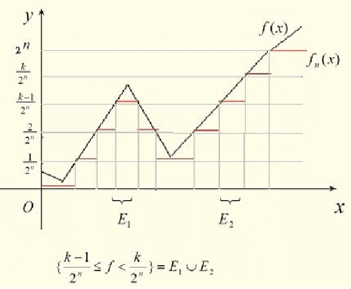

# 簡單函數逼近可測函數

## 相關筆記

[集合的特徵函數](../set/characteristic-function.md)。

## 特徵(指示)函數為可測函數

> 集合$$E$$的特徵(指示)函數為$$\chi_E(x)\equiv \mathbb{I}_E(x)= \left\{ \begin{aligned} &1 ~ \text{ if } x \in E, \\ &0 ~ \text{ if } x \notin E \end{aligned} \right.$$
>
> 則$$E$$為可測集合$$\Leftrightarrow \chi_E$$為可測函數。

proof: 以定義直接證明

proof =>:

取$$S \in \mathbb{B}(\mathbb{R})$$，可得$$\chi_E^{-1}(S) = \left\{ \begin{aligned} & X,~ \text{ if } 0, 1 \in S, \\ & E,~ \text{ if } 1 \in S, ~ 0 \notin S, \\ & E^c,~ \text{ if } 1 \notin S, ~ 0 \in S, \\ & \empty, ~ \text{ otherwise } \end{aligned} \right.$$

也可用$$\chi_E^{-1}((-\infty, c))= \left\{ \begin{aligned} & \empty,~ \text{ if } c < 0, \\ & E^c,~ \text{ if } 0 \leq c < 1, \\ & E \cup E^c,~ \text{ if } c \geq 1, \end{aligned} \right.$$

因為$$X, E, E^c, \empty \in \Sigma$$，所以$$\chi_E$$為可測函數 (QED)。

proof <=:

$$\chi_E^{-1}((1/2, \infty))=\{ x\in X ~|~ \chi_{E}(x) > 1/2 \}=E \in \Sigma$$ (QED)

### 集合序列上極限的特徵函數(可穿過limsup符號)

> 令$$\{E_n\}$$為集合序列，且$$\displaystyle E^{*}=\limsup_{n \rightarrow \infty} E_n \equiv \bigcap_{n=1}^\infty \bigcup_{k=n}^\infty E_k$$，則：
>
> $$\displaystyle \chi_E^{*}(x)=\limsup_{n \rightarrow \infty} \chi_{E_n}(x)$$

## 簡單函數(simple function)

> 令$$f: E \rightarrow \mathbb{R}, ~ E \subseteq \mathbb{R}^n$$，若$$S=\{y \in \mathbb{R}~|~ y=f(x), x \in E\}$$為有限集合時，則稱$$f$$為集合$$E$$上的簡單函數。
>
> <mark style="color:red;">註：簡單函數就是值域為有限取值的函數。例如離散型的隨機變數</mark>。

若$$f$$為$$E$$上的簡單函數時，可將集合$$E$$切為$$p$$個分割$$E_1, \dots, E_p, ~ E_i \cap E_j = \emptyset$$。

且$$f(x) = c_i, \forall x \in E_i$$，則可得$$\displaystyle f(x)=\sum_{i=1}^p c_i \chi_{E_i}(x), ~x \in E$$。

### 簡單函數的性質

> $$f,g$$為集合$$E$$的簡單函數：
>
> * $$f(x) \pm g(x)$$為$$E$$的簡單函數。
> * $$f(x)g(x)$$為$$E$$的簡單函數。
> * 若$$E_i, i=1,2,\dots, p$$均為可測集合，則$$f$$為可測函數。

## 存在遞增可測簡單函數可逼近非負可測函數

> $$f: E \rightarrow \overline{\mathbb{R}}^{+}$$為非負可測函數(函數值可為無窮大)，則存在遞增非負可測簡單函數序列：$$h_k(x) \leq h_{k+1}(x), k \in \mathbb{N}$$ 使得：$$\displaystyle \lim_{k \rightarrow \infty }h_k(x) =f(x), ~ x \in E$$。
>
> <mark style="color:red;">註：此處簡單函數逼近切</mark>$$f$$<mark style="color:red;">的值域(但可能有無限多個取值)</mark>。

<figure><figcaption>
simple function approximation
</figcaption></figure>

proof：切值域直接建構遞增簡單函數序列

[https://math.stackexchange.com/questions/2943834/approximation-of-measurable-function-via-simple-functions-proof](https://math.stackexchange.com/questions/2943834/approximation-of-measurable-function-via-simple-functions-proof)

$$\forall k \in \mathbb{N}$$，可將(值域)閉區間$$[0,k]$$分為$$k \cdot 2^k$$等長區間。

令其中第$$j$$個定義域區間為$$E_{k,j}=\{x \in E ~|~ \frac{j-1}{2^k} \leq f(x) < \frac{j}{2^k}\}, j=1,2,\dots, k2^k$$。

而函數值大於等於$$k$$的區間記為$$E_k=\{x \in E ~|~ f(x) \geq k\}$$。

取(值域)函數序列：$$\displaystyle  	h_k(x)=\left\{ 	\begin{aligned} 	&\frac{j-1}{2^k}, & x \in E_{k,j} \\ 	&k, & x \in E_k 	\end{aligned} 	\right. 	~j=1,2,\dots, k2^k, ~ k \in \mathbb{N}$$。

記$$\displaystyle h_k(x)=k \cdot \chi_{E_k}(x) + \sum_{j=1}^{k \cdot 2^k} \frac{j-1}{2^k}\chi_{E_{k,j}}(x), ~ x \in E$$。

因此$$h_k(x)$$都是非負可測簡單函數，且可得$$h_k(x) \leq h_{k+1}(x) \leq f(x), ~ h_k(x) \leq k$$，$$x \in E, ~ k \in \mathbb{N}$$ 為遞增函數序列。

若$$\forall x \in E$$，函數有界，即$$\exists M < \infty \ni f(x) \leq M$$，則當$$k  > M$$時，可得$$0 \leq f(x) - h_{k}(x) \leq 2^{-k}, ~ x \in E$$。

若 $$f(x) = \infty$$，可得$$h_k(x) = k, k \in \mathbb{N}$$

因此$$\displaystyle \lim_{k \rightarrow \infty} h_k(x) = f(x), ~ \forall x \in E$$ (QED)

## 存在可測簡單函數逼近可測函數

> $$f: E \rightarrow \overline{\mathbb{R}}$$為可測函數，則存在可測簡單函數序列$$\{h_k(x)\}$$使得$$|h_k(x)| \leq |f(x)|$$且有 $$\displaystyle \lim_{k \rightarrow \infty} h_k(x) = f(x), ~ x \in E$$。
>
> 若$$f(x) < \infty$$，則上述為均勻(一致)收斂，即$$\displaystyle \lim_{k \rightarrow \infty }\sup_{x\in E}\{f_k(x) - f(x)\}=0$$。

proof

令$$f(x)=f^{+}(x) - f^{-}(x)$$，由存在遞增可測簡單函數可逼近非負可測函數$$m_k(x)$$與$$n_k(x)$$滿足$$\displaystyle \lim_{k \rightarrow \infty }m_k(x)=f^{+}(x)$$與$$\displaystyle \lim_{k \rightarrow \infty }n_k(x)=f^{-}(x)$$ $$x \in E$$

由於$$h_k(x)=m_k(x) - n_k(x)$$為可測簡單函數，且由極限的線性性質得 $$\displaystyle \lim_{k \rightarrow \infty }m_k(x)-n_k(x)=f^{+}(x) - f^{-}(x)=f(x), ~ x \in E$$。 (QED)

若在集合$$E$$上函數值有限，即$$|f(x)| \leq M$$，則當$$k>M$$時，可得：

* $$\displaystyle \sup |f^{+}(x) - m_k(x)| \leq \frac{1}{2^k}, ~ x \in E$$
* $$\displaystyle \sup |f^{-}(x) - n_k(x)| \leq \frac{1}{2^k}, ~ x \in E$$

因此可得$$\displaystyle  \begin{aligned} & \lim_{k \rightarrow \infty} \sup{(f(x)-(m_k(x) - n_k(x))}  \\ & \leq \lim_{k \rightarrow \infty}\sup |f^{+}(x) - m_k(x)| + \lim_{k \rightarrow \infty}\sup |f^{-}(x) - n_k(x)| \\ & \leq \lim_{k \rightarrow \infty}\frac{1}{2^k} + \lim_{k \rightarrow \infty}\frac{1}{2^k} \\ & \leq 0   \end{aligned}$$

(QED)

## 支撐集(support set)

> 對於定義在$$E \subseteq \mathbb{R}^n$$的函數$$f(x)$$，定義$$\mathrm{supp}(f)=\{x \in E~|~ f(x)\neq 0\}$$為函數的支撐集。
>
> 如果$$\mathrm{supp}(f)$$有界\[$$\exists r >0, p \in \mathbb{R}^n \ni \mathrm{supp}(f) \subseteq B_r(p)$$]\(在歐式空間中等價於緊緻集合)，則稱函數$$f(x)$$是有緊緻支撐集的函數。

### 存在可測簡單函數且函數為有緊致支撐集逼近可測函數

> $$f: E \rightarrow \overline{\mathbb{R}}$$為可測函數，則存在可測簡單函數序列$$\{h_k(x)\}$$，且$$h_k(x)$$有緊緻支撐集，使得$$|h_k(x)| \leq |f(x)|$$且有 $$\displaystyle \lim_{k \rightarrow \infty} h_k(x) = f(x), ~ x \in E$$。

proof

$$\forall k$$令$$g_k(x) = h_k(x) \chi_{B_k(0)}(x), ~ x \in E$$

則$$g_k(x)$$仍為可測函數且有緊緻支撐集。

若$$x \in E$$，則存在$$k_0 \ni k \geq k_0$$時，$$x \in B_k(0)$$，此時可得 $$\displaystyle  lim_{k \rightarrow \infty} g_k(x) = \lim_{k \rightarrow \infty} h_k(x) = f(x), ~ x \in E$$ (QED)

