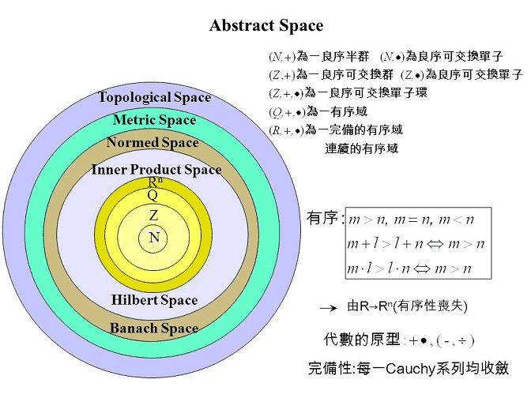
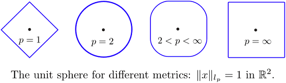

# 度量空間 (metric space)

## 距離函數與度量空間

> $$X$$為一集合，如果存在一實值函數 $$d(\cdot, \cdot): X \times X \rightarrow \mathbb{R}$$滿足 $$\forall x, y, z \in X$$則稱$$d$$為距離函數（distance function）
>
> 1. \[兩點間距離為正值]$$d(x,y) \geq 0$$ and $$d(x,y) = 0 \Leftrightarrow  x = y$$
> 2. \[對稱性] $$d(x,y) = d(y,x)$$
> 3. \[三角不等式] $$d(x,y) +d(y,z) \geq d(x, z)$$

**距離函數擴展了距離的定義**。

> $$(X, d)$$稱為度量空間（metric space），也稱賦距空間，函數$$d$$為$$X$$上的一個度量（距離）函數。

* **度量空間主要討論集合加上距離函數後的性質**。
* 所有的集合至少存在離散度量函數。
* 有了度量，就可定義集合中收斂的性質。

## 抽象空間

## 度量（metric）、內積（inner product）與範數（norm）比較

| metric                                   | inner product                                                             | norm                                    |
| ---------------------------------------- | ------------------------------------------------------------------------- | --------------------------------------- |
| $$d:X\times X \rightarrow \mathbb{R}^+$$ | $$\langle \cdot, \cdot\rangle: X \times X \rightarrow \mathbb{R}^+$$      | $$\|\cdot\|:X\rightarrow \mathbb{R}^+$$ |
| 距離函數抽象化                                  | 角度的抽象化                                                                    | 長度的抽象化                                  |
| $$d(x,y)=0\Leftrightarrow x=y$$          | $$\langle x, x \rangle\geq 0, \langle x,x\rangle =0 \Leftrightarrow x=0$$ | $$\|x\|=0 \Leftrightarrow =0$$          |
| $$d(x,y)=d(y,x)$$                        | $$\langle x, y \rangle = \overline{\langle y, x \rangle}$$                | $$\| cx \|=|c| \|x\|$$                  |
| $$d(x,y)+d(y,z) \geq d(x,z)$$            | $$\langle ax+by,z \rangle=a \langle x, z\rangle + b \langle y, z\rangle$$ | $$\|x\| + \|y\| \geq \|x+y\|$$          |

* 度量不需要滿足分配律，而內積不需要滿足三角不等式。
* 度量空間使用$$d(x,y)$$ 定義$$x,y$$兩點之間的距離，而賦範空間使用$$\|x−y|$$定義$$x,y$$兩點之間的距離。

### 範數為距離函數的一般化

> $$\forall x, y \in X$$, $$\| x-y\|=d(x,y)$$

* 令$$x,y,z \in X$$, $$a=x-y, b=y-z, c=x-z$$
* \[非負性]$$\|a\|=0 \Leftrightarrow a=0 \Leftrightarrow x=y$$
* \[對稱性] $$\|a\| = |-1|\|a\|=\|-a\|$$。所以$$\| x-y\| = \|y-x\|$$
* \[三角不等式] $$\|a\| + \|b\| \geq \|a+b\| \Leftrightarrow \| x-y \| + \|y-z\| \geq \|x-z\|$$(QED)

## 常見度量空間

### Euclidean space

* \[歐式度量或$$l^2$$度量]$$X=\mathbb{R}^n$$, $$d(x,y) = \| x - y\|_2$$
* \[$$l^1$$度量]$$X = \mathbb{R}^n$$, $$d(x,y)=\| x - y\|_1 = |x_1 -y_1 | + |x_2 -y_2| + \ldots +|x_n -y_n|$$
* \[$$l^{\infty}$$度量]$$X = \mathbb{R}^n$$, $$d(x,y)=\| x- y\|_{\infty} =\max \{ |x_1-y_1|, |x_2 - y_2| , \ldots, |x_n - y_n| \}$$

### complex space

$$X = \mathbb{C}$$, $$d(z_1, z_2) = |z_1 - z_2|$$

### discrete space

$$X$$為任意非空集合，定義離散度量 $$d(x,y) =   \{ \begin{align}  0, & \ \text { if } x = y \\ 1, &   \text{ if } x \neq y \\ \end{align}$$

&#x20;**此度量空間證明了所有的集合都至少有一個度量函數**$$d$$
****
。

* \[非負性] $$d(x,x)=0$$, $$d(x,y)=1, \forall x \neq y$$
* \[對稱性] $$d(y,x)=d(x,y)=1, \forall x \neq y$$
* \[三角不等式]&#x20;
  * $$x=y=z$$, $$d(x,y)+d(y,z)=0+0=d(x,z)$$
  * $$x\neq y\neq z$$, $$d(x,y)+d(y,z)=1+1\geq d(x,z)=1$$
  * $$x=y\neq z$$, $$d(x,y)+d(y,z)=0+1\geq d(x,z)=1$$

### sub-metric space

$$(X, d)$$ is metric space, and $$S \subset X$$, then $$(S, d)$$is metric space.

e.g. rational number set $$\mathbb{Q}$$ and $$d(x,y) = |x -y|$$

### continuous function

$$X=C[a,b]$$為定義在實數區間$$[a,b]$$所有的連續實數值函數，

* $$\displaystyle d_1(f,g)= \int_a^b |f(x)-g(x)|dx$$
* $$d_{\infty}(f,g)=\sup\{ |g(t) - f(t)\ \vert | a \leq t \leq b\}$$，兩函數的距離為兩函數值在區間$$[a,b]$$的最大差值。

### continuous function with quadratic metric

$$X=C[a,b]$$, $$d(f,g)=( \int_a^b (f(t) - g(t))^2 dt)^{\frac{1}{2}}$$

### l2-metric

$$X=(x_1, x_2, \ldots, x_n, \ldots)$$be sequence of real numbers and $$\sum_{i=1}^\infty (x_i)^2 < \infty$$, $$d(x,y) =(\sum_{i=1}^\infty (x_i - y_i)^2)^{\frac{1}{2}}$$

### bounded sequence

$$X=(x_1, x_2, \ldots, x_n, \ldots)$$be sequence of real numbers and $$x_i< \infty \forall i$$, $$d(x,y)= \sup{ |x_i -y_i|} \ \forall i$$

## 完備度量空間（complete metric space）

> 度量空間$$(X,d)$$中的數列 $$\{x_n\}$$稱為柯西數列（Cauchy sequence）若$$d(x_n, x_m) \rightarrow 0$$as $$n, m \rightarrow \infty$$
>
> 完備度量空間若且唯若空間中的任意柯西數列均收斂，且極限點在$$X$$中。

收斂數列必定是柯西數列，反之柯西數序必須為完備度量空間中的數列，才是收斂數列，否則可能無法在度量空間中收斂。

例如有理數集合$$\mathbb{Q}$$與$$d=|x-y|$$不是完備度量空間，因為$$\{1,  1.41, 1.414, 1.4142, \ldots\}$$此數列收斂，但收斂至無理數。
