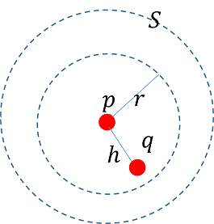

# 開集合

## 開集合\(open set\)

> $$(X,d)$$為度量空間，稱集合$$S \subseteq X$$為開集合，若所有在集合$$S$$內的點均為其內點，即
>
> * $$a∈S$$為內點，則$$\exists r>0 \ni N_r (a) \subset S $$
> * $$S$$為開集合，則 $$\forall a \in S, a \in int(S)$$

* 如果$$S$$不為開集合，則 $$\exists a \in S \ni \forall r > 0, N_r(a) \not \subset S$$。
* 因為開集合$$S$$的補集$$S^c$$為閉集合，且閉集合包含所有的極限點，因此開集合$$S$$不包含所有的極限點；即存在$$S$$的極限點$$x$$，且$$x \notin S$$。
* 實數的常見開集合為開區間$$(a,b)$$，在$$n$$維空間則為開球$$(a_1,b_1) \times(a_2,b_2)\times\cdots \times (a_n, b_n)$$。

### 開集合等價於內點集合

> $$ (X,d)$$為度量空間, $$S \subseteq X$$ 為開集合 $$\Leftrightarrow S= int(S)$$

* 給定點$$p \in S,$$半徑$$r>0$$與點$$q \in N_r(p)$$
* 令長度$$h=d(p,q)$$，得長度$$r_1=r-h > 0$$使得 $$N_{r_1}(q) \subseteq N_r(p)$$\(QED\)

### 邊界點非開集合中的元素

* 若$$a$$為集合$$S$$的邊界點（$$a \in \partial(S)$$），則$$\forall r > 0 ~ N_r(a) \cap S \neq \emptyset ~\land ~N_r(a) \cap S^c \neq \emptyset$$。
* 因此$$a$$不為$$S$$的內點，所以不是開集合內的元素 \(QED\)

### 鄰域為開集合

> •$$(X,d)$$為度量空間, 給定$$x \in X$$，則$$N_r (x)=\{y \in X, d(x,y)<r \}$$為開集合。

* 令$$y \in N_r(x)$$，則$$d(x,y) < r$$
* 令$$h=r-d(x,y) > 0 $$，取$$p\in X, d(y,p)<h$$
* 可得 $$d(x,p) \leq d(x,y)+d(y,p) < d(x,y)+r -d(x,y) <r$$
* 因此$$p \in X$$為內點，所以$$N_r(x)$$為開集合 \(QED\)

### 空集合與歐式空間均為開集合且為閉集合

> $$\emptyset$$與$$\mathbb{R}^n$$同時為開集合與閉集合。
>
> 若以邊界點角度分析，若集合$$S$$沒有邊界點時，因為$$S$$不包含任意邊界點，所以S為開集合；同時因為不存在邊界點（即邊界點為空集合），因此$$S$$包含了其所有邊界點，因此$$S$$為閉集合。

* 因為所有的點（沒有任何點）均為空集合的內點，因此空集合為開集合。
* 因為在$$\mathbb{R}^n$$ 空間中，$$\emptyset^c=\mathbb{R}^n$$, 所以$$\mathbb{R}^n$$為閉集合。
* 因為$$\forall x∈R^n ~ \exists r > 0 \ni N_r(x) \ni \mathbb{R}^n$$，所以$$\mathbb{R}^n$$為開集合。
  * 因為$$(\mathbb{R}^n)^c=\emptyset$$，所以$$\emptyset$$為閉集合。\(QED\)

## 開集合的聯集與交集

給定度量空間$$(X,d)$$

### 任意（可數無限）個開集合的聯集仍是開集合

> $$S_n \subseteq X, ~ n\in \mathbb{N}$$為開集合，則$$\displaystyle \cup_{n \in \mathbb{N}} S_n$$為開集合。

* 令集合$$S = \cup_{n \in \mathbb{N}} S_n$$，且點$$x \in S$$。
* 因此$$x$$存在於某些開集合中，令$$x \in S_k$$。
* 因為$$S_k$$為開集合，所以$$\exists r > 0 \ni N_r(x) \subseteq S_k$$。
* 因為$$x \in S$$，可得 $$N_r(x) \subseteq S$$。
* 對於$$\forall x \in S$$，均可以得到相同的結論，因此$$S$$為開集合 \(QED\)

### 有限個開集合的交集仍是開集合

> $$S_n \subseteq X, ~ n=1,2,\ldots, N$$為開集合，則$$\displaystyle \cap_{n=1}^N S_n$$為開集合。
>
> 註：有限個開集合的交集才能保證為開集合，否則可能收斂到一點變成閉集合。

* 令集合$$S = \cap_{n=1}^N S_n$$，且$$x \in S$$。
* 依定義得 $$x$$為所有開集合$$S_n$$都有的元素，因此$$\exists r_n > 0 ~\ni N_{r_n}(x) \subseteq S_n, n=1,2,\ldots, N$$。
* 取$$r = \min \{r_1, r_2, \ldots, r_n \}$$，得 $$N_r(x) \subseteq S$$。
* 而$$\forall x \in S$$，均可使用相同的方法得到$$N_r(x) \subseteq S$$，所以$$S$$為開集合 \(QED\)

### 任意（無限）個開集合的交集不一定是開集合

> 可能收斂至一點。

例如$$S_n = (- \frac{1}{n}, \frac{1}{n}), ~ \cap_{n=1}^\infty S_n = 0$$收斂至單點，不是開集合。

### 實數上的任意閉區間為可數開區間的交集

> 不失一般性令$$[a,b] \subseteq \mathbb{R}$$，則$$\displaystyle [a,b]= \cap_{n=1}^{\infty} \bigg(a- \frac{1}{n}, b + \frac{1}{n} \bigg)$$

### 集合的加法

> * 給定集合$$S_1, S_2 \subseteq \mathbb{R}$$
> * 若$$S_1, S_2$$均為開集合，則$$S_1 + S_2 = \{ x+y | x \in S_1,~y \in S_2\}$$為開集合。
> * 若$$S_1, S_2$$均為閉集合，則$$S_1+S_2$$為閉集合。

## 實數的開集合結構

### 分量區間（component interval）

> 令$$S \subseteq \mathbb{R}$$為開集合。定義開區間（open interval）$$I$$稱為集合$$S$$的分量區間若滿足：
>
> * $$I \subseteq S$$且
> * 不存在開區間 $$J \subseteq \mathbb{R}, ~ J \neq I$$使得 $$I \subseteq J \subseteq S$$，即$$I$$為$$S$$中最大的開區間。

* 例如$$S=(1,2)$$，則$$I=(1,2)$$
* 例如$$S=(1,2) \cup (2,3) \cup (3,4)$$，則$$I=(1,2)$$或$$(2,3)$$或$$(3,4)$$。

### 分量區間的唯一性

> $$S \subseteq \mathbb{R}$$為非空開集合，則$$\forall x \in S$$，$$x$$只會是唯一的分量區間之元素。
>
> * $$I, J \subseteq S$$為分量區間，$$x \in I \Rightarrow x \notin J$$
> * 此分量區間必為$$I_x=(a(x), b(x))$$
>   * $$a(x)= \inf \{ a \in \overline{\mathbb{R}}\| \text{ open interval } (a,x) \subseteq S\}$$
>   * $$b(x) = \sup \{ b \in \overline{\mathbb{R}}\| \text{ open interval } (x, b) \subseteq S\}$$
>   * $$\overline{\mathbb{R}}$$為擴充實數，因此$$a(x)$$可為$$-\infty$$，$$b(x)$$可為$$\infty$$。

* 由分量區間定義得不存在開區間$$J \ni I_x \subseteq J \subseteq S $$。因此$$I_x$$ 為包含$$x$$的分量區間。
* 令$$J_x$$ 為包含$$x$$的另一個分量區間，則$$I_x∪J_x$$ 為$$S$$的開區間且$$I_x \subseteq I_x \cup J_x,~ J_x\subseteq I_x \cup J_x$$
  。
* 由分量區間的定義得$$I_x \cup J_x=I_x$$  且 $$I_x \cup J_x=J_x \Rightarrow I_x=J_x  $$\(QED\).

