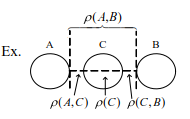
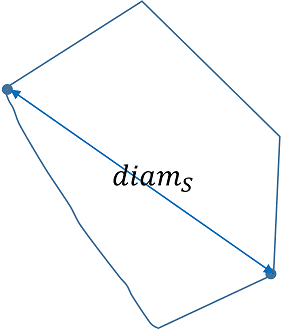
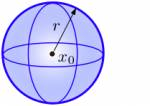
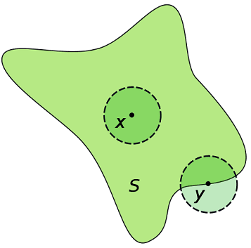
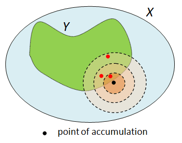

# 點拓樸集

## 簡介

此為度量空間$$(X,d)$$的點拓樸集，與特定空間的點拓樸集，如$$\mathbb{R}^n$$相比性質較少，但是較為通用。

## 兩集合的距離

> $$A,B \subseteq X$$, $$d(A,B)=\inf \{ d(x,y)| \forall x \in A, ~ y \in B\}$$
>
> • 集合的距離為兩集合間最短的兩點間的距離。

### 兩集合間的距離不滿足三角不等式

* $$d(A,B) > d(A,C) + d(B,C)$$不滿足三角不等式。
* 但$$d(A,B) \leq d(A,C)+d(B,C)+d(C)$$成立

## 點到集合的距離

> $$A \subseteq X$$, $$x \in X$$, $$d(x,A)=\inf d(x,y), ~\forall y \in A$$
>
>  點到集合的距離為點到集合最短兩點間的距離。

* 若$$A$$為閉集合，且$$x\notin A \Rightarrow d(x,A) >0$$

## 集合的直徑（diameter）

> $$S\subseteq X$$, $$d(S)=\sup\{ d(x,y), ~\forall x, y \in S \}$$
>
> $$S$$可為任意形狀的集合，集合$$S$$的直徑為集合中距離最遠兩點的長度。

* 集合的直徑可能為無窮大。例如$$ S=(a,\infty) \text{ or }  (−\infty,b) $$

## 有界集合（bounded set）

> 稱集合$$S$$為有界集合若滿足
>
> * $$\exists M\geq 0 , ~ y \in S \ni d(x,y) <M, \forall x \in S$$
> * 或 $$\exists M \geq 0 \ni  \sup d(x,y) < M, \forall x, y \in S$$
> * 或 $$\exists x \in S \exists r > 0 \ni S \subseteq N_r(S)$$

*  有界集合即集合中任意兩點的距離必定小於某個有限實數$$M$$。
* 無界集合即集合中存在兩點的距離為無窮大。因此必須是有界集合才可定義直徑。

## 鄰域（neighborhood）

> 給定點$$a\in S$$與半徑$$r > 0$$，則點$$a$$以$$r$$為半徑的鄰域（neighborhood of a with radius r）記為 $$N_r(a) \equiv N(a,r)=\{b \in S | d(a,b) < r\}$$

* 注意$$N_r (a)$$包含了以$$a$$為圓心，$$r$$為半徑中，所有屬於集合$$S$$中的點，但不包含圓周上的點。
* **鄰域的定義中使用**$$d(a,b)$$**，因此只要符合距離測度的函數即可**。所以鄰域不一定是以$$a$$為中心的圓形，可能是菱形$$d(a,b)=|a−b|$$或是其它形狀。

## 內點（interior point）

> 稱點$$a \in S$$為集合$$S$$的內點若存在以$$a$$為中心的鄰域$$N_r(a)$$為$$S$$的子集合。$$\exists r > 0 \ni N_r(a) \subseteq S$$。
>
> 集合$$S$$中所有內點形成的集合記為$$int(S)$$

* 若點$$a$$恰好位於集合$$S$$的邊界上，則不存在符合上述定義的半徑$$r$$，因此不為內點；
* 反之若點$$a$$在集合$$S$$內，則一定可以找到滿足上述定義的半徑$$r$$

### 內點的性質

> 給定度量空間$$(X,d)$$與子集合$$A,B \subseteq X$$，則
>
> 1. $$A\subset B \Rightarrow int(A) \subset int(B)$$
>    * 反之不成立，考慮孤立點不為內點的情形。$$A=\{0\} \cup [1,2]$$, $$B=[0.5, 2.5]$$, $$int(A)=(1,2),~ int(B)=(0.5, 2.5)$$可得 $$int(A) \subset int(B)$$但$$ A \nsubseteq B$$。
> 2. $$int(A\cap B)=int(A) \cap int(B)$$
> 3. $$int(A) \cup int(B) \subset int(A \cup B)$$
> 4. $$int(A)=X-\overline{X-A}$$，$$\overline{X-A}$$為$$X-A$$的閉包（closure）。
> 5. $$int(X-A)=X-\overline{A}$$
> 6. $$int(int(A))=int(A)$$
> 7. $$int(\cap_{i=1}^nA_i)=\cap_{i=1}^n(int(A_i)), ~ A_i \subseteq X$$
> 8. $$int(\cap_{i=1}^{\infty} A_i) \subseteq \cap_{i=1}^{\infty}(int(A_i)), ~ A_i \subseteq X$$
> 9. $$\cup_{i=1}^{\infty} (int(A_i)) \subseteq int(\cup_{i=1}^{\infty} A_i), ~ A_i \subseteq X$$
> 10. 若$$A$$在$$X$$中為開集合或閉集合，令$$\partial(A)$$為$$A$$的邊界點，則$$int(\partial A)=\emptyset$$，
> 11. 若$$int(A)=int(B)=\emptyset$$，則$$A$$在$$X$$為閉集合，則$$int(A \cup B)=\emptyset$$

proof 1:

* 令$$a \in int(A)$$，則$$\exists r > 0 \ni N_a(r) \subset A$$
* 因為$$A\subset B$$，可得$$N_a(r) \subset B$$，所以$$int(A) \subset int(B)$$\(QED\)

## 邊界點（boundary point）

> 令$$(X,d)$$為度量空間，給定子集合$$S \subset X$$
>
> 稱點$$p \in X$$為集合$$S$$的邊界點若$$\forall r >0 . N_r(a) \cap S \neq \emptyset$$且$$N_r(a) \cap S^c \neq \emptyset$$
>
> 邊界點$$p$$形成的集合稱為邊界集，記為$$\partial(S)$$

## 外點（exterior point）

> 點$$p \in S^c$$，若滿足$$\exists r > 0 \ni N_r(p) \subset S^c$$，則稱$$p$$為集合$$S$$的外點（或$$p$$為集合$$S^c$$的內點 ）
>
> 所有外點形成的集合記為$$ext(S)$$

## 集合的三一律

> $$\forall S \subset X$$，有以下的性質
>
> * $$int(S) \subset S$$
> * $$ext(S) = int(X\setminus S)$$
> * $$ext(S) \subset X \setminus S$$
> * $$int(S) \cap ext(S) = \emptyset$$
> * $$int(S) \cap \partial(S) = \emptyset$$
> * $$ext(S) \cap \partial (S) = \emptyset$$
> * $$int(S) \cup ext(S) \cup \partial(S) = X$$
>
> 因此點$$x \in int(S),~ x \in ext(S), ~ x \in \partial(S)$$只能有一個成立。

## 凝集點（condensation point）

> 集合$$S\subseteq X$$，若$$x\in X$$滿足 $$\forall r > 0, N_r(x)\cap S$$均為不可數集合時，稱$$x$$為$$S$$的凝集點。

### 不可數集合必存在凝聚點

> 若$$S$$為不可數集合，則存在$$x \in S$$為凝聚點。
>
> 反之，不存在凝聚點的集合必為可數集合。

* 假設$$\forall x \in S$$均不為凝聚點，則對於每一個點$$x$$, $$\exists r > 0 \ni N_{r(x)}(x) \cap S$$為可數集合。因此可得 $$S \subseteq \cup_{x \in S} (N_{r(x)}(x) \cap S)$$。
* 由於可數集合的（有限或無限）聯集仍為可數集合，且可數集合的任意子集仍為可數集合，因此得$$S$$為可數集合（QED）。

### 凝集點的性質

> 令集合$$S \subseteq X$$為不可數集合，且$$T$$為$$S$$的凝集點集合，則
>
> 1. $$S \setminus T$$為可數集合。
> 2. $$S \cap T$$為不可數集合。
> 3. $$T$$為閉集合。
> 4. $$T$$不包含孤立點。

* proof\(1\): $$S \setminus T$$中不包含凝集點，因此為可數集合。\(QED\)。
* proof\(2\): 因為$$S$$為不可數集合，因此$$S$$中必包含凝集點，可得$$S\cap T \neq \emptyset$$為部份凝集點的集合，因此為不可數集合。\(QED\)
* proof\(3\): 令$$x\in T$$為凝集點，由定義得$$\forall r > 0~ \exists N_r(x) \cap S$$為不可數集合，因此 $$\forall r > 0, N_r(x) \cap S \setminus \{ x\} \neq \emptyset$$，即$$x$$為$$S$$的極限點，可得$$T$$為所有$$S$$極限點的集合，因此$$T$$為閉集合\(QED\)。
* proof\(4\): 令$$x\in T$$為凝集點，由定義得$$\forall r > 0~ \exists N_r(x) \cap S$$為不可數集合，因此$$N_r(x) \cap S \neq \{x\}$$不包含孤立點。\(QED\)。

## 附著點（adherent point）

> 給定度量空間$$(X,d)$$，子集合$$S \subseteq X$$，點$$x\in X$$。若$$\forall r >0, N_r(x) \cap S \neq \emptyset$$ 則稱點$$x$$為集合$$S$$的附著點。
>
> 若$$x$$為$$S$$的附著點，可得$$\forall \epsilon > 0 \ \exists y \in S \ni d(x,y) < \epsilon $$。

* $$x$$為附著點，但$$x$$不必為集合$$S$$的元素。
* 附著點直觀的解釋是$$x$$的任意鄰域必定包含至少一個$$S$$集合中的元素。
*  附著點與極限點的定義，唯一差異是極限點與$$S$$的交集不可為點$$x$$自身。
* 因為$$x$$的任意鄰域$$N_r (x)$$均包含集合$$S$$至少一個元素，因此$$x$$為$$S$$中的元素或在$$S$$的邊界點上。
* 若$$x$$在集合$$S$$的邊界點外（外點），則$$\exists r>0 \ni N_r (x) \cap S=\emptyset $$。

## 孤立點（isolated point）

> 集合$$S \subset X$$，如果點$$x\in S$$滿足 $$\exists r > 0 \ni N_r(x) \cap S = \{x\}$$，則稱$$x$$為孤立點。
>
> 若不是孤立點，則$$N_r(x) \cap S$$為不可數集合。
>
> 由定義知孤立點不是極限點。

* 由定義知孤立點不是內點, 因為若$$\exists r>0 \ni N_r (x) \subset S$$，可得$$N_r (x)\cap S=N_r (x) \neq \{x\}$$。
* 因為$$N_r (x) \cap S$$集合中元素應為無窮多個，若只有一個點時，表示$$x$$附近沒有任何元素，即為孤立點。
* 例如 $$S=\{1/n, \forall n \in \mathbb{N}\}$$，則$$S$$內的每一點都是孤立點。

### 孤立點集合為可數集合

> • $$S \subseteq X$$, 令$$F$$為$$S$$中孤立點形成的集合，則$$F$$為可數\(有限或無限\)集合。

* 若$$S$$中的孤立點為有限個，則$$F$$為可數有限集合。
* 令$$S$$中孤立點個數為無限多個，考慮$$x \in S$$為孤立點，即 $$\exists r  > 0 \ni N_r(x) \cap S =\{ x\}$$。
* 因為$$F$$為孤立點的集合, 令$$r_1=\min⁡\{r >0~|~ \forall x \in F, N_r (x) \cap  S=\{x\}\}$$, 且令滿足此最小半徑的點為$$x_1$$， 則此點必定唯一，否則違反孤立點的定義。
* 從$$F\setminus \{x_1\}$$的集合中，可得$$r_2=\min \{  r>0  | \forall x \in F \setminus \{x_1\}, N_r (x) \cap S=\{x\}  \}$$ 且令滿足此最小半徑的點為$$x_2$$。
* 以此類推，可得$$F$$中的點與自然數集合$$\mathbb{N}$$有一對一的關係，因此$$F$$為可數集合。 \(QED\)

## 極限點（limit point） 

或稱accumulation point, cluster point

> * 給定集合$$S \subset X$$，點$$ x \in X$$，若$$\forall r>0  \exists\ y \in S, y \neq x \ni y \in N_r (x)$$ 或 $$\forall r >0 (N_r (x)\cap S)\setminus \{x\} \neq \emptyset$$，則稱$$x$$為$$S$$的極限點。
> * $$x \in X$$為$$S$$的極限點，則$$\forall \epsilon >0, ~ \exists y \in S \setminus \{x\}  \ni d(x,y)<\epsilon$$。

* **由定義知極限點必為附著點**。
*  極限點就是由序列收斂點的觀點來定義極限的性質。
* 極限點直觀的解釋是$$x$$的任意鄰域必定包含至少一個S集合中除了自已外的元素。
* 可得實數中閉區間中所有元素都是極限點，而開區間除了端點外均為極限點。

## 導集合（derived set）

> 導集合$$d(S)$$為集合$$S$$所有極限點形成的集合。
>
> $$d(S)=\{x \in X | \forall r >0, N_r(x) \cap S \setminus \{ x\}\neq \emptyset \}$$

* 導集合為閉集合。
* 

