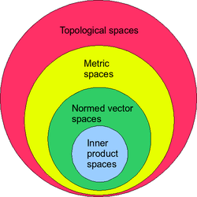

# 賦範空間

範數最先由向量模長中推廣，從向量模長這一特殊的例子推廣更一般線性空間中的範數。因此，需將範數最本質的特點提煉出來，即：非負、正定、正齊次（數乘）和三角不等式（正齊次由線性空間性質決定）。以上四個性質相互獨立，無法互相推導，作為定義線性空間中的範數的最基本性質。

從範數公理性的四個性質，不難得到其與距離空間的四個性質是等價的。也就是說，**範數滿足距離的定義**，賦範空間也是一類特殊的距離空間，該距離空間距離函數由範數誘導。

## Lp空間

> * $$C[a,b]$$是定義域為實數區間$$[a,b]$$上連續函數全體所成的集合。
> * 定義範數 $$\displaystyle \| f\|_p = \bigg( \int (f)^pdx \bigg)^{\frac{1}{p}}, ~ 1 \leq p \leq \infty$$
> * 距離為$$d(f,g)=\| f -g \|_p$$
>
> 成為一個賦範空間。但該賦範空間是不完備，即連續函數可能收斂為不連續函數。

