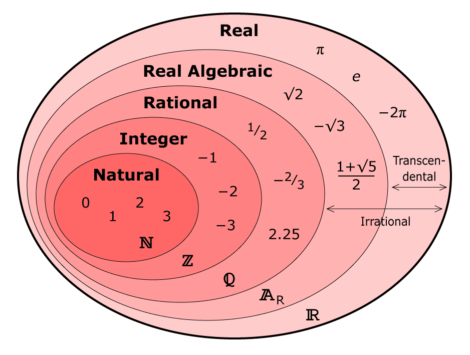

# 實數

## 簡介

分析數學中的主要概念，如收斂性、微分與積分等，對其討論時，必定都將追溯到實數系的基本性質。	• 我們需證明實數集合$$\mathbb{R}$$ 為一個具有完備性的有序體\(complete ordered field\)。

## 整數\(integer\)

* 整數集合 $$\mathbb{Z} = \{ \cdots, -2, -1, 0, 1, 2, \cdots \}  = - \mathbb{N} \cup \{0\} \cup \mathbb{N}$$
* 可以處理$$ a−b,  a<b  \text{ and } a, b \in \mathbb{N}$$ 擴展定義
* 由定義可得自然數為整數的子集合，$$\mathbb{N} \subset \mathbb{Z}$$。
* 雖然自然數為整數的子集合，但因為兩者均為無限集合，且兩者可找出一對一且映成的函數，所以兩集合元素個數相等，$$| \mathbb{N} | = | \mathbb{Z} |$$。

## 有理數\(rational number\)

* 有理數定義為 $$r = \frac{n}{m}, \forall n, m \in \mathbb{Z}$$，$$gcd(n,m)=1$$，是為了處理$$ \frac{n}{m}$$ 不為整數的擴展定義。
* 有理數集合記為$$\mathbb{Q}$$
* 兩個有理數之間，必定存在一個相異有理數，所以**有理數處處稠密\(dense\)**。
  * $$\forall a,b \in \mathbb{Q} ,\text {let } c = \frac{a+b}{2} \Rightarrow c \in \mathbb{Q}$$
* 因為有理數+無理數\(如$$1 + \sqrt{2}$$\)仍為無理數，同理**無理數處處稠密**。

有理數的有限個數十進位表示法$$ r = a_0 + \frac{a_1}{10}+\frac{a_2}{10^2}+\cdots + \frac{a_n}{10^n}=a_0.a_1a_2\cdots a_n, a_0 \in \mathbb{Z}, a_1,\cdots, a_n \in \{0,1,2,\cdots, 9\}$$

