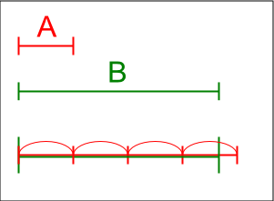

# 實數\(real number\)

## 簡介

把有理數比做直線，則直線上會充滿了間隙，它是不完備的、不連續的。而我們則把直線看成是沒有間隙的、 完備的和連續的。 直線的連續性是什麼意思？我們必須要有連續性的一個精確定義，使它可以成為邏輯推理的基礎。

有很多理論都可以建立實數系，而戴德金切割法\(Dedekind cut method\) 建構實數為最簡單。此法的特色是以有理數系為基礎，然後只利用了集合與邏輯性質建構實數系。

切割法簡單的說，就是在直線\(實數\)上任意選一點$$r$$切割，可將實數分成左、右兩個集合。將小於$$r$$\(一定不會包含$$r$$\)左側的全體有理數且沒有最大值的集合稱為左分割$$S$$。而將大於$$r$$\(可能會包含$$r$$\)右則的全體有理數形成的集合稱為右分割$$T \equiv (\mathbb{Q} \setminus S$$\)。

因此有理數分割 $$(S, T)$$可唯一決定實線上的任一點$$r$$。因為從集合的最大值、最小值的定理，可得以下四種結果：

* $$S$$有最大有理數\(與分割定義不符\)，$$T$$沒有最小有理數，因此$$r \in S$$為有理數。
* $$S$$沒有最大有理數，$$T$$有最小有理數
  ，因此$$r \in T$$為有理數。
* $$S$$沒有最大有理數，$$T$$沒有最小有理數，因此$$r$$為無理數。
* $$S$$有最大有理數\(與分割定義不符\)且$$T$$有最小有理數的情形與定義矛盾，不存在。

因此分割$$(S,T)$$可唯一表示一個實數，而分割形成的集合為實數集，即所有分割的集合。
因為只要確定集合$$S$$，集合$$T$$唯一，因此有時只用集合$$S$$代表$$r$$的分割。

而分割的集合同[有理數系](../set/rational-number.md#you-li-shu-xi-rational-number-system)，也滿足加法與乘法的體\(field\)性質，以及為全序集，因此可得實數系\(real number system\)的性質。

## 實數集合

> 定義非空實數集合$$\mathbb{R}$$滿足十個公理（axioms），且可分為三類：field axioms, order axioms, completeness axioms。

### field axioms

$$\forall x,y,z \in \mathbb{R}$$，定義加法與乘法兩個二元算子性質如下：

1. \[交換律\] $$x+y=y+x$$, $$xy=yx$$
2. \[結合律\] $$x+(y+z)=(x+y)+z$$, $$(xy)z=x(yz)$$
3. \[分配律\] $$x(y+z)=xy+xz$$
4. \[加法反元素\] $$\forall x, y \in \mathbb{R}$$, $$\exists z \in \mathbb{R} \ni x+z=y$$, 記為$$z=y-x$$。$$x-x$$記為0。當$$y=0$$時，$$z$$為$$x$$的加法反元素。
5. \[乘法反元素\] 若 $$x,y \in \mathbb{R}$$且$$x \neq 0$$, 則存在$$z \in \mathbb{R}$$使得$$xz=y$$，記為$$z=\frac{y}{x}$$。當$$y=1$$時，$$z=x^{-1}$$為其乘法反元素。

### order axioms

$$\forall x,y,z \in \mathbb{R}$$，有序關係性質如下：

1. \[三一律\] $$x=y, x > y, x<y$$三者同時只有一個性質為真。
2. 若 $$x <y$$，則$$\forall z\in \mathbb{R}, ~ x+z < y+z$$。
3. 若$$x >0 $$且 $$y >0 $$則$$xy >0 $$。
4. 若$$x>y$$且 $$y >z$$，則$$x > z$$。

* 當$$x>0$$時稱為正數（positive number）；$$x<0$$時稱為負數（negative number）。
* $$x \leq y \Leftrightarrow x<y \lor x = y$$。

### 有序性質

> $$\forall a,b \in \mathbb{R}$$，若 $$ a \leq b + \epsilon, ~ \forall \epsilon >0$$，則$$a \leq b$$。
>
> 反之若 $$ a > b$$時，則$$\exists \epsilon > 0 \ni a > b+ \epsilon$$。
>
> 在證明時經常會使用此性質。

若$$ b < a$$，令$$\epsilon = \frac{b-a}{2}$$，則 $$b+\epsilon = b+ \frac{a-b}{2} = \frac{a+b}{2} < \frac{a+a}{2}=a$$\(QED\)。

### complete axioms

1. $$\emptyset \neq S \subseteq \mathbb{R}$$若有上界（bounded above）則有最小上界（supremum），記為$$b = \sup(S)$$。

* 可得實數中非空子集合若有下界則有最大下界。

## 切割\(cut\)

> \(左\)切割為一有理數子集合$$S \subset \mathbb{Q}$$，且滿足三個條件：
>
> * $$S \neq \emptyset$$且$$S \neq \mathbb{Q}$$。
> * \[比$$p$$小的全體有理數均為分割內的元素\] 若$$p \in S$$且對於所有的$$q \in \mathbb{Q}$$滿足$$ q < p$$ ，則$$q \in S$$。
> * \[分割內沒有最大元素\] 若$$p \in S$$，則存在$$ q \in S$$使得$$p < q$$

* \(有理數\)切割的直觀意義，是在直線上用某個點$$p$$將直線切成兩個分割集合，那麼這個點必定不在左分割$$S$$中，但點$$p$$不一定是右\(有理數\)分割$$T \equiv \mathbb{Q} \setminus S$$的元素。因為切點$$p$$可能是無理數。
* \(左\)分割即為比某個數$$p$$小的全體有理數，且沒有最大值的集合。

eg.

* $$S = \{ r \in \mathbb{Q} |  r< 1\}$$為一分割。
* $$S = \{ r\in \mathbb{Q} |  r \leq 0\} \cup\{ r \in \mathbb{Q} | r >0 \land r^2 < 2\}$$為一分割。

### 分割的目的

* 戴德金切割就成了把全部有理數分成$$S, T$$兩半的序對$$(S,T)$$ ，所以$$S \cup T = \mathbb{Q}$$。由於$$S$$與$$T$$不相交，因此確定了其中一邊也同時確定了另一邊，習慣上我們用序對左邊的集合$$S$$來定義實數，稱之為戴德金左集合（Dedekind left set）。**也就是說一個實數就是一堆有理數所形成的戴德金左集合，而全體實數就是這些戴德金左集合所形成的集合**。
* 為什麼要把實數講得這麼古古怪怪的？因為我們假裝我們不認得無理數，只認得有理數，因此只好利用有理數以及熟知的實數的性質去捕捉實數。有了分割的定義，我們就可以定義加法和乘法，並規定其中的大小關係。

### 有理數必定屬於左或右分割其中一個集合

> 令$$S$$為有理數的\(左\)分割，則
>
> 1. $$\forall p \in S$$, if $$q \in \mathbb{Q}$$ and $$ q \notin S$$ then $$ q > p$$。\[因為集合$$S$$會包含所有小於$$p$$的有理數，因此$$q$$不為$$S$$的元素時，則$$q$$
> 2. $$\forall p, q \in \mathbb{Q}$$, $$p \notin S$$ and $$ p < q$$ then $$q \notin S$$。

1. 

## 實數集完備性的七個等價定理

實數集$$\mathbb{R}$$ 與有理數系$$\mathbb{Q}$$ 兩者都是有序體\(totally-ordered field\), 但是兩者最大的差別在於實數
集具有完備性\(所有收斂數列均收斂在集合中\)，而有理數集沒有完備性。

1. **Dedekind切割原理\(Dedekind cut theorem\)**：對於實數集的任何一個切割$$R$$的最小上界存在。
2. **確界原理（ supremum and infimum principle ）**： 設S為非空數集。若S有上界，則S必有上確界；若S有下界，則S必有下確界。可以由實數的無限小數公理或者 Dedekind 分割證明
   。
3. **區間套定理\(Nested Intervals Theorem\)**：實數連續性的一種描述，幾何意義是，有一數列閉區間\(兩個端點也屬於此區間\)，滿足後一個閉區間包含於前一個閉區間\(區間越來越小\)以及閉區間長

   度的極限為零這兩個條件時，則這一數列區間存在唯一一個共同點。

4. **單調有界定理\(The monotone bounded convergence theorem\)**：單調\(遞增或遞減\)有界數列必收斂（有極限）。
5. **有限覆蓋定理\(finite cover theorem\)**：有界閉區間的任何一個開覆蓋\(open cover\)， 必存在有限個數的子覆蓋。
6. **數列緊緻性定理 \(compact sequence\)**：有界數列必有收斂的子數列。
7. **柯西收斂準則\(Cauchy converge criterion\)**：無窮數列收斂的充分必要條件是無窮數列是柯西數列。

這七個定理可以循環證明，因此均為實數集完備性公理的等價敘述。

## 阿基米德性質\(Archimedean property\)

> $$\forall 0 < a, b \in \mathbb{R} \Rightarrow \exists n \in \mathbb{N} \ni na > b$$。

* 若$$a>b$$，則取$$n=1$$可得$$a>b$$。
* 不論$$a$$有多小，$$b$$有多大，必定可以找到$$n \in \mathbb{N} \ni na>b$$
  。

##  實數集的稠密性

> $$\forall a,b \in \mathbb{R}, \ a <b$$ $$ \exists u \in \mathbb{Q}, \ v \in \Gamma \ni a < u < b$$ 且 $$ a < v < b$$。
>
> 任兩個不相等的實數之間，必定存在無理數或有理數。

