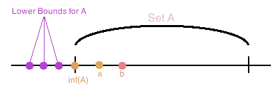
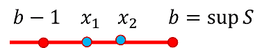

# 實數\(real number\)

## 簡介

把有理數比做直線，則直線上會充滿了間隙，它是不完備的、不連續的。而我們則把直線看成是沒有間隙的、 完備的和連續的。 直線的連續性是什麼意思？我們必須要有連續性的一個精確定義，使它可以成為邏輯推理的基礎。

有很多理論都可以建立實數系，而戴德金切割法\(Dedekind cut method\) 建構實數為最簡單。此法的特色是以有理數系為基礎，然後只利用了集合與邏輯性質建構實數系。

切割法簡單的說，就是在直線\(實數\)上任意選一點$$r$$切割，可將實數分成左、右兩個集合。將小於$$r$$\(一定不會包含$$r$$\)左側的全體有理數且沒有最大值的集合稱為左分割$$S$$。而將大於$$r$$\(可能會包含$$r$$\)右則的全體有理數形成的集合稱為右分割$$T \equiv (\mathbb{Q} \setminus S$$\)。

因此有理數分割 $$(S, T)$$可唯一決定實線上的任一點$$r$$。因為從集合的最大值、最小值的定理，可得以下四種結果：

* $$S$$有最大有理數\(與分割定義不符\)，$$T$$沒有最小有理數，因此$$r \in S$$為有理數。
* $$S$$沒有最大有理數，$$T$$有最小有理數
  ，因此$$r \in T$$為有理數。
* $$S$$沒有最大有理數，$$T$$沒有最小有理數，因此$$r$$為無理數。
* $$S$$有最大有理數\(與分割定義不符\)且$$T$$有最小有理數的情形與定義矛盾，不存在。

因此分割$$(S,T)$$可唯一表示一個實數，而分割形成的集合為實數集，即所有分割的集合。
因為只要確定集合$$S$$，集合$$T$$唯一，因此有時只用集合$$S$$代表$$r$$的分割。

而分割的集合同[有理數系](../set/rational-number.md#you-li-shu-xi-rational-number-system)，也滿足加法與乘法的體\(field\)性質，以及為全序集，因此可得實數系\(real number system\)的性質。

## 實數集合

> 定義非空實數集合$$\mathbb{R}$$滿足十個公理（axioms），且可分為三類：field axioms, order axioms, completeness axioms。

### field axioms

$$\forall x,y,z \in \mathbb{R}$$，定義加法與乘法兩個二元算子性質如下：

1. \[交換律\] $$x+y=y+x$$, $$xy=yx$$
2. \[結合律\] $$x+(y+z)=(x+y)+z$$, $$(xy)z=x(yz)$$
3. \[分配律\] $$x(y+z)=xy+xz$$
4. \[加法反元素\] $$\forall x, y \in \mathbb{R}$$, $$\exists z \in \mathbb{R} \ni x+z=y$$, 記為$$z=y-x$$。$$x-x$$記為0。當$$y=0$$時，$$z$$為$$x$$的加法反元素。
5. \[乘法反元素\] 若 $$x,y \in \mathbb{R}$$且$$x \neq 0$$, 則存在$$z \in \mathbb{R}$$使得$$xz=y$$，記為$$z=\frac{y}{x}$$。當$$y=1$$時，$$z=x^{-1}$$為其乘法反元素。

### order axioms

$$\forall x,y,z \in \mathbb{R}$$，有序關係性質如下：

1. \[三一律\] $$x=y, x > y, x<y$$三者同時只有一個性質為真。
2. 若 $$x <y$$，則$$\forall z\in \mathbb{R}, ~ x+z < y+z$$。
3. 若$$x >0 $$且 $$y >0 $$則$$xy >0 $$。
4. 若$$x>y$$且 $$y >z$$，則$$x > z$$。

* 當$$x>0$$時稱為正數（positive number）；$$x<0$$時稱為負數（negative number）。
* $$x \leq y \Leftrightarrow x<y \lor x = y$$。

### 有序性質

> $$\forall a,b \in \mathbb{R}$$，若 $$ a \leq b + \epsilon, ~ \forall \epsilon >0$$，則$$a \leq b$$。
>
> 反之若 $$ a > b$$時，則$$\exists \epsilon > 0 \ni a > b+ \epsilon$$。
>
> 在證明時經常會使用此性質，比如$$\forall \epsilon >0, a -\epsilon \leq a_n \leq a +\epsilon$$，可得$$a_n \leq a$$且 $$ a \leq a_n$$，由三一律得$$a_n =a$$。

若$$ b < a$$，令$$\epsilon = \frac{b-a}{2}$$，則 $$b+\epsilon = b+ \frac{a-b}{2} = \frac{a+b}{2} < \frac{a+a}{2}=a$$\(QED\)。

### 有界集合

> 集合$$ S \subseteq \mathbb{R}$$，若存在$$b \in \mathbb{R} \ni x \leq b, ~ \forall x \in S$$，則$$b$$為集合$$S$$的上界\(upper bound\)。註：$$b$$不必為集合$$S$$內的元素。
>
> 若$$b \in S \ni x \leq b \forall x \in S$$，則$$b$$為集合$$S$$的最大元素\(maximum element\)，記為 $$b = \max(S)$$。
>
> 若集合不存在上界時，則稱無上界（unbounded above）。
>
> 下界與最小元素為以相同的方式定義。

* $$\mathbb{R}^+=\{0, \infty\}$$無上界與最大元素，（最大）下界為0，但沒有最小元素。
* 閉區間$$S=[0,1]$$上界與最大元素同為1；（最大）下界與最小元素同為0。
* 半開區間$$S=[0,1)$$上界為1，但無最大元素；（最大）下界與最小元素均為0。
* $$[a,b], (a,b), (a,b], [a,b)$$四個集合的最小上界均為$$b$$，最大下界均為$$a$$。
* $$\{r \in \mathbb{Q}| r\geq 0 \cap r^2 \leq 2\}$$的最小上界為$$\sqrt{2}$$，但無最大元素，最大下界為0。
* $$\inf(\mathbb{N})=1,~ \sup(\mathbb{⁡N})=\infty $$
* $$\inf(\mathbb{Z})=−\infty, ~ \sup(\mathbb{Z})=\infty$$
* $$\inf⁡\{(−1)^n+\frac{1}{n}, ~n=1,2,\ldots\})=−1 $$
* $$\sup(\{(−1)^n−\frac{1}{n}, ~ n=1,2,\ldots\})=1 $$

### 最小上界（最大下界）

> 給定實數的非空子集合$$S$$且$$S$$有上界。$$b\in \mathbb{R}$$若滿足以下性質時稱為集合的最小上界（least upper bound），記為$$b=\sup(S)$$：
>
> * $$b$$為集合$$S$$的上界（$$\forall x \in S, x \leq b$$）
> * 集合$$S$$不存在比$$b$$小的上界 \($$c < b \Rightarrow \exists x \in S, x \geq c$$\)
>
> 若實數的非空子集合$$S$$有下界，$$a\in \mathbb{R}$$若滿足以下性質時稱為集合的最大下界（greatest lower bound），記為$$a = \inf(S)$$：
>
> * $$a$$為集合$$S$$的下界（$$\forall x \in S, a \leq x$$）
> * 集合$$S$$不存在比$$a$$大的下界 （$$c>a \Rightarrow \exists x \in S, x \leq c$$）

* **由定義很容易得出集合**$$S$$**的最小上界與最大下界的唯一性**。

### 空集合的最小上界與最大下界

> $$\sup(\emptyset)=−\infty, ~ \inf(\emptyset)=\infty $$

* 若$$\emptyset \neq A \subset \mathbb{R}$$沒有上界時，因此$$\sup(⁡A)$$ 不等於任意值，因此為了方便則記為$$\sup(⁡A)=\infty$$\(注意$$\infty$$不是一個值，而僅是一個符號\)
  。
* 同理若$$\emptyset \neq A \subset \mathbb{R}$$沒有下界時，因此$$\inf(⁡A)$$ 不等於任意值，因此為了方便則記為$$\inf(⁡A)=−\infty$$。
* 對於任意實數$$r$$，空集合$$\emptyset$$沒有任何實數大於$$r$$，也沒有任何實數小於$$r$$，因此可以將$$r$$視為$$\emptyset$$的上界與下界。
* 因為任意實數都是$$\emptyset$$的上界與下界，因此對於$$\sup(\emptyset)$$ 與$$\inf(\emptyset)$$ 的合理定義為$$\sup(\emptyset)=−\infty, ~ \inf(\emptyset)=\infty$$。

### 完備性公理\(complete axioms\)

> * $$\emptyset \neq S \subseteq \mathbb{R}$$若有上界（bounded above）則有最小上界（supremum），記為$$b = \sup(S)$$。
> * 同理可得實數中非空子集合（區間）若有下界則有最大下界。

* 因為實數是完備集合（complete set），所以才有此性質；	 可由Dedekind分劃中實數的完備性證明
  。

Proof:

* $$\emptyset \neq S\subset \mathbb{R}$$，且$$S$$有上界
* 定義$$A=\{a \in \mathbb{R} | S\text{ 中至少有一元素 }x \ni x>a\}$$
* 定義 $$B=\{b \in \mathbb{R} | S \text{ 中的每個元素 }x, x \leq b\}$$  \($$S$$所有上界形成的集合\)
  。
*  \(將實數線依集合$$S$$中某個點$$x$$切成兩分割$$A,B$$\)
* $$A \cup B=\mathbb{R}, ~ A \cap B=\emptyset, ~ A<B$$
* 因為$$S\neq \emptyset$$,所以$$A \neq \emptyset, B \neq \emptyset $$
* 依實數的完備性可知必存在$$r \in \mathbb{R} \ni \forall a \in A, a \leq r$$且$$ \forall b \in B, r \leq b $$。
* 要證明$$r \in B$$
* 若$$r \in B$$，則依定義得$$r \in A$$。
* 依$$A$$的定義$$\exists x \in S \ni r<x$$
* 因為$$x \in S$$ 且$$\frac{(x+r)}{2}<x$$，所以$$\frac{(x+r)}{2} \in A$$且$$\frac{(x+r)}{2}>r$$，此與完備性中$$\forall a \in A, a \leq r$$的性質不合
* 因此$$r \in B$$，因為$$B$$是$$S$$所有上界形成的集合，則$$r$$為$$S$$的最小上界。\(QED\)

## 最小上界\(最大下界\)的性質

### 最小上界存在時，若集合有下界則有最大下界，反之亦然

> 集合$$\emptyset \neq S \subset \mathbb{R}$$，則以下兩敘述等價：
>
> 1. 若$$S$$有上界，則$$S$$有最小上界。
> 2. 若$$S$$有下界，則$$S$$有最大下界。

Proof 1-&gt;2:

* 若$$S$$有下界$$a$$，則$$\forall x \in S,~ x \geq a$$。
* 因此$$−S$$有上界: $$\forall -x \in −S, ~ −x \leq −a$$，因為$$−S$$有上確界，令$$b=\sup⁡(−S)$$。
* 可得 $$−b=\inf(⁡S)$$  \(QED\).

Proof 2-&gt;1: 同理可證
。

### 比最小上界小的的任意元素均不為上界

> $$\emptyset \neq S \subseteq \mathbb{R}$$有最小上界$$b= \sup(S)$$，則$$\forall c <b, \exists x \in S \ni c < x \leq b$$。
>
> 同理 $$S$$有最大下界 $$a = \inf(S)$$，則$$\forall c > a~ \exists x \in S \ni a \leq x < c$$ 。

* 因為$$b=\sup(S)$$，由定義得$$\forall x \in S, x \leq b$$。
* 因為$$c < b$$，所以$$c$$不是最小上界，因此$$\exists x \in S \ni c <x$$。
* 因此可得 $$c< x \leq b$$ \(QED\)

### 實數集合中必存在嚴格遞增數列收斂至最小上界

> $$\emptyset \neq S \subseteq \mathbb{R}$$有最小上界$$b= \sup(S)$$若且唯若存在嚴格遞增序列$$\displaystyle \{x_n, n \in \mathbb{N}| \forall i< j, ~x_i < x_j \} \subset S \ni \lim_{n \rightarrow \infty}x_n=b$$
>
> $$\emptyset \neq S \subseteq \mathbb{R}$$有最大下界$$a= \inf(S)$$若且唯若存在嚴格遞減序列$$\displaystyle  \{x_n, n \in \mathbb{N}| \forall i< j, ~x_i > x_j \} \subset S \ni \lim_{n \rightarrow \infty}x_n=a$$
>
> 可以用建構法建出滿足條件的單調序列。

* $$∵b=\sup{⁡}S$$, 給定$$\epsilon=1$$，可得$$x_1 \in S \ni b−1<x_1<b$$
* 取$$\epsilon_2 = \min\{\frac{1}{2}, b-x_1\}$$，可得 $$x_2 \in S \ni b−\epsilon_2<x_2<b$$
* 整理可得 $$x_1≤b−\epsilon_2<x_2,  ~ b−\frac{1}{2} \leq b−\epsilon_2<x_2<b$$
* 同理可得 $$x_1, x_2,\ldots, x_n \in S \ni x_{n-1} < x_n$$且 $$b-\frac{1}{n} <x_n < b$$。
* 所以 $$\displaystyle \lim_{n \rightarrow \infty} b - \frac{1}{n} < \lim_{n \rightarrow \infty} x_n<b$$
* 由夾擠定理得 $$\displaystyle \lim_{n \rightarrow \infty} x_n=b $$\(QED\)

### 集合最小上界與最大下界互為對偶

> $$\forall \emptyset\neq S \subset \mathbb{R}$$，$$S$$為有界集合， $$−S \equiv \{−s|s \in S\}$$，則
>
> * $$\sup(⁡S) =−\inf⁡(−S)$$
> * $$\inf(⁡S)=−\sup⁡(−S)$$

#### 範例

$$S=(a,b), ~ −S=(−b, −a) $$

* $$\sup(⁡S)=b, ~\inf(⁡S)=a
  $$
* $$\sup⁡(−S)=−a, ~ \inf⁡(−S)=−b $$

Proof:

* 令$$\sup(⁡S)=b
  $$
* $$\sup(⁡S) \Leftrightarrow \forall \epsilon>0~ \exists x \in S \ni b−\epsilon<x$$
* $$\forall \epsilon>0 ~ \exists−x\in −S \ni −b+\epsilon>−x
  $$
* $$\therefore−b$$是集合$$−S$$的最大下界，即$$ −b=\inf⁡(−S)\Leftrightarrow \sup(⁡S)=−\inf⁡(−S) $$
* 令$$\inf⁡S=a
  $$
* $$\inf(⁡S) \Leftrightarrow \forall \epsilon>0 ~\exists x \in S \ni x<a+\epsilon$$
* $$\forall \epsilon>0 ~\exists −x \in −S \ni −x>−a−\epsilon$$
* $$\therefore −a$$是集合$$−S$$的最小上界，即$$ −a=\sup⁡(−S) \Leftrightarrow \inf(⁡S)=−\sup⁡(−S)$$  \(QED\)

### 最小上界與最大下界的四則運算

> 集合$$\emptyset \neq A \subset \mathbb{R}, ~ \emptyset \neq B \subset \mathbb{R} $$
>
> * 令$$A+B=\{a+b|a \in A, b \in B\}$$，則
>   * 當$$A,B$$有上界時，$$A+B$$也有上界且$$\sup⁡(A+B)=\sup(⁡A)+\sup(⁡B) $$。
>   * 當$$A,B$$有下界時，$$A+B$$也有下界且$$\inf⁡(A+B)=\inf(⁡A)+\inf(⁡B)$$。
> * 令$$AB=\{xy|x \in A, y \in B \}, $$，若$$A \subset \mathbb{R}^+, B \subset \mathbb{R}^+$$則
>   * 當$$A,B$$有上界時，$$AB$$也有上界且$$\sup⁡(AB)=\sup(⁡A) \sup(⁡B) $$。
>   * 當$$A,B$$有下界時，$$AB$$也有下界且$$\inf⁡(AB)=\inf(⁡A )\inf(⁡B ) $$。

* 由最小上界得當$$ \emptyset \neq A \subset \mathbb{R}, ~ \emptyset \neq B \subset \mathbb{R}$$時，$$\sup(⁡A)=x, ~ \sup⁡(B)=y$$存在
  。
* 因為$$\forall a \in A, a \leq x$$ ，$$\forall b \in B, b \leq y$$，所以$$x+y$$是$$A+B$$的上界。
  * $$\sup(⁡A)=x \Leftrightarrow \forall \epsilon >0 ~ \exists a \in A \ni x−\epsilon<a $$
  * $$\sup⁡(B)=y \Leftrightarrow \forall \epsilon >0 ~\exists b \in B \ni y− \epsilon <b $$
  * $$\therefore \forall \epsilon>0 ~\exists a \in A, b \in B \ni  x+y−2\epsilon<a+b $$
  * $$\therefore x+y$$為集合$$A+B$$的最小上界，即$$\sup⁡(A+B)=x+y=\sup⁡(A)+\sup(B)$$  \(QED\).

### 最小上界與最大下界的次序

> 集合$$\emptyset \neq A \subset \mathbb{R}, ~ \emptyset \neq B \subset \mathbb{R}, $$
>
> * 若$$A\subset B$$（e.g. $$(1,2) \subset [0,2]$$）
>   * 當$$B$$有上界時，$$A$$也有上界，且$$\sup⁡(A) \leq \sup⁡(B) $$
>   * 當$$B$$有下界時，$$A$$也有下界，且$$\inf(⁡A) \geq \inf(⁡B) $$
> * $$\forall x \in A,~ \forall y \in B, ~x \leq y$$，則$$A$$有上界，$$B$$有下界，且$$\sup(⁡A)  \leq \inf⁡(B)$$  （e.g. $$A=(1,2), B=(3,4)$$）
> * $$\forall x\in A ~\exists y \in B \ni x\leq y$$，且$$B$$有上界，則$$A$$也有上界，且$$\sup(⁡A) \leq \sup(⁡B)$$  （e.g. $$A=(1,3), B=(2, 4)$$）
> * $$\forall x\in A ~\exists y \in B \ni x\geq z$$，且$$B$$有下界，則$$A$$也有下界，且$$\inf(⁡A) \geq \inf(⁡B)$$（e.g. $$A=(1,3), B=(2,4)$$）

Proof: $$A\subset B $$

* 因為$$B$$有上界，且$$B$$為實數中非空子集合，所以$$B$$有最小上界，令$$r=\sup(⁡B) $$。
* $$\because A\subset B,  \therefore \forall a \in A , a\in B \Rightarrow a \leq r$$，因此$$A$$有上界$$r$$
* 因為$$A$$有上界，且$$A$$非實數中的非空子集合，所以$$A$$有最小上界，令$$s=\sup(⁡A)
  $$。
* $$.\because s=\sup(⁡A)\Leftrightarrow \forall \epsilon>0 ~\exists a \in A \subset B \ni s−\epsilon <a $$
* $$\because r=\sup(⁡B) \Leftrightarrow \forall b \in B, b \leq r $$
* $$\therefore \forall \epsilon >0 ~ \exists a \in A\subset B \ni s−\epsilon <a \leq r $$
* $$\therefore \sup(⁡A) \leq \sup(⁡B)$$  \(QED\)


Proof:

* $$\forall x \in A, ~ \forall y \in B, x\leq y $$
* 因為$$A$$為實數的非空集合，且A有上界，則由最小上界性質得$$\sup(⁡A)$$存在，同理得$$\inf(⁡B)$$ 存在。
* 因為集合$$B$$中每一點都是$$A$$的上界，得$$\forall b \in B,  b \geq \sup(⁡A) $$
* $$B$$的最大下界定義得$$\forall \epsilon>0 ~ \exists b \in B \ni \inf⁡(B)+\epsilon > b$$，且$$\forall b \in B,~ b \geq \sup(⁡A) $$
* 因此$$\sup(⁡A)\leq \inf(⁡B)$$  \(QED\)

### 最小上界與最大下界的實數倍

> 集合$$\emptyset \neq A \subset \mathbb{R}$$
，實數$$ c \in \mathbb{R}$$。令集合$$cA=\{cx|x \in A\} $$
>
> * 若$$ c>0
  $$
>   * 當$$A$$有上界時，$$cA$$也有上界且$$\sup⁡(cA)=c\cdot \sup(A)$$
>   * 當$$A$$有下界時，$$cA$$也有下界且$$\inf⁡(cA)=c\cdot \inf(⁡A ) $$
> * 若$$c<0
  $$
>   * 當$$A$$有上界時，$$cA$$也有下界且$$\inf⁡(cA)=c\cdot\inf(⁡A )$$
>   * 當$$A$$有下界時，$$cA$$也有上界且$$\sup⁡(cA)=c\cdot \sup(A)$$

#### 範例

* $$A=(a,b)$$或$$[a,b)$$或$$(a,b]$$或$$[a,b]$$
* $$\inf⁡(A)=a, ~ \sup⁡(A)= b$$
* $$c>0, cA=(ca, cb)$$或$$ [ca, cb)$$或$$(ca, cb]$$或$$[ca, cb]
  $$
  * $$\inf(c⁡A)=ca, ~ \sup(c⁡A)=cb
    $$
* $$c<0,  cA=(cb, ca)$$或 $$[cb, ca)$$ 或$$(cb, ca]$$或$$ [cb,  ca]
  $$
  * $$\inf(c⁡A)=cb, ~\sup(c⁡A)=ca
    $$

Proof: $$c>0
$$

* 因為$$A$$為實數的非空集合且有上界，因此有最小上界，令$$\sup⁡(A)=r$$
  。
* 若$$ y \in cA \Rightarrow  \frac{y}{c} \in A \Rightarrow \frac{y}{c} \leq \sup(⁡A)=r$$
* $$\because c>0,~\frac{y}{c}\leq r \Rightarrow y \leq cr$$ 所以$$cr$$是集合$$cA$$的上界--\(1\)
* $$\because \sup(⁡A)=r \Leftrightarrow \forall \epsilon>0 ~\exists x \in A \ni r−\epsilon<x  $$
* $$\because c>0$$，上式可改寫成$$∀\epsilon>0 ~\exists x \in A \ni r−\frac{\epsilon}{c}<x $$
* $$\therefore \forall \epsilon>0, cr−\epsilon<cx$$
* 因為$$cx \in cA$$，上式表示$$cr−\epsilon$$不是集合$$cA$$的上界--\(2\)
* 由\(1,2\)得$$cr$$是$$cA$$的最小上界\(QED\).


Proof: $$c<0$$

* 令$$\sup(⁡A)=r
  $$
* 由定義知當 $$y \in cA$$ 則 $$\frac{y}{c}\in A ~\therefore \frac{y}{c} \leq \sup(⁡A)=r $$
*  因為$$c<0, \frac{y}{c}\leq r$$, 所以$$y\geq cr$$，因此可得$$cr$$是集合$$cA$$的下界--\(1\)
* $$r=\sup(⁡A) \Leftrightarrow \forall \epsilon>0 ~\exists x \in A \ni r−\epsilon<x   $$
* $$\because c<0$$ 上式可改為成$$\forall \epsilon >0 \exists x \in A \ni r+\frac{\epsilon}{c}<x $$
* $$\therefore \forall \epsilon >0 \ni cx<cr+\epsilon$$
* 因為$$cx \in cA$$，上式表示$$\forall \epsilon>cr+\epsilon$$不是$$cA$$的下界--\(2\)
* 由\(1,2\)得$$cr$$是$$cA$$的最大下界 \(QED\)

### 由最小上界可得實數中包含無理數

> 存在正實數$$a \in \mathbb{R}^{+} \ni a^2=2$$

Proof:

* 令集合$$A=\{x \in \mathbb{R}^+ |x^2<2\} $$
* 因為$$1 \in A$$且 2為$$A$$的上界， 由實數的完備性知$$A$$有最小上界，令$$a=\sup(⁡A)$$
  。
* 若$$a^2<2$$
  * 令 $$h=\frac{(2−a^2)}{2(2a+1)} \Rightarrow a+h \in A$$ 且 $$a+h>2 $$
  *  此與$$a=\sup(A)$$矛盾
    。
* 若$$a^2>2$$
  * 令$$h=\frac{a^2−2}{4a} \Rightarrow 0<a−h<a$$ 且 $$(a−h)^2>2 $$
  * $$ \therefore (a−h)^2>2>x^2, ~ \forall x \in A $$
  * 因為$$a−h>0, x>0$$ 所以$$a−h>x \forall x \in A$$
  * 得$$a−h$$為$$A$$的上界，此與$$a=\sup(⁡A)$$ 矛盾
* 根據實數的有序性得$$a^2=2$$ \(QED\).

## 切割\(cut\)

> \(左\)切割為一有理數子集合$$S \subset \mathbb{Q}$$，且滿足三個條件：
>
> * $$S \neq \emptyset$$且$$S \neq \mathbb{Q}$$。
> * \[比$$p$$小的全體有理數均為分割內的元素\] 若$$p \in S$$且對於所有的$$q \in \mathbb{Q}$$滿足$$ q < p$$ ，則$$q \in S$$。
> * \[分割內沒有最大元素\] 若$$p \in S$$，則存在$$ q \in S$$使得$$p < q$$

* \(有理數\)切割的直觀意義，是在直線上用某個點$$p$$將直線切成兩個分割集合，那麼這個點必定不在左分割$$S$$中，但點$$p$$不一定是右\(有理數\)分割$$T \equiv \mathbb{Q} \setminus S$$的元素。因為切點$$p$$可能是無理數。
* \(左\)分割即為比某個數$$p$$小的全體有理數，且沒有最大值的集合。

eg.

* $$S = \{ r \in \mathbb{Q} |  r< 1\}$$為一分割。
* $$S = \{ r\in \mathbb{Q} |  r \leq 0\} \cup\{ r \in \mathbb{Q} | r >0 \land r^2 < 2\}$$為一分割。

### 分割的目的

* 戴德金切割就成了把全部有理數分成$$S, T$$兩半的序對$$(S,T)$$ ，所以$$S \cup T = \mathbb{Q}$$。由於$$S$$與$$T$$不相交，因此確定了其中一邊也同時確定了另一邊，習慣上我們用序對左邊的集合$$S$$來定義實數，稱之為戴德金左集合（Dedekind left set）。**也就是說一個實數就是一堆有理數所形成的戴德金左集合，而全體實數就是這些戴德金左集合所形成的集合**。
* 為什麼要把實數講得這麼古古怪怪的？因為我們假裝我們不認得無理數，只認得有理數，因此只好利用有理數以及熟知的實數的性質去捕捉實數。有了分割的定義，我們就可以定義加法和乘法，並規定其中的大小關係。

### 有理數必定屬於左或右分割其中一個集合

> 令$$S$$為有理數的\(左\)分割，則
>
> 1. $$\forall p \in S$$, if $$q \in \mathbb{Q}$$ and $$ q \notin S$$ then $$ q > p$$。\[因為集合$$S$$會包含所有小於$$p$$的有理數，因此$$q$$不為$$S$$的元素時，則$$q$$
> 2. $$\forall p, q \in \mathbb{Q}$$, $$p \notin S$$ and $$ p < q$$ then $$q \notin S$$。

## 實數集完備性的七個等價定理

實數集$$\mathbb{R}$$ 與有理數系$$\mathbb{Q}$$ 兩者都是有序體\(totally-ordered field\), 但是兩者最大的差別在於實數
集具有完備性\(所有收斂數列均收斂在集合中\)，而有理數集沒有完備性。

1. **Dedekind切割原理\(Dedekind cut theorem\)**：對於實數集的任何一個切割$$R$$的最小上界存在。
2. **確界原理（ supremum and infimum principle ）**： 設S為非空數集。若S有上界，則S必有上確界；若S有下界，則S必有下確界。可以由實數的無限小數公理或者 Dedekind 分割證明
   。
3. **區間套定理\(Nested Intervals Theorem\)**：實數連續性的一種描述，幾何意義是，有一數列閉區間\(兩個端點也屬於此區間\)，滿足後一個閉區間包含於前一個閉區間\(區間越來越小\)以及閉區間長

   度的極限為零這兩個條件時，則這一數列區間存在唯一一個共同點。

4. **單調有界定理\(The monotone bounded convergence theorem\)**：單調\(遞增或遞減\)有界數列必收斂（有極限）。
5. **有限覆蓋定理\(finite cover theorem\)**：有界閉區間的任何一個開覆蓋\(open cover\)， 必存在有限個數的子覆蓋。
6. **數列緊緻性定理 \(compact sequence\)**：有界數列必有收斂的子數列。
7. **柯西收斂準則\(Cauchy converge criterion\)**：無窮數列收斂的充分必要條件是無窮數列是柯西數列。

這七個定理可以循環證明，因此均為實數集完備性公理的等價敘述。

## 阿基米德性質\(Archimedean property\)

> $$\forall 0 < a, b \in \mathbb{R} \Rightarrow \exists n \in \mathbb{N} \ni na > b$$。

* 若$$a>b$$，則取$$n=1$$可得$$a>b$$。
* 不論$$a$$有多小，$$b$$有多大，必定可以找到$$n \in \mathbb{N} \ni na>b$$
  。

proof \(反證法\)

* 假設性質不成立，即$$\exists a>0, b>0 ~\forall n \in \mathbb{N} \ni na \leq b$$
  * 因此對每一個自然數$$n \in \mathbb{N}$$, 可得$$n \leq b/a$$，即$$b/a$$ 為$$n$$的上界。 
  * 由實數的完備性得知因為自然數集合為實數的非空子集合，因此若$$\mathbb{N}$$存在上界時，則必存在上確界。
  * 因此令$$m=\sup⁡(\mathbb{N})$$，得$$\epsilon=1,~\exists x \in \mathbb{N}∋m−1<x$$
  * $$m<x+1$$，但因為$$x+1 \in \mathbb{N}$$, 此結果與$$m$$為$$\mathbb{N}$$的最小上界矛盾。
* 因此Archimedean property成立\(QED\)

### 必定存在大於給定正實數的正整數

> $$\forall r \in \mathbb{R}^+ ~ \exists n \in \mathbb{N} \ni n>r$$

* 取$$a=1, b= r$$，由阿基米德性質得$$\exists n \in \mathbb{N} \ni n > r$$ \(QED\)

### 無窮小的極限值為0

> $$\displaystyle \lim_{n \rightarrow \infty} \frac{1}{n}=0$$

proof:

* $$\forall \epsilon >0 $$，由阿基米德性質得$$\exists n \in \mathbb{N} \ni  n\epsilon > 1$$可得$$\frac{1}{n} < \epsilon$$。
* 而$$\forall m \in \mathbb{N}, m >n$$, $$\frac{1}{m} < \epsilon$$
* 由極限的定義得 $$\lim_{n \rightarrow \infty} \frac{1}{n}=0$$\(QED\)

### 實數中以開區間逼近閉區間

> $$\forall c \in \mathbb{R}$$，閉區間$$[0,c]= \displaystyle \lim_{n \rightarrow \infty} \left(0 + \frac{1}{n}, c+\frac{1}{n} \right)$$可由外側逼近，或是$$[0,c]= \displaystyle \lim_{n \rightarrow \infty} \left(0 -\frac{1}{n}, c-\frac{1}{n} \right)$$由內側逼近。

proof:

* $$\displaystyle \lim_{n \rightarrow \infty} 0 + \frac{1}{n} = \lim_{n \rightarrow \infty} 0 - \frac{1}{n}=0$$
* 同理 $$\displaystyle \lim_{n \rightarrow \infty} c + \frac{1}{n} = \lim_{n \rightarrow \infty} c - \frac{1}{n}=c$$ \(QED\)

### 任意兩個差值大於1的實數間必存在整數

> • $$a,b  \in \mathbb{R}, b−a>1 \Rightarrow \exists m \in \mathbb{Z} \ni a<m<b $$

proof:

* 不失一般性令$$a \geq 0
  $$
* 若$$ b−a>1$$，令$$ A=\{p \in \mathbb{N}, p>a\}$$為$$a$$的正整數上界集合。
* 由阿基米德性質知$$A$$非空集合\[必定存在大於某個正實數的正整數\]，由於$$A$$為$$\mathbb{N}$$的子集合
  ， 由正整數的良序性\(正整數的非空子集必有最小元素\)知$$A$$有最小元素$$m=\min(⁡A)$$。
* 若 $$m=1, b>a+1 \geq 1>a$$
* 若$$ m>1$$，所以$$m−1 \in \mathbb{N}$$ 且 $$m−1 \notin A$$$$\Rightarrow a \geq m−1 \Rightarrow b>a+1 \geq m \geq a $$
* 因此若$$b−a>1$$，則$$\exists m \in \mathbb{Z} \ni a<m<b$$\(QED\)

### 任意兩個實數間存在有理數

> $$a,b \in \mathbb{R}, a<b \Rightarrow \exists r \in \mathbb{Q} \ni a<r<b $$

Proof:

* $$\because b−a>0$$, 由阿基米德性質得$$\exists n \in \mathbb{N} \ni n(b−a)>1 $$
* $$nb−na>1 \Rightarrow \exists m \in \mathbb{Z} \ni na<m<nb$$\[任意兩個差值大於1的實數間必存在整數\]
* $$\therefore a<m/n<b$$ \(QED\)

## 絕對值\(absolute value\)

> * $$|x| = \left\{  \begin{align} x, \text{ if } x \geq 0 \\ -x, \text{ if } x <0\end{align}\right.$$
> * $$a \geq 0$$且$$|x| \leq a$$ $$\Leftrightarrow -a \leq x \leq a$$。

## 不等式

### 三角不等式

> * $$\forall x,y \in \mathbb{R}$$, $$|x+y| \leq |x|+|y|$$
> * $$|x_1 + x_2 + \cdots +x_n | \leq |x_1| + |x_2| +\cdots +|x_n|$$
> * $$|x_1 +x_2 + \cdots + x_n| \geq |x_1| - |x_2| - \cdots - |x_n|$$

proof:

* $$-|x| \leq x \leq |x|, ~ -|y| \leq y \leq |y|$$。
* $$-(|x| + |y) \leq x + y \leq |x|+ |y|$$，可得 $$|x+y| \leq |x| +|y|$$。\(QED\)

### Cauchy-Schwarz不等式

> 若$$a_1 ,a_2, \ldots, a_n$$且$$b_1, b_2, \ldots, b_n$$為任意實數，可得 $$\displaystyle \left(\sum_{k=1}^n a_k b_k\right)^2 \leq \left( \sum_{k=1}^n a_k^2 \right) \left( \sum_{k=1}^n b_k^2 \right)$$
>
> 若將數列視為向量，可將上式改寫為 $$\langle \mathbf{a}, \mathbf{b} \rangle^2 \leq \| \mathbf{a} \|^2 \| \mathbf{b}\|^2 $$

### Lagrange不等式

> $$\displaystyle \left(\sum_{k=1}^n a_k b_k\right)^2 = \left( \sum_{k=1}^n a_k^2 \right) \left( \sum_{k=1}^n b_k^2 \right) - \sum_{1 \leq k < j \leq n} (a_k b_j - a_j b_k)^2$$

### Minkowski不等式

> $$\displaystyle \left(\sum_{k=1}^n (a_k b_k)^2\right)^{1/2} \leq \left( \sum_{k=1}^n a_k^2 \right)^{1/2} \left( \sum_{k=1}^n b_k^2 \right)^{1/2}$$
>
> 此為$$n$$維空間的三角不等式 $$\| \mathbf{a} + \mathbf{b}\| \leq \|\mathbf{a}\|+\|\mathbf{b}\|$$

## 實數集的稠密性

> $$\forall a,b \in \mathbb{R}, \ a <b$$ $$ \exists u \in \mathbb{Q}, \ v \in \Gamma \ni a < u < b$$ 且 $$ a < v < b$$。
>
> 任兩個不相等的實數之間，必定存在無理數或有理數。

