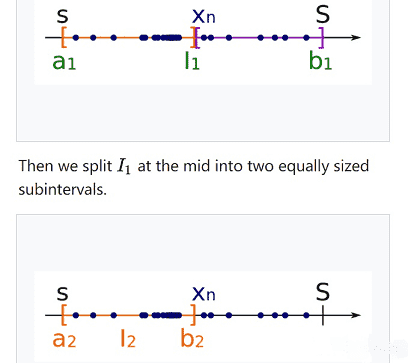

# Bolzano-Weierstrass定理

* [點拓樸集(參考度量空間)](../metric-space/point-topology.md)。

## 有界集合(bounded set)

> 集合$$S \subseteq \mathbb{R}^n$$稱為有界集合，若存在點$$x \in \mathbb{R}^n ~ \exists r > 0 \ni S \subseteq B_r(x)$$。

$$\{ a_n\} \subseteq \mathbb{R}$$稱為**有界實數數列(bounded sequence)**，若存在$$M >0$$使得$$|a_n| \leq M, ~ \forall n$$。

## 歐式空間的Bolzano-Weierstrass定理

> * 數列：每個在$$\mathbb{R}^n$$的有界無限（元素）數列都存在收斂的子數列（收斂在極限點）\[但原始的數列不一定收斂]。
> * 集合：$$\mathbb{R}^n$$中的任意有界無限（元素）集合$$S$$至少有一個極限點（在$$\mathbb{R}^n$$）。
>
> 註：<mark style="color:red;">極限點的鄰域與集合交集的元素為無限多個的性質</mark>，已證明了具有極限點的集合$$S$$內的元素必定為無限多個(否則不滿足極限點的定義)，但具有無限多個點的集合未必有極限點，例如自然數。
>
> 註：有界集合的條件是因為如自然數$$\mathbb{N}$$為無界無限集，但沒有極限點。

proof: 實數數列，使用二元搜尋每次將包含序列的有界區間切半，且總是選包含無限個元素的半區間切下去， 最後依區間套定理會收斂至極限點

令$$\{a_{n}\}$$是有界的無限實數數列。

假設$$\{a_{n}\}$$均落在某個有界區間$$[a,b]$$內，即$$\{a_n \} \subseteq [a,b]$$。

將區間$$[a,b]$$切一半得到$$[a,(a+b)/2]$$與$$[(a+b)/2,b]$$兩個子區間。

那麼某一個區間必定包含無窮個元素$$a_{n}$$。選取那個包含無窮多個$$a_{n}$$的區間。且此區間記為$$I_{1}$$並任取其上的一點記為$$a_{n_{1}}$$。

利用相同的方法，把$$I_{1}$$等分為兩個區間，那麼其中一個區間必定包含數列的無窮多項，任取一點叫做$$a_{n_{2}}$$其中我們要求$$n_{2}>n_{1}$$，於是取那個區間叫$$I_{2}$$。

如果我們記$$l([a,b])=b-a$$為區間的長度，那麼$$l(I_{2})=l(I_{1})/2$$。同理我們一直做下去，可以得到$$l(I_{j})=l(I_{j-1})/2$$，並且取得一子數列$$\{a_{n_{j}}\}$$。

利用$$l(I_{j})$$的長度收斂到零的性質，會收斂到$$\sup a_j = \inf b_j = x$$這一點，我們可以證明這個子序列收斂(QED)。

註：取$$r > (b-a)$$時，$$[a,b] \subseteq B_r(x)$$。

proof: 歐式空間使用相同的方法證明

$$R^n$$ 空間上的證明同實數的做法，在$$R^2$$ 時把平面切成小方形後夾擠得極限點，在$$R^3$$ 將立體方塊切成小方塊後夾擠得極限點。

如果集合$$S$$有界(bounded)，那麼$$S \subseteq B_r(0)$$，並且整個集合$$S$$會落在一個$$n$$維的區塊$$J_1$$裡，$$J_1=I_1^{(1)} \times I_2^{(1)} \times \cdots \times I_n^{(1)}$$。指數上的小括號代表的實際上就是第$$i-1$$次二分，比如1的話就是第$$1-1=0$$次二分。每一個$$x_k \in I_k^{(1)}$$並且$$I_k^{(1)}$$是一個一維的區間， $$a \leq x_k \leq b$$。

用實數的方法在每一個維度二分下去，最後每一個維度都會收斂到一點，可得$$n$$維的極限點(QED)

。
