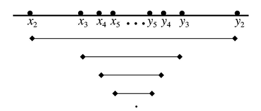

# 區間套定理\(nested interval theorem\)

## 區間套定理\(nested interval theorem\)

> $$\{I_i=[x_i,y_i ], i\in \mathbb{N}\}$$ 為區間套（有界閉區間），即
>
>  $$x_1 \leq x_2 \leq \ldots  \leq x_n \leq \ldots $$且$$ y_1 \geq y_2 \geq  \ldots  \geq y_n \geq  \ldots  $$，$$x_i \leq y_j, ~ \forall i,j \in \mathbb{N} $$。
> 
> 即 $$I_1 \supseteq I_2 \supseteq \ldots  \supseteq I_n \supseteq \ldots $$為遞減集合。
> 
> 則可得 $$\bigcap_{i=}^\infty I_i \neq \emptyset$$。
> 若$$\displaystyle \lim_{i \rightarrow \infty}⁡ |I_i |=0$$，則存在$$c \in \mathbb{R} \ni \bigcap_{i=1}^\infty I_i=\{c\}$$且
  $$\displaystyle \lim_{n \rightarrow \infty}⁡ x_n= \lim_{n \rightarrow \infty}⁡y_n =c$$。

* 長度收斂至0的閉區間套，其必交集於一點。
* 開區間套之無窮交集可能為空集合。

proof: 最小上界性質可以導出區間套定理 

$$\forall i \in \mathbb{N}$$, 由區間套定義知$$x_i \leq y_1$$，即$$y_1$$ 為數列$$\{x_i\}_{i \in \mathbb{N}}$$ 的上界;  

同理 $$y_i \geq x_1$$, 即$$x_1$$ 為數列 $$\{y_i \}_{i \in \mathbb{N}}$$ 的下界。

由最小上界性質(非空有界集合必有最小上界(最大下界)可得：
  * $$\{x_i \}_{i \in \mathbb{N}}$$ 存在上確界$$a$$。
  * $$\{y_i\}_{i \in \mathbb{N}}$$ 存在下確界$$b$$。
  * 由定義知$$a \leq b$$。 
  * 且$$\forall i \in \mathbb{N}, ~ b−a\leq y_i−x_i$$。

所以 $$\displaystyle 0 \leq b−a \leq \lim_{i \rightarrow \infty} (y_i−x_i)=\lim_{i \rightarrow \infty }|I_i |=0 $$

由夾擠定理知$$b−a=0 \Rightarrow a=b=\bigcap_{i=1}^\infty I_i $$。\(QED\)

### 由區間套定理可導出最小上界性質

## Cantor intersection theorem

> 令$$\{Q_1,Q_2,\ldots\}$$為$$\mathbb{R}^n$$ 上可數的非空集合序列，且
>
> * $$Q_{k+1} \subseteq Q_k, ~ k=1,2,\ldots$$ 為遞減集合，
> * $$Q_1$$ 為有界集合且$$Q_k$$ 為閉集合, $$∀k$$
>
> 則$$\displaystyle\bigcap_{k=1}^\infty Q_k$$  為非空閉集合。
>
> 註: 實數版本即為區間套定理\(nested interval theorem\)。

proof:  

令$$S=\cap_{k=1}^\infty Q_k$$, [可數個閉集合的交集仍為閉集合](../metric-space/closed-set.md#ke-shu-wu-xian-ge-bi-ji-he-de-jiao-ji-reng-wei-bi-ji-he)的性質得$$S$$為閉集合。

要檢驗$$ S \neq \emptyset$$ 即$$\exists x \in S$$。

若$$Q_k$$ 集合中為有限多個點時，可簡單證明必定存在$$x \in S$$。

假設$$Q_k$$ 集合中有無限多個點，建造集合$$A=\{x_1,x_2, \ldots\}, ~ x_k \in Q_k$$。

因為$$A$$有無窮多個元素且$$A \subseteq Q_1$$ 為有界集合，由Bolzano-Weierstrass定理得集合$$A$$有極限點$$x$$。

由[極限點的鄰域與集合交集的元素為無窮多個](../metric-space/point-topology.md#ji-xian-dian-de-lin-yu-yu-ji-he-jiao-ji-de-yuan-su-wei-wu-qiong-duo-ge)的性質得$$\forall r>0 B_r (x)$$與$$A$$交集的元素個數為無窮多個。

因此$$\cap_{k=1}^\infty Q_k \neq \emptyset$$ \(QED\).

>

