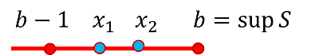

# 上(下)確界(sup, inf)

## 有界集合

> 集合$$S \subseteq \mathbb{R}$$，若存在$$b \in \mathbb{R} \ni x \leq b, ~ \forall x \in S$$，則$$b$$為集合$$S$$的 <mark style="color:red;">上界(upper bound)</mark> 。註：$$b$$不必為集合$$S$$內的元素。
>
> 若$$b \in S \ni x \leq b ~ \forall x \in S$$，則$$b$$為集合$$S$$的<mark style="color:red;">最大元素(maximum element)</mark>，記為 $$b = \max(S)$$。
>
> 若集合不存在上界時，則稱<mark style="color:red;">無上界（unbounded above，記為</mark>$$\sup(S)=\infty$$。
>
> 下界與最小元素為以相同的方式定義。
>
> 若集合不存在下界時，則稱<mark style="color:red;">無下界（unbounded above，記為</mark>$$\inf(S)=-\infty$$。

* $$\mathbb{R}^+=[0, \infty]$$無上界與最大元素，（最大）下界為0，但沒有最小元素。
* 閉區間$$S=[0,1]$$上界與最大元素同為1；（最大）下界與最小元素同為0。
* 半開區間$$S=[0,1)$$上界為1，但無最大元素；（最大）下界與最小元素均為0。
* $$[a,b], (a,b), (a,b], [a,b)$$四個集合的最小上界均為$$b$$，最大下界均為$$a$$。
* $$\{r \in \mathbb{Q}| r\geq 0 \cap r^2 \leq 2\}$$的最小上界為$$\sqrt{2}$$，但無最大元素，最大下界為0。
* 空集合的最小上界與最大下界分別為$$\sup(\emptyset)=-\infty, ~\inf(\emptyset)=\infty$$。
* $$\inf(\mathbb{N})=1,~ \sup(\mathbb{N})=\infty$$
* $$\inf(\mathbb{Z})=−\infty, ~ \sup(\mathbb{Z})=\infty$$
* $$\inf\{(−1)^n+\frac{1}{n}, ~n=1,2,\ldots\})=−1$$
* $$\sup(\{(−1)^n−\frac{1}{n}, ~ n=1,2,\ldots\})=1$$

## 最小上界（最大下界）

> 給定實數的非空子集合$$S$$且$$S$$有上界。$$b\in \mathbb{R}$$若滿足以下性質時稱為集合的<mark style="color:red;">最小上界（least upper bound）</mark>，記為$$b=\sup(S)$$：
>
> * $$b$$為集合$$S$$的上界（$$\forall x \in S, x \leq b$$）
> * 集合$$S$$不存在比$$b$$小的上界 ($$c < b \Rightarrow \exists x \in S, x \geq c$$)
>
> 若實數的非空子集合$$S$$有下界，$$a\in \mathbb{R}$$若滿足以下性質時稱為集合的<mark style="color:red;">最大下界（greatest lower bound）</mark>，記為$$a = \inf(S)$$：
>
> * $$a$$為集合$$S$$的下界（$$\forall x \in S, a \leq x$$）
> * 集合$$S$$不存在比$$a$$大的下界 （$$c>a \Rightarrow \exists x \in S, x \leq c$$）
>
> 註：<mark style="color:red;">最小上界與最大下界不必為集合</mark>$$S$$<mark style="color:red;">內的元素</mark>。

**由定義很容易得出集合**$$S$$**的最小上界與最大下界的唯一性**。

令$$\sup (S) = b, ~ \inf( S) = a$$，在證明時常用寫法：

* $$\forall \epsilon > 0, ~ x < b+ \epsilon$$
* $$\forall \epsilon > 0, \exists x \in S \ni b -\epsilon < x$$
* $$\forall \epsilon > 0, ~ a - \epsilon < x$$
* $$\forall \epsilon > 0, \exists x \in S \ni x < a + \epsilon$$

### 空集合的最小上界與最大下界

> $$\sup(\emptyset)=−\infty, ~ \inf(\emptyset)=\infty$$

proof:

若$$\emptyset \neq A \subseteq \mathbb{R}$$沒有上界時，因此$$\sup(A)$$ 不等於任意值，因此為了方便則記為$$\sup(A)=\infty$$(注意$$\infty$$不是一個值，而僅是一個符號) 。

同理若$$\emptyset \neq A \subset \mathbb{R}$$沒有下界時，因此$$\inf(A)$$ 不等於任意值，因此為了方便則記為$$\inf(A)=−\infty$$。

對於任意實數$$r$$，空集合$$\emptyset$$沒有任何實數大於$$r$$，也沒有任何實數小於$$r$$，因此可以將$$r$$視為$$\emptyset$$的上界與下界。

因為任意實數都是$$\emptyset$$的上界與下界，因此對於$$\sup(\emptyset)$$ 與$$\inf(\emptyset)$$ 的合理定義為$$\sup(\emptyset)=−\infty, ~ \inf(\emptyset)=\infty$$。

### 上(下)確界的接近性質

> $$\emptyset \neq S \subseteq \mathbb{R}$$，且有上/下確界，令$$b=\sup(S), a=\inf(S)$$，則：
>
> * $$\forall x < b, \exists y \in S \ni x < y\leq b$$。
> * $$\forall x > a, \exists y \in S \ni a\leq y < x$$。

### 完備性公理、最小上界性質(complete axioms, least upper bound property)

> <mark style="color:red;">實數中非空有界集合必有最小上界(最大下界)</mark>。
>
> $$\emptyset \neq S \subseteq \mathbb{R}$$若有上界（bounded above）則有最小上界（supremum），記為$$b = \sup(S)$$。
>
> 同理可得實數中非空子集合（區間）若有下界則有最大下界。

因為實數是完備集合（complete set），所以才有此性質； 可由Dedekind分劃中實數的完備性證明 。

proof: 由Dedekind分劃中實數的完備性證明

給定非空有上界集合 $$\emptyset \neq S\subset \mathbb{R}$$

定義集合$$A=\{a \in \mathbb{R} | S\text{ 中至少有一元素 }x \ni x>a\}$$

定義集合 $$B=\{b \in \mathbb{R} | S \text{ 中的每個元素 }x, x \leq b\}$$ ($$S$$所有上界形成的集合) 。

則可得實數線依集合$$S$$中某個點$$x$$切成兩分割$$A,B$$)

$$A \cup B=\mathbb{R}, ~ A \cap B=\emptyset, ~ A<B$$

因為$$S\neq \emptyset$$,所以$$A \neq \emptyset, B \neq \emptyset$$

依實數的完備性可知必存在$$r \in \mathbb{R} \ni \forall a \in A, a \leq r$$且$$\forall b \in B, r \leq b$$。

要證明$$r \in B$$，使用反證法

若$$r \notin B$$，則依定義得$$r \in A$$。

依$$A$$的定義$$\exists x \in S \ni r<x$$

因為$$x \in S$$ 且$$\frac{(x+r)}{2}<x$$，所以$$\frac{(x+r)}{2} \in A$$且$$\frac{(x+r)}{2}>r$$，此與完備性中$$\forall a \in A, a \leq r$$的性質不合

因此$$r \in B$$，因為$$B$$是$$S$$所有上界形成的集合，則$$r$$為$$S$$的最小上界。(QED)

## 最小上界(最大下界)的性質

### 最小上界存在時，若集合有下界則有最大下界，反之亦然

> 集合$$\emptyset \neq S \subset \mathbb{R}$$，則以下兩敘述等價：
>
> 1. 若$$S$$有上界，則$$S$$有最小上界。
> 2. 若$$S$$有下界，則$$S$$有最大下界。

proof: 1->2

若$$S$$有下界$$a$$，則$$\forall x \in S,~ x \geq a$$。

&#x20;因此$$−S$$有上界: $$\forall -x \in −S, ~ −x \leq −a$$

因為$$−S$$有上確界，令$$b=\sup(−S)$$。 可得 $$−b=\inf(S)$$ (QED).

proof: 2->1

同理可證 。

### \[證明常用]比最小上界小的的任意元素均不為上界

> $$\emptyset \neq S \subseteq \mathbb{R}$$有最小上界$$b= \sup(S)$$，則$$\forall c <b, \exists x \in S \ni c < x \leq b$$。
>
> 常寫成$$\forall \epsilon > 0, ~\exists x \in S \ni b-\epsilon < x$$
>
> 同理 $$S$$有最大下界 $$a = \inf(S)$$，則$$\forall c > a~ \exists x \in S \ni a \leq x < c$$ 。
>
> 常寫成$$\forall \epsilon > 0 ~ \exists x \in S \ni x < b+ \epsilon$$

proof: 由最小上界(最大下界)定義直接可得

因為$$b=\sup(S)$$，由定義得$$\forall x \in S,~ x \leq b$$。

因為$$c < b$$，所以$$c$$不是最小上界，因此$$\exists x \in S \ni c <x$$。

因此可得 $$c< x \leq b$$ (QED)

### 集合最小上界與最大下界互為對偶

> $$\forall \emptyset\neq S \subseteq \mathbb{R}$$，$$S$$為有界集合， 定義$$−S \equiv \{−s|s \in S\}$$，則
>
> $$\sup(S) =−\inf(−S)$$
>
> $$\inf(S)=−\sup(−S)$$

proof:

令$$\sup(S)=b$$，由定義可得 $$\forall \epsilon>0~ \exists x \in S \ni b−\epsilon<x$$

兩邊取負號得 $$\forall \epsilon>0 ~ \exists−x\in −S \ni −b+\epsilon>−x$$

所以 $$−b$$是集合$$−S$$的最大下界，即$$−b=\inf(−S)\Leftrightarrow \sup(S)=−\inf(−S)$$ (QED)

令$$\inf(S)=a$$，由定義得 $$\forall \epsilon>0 ~\exists x \in S \ni x<a+\epsilon$$

兩邊取負號得 $$\forall \epsilon>0 ~\exists −x \in −S \ni −x>−a−\epsilon$$

因此$$−a$$是集合$$−S$$的最小上界，即$$−a=\sup(−S) \Leftrightarrow \inf(S)=−\sup(−S)$$ (QED)

#### 範例

$$S=(a,b), ~ −S=(−b, −a)$$

$$\sup(S)=b, ~\inf(S)=a$$

$$\sup(−S)=−a, ~ \inf(−S)=−b$$

### 最小上界與最大下界的四則運算

> 集合$$\emptyset \neq A \subset \mathbb{R}, ~ \emptyset \neq B \subset \mathbb{R}$$
>
> 令$$A+B=\{a+b~|~a \in A, b \in B\}$$，則
>
> * 當$$A,B$$有上界時，$$A+B$$也有上界且$$\sup(A+B)=\sup(A)+\sup(B)$$。
> * 當$$A,B$$有下界時，$$A+B$$也有下界且$$\inf(A+B)=\inf(A)+\inf(B)$$。
>
> 令$$AB=\{xy|x \in A, y \in B \},$$，若$$A \subset \mathbb{R}^+, B \subset \mathbb{R}^+$$則
>
> * 當$$A,B$$有上界時，$$AB$$也有上界且$$\sup(AB)=\sup(A) \sup(B)$$。
> * 當$$A,B$$有下界時，$$AB$$也有下界且$$\inf(AB)=\inf(A )\inf(B )$$。

proof: 加法

由最小上界得當$$\emptyset \neq A \subset \mathbb{R}, ~ \emptyset \neq B \subset \mathbb{R}$$時，$$\sup(A)=x, ~ \sup(B)=y$$存在 。

因為$$\forall a \in A, a \leq x$$ ，$$\forall b \in B, b \leq y$$，所以$$x+y$$是$$A+B$$的上界。

$$\sup(A)=x \Leftrightarrow \forall \epsilon >0 ~ \exists a \in A \ni x−\epsilon<a$$

$$\sup(B)=y \Leftrightarrow \forall \epsilon >0 ~\exists b \in B \ni y− \epsilon <b$$

$$\therefore \forall \epsilon>0 ~\exists a \in A, b \in B \ni x+y−2\epsilon<a+b$$

$$\therefore x+y$$為集合$$A+B$$的最小上界，即$$\sup(A+B)=x+y=\sup(A)+\sup(B)$$ (QED).

### 最小上界與最大下界的次序

> 集合$$\emptyset \neq A \subseteq \mathbb{R}, ~ \emptyset \neq B \subseteq \mathbb{R}$$
>
> \[子集合] 若$$A\subseteq B$$（e.g. $$(1,2) \subset [0,2]$$）
>
> * 當$$B$$有上界時，$$A$$也有上界，且$$\sup(A) \leq \sup(B)$$
> * 當$$B$$有下界時，$$A$$也有下界，且$$\inf(A) \geq \inf(B)$$
>
> \[$$A$$完全小於$$B$$] $$\forall x \in A,~ \forall y \in B, ~x \leq y$$，則$$A$$有上界，$$B$$有下界，且$$\sup(A) \leq \inf(B)$$ （e.g. $$A=(1,2), B=(3,4)$$）
>
> \[$$A$$部份小於$$B$$]
>
> * $$\forall x\in A ~\exists y \in B \ni x\leq y$$，且$$B$$有上界，則$$A$$也有上界，且$$\sup(A) \leq \sup(B)$$ （e.g. $$A=(1,3), B=(2, 4)$$）
> * $$\forall x\in A ~\exists y \in B \ni x\geq z$$，且$$B$$有下界，則$$A$$也有下界，且$$\inf(A) \geq \inf(B)$$（e.g. $$A=(1,3), B=(2,4)$$）

proof: 子集合

因為$$B$$有上界，且$$B$$為實數中非空子集合，所以$$B$$有最小上界，令$$r=\sup(B)$$。

因為$$A\subseteq B$$，所以$$\forall a \in A , a\in B \Rightarrow a \leq r$$，因此$$A$$有上界$$r$$

因為$$A$$有上界，且$$A$$非實數中的非空子集合，所以$$A$$有最小上界，令$$s=\sup(A)$$。

因為$$s=\sup(A)\Leftrightarrow \forall \epsilon>0 ~\exists a \in A \subseteq B \ni s−\epsilon <a$$

因為$$r=\sup(B) \Leftrightarrow \forall b \in B, b \leq r$$

所以$$\forall \epsilon >0 ~ \exists a \in A\subseteq B \ni s−\epsilon <a \leq r$$

因此$$\sup(A) \leq \sup(B)$$ (QED)

proof: 完全小於

$$\forall x \in A, ~ \forall y \in B, x\leq y$$

因為$$A$$為實數的非空集合，且A有上界，則由最小上界性質得$$\sup(A)$$存在，同理得$$\inf(B)$$ 存在。

因為集合$$B$$中每一點都是$$A$$的上界，得$$\forall b \in B, b \geq \sup(A)$$

$$B$$的最大下界定義得$$\forall \epsilon>0 ~ \exists b \in B \ni \inf(B)+\epsilon > b$$，且$$\forall b \in B,~ b \geq \sup(A)$$

因此$$\sup(A)\leq \inf(B)$$ (QED)

### 最小上界與最大下界的實數倍

> 集合$$\emptyset \neq A \subset \mathbb{R}$$ ，實數$$c \in \mathbb{R}$$。令集合$$cA=\{cx|x \in A\}$$
>
> 若$$c>0$$
>
> * 當$$A$$有上界時，$$cA$$也有上界且$$\sup(cA)=c\cdot \sup(A)$$
> * 當$$A$$有下界時，$$cA$$也有下界且$$\inf(cA)=c\cdot \inf(A )$$
> *
>
> 若$$c<0$$
>
> * 當$$A$$有上界時，$$cA$$也有下界且$$\inf(cA)=c\cdot\inf(A )$$
> * 當$$A$$有下界時，$$cA$$也有上界且$$\sup(cA)=c\cdot \sup(A)$$

proof: c為正數

因為$$A$$為實數的非空集合且有上界，因此有最小上界，令$$\sup(A)=r$$ 。

若$$y \in cA \Rightarrow \frac{y}{c} \in A \Rightarrow \frac{y}{c} \leq \sup(A)=r$$

$$\because c>0,~\frac{y}{c}\leq r \Rightarrow y \leq cr$$ 所以$$cr$$是集合$$cA$$的上界--(1)

$$\because \sup(A)=r \Leftrightarrow \forall \epsilon>0 ~\exists x \in A \ni r−\epsilon<x$$

$$\because c>0$$，上式可改寫成$$∀\epsilon>0 ~\exists x \in A \ni r−\frac{\epsilon}{c}<x$$

$$\therefore \forall \epsilon>0, cr−\epsilon<cx$$

因為$$cx \in cA$$，上式表示$$cr−\epsilon$$不是集合$$cA$$的上界--(2)

由(1,2)得$$cr$$是$$cA$$的最小上界(QED).

proof: c為負數

令$$\sup(A)=r$$

由定義知當 $$y \in cA$$ 則 $$\frac{y}{c}\in A ~\therefore \frac{y}{c} \leq \sup(A)=r$$

因為$$c<0, \frac{y}{c}\leq r$$, 所以$$y\geq cr$$，因此可得$$cr$$是集合$$cA$$的下界--(1)

$$r=\sup(A) \Leftrightarrow \forall \epsilon>0 ~\exists x \in A \ni r−\epsilon<x$$

$$\because c<0$$ 上式可改為成$$\forall \epsilon >0 \exists x \in A \ni r+\frac{\epsilon}{c}<x$$

$$\therefore \forall \epsilon >0 \ni cx<cr+\epsilon$$

因為$$cx \in cA$$，上式表示$$\forall \epsilon>cr+\epsilon$$不是$$cA$$的下界--(2)

由(1,2)得$$cr$$是$$cA$$的最大下界 (QED)

#### 範例

$$A=(a,b)$$或$$[a,b)$$或$$(a,b]$$或$$[a,b]$$

$$\inf(A)=a, ~ \sup(A)= b$$

$$c>0$$:

* $$cA=(ca, cb)$$或$$[ca, cb)$$或$$(ca, cb]$$或$$[ca, cb]$$
* $$\inf(cA)=ca, ~ \sup(cA)=cb$$

$$c<0$$:

* $$cA=(cb, ca)$$或 $$[cb, ca)$$ 或$$(cb, ca]$$或$$[cb, ca]$$
* $$\inf(cA)=cb, ~\sup(cA)=ca$$

### 由最小上界可得實數中包含無理數

> 存在正實數$$a \in \mathbb{R}^{+} \ni a^2=2$$

proof:

令集合$$A=\{x \in \mathbb{R}^+ |x^2<2\}$$

因為$$1 \in A$$且$$2$$為$$A$$的上界， 由實數的完備性知$$A$$有最小上界，令$$a=\sup(A)$$ 。

若$$a^2<2$$

令 $$h=\frac{(2−a^2)}{2(2a+1)} \Rightarrow a+h \in A$$ 且 $$a+h>2$$

此與$$a=\sup(A)$$矛盾 。

若$$a^2>2$$

令$$h=\frac{a^2−2}{4a} \Rightarrow 0<a−h<a$$ 且 $$(a−h)^2>2$$

$$\therefore (a−h)^2>2>x^2, ~ \forall x \in A$$

因為$$a−h>0, x>0$$ 所以$$a−h>x \forall x \in A$$

得$$a−h$$為$$A$$的上界，此與$$a=\sup(A)$$ 矛盾

根據實數的有序性得$$a^2=2$$ (QED).

## \[單調有界定理]單調有界數列必收斂至最小上界(最大下界)

> * 若$$\{a_n\}_{n\in \mathbb{N}}$$為有界遞增數列，則$$\displaystyle \lim_{n \rightarrow \infty} a_n = \sup_{n \in \mathbb{N}}\{a_n\}$$。
> * 若$$\{b_n\}_{n\in \mathbb{N}}$$為有界遞減數列，則$$\displaystyle \lim_{n \rightarrow \infty} b_n = \inf_{n \in \mathbb{N}}\{b_n\}$$。\
>   註：可分為建構數列\[[證明](../sequence/monotonic-sequence.md#chan-diao-you-jie-ding-li-shi-shu-zhong-de-you-jie-chan-diao-shu-lie-bi-shou-lian)]和集合的證明法，此處考慮集合法。

proof: 實數的最小上界性質(非空有上界的集合必有最小上界)

$$\{a_n\}$$為有界遞增數列，依實數的最小上界性質得集合$$\{a_n\}$$有最小上界$$\displaystyle M=\sup_{n \in \mathbb{N}}\{a_n\}$$。

由\[比最小上界小的的任意元素均不為上界]得$$\forall \epsilon > 0, ~\exists n_0 \in \mathbb{N} \ni M-  \epsilon < a_{n_0}$$--(1)

因為$$\{a_n\}$$為遞增函數，所以當$$n > n_0$$，由(1)得$$M-\epsilon < a_{0} \leq a_n$$--(2)

由最小上界定義得$$\forall \epsilon > 0, a_n < M + \epsilon, \forall n \in \mathbb{N}$$--(3)

由(2,3)得$$\forall \epsilon >0,~ \exists n_0 \in \mathbb{N} \ni M-\epsilon < a_{n_0}  \leq a_n < M+\epsilon$$，因此$$\displaystyle \lim_{n \rightarrow \infty} a_n=M$$ (QED)

##

## 阿基米德性質(Archimedean property)

> 1. $$\forall 0 < a, b \in \mathbb{R} \Rightarrow \exists n \in \mathbb{N} \ni na > b$$。
> 2. \[等號也成立] $$\exists n \in \mathbb{N} \ni na \geq b$$。

1.2兩種寫成等價。1->2: 因為$$n a >b$$必定可得$$na \geq b$$。2->1：因為$$n_2 a \geq b$$，取$$n=n_2+1$$仍為自然數，因此可得$$na > b$$。

[https://math.stackexchange.com/questions/2182965/why-can-we-include-equality-in-the-archimedean-property](https://math.stackexchange.com/questions/2182965/why-can-we-include-equality-in-the-archimedean-property)

* 若$$a>b$$，則取$$n=1$$可得$$a>b$$。
* 不論$$a$$有多小，$$b$$有多大，必定可以找到$$n \in \mathbb{N} \ni na>b$$ 。

proof: 反證法

假設性質不成立，即$$\exists a>0, b>0 ~\forall n \in \mathbb{N} \ni na \leq b$$

因此對每一個自然數$$n \in \mathbb{N}$$, 可得$$n \leq b/a$$，即$$b/a$$ 為$$n$$的上界。

由實數的完備性得知因為自然數集合為實數的非空子集合，因此若$$\mathbb{N}$$存在上界時，則必存在上確界。

因此令$$m=\sup(\mathbb{N})$$，得$$\epsilon=1,~\exists x \in \mathbb{N}∋m−1<x$$

$$m<x+1$$，但因為$$x+1 \in \mathbb{N}$$, 此結果與$$m$$為$$\mathbb{N}$$的最小上界矛盾。

因此Archimedean property成立(QED)

### \[證明常用]必定存在大於給定正實數的正整數

> $$\forall r \in \mathbb{R}^+ ~ \exists n \in \mathbb{N} \ni n>r$$

取$$a=1, b= r$$，由阿基米德性質得$$\exists n \in \mathbb{N} \ni n > r$$ (QED)

### \[證明常用]無窮小的極限值為0

> $$\displaystyle \lim_{n \rightarrow \infty} \frac{1}{n}=0$$。

註：因此$$\displaystyle \forall c \in \mathbb{R}, ~\lim_{n \rightarrow \infty} c+ \frac{1}{n} = \lim_{n \rightarrow \infty} c- \frac{1}{n}=c$$。

proof:

$$\forall \epsilon >0$$，由阿基米德性質得$$\exists n \in \mathbb{N} \ni n\epsilon > 1$$，移項可得$$\frac{1}{n} < \epsilon$$。

而$$\forall m \in \mathbb{N}, m >n$$時，可得 $$\frac{1}{m}< \frac{1}{n} < \epsilon$$。

由極限的定義得 $$\lim_{n \rightarrow \infty} \frac{1}{n}=0$$(QED)

### 任意兩個差值大於1的實數間必存在整數

> • $$a,b \in \mathbb{R}, b−a>1 \Rightarrow \exists m \in \mathbb{Z} \ni a<m<b$$

proof:

不失一般性令$$a \geq 0$$

若$$b−a>1$$，令$$A=\{p \in \mathbb{N}, p>a\}$$為$$a$$的正整數上界集合。

由阿基米德性質知$$A$$非空集合\[必定存在大於某個正實數的正整數]，由於$$A$$為$$\mathbb{N}$$的子集合 ， 由正整數的良序性(正整數的非空子集必有最小元素)知$$A$$有最小元素$$m=\min(A)$$。

若 $$m=1, b>a+1 \geq 1>a$$

若$$m>1$$，所以$$m−1 \in \mathbb{N}$$ 且 $$m−1 \notin A$$ $$ightarrow a \geq m−1 \Rightarrow b>a+1 \geq m \geq a$$

因此若$$b−a>1$$，則$$\exists m \in \mathbb{Z} \ni a<m<b$$(QED)

### 實數必位於兩個連續整數之間

> $$\forall x \in \mathbb{R}, ~\exists n \in \mathbb{Z} \ni n \leq x < n+1$$，常將滿足此條件的$$n$$記為$$[x]$$。
>
> 註：$$n$$為整數，因此$$[-3.41]=-4, [3,41]=4$$。

proof

若$$x$$為整數，令$$n=x$$，則依Archimedean性質，得$$S=\{m \in \mathbb{N}~|~ m >x\}$$不是空集合。

因為$$S \subset \mathbb{N}$$，依正整數的良序性得$$S$$有最小元素記為$$k$$，因此$$k > x$$且$$k-1 \leq x$$。

令$$n=k-1$$即為所求的整數。

若$$x <0$$且非整數，依前述方面可得正整數$$h \in \mathbb{N} \ni h-1<-x<h$$或$$-h < x < -h+1$$，令$$n=-h$$即為所求。(QED)

### \[證明常用]正實數與0之間必存在有理數

> $$\forall a >0 ~ \exists n \in \mathbb{N} \ni 0 < \frac{1}{n} < a$$

由Archimedean性質$$\forall 0 < a, 1 \in \mathbb{R} \Rightarrow \exists n \in \mathbb{N} \ni na > 1$$。移項可得$$0 < \frac{1}{n} < a$$。

### \[證明常用]任意兩個相異實數間存在有理數

> $$a,b \in \mathbb{R}, a<b \Rightarrow \exists r \in \mathbb{Q} \ni a<r<b$$
>
> 註：如果$$a,b \in \mathbb{Q}$$時，直觀的建構法為$$r=\frac{(a+b)}{2}$$。但要考慮無理數的情形。

proof:

$$\because b−a>0$$, 由阿基米德性質得$$\exists n \in \mathbb{N} \ni n(b−a)>1$$

$$nb−na>1 \Rightarrow \exists m \in \mathbb{Z} \ni na<m<nb$$\[任意兩個差值大於1的實數間必存在整數]

$$\therefore a<m/n<b$$ (QED)

### 實數的倍數可逼近整數

> 1. $$x \in \mathbb{R}, ~ n \in \mathbb{N}$$，則存在$$h, k \in \mathbb{Z}, ~0 <k \leq n \ni |kx-h|<\frac{1}{n}$$。
> 2. 若$$x$$為無理數，則有無限多個有理數$$h/k$$滿足$$|x-h/k|<1/k^2$$。
>
> e.g. $$x=1.25, n=12$$，則$$k=12, , h=0, |12 \times 1.25 - 15|=0<1/12$$。

### \[證明常用]閉(開)區間可用開(閉)區間

> $$\displaystyle [a,b]=\bigcap_{n=1}^\infty (a-\frac{1}{n}, b+\frac{1}{n})=\bigcap_{n=1}^\infty [a-\frac{1}{n}, b+\frac{1}{n}]$$。(由開區間夾擠閉區間)
>
> $$\displaystyle (a,b)=\bigcup_{n=1}^\infty [a+\frac{1}{n}, b-\frac{1}{n}] =\bigcup_{n=1}^\infty (a+\frac{1}{n}, b-\frac{1}{n})$$。(由閉區間擴張得開區間)
>
> $$\displaystyle \{a\}=\bigcap_{k=1}^\infty(a-\frac{1}{k}, a+\frac{1}{k}) =\bigcap_{k=1}^\infty[a-\frac{1}{k}, a+\frac{1}{k}]$$  \[單點集]
>
> $$\displaystyle \mathbb{R}^{+}\equiv[0,\infty)=\bigcup_{k=0}^\infty [k, k+1)$$
>
> [https://math.stackexchange.com/questions/2869734/show-that-a-b-bigcap-n-1-infty-a-1-n-b1-n](https://math.stackexchange.com/questions/2869734/show-that-a-b-bigcap-n-1-infty-a-1-n-b1-n)

proof:由開區間夾擠閉區間 

\=>

因為$$[a,b] \subseteq (a-1/k, b+1/k), \forall k \in \mathbb{N}$$，因此$$[a,b] \subseteq \bigcap_{k=1}^\infty (a-1/k, b+1/k)$$--(1)

\[QED]

<=

要證明$$[a,b] \supseteq \bigcap_{k=1}^\infty (a-1/k, b+1/k)$$--(2)

令$$x \notin [a,b]$$，即$$x<a$$或$$x >b$$。如果可得$$x \notin \bigcap_{k=1}^\infty (a-1/k, b+1/k)$$時，則可證明(2)。

\[反證法]假設$$x \notin [a,b]$$且$$x \in \bigcap_{k=1}^\infty (a-1/k, b+1/k)$$--(3)。

* 由$$x<a$$得$$a-x>0$$，從Archimedean性質得$$\exists k_a \ni \mathbb{N} \ni k_a(a-x) \geq 1$$。整理得$$x \leq a-1/k_a$$，所以$$x \notin (a-1/k_a, b+1/k_a)$$ --(4)
* 同理由$$x>b$$得$$x-b>0$$，從Archimedean性質得$$\exists k_b \ni \mathbb{N} \ni k_b(x-b) \geq 1$$。整理得$$x \geq b+1/k_b$$，所以$$x \notin (a-1/k_b, b+1/k_b)$$--(5)

由(4,5)得假設$$x \notin [a,b]$$=>$$x \notin \bigcap_{k=1}^\infty (a-1/k, b+1/k)$$(QED)

註：開區間$$(a-\frac{1}{k}, b+\frac{1}{k})$$改為$$[a-\frac{1}{k}, b+\frac{1}{k}]$$時也成立。

因為(1)仍然成立。而(4)可從$$\exists k_a \ni \mathbb{N} \ni k_a(a-x) > 1$$，得$$x< a-1/k_a$$，所以$$x \notin [a-1/k_a, b+1/k_a]$$

proof:  由閉區間擴張得開區間

因為$$\exists k \ni \mathbb{N}\ni[a+1/k, b-1/k] \subseteq (a,b)$$，所以$$\displaystyle (a,b)\supseteq \bigcup_{k=1}^\infty [a+\frac{1}{k}, b-\frac{1}{k}]$$--(1)

要證明$$\displaystyle (a,b) \subseteq \bigcup_{k=1}^\infty [a+\frac{1}{k}, b-\frac{1}{k}]$$--(2)

令$$x \in (a,b)$$，即$$a < x < b$$。

因為$$x-a>0$$，由Archmedian property得$$\exists k_a \in \mathbb{N}\ni k_a(x-a)\geq1$$。整理得$$a+1/k_0 \leq x$$。

同理可得$$\exists K_b \in \mathbb{N} \ni x \leq b-1/k_b$$。

取$$k_0 = \max(k_a, k_b)$$，可得$$x \in  [a+1/k_0, b-1-k_0]$$，因此(2)成立

(QED)

proof: 單點集

$$\{a\} \subseteq  (a-1/k, a+1/k)$$顯然成立--(1)

to prove $$\displaystyle \bigcap_{k=1}^\infty (a-1/k, a+1/k) \subseteq \{a\}$$--(2)

令$$x \neq a$$，如果能得到$$x \notin \bigcap_{k=1}^\infty(a-1/k, a+1/k)$$則可得到--(2)

\[反證法]

令$$x > a$$，得$$x-a>0$$，由Archimedean propery得$$\exists k_0 \in \mathbb{N} \ni k_0 (x-a) \geq 1$$。整理得$$x \geq a+\frac{1}{k_0}$$，即$$x \notin (a-1/k_0, a+1/k_0)$$--(3)。

同理當$$x <a$$時，可得$$x \leq a-1/k_1$$，即$$x \notin (a-1/k_1, a+1/k_1)$$--(4)。

由(3,4)得(2)

由(1,2)得證 (QED)

## 有理數的十進位表示法

假設$$r\in \mathbb{R}$$可表示為有限十進位表示法。

即$$r=a_0+\frac{a_1}{10}+\frac{a_2}{10^2}+\dots+\frac{a_n}{10^n}, ~ a_i \in \{0, 1,\dots, 9\}, \forall i$$。常寫成：$$r=a_0.a_1a_2\dots a_n$$。

但只有部份有理數可寫成此種表示法，有理數如$$1/3$$或無理數無法寫成有限十進位表示法。

### 實數可用有限十進位表示法逼近

> 令$$x$$為正實數。則$$\forall n \in \mathbb{N}, ~\exists r_n=a_0.a_1a_2\dots a_n\ni r_n \leq x < r_n +\frac{1}{10^n}$$。
>
> 例：$$x=\frac{1}{3}$$，則$$r_n=0.33$$，$$0.33 \leq \frac{1}{3}<0.34$$。

proof: 直接建構法

令集合$$S=\{y \in \mathbb{Z^+}~|~ 0 \leq y \leq x\}$$，則可得至少有$$0 \in S$$，因此不是空集合且有上界$$x$$。

由\[最小上界性質]得$$S$$有最小上界記為$$a_0=\sup S$$。

由$$S$$的定義得$$a_0 \in S$$且$$a_0 \in \mathbb{Z}^{+}$$。

可得$$a_0 \leq x < a_0+1$$，記$$a_0=[x]$$。

令$$a_1=[10x-10a_0]$$。因為$$0 \leq 10x-10a_0=10(x-a_0)<10$$，可得$$0 \leq a_1 \leq9$$，且$$a_1 \leq 10 x - 10a_0 < a_1 +1$$。

因此$$a_1$$為滿足以下條件的最大整數：$$a_0+\frac{a_1}{10} \leq x < a_0 + \frac{a_1+1}{10}$$。

以此類推可得$$a_1, \dots, a_{n-1}, ~0 \leq a_i \leq 9$$，令$$a_n$$為滿足以下不等式的最大整數：

$$a_0+\frac{a_1}{10}+\dots +\frac{a_n}{10^n} \leq x < a_0+\frac{a_1}{10}+\dots +\frac{a_n+1}{10^n}$$，則$$0 \leq a_n \leq 9$$。

則可得$$r_n \leq x < r_n + \frac{1}{10^n}$$ (QED)

