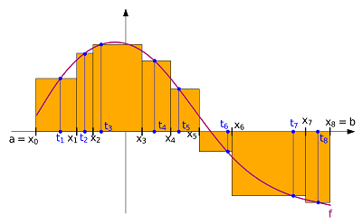
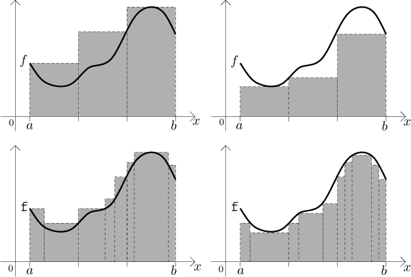
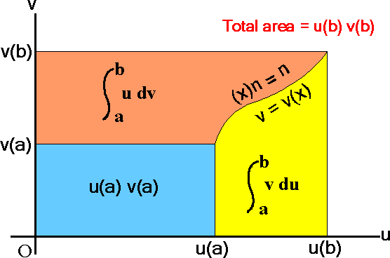

# Riemann-Stieltjes積分

## 簡介

黎曼（Riemann）積分的收斂概念與函數的點連續相似。

* 函數$$f$$在點$$c$$連續$$\displaystyle \lim_{x \to c}⁡ f(x)=f(c) \Leftrightarrow \forall \epsilon> 0 ~ \exists \delta >0 \ni |f(x)−f(c)|<\epsilon ~  \forall |x−c|<\delta$$
*   同樣黎曼積分$$S(P,f,\alpha)=a \Leftrightarrow \forall \epsilon >0~ \exists \delta >0 \ni |S(P,f,\alpha)−a|<\epsilon ~\forall  \text{ partition }P[a,b], ~ \| P\| < \delta$$

    即要求積分值$$S(P,f,\alpha)$$與$$a$$的差值小於$$\epsilon$$， 必定可以找到某個定義域的分割方式$$P$$，其分割最大區間小於$$\delta$$時可滿足此條件。

積分$$\int f dg$$中，$$f$$為被積分函數(integrand)，$$g$$為積分函數(integrator)。重點在討論$$g$$非連續函數時須滿足什麼條件才可積分。

## 更細的分割（finer partition）

> 給定實數閉區間$$[a,b]$$，區間的分割（partition）$$P=\{ x_0, x_1, \ldots, x_n\},~ a=x_0<x_1< \ldots <x_n=b$$
>
> 若$$P^{'}$$為比$$P$$更細的分割，則$$P \subseteq P^{'}$$，即更細的分割必須包含原始的分割所有的點且有更多的點。
>
> 令區間$$[a,b]$$所有的分割形成的集合記為$$\mathcal{P}[a,b]$$

* 令$$\|P\|$$為分割$$P$$中，長度最大的區間。
* 可得$$P \subseteq P^{'} \Rightarrow \| P^{'}\| \leq \| P \|$$，反之不成立。
  * $$P=\{0,1,2\}$$ , $$\|P\|=1$$
  * $$P^′=\{0, 0.5, 1,5, 2\}$$, $$\|P^{′} \|=1$$
  * $$\|P^{′} \| \leq \|P\|$$  but $$P \nsubseteq P^{'}$$&#x20;

## Riemann-Stieltjes積分

> * 令$$P$$ 為區間 $$[a,b]$$的分割，且$$t_k \in [x_{k−1}, x_k ]$$
> * 定義 $$\begin{aligned} \displaystyle S(P, f, \alpha) & =\sum_{k=1}^nf(t_k)(\alpha(x_k) - \alpha(x_{k-1})) \\ &= \sum_{k=1}^n f(t_k)\Delta\alpha_k  \end{aligned}$$
> * 稱為 Riemann-Stieltjes sum of function $$f$$ (integrand, 被積分函數) with respect to $$\alpha$$ (integrator, 積分函數).
>
> 當積分函數$$\alpha(x)=x$$時，為一般的Riemann積分，如下圖。

## 黎曼可積分函數(Riemann-integrable function)

> * $$f \in R(\alpha)$$  in $$[a,b]$$代表Riemann-integrable w.r.t. $$\alpha$$ if
>   * 定義1: $$∀\epsilon >0 ~ \exists \text{ partition  }P_\epsilon [a,b] \ni  |S(P,f,\alpha)−A|<\epsilon ~ \forall P\subseteq P_{\epsilon} [a,b]$$
>   * 定義2: $$∀\epsilon>0 ~\exists \delta>0 \ni  |S(P,f,\alpha)−A|< \epsilon, \forall \text{ partition } P, ~ \|P\|< \delta$$
> * &#x20;當要求$$S(P,f,\alpha)$$與$$A$$的差值小於$$\epsilon$$時，只要選定更細的分割$$P$$,，其最大的區間長度小於$$\delta$$即可達成。
>

當積分存在時，記為$$\displaystyle \int_a^b f d\alpha =A$$或 $$\displaystyle \int_a^b f(x)d\alpha(x)=A$$

為如果把$$f$$的定義域越切越細時，則分割每一區間面積的加總，會逐漸逼近至積分值。

## &#x20;同一積分函數(integrator)之線性性質

> $$f,g \in R(\alpha)$$ 為黎曼可積的函數，則$$\forall c_1, c_2 \in \mathbb{R}, ~ c_1f+c2g \in R(\alpha)$$也是黎曼可積的函數，且 $$\displaystyle \int_a^b (c_1 f+ c_2g)d\alpha=c_1 \int_a^b f d\alpha + c_2 \int_a^bg d\alpha$$

proof:

* 令 $$h=c_1f+c_2g$$，且$$P$$為閉區間$$[a,b]$$的分割，則積分 $$\begin{aligned} \displaystyle S(P,h, \alpha) &=\sum_{k=1}^n h(t_k)\Delta\alpha_k \\ &=c_1 \sum_{k=1}^n f(tk) \Delta \alpha_k+c_2 \sum_{k=1}^n g(t_k)\Delta \alpha_k \\ &= c_1 S(P, f, \alpha) + c_2 S(P, g, \alpha) \end{aligned}$$
* $$\int_a^b f d\alpha \Leftrightarrow \forall \epsilon >0 ~ \exists \text{ partition } P_{\epsilon_1}[a,b] \ni |S(P, f, \alpha ) - \int_a^b f d \alpha| < \epsilon, ~ \forall P_{\epsilon_1} \subseteq P$$
* $$\int_a^b g d\alpha \Leftrightarrow \forall \epsilon >0 ~ \exists \text{ partition } P_{\epsilon_2}[a,b] \ni |S(P, g, \alpha ) - \int_a^b g d \alpha| < \epsilon, ~ \forall P_{\epsilon_2} \subseteq P$$
* 取更細的分割 $$P_{\epsilon}=P_{\epsilon_1} \cup P_{\epsilon_2}$$，可得 $$P_{\epsilon} \subseteq P$$，因此 $$|S(P,h,\alpha) - c_1 \int_a^b fd\alpha-c_2\int_a^b gd\alpha|\leq |c_1|\epsilon + |c_2| \epsilon$$(QED)

## 不同積分函數的線性性質

> $$f\in R(\alpha)$$且$$f \in R(\beta)$$在閉區間$$[a,b]$$上均可積，則$$\forall c_1, c_2 \in \mathbb{R}$$, $$f\in R(c_1 \alpha + c_2 \beta)$$在閉區間$$[a,b]$$可積，且 $$\displaystyle \int_a^b f d(c_1 \alpha + c_2\beta)=c_1 \int_a^b fd\alpha + c_2 \int_a^b f d\beta$$

同上，只要證明

* $$\forall \epsilon >0 ~ \exists \text{ partition } P_{\epsilon}[a,b] \ni |S(P, f, c_1 \alpha+c_2 \beta)- A|< \epsilon, ~ \forall P_{\epsilon} \subseteq P$$
* 即 $$\displaystyle t_k \in [x_{k-1}, x_k], |\sum_{k=1}^nf(t_k)\Delta(c_1\alpha+c_2\beta)_k -A| < \epsilon$$

## 積分區間的和

> $$c\in(a,b)$$，若以下三個積分中有兩個存在時，則第三個積分必定存在

> $$\displaystyle \int_a^b fd\alpha=\int_a^c f d\alpha + \int_c^b f d\alpha$$
>
> 使用數學歸納法，可將$$[a,b]$$拆解成有限區間均可得相同結論。

proof:

* 令$$P$$為閉區間$$[a,b]$$的分割，且$$c \in P$$。
* 令$$P_1=P \cap [a,c]$$，$$P_2 = P \cap[c,b]$$
* 則$$S(P, f, \alpha)= S(P_1, f, \alpha) +S(P_2, f, \alpha)$$
* 不失一般性，令$$\int_a^c f d \alpha$$與$$\int_c^b f d \alpha$$存在，則
* $$\forall \epsilon > 0 ~ \exists \text{ partition } P_{1,\epsilon}[a,c] \ni |S(P_1, f, \alpha)-\int_a^c f d\alpha|< \frac{\epsilon}{2}, ~ \forall P_{1,\epsilon} \subseteq P_1$$
* $$\forall \epsilon > 0 ~ \exists \text{ partition } P_{2,\epsilon}[a,c] \ni |S(P_2, f, \alpha)-\int_c^b f d\alpha|< \frac{\epsilon}{2}, ~ \forall P_{2,\epsilon} \subseteq P_2$$
* 取更細的分割 $$P_{\epsilon} = P_{1,\epsilon} \cup P_{2,\epsilon}$$, 當$$P_{\epsilon} \subseteq P$$可得 $$P_{1,\epsilon} \subseteq P_1$$且$$P_{2,\epsilon} \subseteq P_2$$
* 因此 $$|S(P, f, \alpha) - \int_a^c f d\alpha - \int_c^b f d \alpha|< \epsilon$$ (QED)

## 單點積分為0與反向區間積分

> 若$$a,b \in \mathbb{R}, a<b$$且$$\int_a^b fd\alpha$$存在，
>
> * 定義$$\int_a^bf d\alpha = - \int_b^a d \alpha$$
> * 定義$$\int_a^a f d\alpha=0$$

因此[積分區間的和](rs-integral.md#ji-fen-ou-jian-de-he)可改寫為$$\displaystyle \int_a^b f d\alpha + \int_b^c f d \alpha + \int_c^a f d\alpha=0$$。

## 分部積分（integration by parts）

> 令$$f\in R(\alpha)$$為在區間$$[a,b]$$的可積函數。
>
> 則 $$\alpha \in R(f)$$為在區間$$[a,b]$$的可積函數，則$$\displaystyle \int_a^b f(x) d\alpha(x) + \int_a^b \alpha(x)d f(x) = f(b) \alpha(b) - f(a)\alpha(a)=f(x)\alpha(x)|_{x=a}^{b}$$

> 以微分分析，則得 $$\frac{d f\alpha}{dx}  = \frac{df}{dx}\alpha+f \frac{d\alpha}{dx}$$

proof:

* $$f \in R (\alpha) \Leftrightarrow$$$$\forall \epsilon > 0 ~ \exists \text{ partition } P_{\epsilon} [a,b] \ni |S(P_1, f, \alpha) - \int_a^b f d\alpha|<\epsilon, ~ \forall P_{\epsilon}[a,b] \subseteq P$$
* 考慮$$\alpha \in R(f)$$且 $$P_{\epsilon}\subseteq P$$得 $$\displaystyle S(P,f,\alpha)=\sum_{k=1}^n\alpha(t_k)\Delta f_k=\sum_{k=1}^n \alpha(t_k)f(x_k) - \sum_{k=1}^n \alpha(t_k) f(x_{k-1})$$
* 可寫為 $$A=f(b)\alpha(b)-f(a)\alpha(a)$$且得
* $$A=\sum_{k=1}^n f(x_k)\alpha(x_k) - \sum_{k=1}^n f(x_{k-1})\alpha(x_{k-1})$$
* $$\therefore A=S(P,f,\alpha)=\sum_{k=1}^n f(x_k)[\alpha(x_k) - \alpha(t_k)]+\sum_{k=1}^n f(x_{k-1})[\alpha(t_k) - \alpha(x_{k-1}]=S(P_1, f, \alpha)$$
* $$\therefore |A-S(P, f, \alpha ) - \int_a^b f d \alpha|<\epsilon$$ (QED)

### 圖例

> $$u(x)v(x)|_{x=a}^b=u(b)v(b)-u(a)v(a)=\int_a^b u(x)dv(x)+\int_a^b v(x)du(x)$$

## 變數變換（change of variable）

> * $$f \in R(\alpha)$$為閉區間$$[a,b]$$的可積函數
> * $$g$$為定義在閉區間$$S=[c,d]$$的嚴格單調連續函數(之後會證套單調為非必要條件，只要是連續函數即可)
> * $$a=g(c), b=g(d)$$,$$h(x)=f(g(x))$$, $$\beta(x)=\alpha(g(x))$$
> * 若$$x \in S$$，則$$h \in R(\beta)$$且$$\int_a^b fd\alpha = \int_c^d h d\beta$$，即
> * $$\displaystyle \int_{g(c)}^{g(d)}f(t)d\alpha(t)=\int_c^d f(g(x))d(\alpha(g(x)))$$
>
> 註：當$$\alpha(x)=x$$時，退化成黎曼積分

### 常用微分積分符號

令$$\frac{d}{dx}F(x) = f(x)$$，移項得 $$dF(x)=f(x)dx$$。

因此對$$f(x)$$積分可得 $$\int_a^b f(x)dx  = \int_a^b dF(x)=F(x)|_a^b=F(b)-F(a)$$。

只要函數的微分存在，$$dF(x)$$可用$$f(x)dx$$表示。

###

