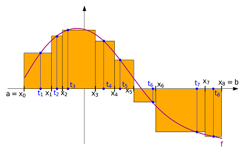
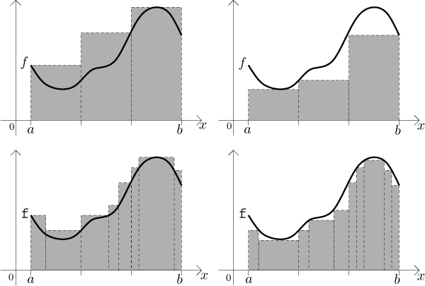

# Riemann-Stieltjes積分

## 簡介

黎曼（Riemann）積分的收斂概念與函數的點連續相似。

* 函數$$f$$在點$$c$$連續$$\lim_{x \rightarrow c}⁡ f(x)=f(c) \Leftrightarrow \forall \epsilon> 0 ~ \exists \delta >0 \ni |f(x)−f(c)|<\epsilon ~  \forall |x−c|<\delta $$
* 同樣黎曼積分$$S(P,f,\alpha)=a \Leftrightarrow \forall \epsilon >0~ \exists \delta >0 \ni |S(P,f,\alpha)−a|<\epsilon ~\forall  \text{ partition }P[a,b], ~ \| P\| < \delta  $$

  即要求積分值$$S(P,f,\alpha)$$與$$a$$的差值小於$$\epsilon$$， 必定可以找到某個定義域的分割方式$$P$$，其分割最大區間小於$$\delta$$時可滿足此條件。

## 更細的分割（finer partition）

> 給定實數閉區間$$[a,b]$$，區間的分割（partition）$$P=\{ x_0, x_1, \ldots, x_n\},~ a=x_0<x_1< \ldots <x_n=b$$
>
> 若$$P^{'}$$為比$$P$$更細的分割，則$$P \subseteq P^{'}$$，即更細的分割必須包含原始的分割所有的點且有更多的點。
>
> 令區間$$[a,b]$$所有的分割形成的集合記為$$\mathcal{P}[a,b]$$

* 令$$\|P\|$$為分割$$P$$中，長度最大的區間。
* 可得$$P \subseteq P^{'} \Rightarrow \| P^{'}\| \leq \| P \|$$，反之不成立。
  * $$P=\{0,1,2\}$$ , $$\|P\|=1$$
  * $$ P^′=\{0, 0.5, 1,5, 2\}$$, $$\|P^{′} \|=1$$
  * $$\|P^{′} \| \leq \|P\|$$  but $$P \nsubseteq P^{'}$$ 

## Riemann-Stieltjes積分

> * 令$$P$$ 為區間 $$[a,b]$$的分割，且$$t_k \in [x_{k−1}, x_k ]  $$
> * 定義 $$\begin{aligned} \displaystyle S(P, f, \alpha) & =\sum_{k=1}^nf(t_k)(\alpha(x_k) - \alpha(x_{k-1})) \\ &= \sum_{k=1}^n f(t_k)\Delta\alpha_k  \end{aligned}$$
> * 稱為 Riemann-Stieltjes sum of function $$f$$ \(integrand, 被積分函數\) with respect to $$\alpha$$ \(integrator, 積分函數\).
>
> 當積分函數$$\alpha(x)=x$$時，為一般的Riemann積分，如下圖。

## 黎曼可積分函數\(Riemann-integrable function\)

> * $$f \in R(\alpha)$$  in $$[a,b]$$代表Riemann-integrable w.r.t. $$\alpha$$ if
>   * 定義1: $$∀\epsilon >0 ~ \exists \text{ partition  }P_\epsilon [a,b] \ni  |S(P,f,\alpha)−A|<\epsilon ~ \forall P\subseteq P_{\epsilon} [a,b] $$
>   * 定義2: $$∀\epsilon>0 ~\exists \delta>0 \ni  |S(P,f,\alpha)−A|< \epsilon, \forall \text{ partition } P, ~ \|P\|< \delta $$
> *  當要求$$S(P,f,\alpha)$$與$$A$$的差值小於$$\epsilon$$時，只要選定更細的分割$$P$$,，其最大的區間長度小於$$\delta$$即可達成。

當積分存在時，記為$$\displaystyle \int_a^b f d\alpha =A$$或 $$\displaystyle \int_a^b f(x)d\alpha(x)=A$$

為如果把$$f$$的定義域越切越細時，則分割每一區間面積的加總，會逐漸逼近至積分值。

##  同一積分函數\(integrator\)之線性性質

> $$f,g \in R(\alpha)$$ 為黎曼可積的函數，則$$\forall c_1, c_2 \in \mathbb{R}, ~ c_1f+c2g \in R(\alpha)$$也是黎曼可積的函數，且 $$\displaystyle \int_a^b (c_1 f+ c_2g)d\alpha=c_1 \int_a^b f d\alpha + c_2 \int_a^bg d\alpha $$

proof:

* 令 $$h=c_1f+c_2g$$，且$$P$$為閉區間$$[a,b]$$的分割，則積分 $$\begin{aligned} \displaystyle S(P,h, \alpha) &=\sum_{k=1}^n h(t_k)\Delta\alpha_k \\ &=c_1 \sum_{k=1}^n f(tk) \Delta \alpha_k+c_2 \sum_{k=1}^n g(t_k)\Delta \alpha_k \\ &= c_1 S(P, f, \alpha) + c_2 S(P, g, \alpha) \end{aligned}$$
* $$\int_a^b f d\alpha \Leftrightarrow \forall \epsilon >0 ~ \exists \text{ partition } P_{\epsilon_1}[a,b] \ni |S(P, f, \alpha ) - \int_a^b f d \alpha| < \epsilon, ~ \forall P_{\epsilon_1} \subseteq P$$
* $$\int_a^b g d\alpha \Leftrightarrow \forall \epsilon >0 ~ \exists \text{ partition } P_{\epsilon_2}[a,b] \ni |S(P, g, \alpha ) - \int_a^b g d \alpha| < \epsilon, ~ \forall P_{\epsilon_2} \subseteq P$$
* 取更細的分割 $$P_{\epsilon}=P_{\epsilon_1} \cup P_{\epsilon_2}$$，可得 $$P_{\epsilon} \subseteq P$$，因此 $$|S(P,h,\alpha) - c_1 \int_a^b fd\alpha-c_2\int_a^b gd\alpha|\leq |c_1|\epsilon + |c_2| \epsilon$$\(QED\)

## 不同積分函數的線性性質

> $$f\in R(\alpha)$$且$$f \in R(\beta)$$在閉區間$$[a,b]$$上均可積，則$$\forall c_1, c_2 \in \mathbb{R}$$, $$f\in R(c_1 \alpha + c_2 \beta)$$在閉區間$$[a,b]$$可積，且 $$\displaystyle \int_a^b f d(c_1 \alpha + c_2\beta)=c_1 \int_a^b fd\alpha + c_2 \int_a^b f d\beta$$

同上，只要證明

* $$\forall \epsilon >0 ~ \exists \text{ partition } P_{\epsilon}[a,b] \ni |S(P, f, c_1 \alpha+c_2 \beta)- A|< \epsilon, ~ \forall P_{\epsilon} \subseteq P$$
* 即 $$\displaystyle t_k \in [x_{k-1}, x_k], |\sum_{k=1}^nf(t_k)\Delta(c_1\alpha+c_2\beta)_k -A| < \epsilon$$

### 常用微分積分符號

令$$ \frac{d}{dx}F(x) = f(x)$$，移項得 $$dF(x)=f(x)dx$$。

因此對$$f(x)$$積分可得 $$\int_a^b f(x)dx  = \int_a^b dF(x)=F(x)|_a^b=F(b)-F(a)$$。

只要函數的微分存在，$$dF(x)$$可用$$f(x)dx$$表示。

### 

## 分部積分（integration by parts）

> $$\int u(x) dv(x) = u(x)v(x) - \int v(x)du(x)$$

因為$$\frac{d}{dx}uv = u^{'}v+uv^{'}$$

兩邊積分得 $$uv=\int vdu + \int u dv$$ \(QED\)

