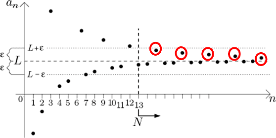

# 數列(sequence)

## 簡介

討論實數的無窮數列為收斂或發散是最基本的形式，實數數列的收斂點概念或極限點有關。

由於收斂數列的值域必定有界，因此一般簡寫為(有界)收斂數列。

實變分析中還會討論集合數列聯集或交集運算後的結果，可測函數數列（或隨機變數）的收斂形式（點態、均勻、L-p、測度收斂）等。

## 有限數列與無限數列

> 給定有限集合$$\{1,2,\ldots, n\}$$，與定義在此集合的函數$$f$$，則$$\{f(1), f(2),\ldots, f(n)\}$$為有限數列（finite sequence）。
>
> 給定自然數集合$$\{1,2,\ldots \}$$與定義在此集合的函數$$f$$，則$$\{f(1), f(2), \ldots\}$$為無限數列（infinite sequence）。

一般討論數列時，所使用的指標集合未指明時，為有限集合或是可數集合，而非不可數集合。

## 子數列(subsequence)

> 嚴格遞增函數：
>
> 令$$s=\{s_n\}$$為無限數列，令函數$$k: \mathbb{N} \rightarrow T, ~ T \subseteq \mathbb{N}$$且為嚴格遞增函數（若$$m <n$$，則$$k(m) < k(n)$$）。
>
> 則對所有大於1的整數$$n$$，合成函數$$(s \circ k)(n) = s_{k(n)} \equiv s_{kn}$$形成的序列$$\{s_{k(n)}\} \equiv \{s_{kn}\}$$稱為$$s$$的子數列。

> 度量空間：
>
> $$(X,d)$$為度量空間，$$\{a_n\}_{n \in \mathbb{N}} \subseteq X$$，令$$\{n_r\}_{r \in \mathbb{N}} \subseteq \mathbb{N}$$為自然數中嚴格遞增的序列（做為指標序列），則$$\{a_{n_r} \}_{r \in \mathbb{N}}$$ 為$$\{a_n\}_{n \in \mathbb{N}}$$ 的子序列。
>
> 子序列是從$$\{a_n\}$$中取出部份的元素，$$n_1$$代表取出的第一個元素在$$\{a_n\}$$的位置，依此類推，依其順序組合而成的新序列$$\{a_{n_r})\}$$為$$\{a_n\}$$的子集合，且順序仍保持相同。

* <mark style="color:red;">子數列就是原本的數列，依原始數列的順序，任意取出的子集合形成的數列</mark> 。
* 例如 $$\{a_n\}=\{9,8,4,5,1,3,4,5\}, \{n_r\}=\{1,4, 6\} \Rightarrow \{a_{n_r} \}=\{a_1,a_4,a_6\}=\{9,5,3\}$$。
* 下圖中，把紅色圓圈內的點取出形成子數列，則可形成收斂子數列。

## 收斂數列

> 收斂數列：實數或歐式空間
>
> * $$\{a_n\}_{n \in \mathbb{N}} \subseteq \mathbb{R}^n$$ 稱為收斂數列若$$\displaystyle \lim_{n \rightarrow \infty} a_n = a \Leftrightarrow \forall \epsilon > 0 \ \exists n_0 \in \mathbb{N} \ni d(a_n, a) < \epsilon\ \forall n \geq n_0$$
> * 常寫為 $$a_n \rightarrow a$$ as $$n \rightarrow \infty$$
> * 如果$${a_n}$$不是收斂數列(convergent sequence)，則為發散數列(divergent sequence)。

> 收斂數列：度量空間
>
> * $$(X,d)$$為度量空間, $$\{a_n\}_{n \in \mathbb{N}} \subset X$$為一數列
> * $$\displaystyle \lim_{n \rightarrow \infty} a_n = a \Leftrightarrow \forall \epsilon > 0 \ \exists n_0 \in \mathbb{N} \ni d(a_n,a) < \epsilon\ \forall n \geq n_0$$

* <mark style="color:red;">數列收斂的直觀意義，不論我們要使</mark>$$a_n$$ <mark style="color:red;">與</mark>$$a$$<mark style="color:red;">接近到任何程度(小於</mark>$$\epsilon$$)<mark style="color:red;">，只要</mark>$$n$$<mark style="color:red;">值夠大時一定能夠辦到</mark>。因此給定接近的距離$$\epsilon$$後，只要過了第$$a_0,a_1,\ldots,a_{n_{0}−1 }$$ (有限項)之後，$$a_{n_0},a_{n_0+1},\ldots$$(無窮項)與$$a$$的距離均小於$$\epsilon$$。
* 由於實數的完備性，若$$\displaystyle \lim_{n \rightarrow \infty}a_n$$ 收斂，<mark style="color:blue;">收斂值必為實數且唯一</mark>。
* 如果$$\{a_n, ~ n \geq 1\}$$有子序列收斂，將這些收斂子序列收集起來得集合$$B$$，將$$\sup (B)$$ 記為$$\displaystyle \limsup_{n \rightarrow \infty} a_n$$，$$\inf(B)$$ 記為$$\displaystyle \liminf_{n \rightarrow \infty} a_n$$。

### 發散數列(divergent sequence)

> \[數列發散至無窮大] $$\displaystyle \lim_{n \rightarrow \infty} a_n=\infty \Leftrightarrow \forall M>0 ~ \exists n_0 \in \mathbb{N} \ni a_n \geq M ~\forall n \geq n_0$$
>
> \[數列發散至負無窮大] $$\displaystyle \lim_{n \rightarrow \infty} a_n=-\infty \Leftrightarrow \forall M>0 ~ \exists n_0 \in \mathbb{N} \ni a_n \leq M ~\forall n \geq n_0$$
>
> \[數列不發散，但上極限不等於下極限] $$\displaystyle \limsup_{n \rightarrow \infty} a_n \neq \liminf_{n \rightarrow \infty} a_n$$

如$$\displaystyle \lim_{n \rightarrow \infty} \sin(nx)$$發散，因為$$\displaystyle \limsup_{n \rightarrow \infty} \sin(nx) = 1$$，而$$\displaystyle \liminf_{n \rightarrow \infty} \sin(nx) = -1$$。

<mark style="color:red;">發散數列定義為數列上極限不等於下極限，因此數列極限不存在。但數列的上、下極限必定存在</mark>。

### 收斂數列的唯一性

> 度量空間$$(X,d)$$中，$$\{ a_n\} \subseteq X$$為收斂數列，若 $$\displaystyle \lim_{n \rightarrow \infty} a_n = p$$且 $$\displaystyle \lim_{n \rightarrow \infty} a_n=q$$，則$$p=q$$

proof: 三角不等式夾擠

$$\because a_n \rightarrow p \Leftrightarrow d(a_n, p) \rightarrow 0$$as $$n \rightarrow \infty$$

$$\because a_n \rightarrow q \Leftrightarrow d(a_n, q) \rightarrow 0$$as $$n \rightarrow \infty$$

因為度量函數$$d$$滿足三角不等式，因此$$0 \leq d(p, q) \leq d(p, a_n) + d(q, a_n) \rightarrow 0$$ as $$n \rightarrow \infty$$

所以$$p=q$$ (QED)

### 收斂數列的四則運算仍為收斂數列

> $$\displaystyle \lim_{n \rightarrow \infty} a_n = a$$ 且 $$\displaystyle \lim_{n \rightarrow \infty} b_n = b$$均為收斂數列，則
>
> * $$\forall s, t \in \mathbb{R}$$,$$\displaystyle \lim_{n \rightarrow \infty} (s a_n \pm t b_n) = sa \pm tb$$
> * $$\displaystyle \lim_{n \rightarrow \infty} (a_n b_n) = ab$$
> * $$\displaystyle \lim_{n \rightarrow \infty} \frac{a_n}{b_n} = \frac{a}{b}, \ \text{ if } b \neq 0$$
>
> 可由收斂數列的定義簡單得出。

proof: 加減法

$$\displaystyle \lim_{n \rightarrow \infty} a_n=A \Leftrightarrow \forall \epsilon>0 ~\exists n_a \in \mathbb{N} \ni |a_n−A|<\epsilon ~ \forall n \geq n_a$$

$$\displaystyle \lim_{n \rightarrow \infty} b_n=B \Leftrightarrow \forall \epsilon>0 ~\exists n_b \in \mathbb{N} \ni |b_n−B|<\epsilon ~ \forall n \geq n_b$$

取$$n_0=n_a+n_b\Rightarrow |a_n−A+b_n−B|\leq |a_n−A|+|b_n−B|\leq \epsilon, ~ \forall n \geq n_0$$ (QED).

proof: 線性

$$\displaystyle \lim_{n \rightarrow \infty}(ta_n+sb_n )=t \lim_{n \rightarrow \infty} a_n +s \lim_{n \rightarrow \infty} b_n=sA+tB$$ (QED)

proof: 乘法

$$|a_n b_n−AB|=|a_n b_n−Ab_n+Ab_n−AB|\leq |a_n−A||b_n |+|A||b_n−B|$$

取 $$\displaystyle \epsilon=1,~\lim_{n \rightarrow \infty}b_n=B \Rightarrow \exists n_1 \in \mathbb{N} \ni |b_n−B|<1, ~\forall n \geq n_1$$

所以 $$|b_n |−|B| \leq |(|b_n |−|B|)| \leq |b_n−B|<1 \Rightarrow |b_n | \leq |B|+1$$

因為 $$\displaystyle \lim_{n \rightarrow \infty} b_n=B \Rightarrow \exists n_2 \in \mathbb{N}, |b_n−B|<\epsilon/2(|A|+1) , ~\forall n \geq n_2$$

因為$$\displaystyle \lim_{n \rightarrow \infty} a_n=A \Rightarrow \exists n_3 \in \mathbb{N} \ni |a_n−A|<\epsilon/2(|B|+1), ~ \forall n \geq n_3$$

取$$n_0=n_1+n_2+n_3 \Rightarrow$$

$$\begin{align} |a_n b_n−AB| & \leq |a_n−A||b_n |+|A||b_n−B| \\ & \leq \epsilon (|B|+1)/2(|B|+1) +|A|\epsilon/2(|A|+1) \\ &<\epsilon \end{align}$$ (QED).

### 收斂數列的值域有界且收斂至極限點

> 度量空間$$(X,d)$$中，$$\{ a_n\} \subseteq X$$為收斂數列，令 $$\displaystyle \lim_{n \rightarrow \infty} a_n = a$$，且令$$T=\{a_1, a_2, \ldots\}$$為序列之值的集合，則
>
> * $$T$$為有界集合（$$\exists a_k \in T, r >0 \ni T \subseteq B_r(a_k)$$ ）
> * $$a$$為$$T$$的附著點（$$\forall r>0, B_r(a)\cap T \neq \emptyset$$）
> * 當$$T$$為無窮集合時，$$a$$為極限點（$$\forall >0, B_r(a) \cap T - \{a\} \neq \emptyset$$）。

proof:

$$\displaystyle \lim_{n \rightarrow \infty}a_n=a \Leftrightarrow \forall \epsilon>0 ~ \exists n_0 \in \mathbb{N} \ni d(a_n,a)<\epsilon, ~\forall n \geq n_0$$

當$$\epsilon=1$$時，取$$n_1$$ 為符合收斂條件的$$n_0$$。

則$$\forall n \geq n_1, \{a_n\} \subseteq B_r (a), r =1+\max \{ d(a,a_1 ), d(a,a_2 ),\ldots ,d(a,a_n )\}$$

而$$\forall \epsilon>0$$，均可得出此結果，因此值域集合$$T$$有界 (QED).

由收斂定義得 $$\forall \epsilon>0, ~b_\epsilon (a) \cap T \neq \emptyset$$, 因此$$a$$為附著點. (QED)

如果$$T$$為無窮集合，則$$\forall \epsilon>0, ~b_\epsilon (a) \cap T$$有無窮多個點，因此 $$\forall \epsilon>0, ~b_\epsilon (a) \cap T - \{a\} \neq \empty$$，因此$$a$$為極限點 (QED)

### 必存在數列收斂至極限點

> 給定度量空間$$(X,d)$$，且集合$$S \subseteq X$$。 若$$a \in X$$為$$S$$中的附著點(極限點)，則存在序列$$\{a_n\} \subseteq S$$且$$\displaystyle \lim_{n \rightarrow \infty} a_n=a$$

> 註：與[收斂序列的值域有界且收斂至極限點](./#shou-lian-xu-lie-de-zhi-yu-you-jie-qie-shou-lian-zhi-ji-xian-dian)整合後得$$a$$為附著點 $$\displaystyle \Leftrightarrow \exists \{a_n\} \subseteq X \ni \lim_{n \rightarrow \infty} a_n =a$$

proof: 直接建構

令$$a$$為集合$$S$$的極限點，由定義得$$\forall r > 0, B_r(a) \cap S - \{a\} \neq \empty$$。

因此$$\forall n \in \mathbb{N}$$，令半徑$$r = \frac{1}{n}$$，取點$$a_n \in B_r(a)$$。

可得$$d(a_n, a) < \frac{1}{n}$$

因此$$\displaystyle \lim_{n \rightarrow \infty} a_n = a$$ (QED)

### 收斂數列的子數列必為收斂數列且收斂至同一點

> $$\displaystyle \lim_{n \rightarrow \infty} a_n = a$$收斂 ，則$$\displaystyle \lim_{i \rightarrow \infty} a_{n_i}=a$$收斂。
>
> 因為原始序列只要$$n$$夠大（大於$$n_0$$）時必定會收斂；而不論子數列如何取出，只要取出的數列索引值夠大（大於$$n_0$$）時仍會收斂。
>
> 反向不一定成立，因為子數列可能是從發散數列中得出，即子數列是捨去了原數列中不收斂的點後才會收斂。 反向成立的條件是同一序列的所有(任意)的子序列均收斂至同一點。

proof:

$$\displaystyle\lim_{n \rightarrow \infty} a_n = a$$ 收斂 $$\Leftrightarrow$$$$\forall \epsilon > 0 \ \exists n_0 \in \mathbb{N} \ni |a_n - a| < \epsilon, \ \forall n \geq n_0$$

取$$i \geq n_0$$則$$n_i \geq i \geq n_0 \Rightarrow |a_{n_i} - a|<\epsilon$$ (QED)

### 子數列收斂至原數列的極限點

> $$\{a_n\}_{n \in \mathbb{N}}$$ 為一實數數列，則以下為等價性質：
>
> * $$L \in \mathbb{R}$$為$$\{a_n\}_{n \in \mathbb{N}}$$的極限點。
> * 存在子數列$$\{a_{n_k}\}$$收斂至$$L$$。

### 數列奇數項與偶數項收斂至同一值，則數列數斂

> $$\displaystyle \lim_{n \rightarrow \infty} a_{2n} = a$$且 $$\displaystyle \lim_{n \rightarrow \infty} a_{2n+1} = a$$ 則 $$\displaystyle \lim_{n \rightarrow \infty} a_n = a$$

proof:

$$\forall \epsilon > 0 \ \exists n_0 \in \mathbb{N} \ni |a_{2n} - a| < \epsilon, \forall 2n \geq n_0$$and $$\exists n_1 \in \mathbb{N} \ni |a_{2n+1} - a| < \epsilon, \forall 2n+1 \geq n_1$$

take $$n_3=2n_0+2n_1+1$$ then $$|a_n - a| < \epsilon\ \forall n \geq n_3$$(QED)

