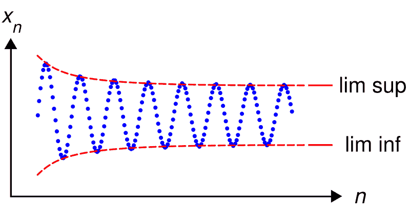
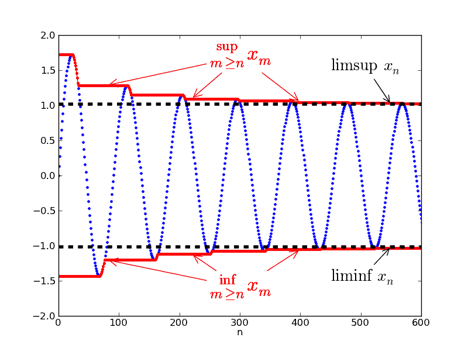

# 數列的上、下極限

## 簡介

* 數列$$\{a_n\}$$的上極限和下極限為數列在索引值$$n$$無窮大時的值，為單點且可視為**數列在極限的上下界**。
* 數列的極限不一定存在，因為數列極限可能發散或是在區間內震盪（如正弦、餘弦函數）。
* **但數列的上、下極限必定存在**，因為序列的上極限或下極限為單點，沒有收斂的問題，且擴展實數中非空集合必有最小上（下）界。（考慮擴展實數是因為上、下極限可能為正負無窮大）。
* 下兩圖中，紅色的線是由$$n$$開始的序列最小上界（最大下界）所連成的線，即$$\sup\{x_n, x_{n+1},x_{n+2}, \ldots\}  $$與$$\inf\{x_n, x_{n+1},x_{n+2}, \ldots\}$$，而紅色的線在$$n \rightarrow \infty$$時才是$$\limsup⁡ x_n$$與$$\liminf x_n$$ 之值。

## 實數數列上極限\(limit superior of a sequence\)

> 令$$\{x_n\}_{n \in \mathbb{N}} \subseteq \mathbb{R}$$為一數列，
>
> * $$\displaystyle \overline{\lim_{n \rightarrow \infty}}x_n\equiv \limsup_{n \rightarrow \infty} x_n=\inf_{n \geq 0}\sup_{ k \geq n} x_k = \inf_{n \geq 0}\{\sup_{k \geq n} x_k\}$$或
> * $$\displaystyle \limsup_{n \rightarrow \infty} x_n =\lim_{ n \rightarrow \infty} (\sup_{k \geq n} x_k)$$
> * 上極限是所有收斂子序列的最大值。
> * 上極限是由第$$n$$個元素開始的最小上界形成集合的最大下界。
>
> 令數列的上極限為$$b \in \mathbb{R}$$，則$$\displaystyle \limsup_{n \rightarrow \infty} x_n = \inf_{n \geq 0}\{ \sup_{k \geq n} x_n\}=b $$若且唯若$$\forall \epsilon >0  ~\exists n_0 \in \mathbb{N} \ni x_n < b+ \epsilon, \forall n \geq n_0$$。
>
> * 在實數中，固定索引值$$n$$後，$$x_n < b \Leftrightarrow \forall \epsilon >0, x_n < b+ \epsilon$$。
>   * 但是在數列中，滿足條件的$$n$$是依賴於給定的$$\epsilon$$而變動。因此必須先給定$$\epsilon$$之值後，得到滿足收斂條件的$$n_\epsilon$$，在$$n \geq n_\epsilon$$之後的所有（無限個）數列元素值均小於$$b+\epsilon$$。
>   * 但是在$$n_\epsilon$$之前，$$x_n$$之值可能會大於等於$$b+\epsilon$$。可得只有**有限個**元素$$\{x_1, x_2, \ldots, x_{n_\epsilon -1}\}$$可能會大於等於$$b+\epsilon$$。

* 令$$\{x_n\}$$有上界，則$$\exists M \in \mathbb{R} \ni x_n \leq M,~ \forall n \in \mathbb{N}$$。
* 令$$\forall n \in \mathbb{N}, M_n=\sup\{x_n,x_{n+1}, x_{n+2},\ldots\}  $$

  * $$M_1$$ 為$$\{x_k\}_{k=1}^\infty$$ （第一個元素開始）的最小上界。
  * $$M_2$$ 為$$\{x_k\}_{k=2}^\infty$$ （從第二個元素開始）的最小上界。
  * 以此類推得$$ M_n$$ 為$$\{x_k\}_{k=n}^\infty$$ （從第$$n$$個元素開始）的最小上界。
  * 可得$$\displaystyle \limsup_{n \rightarrow \infty}⁡x_n =\lim_{n \rightarrow \infty}M_n  \in (-\infty, \infty)$$，即數列的上極限等於數列第$$n$$個至無窮多個元素的最小上界
    。

*  若序列$$\{x_n\}$$無上界，則$$\displaystyle  \limsup_{n \rightarrow \infty} x_n=\infty$$。
* 因為任意序列的上極限最小值為$$−\infty$$，所以$$\displaystyle \limsup_{n \rightarrow \infty} x_n  \in [−\infty, \infty]$$。

* 數列的上極限與下極限的定義在任意的偏序集都適用，只需要上確界和下確界存在。
  在完全格裡，上確界和下確界總是存在，所以其中的數列一定有上極限和下極限。

## 實數數列下極限\(limit inferior of a sequence\)

> * $$\displaystyle \underline{\lim_{n \rightarrow \infty}}x_n\equiv \liminf_{n \rightarrow \infty} x_n=\sup_{n \geq 0}\inf_{ k \geq n} x_k = \sup_{n \geq 0}\{\inf_{k \geq n} x_k\}$$或
> * $$\displaystyle \liminf_{n \rightarrow \infty} x_n =\lim_{ n \rightarrow \infty} (\inf_{k \geq n} x_k)$$
> * 下極限是所有收斂子序列的最小值。
> * 下極限是由第$$n$$個元素開始的最大下界形成集合的最小上界。

> 令數列的下極限為$$a \in \mathbb{R}$$，則$$\displaystyle \liminf_{n \rightarrow \infty} x_n = \sup_{n \geq 0}\{ \inf_{k \geq n} a_n\}=a$$若且唯若$$\forall \epsilon >0  ~\exists n_0 \in \mathbb{N} \ni a - \epsilon < x_n , \forall n \geq n_0$$。

> * 在實數中，固定索引值$$n$$後，$$a < x_n \Leftrightarrow \forall \epsilon >0, a -\epsilon < x_n$$。
>   * 但是在數列中，滿足條件的$$n$$是依賴於給定的$$\epsilon$$而變動。因此必須先給定$$\epsilon$$之值後，得到滿足收斂條件的$$n_\epsilon$$，在$$n \geq n_\epsilon$$之後的所有（無限個）數列元素值均大於$$a-\epsilon$$。
>   * 但是在$$n_\epsilon$$之前，$$x_n$$之值可能會小於等於$$a-\epsilon$$。可得只有**有限個**元素$$\{x_1, x_2, \ldots, x_{n_\epsilon -1}\}$$可能會小於等於$$a-\epsilon$$。

* 令$$\{x_n\}$$有下界，則$$\exists m \in \mathbb{R} \ni x_n \geq m,~ \forall n \in \mathbb{N}$$。
* 令$$\forall n \in \mathbb{N}, m_n=\inf\{x_n,x_{n+1}, x_{n+2},\ldots\}  $$
  * $$m_1$$ 為$$\{x_k\}_{k=1}^\infty$$ （第一個元素開始）的最大下界。
  * $$m_2$$ 為$$\{x_k\}_{k=2}^\infty$$ （從第二個元素開始）的最大下界。
  * 以此類推得$$ m_n$$ 為$$\{x_k\}_{k=n}^\infty$$ （從第$$n$$個元素開始）的最大下界。
  * 可得$$\displaystyle \liminf_{n \rightarrow \infty}⁡x_n =\lim_{n \rightarrow \infty}m_n  \in (-\infty, \infty)$$，即數列的下極限等於數列第$$n$$個至無窮多個元素的最大下界
    。
* 若序列$$\{x_n\}$$無下界，則$$\displaystyle  \liminf_{n \rightarrow \infty} x_n=-\infty$$。
* 因為任意序列的下極限最大值為$$\infty$$，所以$$\displaystyle \liminf_{n \rightarrow \infty} x_n  \in [−\infty, \infty]$$。

#### 範例

* $$\{x_n=\frac{1}{n}, ~ n \in \mathbb{N}\}=\{1, \frac{1}{2}, \frac{1}{3},\ldots, \frac{1}{n}, \ldots\}$$，數列之值在$$(0,1]$$之間
  * 有上界, $$M_1=1, M_2=\frac{1}{2}, \ldots,M_n=\frac{1}{n}$$, $$\displaystyle \lim_{n \rightarrow \infty} \{1, \frac{1}{2},\ldots,\frac{1}{n},\ldots\}=0$$
  * 有下界 $$\displaystyle m_1=0, m_2=0,\ldots ,m_n=0, ~\lim_{n \rightarrow \infty} \{0,0,\ldots,0,\ldots\}=0$$
  * 因為上極限等於下極限，因此$$\displaystyle \lim_{n \rightarrow \infty} x_n = 0$$
* $$\{x_n=(−1)^n \}$$  
  * 有上界， $$\forall n \in \mathbb{N},  ~x_n \leq 1$$，所以$$\displaystyle \limsup_{n \rightarrow \infty} x_n=\inf_{n \geq 0}\left\{ ⁡\sup⁡\{1,1,1,\ldots\} \right\} =1$$
  *  有下界，$$\forall n \in \mathbb{N}, ~x_n \geq −1$$，所以$$\displaystyle \liminf_{n \rightarrow \infty} x_n =\sup_{n \geq 0}\left\{ \inf\{−1,−1,−1,\ldots\} \right\}=−1$$
* 所有大於1的實數值均為數列的上界，但1是所有上界中最小值，即$$\sup x_n=1$$
* 所有小於0的實數值均為數列的下界，但0是所有下界中最大值，即$$\inf x_n=0$$
* $$\displaystyle \liminf_{n \rightarrow \infty} n=\infty, ~ \liminf_{n \rightarrow \infty} (−n)=−\infty$$

### 數列收斂若且唯若數列上極限等於下極限

> * 令$$\{x_n\} \subseteq \mathbb{R}$$為實數序列，則$$\displaystyle \lim_{n \rightarrow \infty}⁡x_n =x< \infty$$收斂若且唯若$$\displaystyle \liminf_{n \rightarrow \infty} x_n= \limsup_{n \rightarrow \infty} x_n =x$$
> * 若$$\displaystyle \liminf_{n \rightarrow \infty} x_n =\limsup_{n \rightarrow \infty} x_n =\infty$$，則$$\displaystyle \lim_{n \rightarrow \infty} x_n=\infty$$。

Proof =&gt; 依極限定義必成立。

Proof &lt;=

* $$\displaystyle \limsup_{n \rightarrow \infty}⁡ x_n =x_n \Leftrightarrow \forall \epsilon>0, \exists n_1 \in \mathbb{N} \ni x_n<x+\epsilon , \forall n\geq n_1 $$ 
* $$\displaystyle \liminf_{n \rightarrow \infty} x_n=x \Leftrightarrow \forall \epsilon>0 ~\exists n_2 \in \mathbb{N} \ni x_n>x−\epsilon, ~\forall n \geq n_2  $$
* 取$$n_0=\max\{n_1,n_2 \}$$, 則$$\forall \epsilon>0, x−\epsilon<x_n<x+\epsilon, \forall n \geq n_0$$
* 由極限定義得 $$\displaystyle \lim_{n \rightarrow \infty} x_n=x$$ \(QED\)

### 任意實數數列的下極限小於等於上極限

> 令$$\{x_n\}\subseteq \mathbb{R}$$為實數序列，則$$\displaystyle  \liminf_{n \rightarrow \infty} x_n \leq \limsup_{n \rightarrow \infty} x_n$$

Proof:

* 若$$\{x_n\}$$有界，即$$\exists M \in \mathbb{R} \ni |x_n |≤M, ~\forall n \in \mathbb{N}$$，則：
  * $$m_n=\inf\{x_n,x_{n+1},x_{n+2},\ldots\}\leq \sup⁡\{x_n,x_{n+1},x_{n+2},\ldots\} = M_n$$（因為$$m_n, M_n$$必存在，所以不等式成立）
  * 所以$$\displaystyle \lim_{n \rightarrow \infty} m_n =\liminf_{n \rightarrow \infty}⁡ x_n \leq \lim_{n \rightarrow \infty}⁡ M_n =\limsup_{n \rightarrow \infty} x_n $$。
* 若$$\{x_n \}$$無界，則$$\displaystyle \liminf_{n \rightarrow \infty} x_n  =−\infty$$ 或$$\limsup_{n \rightarrow \infty} x_n = \infty$$
* 所以$$\displaystyle \liminf_{n \rightarrow \infty}⁡ x_n \leq \limsup_{n \rightarrow \infty} x_n$$  \(QED\)

### 實數數列上下極限的單調性

> 令$$\{a_n\},~ \{b_n\} \subseteq \mathbb{R}$$為二數列（有界或無界均可\)，且$$\forall n \in \mathbb{N}, a_n \leq b_n$$， 則：
>
> * $$\displaystyle \limsup_{n \rightarrow \infty}⁡ a_n \leq \limsup_{n \rightarrow \infty} b_n $$
> * $$\displaystyle \liminf_{n \rightarrow \infty} a_n \leq \liminf_{n \rightarrow \infty} b_n$$

Proof:

* 令$$L_n=\sup\{ a_n, a_{n+1},\ldots\}, ~ M_n=\sup\{b_n, b_{n+1}, \ldots \}$$
* 令$$l_n=\inf\{a_n,a_{n+1},\ldots\},  ~m_n=\inf\{b_n,b_{n+1},\ldots\}$$
* 則 $$a_n \leq b_n\Rightarrow L_n \leq M_n$$ 且$$l_n \leq m_n ~ \forall n \in \mathbb{N}$$
* 所以$$\displaystyle \lim_{n \rightarrow \infty}⁡ L_n \leq \lim_{n \rightarrow \infty}⁡ M_n $$ 且 $$\displaystyle \lim_{n \rightarrow \infty} l_n \leq \lim_{n \rightarrow \infty} m_n $$
* 可得 $$\displaystyle \limsup_{n \rightarrow \infty}⁡ a_n \leq \limsup_{n \rightarrow \infty} b_n$$ 且$$\displaystyle \liminf_{n \rightarrow \infty} a_n \leq \liminf_{n \rightarrow \infty} b_n$$  \(QED\)

### 實數數列上下極限的次可加性

> 令$$\{a_n\},~ \{b_n\} \subseteq \mathbb{R}$$為二數列，則
>
> * $$\displaystyle \limsup_{n \rightarrow \infty} (a_n+b_n ) \leq \limsup_{n \rightarrow \infty} a_n +\limsup_{n \rightarrow \infty} b_n $$
> * $$\displaystyle  \liminf_{n \rightarrow \infty} ⁡(a_n+b_n ) \geq  \liminf_{n \rightarrow \infty} a_n+ \liminf_{n \rightarrow \infty}⁡b_n $$

Proof:

* 令 $$L_n=\sup⁡\{a_n+b_n, a_{n+1}+b_{n+1}, \ldots \}$$
  ，$$M_n=\sup\{a_n, a_{n+1}, \ldots\}$$
  , $$P_n=\sup⁡\{b_n,b_{n+1},\ldots\}$$。
* $$\forall k \geq n, a_k \leq M_n $$ 且 $$b_k \leq P_n \Rightarrow a_k + b_k \leq M_n +P_n \Rightarrow L_n \leq M_n + P_n$$
* 可得 $$\displaystyle \lim_{n \rightarrow \infty}⁡ L_n \leq \lim_{n \rightarrow \infty}⁡ ⁡(M_n+P_n )=\lim_{n \rightarrow \infty⁡} M_n +\lim_{n \rightarrow \infty}⁡⁡P_n$$
* 因此 $$\displaystyle \limsup_{n \rightarrow \infty}⁡ (a_n+b_n ) \leq \limsup_{n \rightarrow \infty}⁡⁡ a_n +\limsup_{n \rightarrow \infty}⁡⁡ b_n$$ \(QED\)

### 有界數列存在子數列收斂至上、下極限

> 令$$\{x_n\} \subseteq \mathbb{R}$$為有界序列，且$$\displaystyle \limsup_{n \rightarrow \infty}⁡ x_n  =M,  ~\liminf_{n \rightarrow \infty}x_n=m$$， 則存在子序列$$\{x_{n_i}\}, \{x_{n_j}\}$$滿足 $$\displaystyle \lim_{i \rightarrow \infty} x_{n_i}=M, ~ \lim_{j \rightarrow \infty}⁡x_{n_j } =m$$

Proof:

* 因為$$\{x_n\}$$為有界數列，所以$$\exists c \in \mathbb{R} \ni |x_n |<c, ~\forall n \in \mathbb{N}$$
* 由定義得 $$\displaystyle \limsup_{n \rightarrow \infty} x_n=M \Leftrightarrow \forall \forall \epsilon>0 ~\exists n_0 \in \mathbb{N}  \ni x_n<M+\epsilon, ~\forall n \geq n_0 $$  
* 因此只要序列數量夠大\($$n \geq n_0$$\)，數列之值$$x_n$$ 必定會小於$$M$$。
* 即在$$n \geq n_0$$時，所有數列的值均小於$$M + \epsilon$$，且部份序列值大於$$M−\epsilon$$，令此部份序列值為子數列$$\{x_{n_i} \}$$，則可得 $$\displaystyle \lim_{i \rightarrow \infty}⁡ x_{n_i}=M$$
* 同理也可得到 $$\displaystyle \lim_{j \rightarrow \infty}⁡x_{n_j } =m$$ \(QED\)

### 數列比值上下界與根式上下界關係

> 令$$\{x_n \in \mathbb{R}^{+}\}$$為正值數列，則$$\displaystyle  \liminf_{n \rightarrow \infty}⁡\frac{x_{n+1}}{x_n} \leq \liminf_{n \rightarrow \infty}⁡(x_n )^{1/n} \leq \limsup_{n \rightarrow \infty}⁡(x_n )^{1/n} \leq \limsup_{n \rightarrow \infty}⁡\frac{x_{n+1}}{x_n}$$

