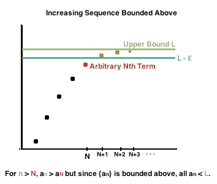
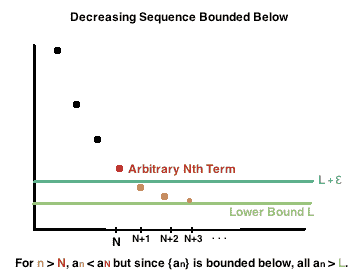

# 單調數列(monotonic sequence)

## 單調數列(monotonic sequence)

> $$(X,d)$$為度量空間，$$\{a_n\}_{n \in \mathbb{N}} \subseteq X$$為一數列，定義：
>
> * 遞增數列(increasing sequence)：$$\forall i \leq j, ~ a_i \leq a_j$$
> * 嚴格遞增數列(strictly increasing sequence)：$$\forall i \leq j, a_i<a_j$$
> * 遞減數列(decreasing sequence)：$$∀i \leq j, a_i \geq a_j$$
> * 嚴格遞減數列(strictly decreasing sequence)：$$\forall i \leq j, a_i>a_j$$

## 有界數列 (bounded sequence)

> $$(X,d)$$為度量空間, $$\{a_n \}$$為一數列，定義：
>
> * \[實數]有上界序列：$$\exists b \in X \ni \forall n \in \mathbb{N}, ~ a_n \leq b$$
> * \[實數]有下界序列：$$\exists a \in X \ni \forall n \in \mathbb{N},~ a_n \geq a$$
> * 有界序列：$$\exists m \in X\ni \forall n \in \mathbb{N}, ~ \lVert a_n \rVert \leq m$$
>
> 註：實數中的有界數列必落在一有界區間中。

[收斂數列必為有界數列且收斂至極限點](./#shou-lian-shu-lie-de-zhi-yu-you-jie-qie-shou-lian-zhi-ji-xian-dian)。

## 單調有界定理(實數中的有界單調數列必收斂)

> <mark style="color:red;">遞增有上界數列必收斂至最小上界</mark>
>
> $$\emptyset \neq S \subseteq \mathbb{R}$$有最小上界$$b= \sup(S) \Leftrightarrow$$ 存在嚴格遞增序列$$\displaystyle \{x_n, n \in \mathbb{N}| \forall i< j, ~x_i < x_j \} \subseteq S \ni \lim_{n \rightarrow \infty}x_n=b$$
> 
> 若$$\{x_n\}$$為有上界遞增數列（$$x_1 \leq x_2 \leq \ldots \leq M$$），則$$\displaystyle \lim_{n \rightarrow \infty} x_n =\sup \{x_n | \forall n \in \mathbb{N}\}$$
>
> <mark style="color:red;">遞減有下界數列必收斂至最大下界</mark> 。
>
> $$\emptyset \neq S \subseteq \mathbb{R}$$有最大下界$$a= \inf(S) \Leftrightarrow$$ 存在嚴格遞減序列$$\displaystyle \{x_n, n \in \mathbb{N}| \forall i< j, ~x_i > x_j \} \subseteq S \ni \lim_{n \rightarrow \infty}x_n=a$$
> 
> 若$$\{x_n\}$$為有下界遞減數列（$$x_1 \geq x_2 \geq \cdots \geq N$$），則$$\displaystyle \lim_{n \rightarrow \infty} x_n =\inf\{x_n |\forall n \in \mathbb{N}\}$$

> 此定理告訴我們不必知道單調數列極限而能判定收斂數列的方法。

proof: 直接建構滿足條件的單調序列

因為$$b=\sup S$$, 給定$$\epsilon=1$$，可得$$x_1 \in S \ni b−1<x_1<b$$

取$$\epsilon_2 = \min\{\frac{1}{2}, b-x_1\}$$，可得 $$x_2 \in S \ni b−\epsilon_2<x_2<b$$

整理可得 $$x_1 \leq b−\epsilon_2<x_2$$, $$b−\frac{1}{2} \leq b−\epsilon_2<x_2<b$$

同理可得 $$x_1, x_2,\ldots, x_n \in S \ni x_{n-1} < x_n$$且 $$b-\frac{1}{n} <x_n < b$$。

所以 $$\displaystyle \lim_{n \rightarrow \infty} (b - \frac{1}{n}) < \lim_{n \rightarrow \infty} x_n<b$$

由夾擠定理得 $$\displaystyle \lim_{n \rightarrow \infty} x_n=b$$(QED)

proof: 以最小上界性質證明 

Proof:

因為$$\{x_n\}$$有上界，由實數的最小上界性質(非空有上界的集合必有最小上界)得存在上確界 $$M=\sup\{x_n | n \in \mathbb{N}\}$$。

因為$$M$$為$$\{x_n\}$$的最小上界，由定義得$$\forall \epsilon>0~\exists n_0 \in \mathbb{N} \ni M−\epsilon<x_{n_0}$$

取$$n \geq n_0$$ 時，$$M−\epsilon <x_{n_0} \leq x_n<M+\epsilon$$ (QED)

註: 由以下兩圖可知遞增（減）數列，因為有界數列，因此到了$$n \geq n_0$$的時候，可以上升（下降）的量就已經到達到了一個很小的範圍，此時就如同函數極限的定義一般，值域在一個很小的範圍$$\epsilon$$內變動，因此收斂。

### 有上(下)界收斂數列必存在收斂子數列

> $$\{a_n\}$$為有上（下）界收斂數列，且令$$\displaystyle \lim_{n \rightarrow \infty} a_n =a$$，則存在子數列$$\{a_{n_r} \}$$收斂至$$a$$，即$$\displaystyle \lim_{r \rightarrow \infty}⁡ a_{n_r} =a$$。
>
> 註：收斂數列必為有界數例，且收斂收列必存在收斂至同一點的子數列。

proof:

由[收斂數列的子數列必為收斂數列且收斂至同一點](./#shou-lian-shu-lie-de-zi-shu-lie-bi-wei-shou-lian-shu-lie-qie-shou-lian-zhi-tong-yi-dian)得證。(QED)
