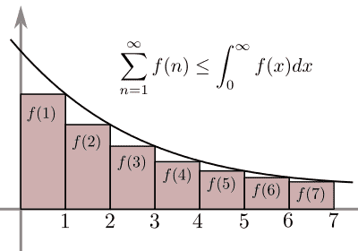
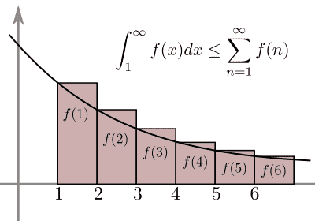
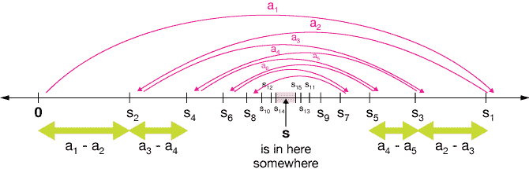
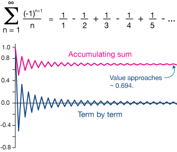

# 級數審斂法

## 篩審斂法\(screen test\)

> 若級數 $$\displaystyle \sum_{k=1}^\infty x_k$$ 收斂，則$$\displaystyle \lim_{n \rightarrow \infty} x_n=0 $$，反之不一定成立（極限為零不保證級數收斂）
>
> 反之，若$$\displaystyle \lim_{n \rightarrow \infty} x_n \neq 0$$，則級數$$ \displaystyle \sum_{k=1}^\infty x_k$$ 發散
。

* 註：已知級數的收斂與發散與無窮項的尾部元素有關，因此若無窮項的元素不收斂至0的話，級數和無法收斂。
* 註： 存在發散級數$$\displaystyle \sum_{k=1}^\infty x_k$$ 且$$\displaystyle \lim_{n \rightarrow \infty} x_n =0 $$。

Proof:

* 若級數$$\displaystyle \sum_{k=1}^\infty x_k$$ 收斂，令$$S_n=x_1+x_2+⋯+x_n= \sum_{k=1}^n x_k  $$
* 則存在$$\displaystyle S \in \mathbb{R}  \ni \lim_{n \rightarrow \infty}⁡S_n =S $$
* $$\begin{align} \displaystyle  \therefore \lim_{n \rightarrow \infty}⁡x_n &= \lim_{n \rightarrow \infty}⁡(S_n−S_{n−1} )\\ &=\lim_{n \rightarrow \infty} S_n −\lim_{n \rightarrow \infty}⁡S_{n−1} \\&=S−S \\ &=0 \end{align}$$ \(QED\)

### 範例：極限值為0的發散級數

$$\displaystyle \sum_{k=1}^\infty \frac{1}{\sqrt{k}}$$發散，但是$$\displaystyle \lim_{n \rightarrow \infty} \frac{1}{\sqrt{n}}=0$$

* $$S_n=\sum_{k=}^n \frac{1}{\sqrt{k}}=1+\frac{1}{\sqrt{2}}+\frac{1}{\sqrt{3}} + \cdots+ \frac{1}{\sqrt{n}} > \frac{1}{\sqrt{n}}+\frac{1}{\sqrt{n}}+\frac{1}{\sqrt{n}}+\cdots +\frac{1}{\sqrt{n}}=\frac{n}{\sqrt{n}}=\sqrt{n} $$
* 因此 $$\displaystyle \lim_{n \rightarrow \infty}S_n \geq \lim_{n \rightarrow \infty}\sqrt{n} = \infty$$發散。

### 正實數的遞減數列篩審斂法

> * $$\{x_n \}$$為遞減數列且$$\forall n \in \mathbb{N}, ~x_n>0$$。
> * 若$$\displaystyle \sum_{k=1}^\infty x_n$$ 為收斂級數，則$$\displaystyle \lim_{n \rightarrow \infty}⁡n x_n=0$$。


Proof:

* 令$$\displaystyle  \sum_{k=1}^\infty x_n =x<\infty$$ 且部份和 $$\displaystyle S_n=\sum_{k=1}^n x_n $$。
* 可得 $$\displaystyle \lim_{n \rightarrow \infty}⁡S_n =x= \lim_{n \rightarrow \infty}⁡ S_{2n }$$
* 因為$$S_{2n}−S_n=x_{n+1}+x_{n+2}+\ldots+x_{2n} \geq x_{2n}+x_{2n}+ \ldots +x_{2n}$$ （因為$$\{x_n \}$$是遞減數列，所以不等式成立）。
* 所以$$\displaystyle \lim_{n \rightarrow \infty}⁡(S_{2n}−S_n )=0=\lim_{n \rightarrow \infty}⁡(x_{n+1}+x_{n+2}+\ldots+x_{2n} ) \geq \lim_{n \rightarrow \infty}⁡n x_{2n} \geq0$$。
* 因此$$\displaystyle \lim_{n \rightarrow \infty}⁡n x_{2n}=0 \Rightarrow \lim_{n \rightarrow \infty}⁡2n x_{2n}=0$$
* 而且$$\{x_n\}$$是遞減數列, 所以$$\displaystyle x_{2n} \geq x_{2n+1} \Rightarrow (2nx_{2n} )\frac{2n+1}{2n} \geq (2n+1) x_{2n+1}\Rightarrow \lim_{n \rightarrow \infty}⁡(2n+1) x_{2n+1}=0$$
* 由奇位數子序列與偶位數子序列收斂則序列收斂的性質，因為$$\displaystyle \lim_{n \rightarrow \infty}⁡(2n+1) x_{2n+1}=0$$ 且$$\displaystyle \lim_{n \rightarrow \infty}2n x_{2n}=0$$ 所以可得 $$\displaystyle \lim_{n \rightarrow \infty}n x_n=0$$ \(QED\)

#### 範例

$$\displaystyle \sum_{k=2}^\infty \sin⁡\frac{\pi}{k}$$   發散。

* 因為$$\forall n=2,3,\ldots , ~ \sin⁡\frac{\pi}{n}>0$$ 且 $$\sin⁡ \frac{\pi}{n} > \sin⁡ \frac{π}{(n+1)}$$, 因此$$\{\sin⁡\frac{\pi}{n} \}$$為遞減數列。
* 由 $$\displaystyle \lim_{n \rightarrow \infty}⁡ n \sin⁡\frac{\pi}{n}=\pi \neq 0$$ 得 $$\displaystyle \sum_{k=2}^\infty \sin \frac{\pi}{k}$$   發散。

## 柯西審斂法\(Cauchy test\)

> 級數$$\displaystyle \sum_{k=1}^\infty x_k$$ 收斂的充要條件為 $$\forall \epsilon>0 ~ \exists n_0 \in \mathbb{N} \ni \forall n>m \geq n_0, ~ |x_{m+1}+x_{m+2}+ \ldots +x_n |<\epsilon$$

註：級數收斂的必要條件是序列要收斂至0，而實數中的收斂數列必為Cauchy序列。

Proof:

* 因為級數$$\displaystyle\sum_{k=1}^\infty x_k$$   收斂的充要條件是其部份和數列$$\{S_n \}$$收斂。
* 而數列$$\{S_n \}$$收斂的充要條件是$$\{S_n\}$$  是Cauchy數列。
* 因此級數$$\displaystyle\sum_{k=1}^\infty x_k$$ 收斂的充要條件是$$\{S_n\}$$是Cauchy數列。
* 因為 $$S_n=\displaystyle\sum_{k=1}^n x_k $$
* 所以$$\{S_n \}$$是Cauchy數列$$\Leftrightarrow $$$$\forall \epsilon>0 ~ \exists n_0 \in \mathbb{N} \ni \forall n>m \geq n_0, ~|S_n - S_m| =  |x_{m+1}+x_{m+2}+ \ldots +x_n |<\epsilon$$ \(QED\)

## 絕對收斂與條件收斂

* 若級數$$\displaystyle \sum_{k=1}^\infty |x_k |$$收斂，則稱級數  $$\displaystyle \sum_{k=1}^\infty x_k$$為絕對收斂（absolute convergence）。
* 若級數$$\displaystyle \sum_{k=1}^\infty |x_k |$$發散，但級數$$\displaystyle \sum_{k=1}^\infty x_k$$收斂，則稱級數$$ \displaystyle \sum_{k=1}^\infty x_k$$條件收斂（conditional convergence）。

### 絕對值審斂法\(absolutely convergence test\)

> 若絕對值級數$$\displaystyle \sum_{k=1}^\infty |x_k |$$ 收斂，則級數$$\displaystyle \sum_{k=1}^\infty x_k$$ 收斂。

Proof:

* $$\forall n \in \mathbb{N}$$，令部份和 $$S_n=\displaystyle \sum_{k=1}^n x_n , ~ T_n=\displaystyle \sum_{k=1}^n |x_n | $$。
* 因為 $$\displaystyle \sum_{k=1}^\infty |x_k |收斂$$，所以數列$$\{T_n\}$$為Cauchy序列。
* 可得$$\forall \epsilon>0, ~ \exists n_0 \in \mathbb{N} \ni \forall n >m \geq n_0, ~ |T_n−T_m |=|x_{m+1} |+|x_{m+2} |+\ldots +|x_n |<\epsilon$$
*  因此 $$|S_n−S_m |=|x_{m+1}+x_{m+2}+\ldots+x_n |\leq |x_{m+1} |+|x_{m+2} |+\ldots+|x_n |<\epsilon$$
* 即$$\{S_n\}$$也為Cauchy序列，由Cauchy審斂法得知$$\displaystyle \sum_{k=1}^\infty x_k$$收斂 \(QED\)

### 絕對收斂比較審斂法\(comparison test for absolute convergence\)

> 若存在$$n_0 \in \mathbb{N}$$ 使得$$\forall n \geq n_0, |x_n |≤|y_n |$$，則稱級數 $$\displaystyle \sum_{k=1}^\infty y_k$$ 優於\(superior to\)級數$$\displaystyle \sum_{k=1}^\infty x_n $$。
>
> * 令級數$$\displaystyle \sum_{k=1}^\infty y_k$$ 優於級數$$\displaystyle \sum_{k=1}^\infty x_k$$
> * 若級數$$ \displaystyle \sum_{k=1}^\infty |y_k |$$ 收斂，則級數$$\displaystyle \sum_{k=1}^\infty |x_k |$$收斂。
> * 若級數$$\displaystyle \sum_{k=1}^\infty |x_k |$$發散，則級數$$ \displaystyle \sum_{k=1}^\infty |y_k |$$ 發散。

Proof:

* 因為$$\exists n_0\in \mathbb{N} \ni \forall n \geq n_0, |x_n | \leq |y_n |$$，令$$\displaystyle \sum_{k=1}^\infty |y_k | =Y$$，則
* $$\forall n \geq n_0, S_n=|x_1 |+|x_2 |+\ldots+|x_{n_0−1} |+|x_{n_0} |+\ldots+|x_n | \leq |x_1 |+|x_2 |+\ldots+|x_{n_0−1} |+|y_{n_0} |+\ldots+|y_n | \leq |x_1 |+|x_2 |+\ldots+|x_{n_0−1} |+Y$$
* 因此$$\{S_n\}$$為遞增序列且有上界，因此$$\{S_n\}$$收斂，可得級數$$\sum_{k=1}^\infty x_k$$ 收斂 \(QED\)

### 絕對收斂極限比較審斂法\(limit comparison test for absolute convergence\)

> 令級數$$\displaystyle \sum_{k=1}^\infty x_k$$與$$\displaystyle \sum_{k=1}^\infty y_k$$滿足$$\displaystyle \lim_{n \rightarrow \infty} \left|\frac{x_n}{y_n} \right|=L \in \mathbb{R}$$
>
> * 若級數$$\displaystyle \sum_{k=1}^\infty y_k$$為絕對收斂 ，則級數$$\displaystyle \sum_{k=1}^\infty x_k$$ 絕對收斂。
> * 若$$L \neq 0$$，則級數$$\displaystyle \sum_{k=1}^\infty y_k$$為絕對收斂若且唯若級數$$\displaystyle \sum_{k=1}^\infty x_k$$絕對收斂。

Proof:

* 因為$$\displaystyle \lim_{n \rightarrow \infty} \left|\frac{x_n}{y_n} \right|=L$$，因此序列$$\left|\frac{x_n}{y_n} \right|$$ 有界, 即$$\exists M>0\ \ni \forall n \in \mathbb{N}, |x_n | \leq M|y_n |$$。
* 因此絕對收斂級數 $$\displaystyle \sum_{k=1}^\infty My_k$$優於級數$$\displaystyle \sum_{k=1}^\infty x_k$$ ，由絕對收斂比較審斂法得級數$$\displaystyle \sum_{k=1}^\infty x_k$$ 絕對收斂。
* 若$$L \neq 0$$，因$$\displaystyle \lim_{n \rightarrow \infty} \left|\frac{x_n}{y_n} \right|=L$$ 可得 $$\displaystyle \lim_{n \rightarrow \infty} \left|\frac{y_n}{x_n} \right|=\frac{1}{L}$$, 因此級數$$\displaystyle \sum_{k=1}^\infty y_k$$ 為絕對收斂若且唯若級數$$\displaystyle \sum_{k=1}^\infty x_k$$絕對收斂 \(QED\)

#### 範例

* 級數 $$\displaystyle \sum_{k=1}^\infty \left|\frac{−2k}{k^2−4k+7} \right| =\infty$$
* 因為$$\displaystyle \lim_{n \rightarrow \infty}⁡ \frac{1/n}{|(−2n)/(n^2−4n+7)|}=\frac{1}{2}$$且$$\displaystyle \sum_{k=1}^\infty \frac{1}{k}=\infty$$。

## 積分審斂法\(integral test\)

> 函數$$f:[1, \infty) \rightarrow \mathbb{R}$$為遞減函數，且滿足$$\forall x \in [1,\infty), f(x)>0$$。
>
> $$\forall n \in \mathbb{N}$$，令$$x_n=f(n)$$ \(即$$x_n$$為函數$$f$$在正整數的樣本點\)，則正項級數$$\displaystyle \sum_{k=1}^\infty x_k$$ 收斂的充要條件為瑕積分 $$\displaystyle \int_1^{\infty} f(x)dx$$  收斂。
>
> * 註：正項級數$$\displaystyle \sum_{k=1}^\infty x_k$$審斂法中收斂的充要條件是部份和$$S_n$$有界。

* 小矩型面積和為$$x_2+\ldots+x_n=S_n−x_1$$
* 大矩型面積和和 $$x_1+x_2+\ldots+x_(n−1)=S_{n−1}$$
* 可得$$\displaystyle \forall n \in \mathbb{N}, ~S_n−x_1 \leq \int_1^n f(x)dx \leq S_{n−1}$$
* proof &lt;=
* 若瑕積分$$\displaystyle \int_1^{\infty} f(x)dx$$ 收斂，即$$\displaystyle \exists A \in \mathbb{R} \ni \lim_{n \rightarrow \infty} \int_1^n f(x)dx=A$$。
* 即數列$$\left\{\displaystyle \int_1^{\infty} f(x)dx\right\}_{n \in \mathbb{N}}$$ 有界，依定義得$$\exists M>0 \ni \forall n \in \mathbb{N}, \displaystyle \int_1^{n} f(x)dx \leq M$$
* 因此$$\forall n \in \mathbb{N}, S_n−x_1 \leq M$$，則數列$$\{S_n\}$$有上界，由[正項級數審斂法](./#zheng-xiang-ji-shu-shen-lian-fa)得$$\sum_{k=1}^\infty x_k$$ 收斂。
* proof =&gt;
* 若正項級數 $$\sum_{k=1}^\infty x_k$$收斂，則由正項級數審斂法得得部份和$$\{S_n\}$$有上界，
  即$$∃M>0∋∀n∈N, S_n≤M$$。
* 因此$$\forall n \in \mathbb{N}, \displaystyle \int_1^{n} f(x)dx \leq M$$，因為$$\left\{\displaystyle \int_1^{\infty} f(x)dx\right\}_{n \in \mathbb{N}}$$為遞增數列且有上界，所以 $$\displaystyle \int_1^{\infty} f(x)dx$$  收斂 \(QED\)

## 比較審斂法\(comparison test\)

> $$\forall n \in \mathbb{N}, ~0<x_n \leq y_n$$
>
> * 若正項級數$$\displaystyle \sum_{k=1}^\infty y_k$$  收斂，則正項級數 $$\displaystyle \sum_{k=1}^\infty x_k$$  收斂。
> * 若正項級數$$\displaystyle \sum_{k=1}^\infty x_k$$   發散，則正項級數$$\displaystyle \sum_{k=1}^\infty y_k$$  發散。

Proof:

* 令部份和 $$S_n=\sum_{k=1}^n x_n , ~ H_n=\sum_{k=1}^n y_n $$
* 因為$$\forall n \in \mathbb{N},  ~0<x_n \leq y_n \Rightarrow S_n \leq H_n$$
* 若級數$$\sum_{k=1}^\infty y_k$$收斂，則 $$\exists M>0 \ni \forall n \in \mathbb{N}, H_n \leq M \Rightarrow S_n \leq M$$
* 即正項級數$$\sum_{k=1}^\infty x_k$$的部份和有上界，由正項級數審斂法得$$\sum_{k=1}^\infty x_k$$  收斂 \(QED\)

#### 範例

* 正項級數收$$\displaystyle \sum_{k=1}^\infty \frac{1}{k!}$$ 收斂。
* $$\forall n \in \mathbb{N}, \frac{1}{n!}=\frac{1}{1 \times 2 \times \cdots \times n}<\frac{1}{1 \times 2\times 2\times  \cdots \times  2}=\frac{1}{2^{n−1} }$$
* 因為幾何級數$$\sum_{k=1}^\infty \frac{1}{2^{k−1}}$$收斂，因此 $$\sum_{k=1}^\infty \frac{1}{k!}$$  收斂 。

## 極限值比較審斂法\(limit comparison test\)

> 令$$\displaystyle \sum_{k=1}^\infty x_k$$  與$$\displaystyle \sum_{k=1}^\infty y_k$$為二正項級數且滿足$$\displaystyle  \lim_{n\rightarrow \infty}⁡ \frac{x_n}{y_n} =A \in \mathbb{R}$$
>
> * 若正項級數 $$\displaystyle \sum_{k=1}^\infty y_k$$ 收斂，則正項級數$$\displaystyle \sum_{k=1}^\infty x_k$$ 收斂（但$$A$$可能等於0）。
> * 若$$A \neq 0$$，則正項級數$$\displaystyle \sum_{k=1}^\infty y_k$$收斂 若且唯若 正項級數$$\displaystyle \sum_{k=1}^\infty y_k$$ 收斂。

Proof:

* 因為$$\displaystyle  \lim_{n\rightarrow \infty}⁡ \frac{x_n}{y_n} =A$$，即序列 $$\{\frac{x_n}{y_n}\}$$有界。
* 所以$$\exists M>0 \ni \forall n \in \mathbb{N}, ~\frac{x_n}{y_n}  \leq M \Rightarrow x_n \leq My_n$$
* 若正項級數$$\displaystyle \sum_{k=1}^\infty My_k$$收斂，由比較審斂法得$$\displaystyle \sum_{k=1}^\infty x_k$$收斂。
* 若$$A \neq 0$$，因為$$\displaystyle \lim_{n \rightarrow \infty}⁡ \frac{x_n}{y_n}=A \Rightarrow \lim_{n \rightarrow \infty}⁡ \frac{x_n}{x_n}= \frac{1}{A} $$
* 因此正項級數 $$\displaystyle \sum_{k=1}^\infty x_k$$收斂若且唯若正項級數$$\displaystyle \sum_{k=1}^\infty y_k$$收斂 \(QED\)

#### 範例

* 級數$$\displaystyle \sum_{k=1}^\infty \frac{1}{4k^2−3k+7}$$ 收斂
  * 因為 $$4k^2−3k+7=O(k^2 )$$
  * 所以$$\displaystyle \lim_{n \rightarrow \infty}\frac{⁡(1/(4n^2−3n+7))}{1/n^2} =1/4$$
  * 因為$$\displaystyle \sum_{k=1}^\infty \frac{1}{k^2}$$   收斂，由極限值比較審斂法得$$\displaystyle \sum_{k=1}^\infty \frac{1}{4k^2−3k+7}$$收斂。

## 交錯級數審斂法\(alternating series test\)

> 令$$\{x_n \}$$為一非遞增序列，且滿足 $$\forall n, x_n>0, ~ x_1 \geq x_2 \geq \cdots \geq x_n \geq \cdots , \lim_{n \rightarrow \infty}⁡x_n  =0 $$
>
> 則交錯級數 $$\displaystyle \sum_{k=1}^\infty (−1)^{k+1} x_k =x_1−x_2+x_3−x_4+\cdots+(−1)^{n+1} x_n+\cdots= S$$收斂。且$$|S−S_n | \leq x_{n+1}  ~\forall n \in \mathbb{N} $$

Proof:

* 部份和 $$S_{2n}=x_1−x_2+x_3−\cdots−x_{2n−2}+(x_{2n−1}−x_{2n} )=S_{2n−2}+(x_{2n−1}−x_{2n} ) \geq S_{2n−2} $$
* 因為$$x_n \geq x_{n+1}$$，$$S_{2n}=x_1−(x_2−x_3 )−\cdots−(x_{2n−2}−x_{2n−1} )−x_{2n} \leq x_1 $$
* 可得數列$$\{S_{2n} \}$$為遞增數列且有上界，則序列$$\{S_{2n}\}$$收斂，令$$\displaystyle \lim_{n \rightarrow \infty} S_{2n}=A \in \mathbb{R} $$。
* $$S_{2n+1}=x_1−x_2+x_3−\cdots +x_{2n−1}−(x_{2n}−x_{2n+1} )=S_{2n−1}−(x_{2n}−x_{2n+1} ) \leq S_{2n−1} $$
* $$S_{2n+1}=(x_1−x_2 )+(x_3−x_4 )+\cdots=(x_{2n−1}−x_{2n} )+x_{2n+1}\geq (x_1−x_2 ) $$
* 所以數列$$\{S_{2n+1} \}$$為遞減數列且有下界，則序列$$\{S_{2n+1} \}$$收斂，令$$\displaystyle \lim_{n \rightarrow \infty}⁡S_{2n+1}=B \in \mathbb{R} $$
* 因為 $$S_{2n+1}=S_{2n}+x_{2n+1} $$，且$$x_{2n+1} > 0$$
* 所以 $$S_{2n} \leq S_{2n+1} \Rightarrow A \leq B $$
* 因為$$0 \leq B−A \leq S_{2n+1}−S_{2n}=x_{2n+1}$$，且由給定條件得$$  \displaystyle \lim_{n \rightarrow \infty} x_n=0 \Rightarrow A=B $$。
* 令$$S=A=B$$，得$$\displaystyle  \lim_{n \rightarrow \infty} S_{2n} =S=\lim_{n \rightarrow \infty} S_{2n+1} $$
* 由[數列奇數項與偶數項收斂至同一值，則數列收斂](../sequence/#shu-lie-qi-shu-xiang-yu-ou-shu-xiang-shou-lian-zhi-tong-yi-zhi-ze-shu-lie-shu-lian)得$$\displaystyle \lim_{n \rightarrow \infty} S_n=S$$。
* 且$$\forall n\in \mathbb{N}, ~|S−S_n | \leq |S_{n+1}−S_n |=x_{n+1} $$ \(QED\)

### alternating harmonic series

$$\displaystyle \sum_{k=1}^\infty \frac{(-1)^{k+1}}{k}=\frac{1}{1} - \frac{1}{2} + \frac{1}{3} - \frac{1}{4}+\frac{1}{5} - \cdots$$

## 狄利克雷審斂法\(Dirichlet test\)

> $$\{x_n\}, \{y_n \}$$為二序列，且滿足$$ \forall n \in \mathbb{N}, x_n>0$$, $$x_1 \geq x_2 \geq \cdots \geq x_n \geq \cdots ,\lim_{n \rightarrow \infty} x_n =0 $$。
>
> 且部份和數列 $$Y_n=\sum_{k=1}^n y_k$$有界，則級數$$\sum_{k=1}^\infty x_k y_k $$ 收斂。

Proof:

* 因為部份和數列$$Y_n$$有界且$$\displaystyle \lim_{n \rightarrow \infty} x_n=0$$, 所以$$\displaystyle \lim_{n \rightarrow \infty}⁡ x_n Y_n=0$$
* 令$$Y_0=0$$，則$$\forall n \in \mathbb{N},  ~ y_k=Y_k−Y_{k−1} $$
* 部份和$$\displaystyle  \begin{align} S_n &= \sum_{k=1}^n x_k y_k \\ &=\sum_{k=1}^n x_k (Y_k - Y_{k=1}) \\ &=\sum_{k=1}^n x_k Y_k - \sum_{k=1}^{n-1} x_{k+1} Y_k \\ &= \sum_{k=1}^n x_k Y_k - \sum_{k=1}^{n} x_{k+1} Y_k + x_{n+1}Y_n \\ &= \sum_{k=1}^n (x_k - x_{k+1})Y_k +x_{n+1}Y_n  \end{align}$$
* 令$$\displaystyle T_n=\sum_{k=1}^n |(x_k−x_{k+1} ) Y_k |$$ ，則$$ \forall n \in \mathbb{N}, ~ T_n \leq T_{n+1} $$
* 可得 $$\displaystyle T_n \leq M \sum_{k=1}^n (x_k−x_{k+1} ) \leq Mx_1 $$
* 所以$$\{T_n\}$$為遞增數列且有上界，則依遞增數列的性質可知存在$$T$$ 滿足$$\displaystyle \lim_{n \rightarrow \infty} T_n =T$$，即
  $$\displaystyle \sum_{k=1}^\infty |(x_k−x_{k+1} ) Y_k | =T $$
* 由絕對值審斂法得 $$\displaystyle \sum_{k=1}^\infty (x_k−x_{k+1} ) Y_k =S $$，因此
  $$\displaystyle \lim_{n \rightarrow \infty}S_n=\lim_{n \rightarrow \infty}\sum_{k=1}^\infty (x_k−x_{k+1} ) Y_k+\lim_{n \rightarrow \infty}x_{n+1} Y_n=S $$
* 所以級數$$\displaystyle \sum_{k=1}^\infty x_k y_k $$  收斂 \(QED\)

###  Dirichlet審斂法可得交錯級數審斂法

Proof:

* 令序列$$\{x_n\}$$ 滿足$$\forall n \in \mathbb{N}, x_n>0$$, $$x_1 \geq x_2 \geq \ldots,~\lim_{n \rightarrow \infty}⁡ x_n=0 $$
* 令交錯級數$$ x_1−x_2+x_3−x_4+\dots+(−1)^{n+1} x_n+\dots$$ 與 $$b_1=1, b_2=−1, \dots,b_n=(−1)^{n+1} $$。
* 則$$\forall n \in \mathbb{N}, ~|B_n |=|b_1+b_2+\dots+b_n |=|1−1+1−1+\dots+(−1)^{n+1} |\leq 1 $$
* 由Dirichlet審斂法得交錯級數 $$x_1−x_2+x_3−x_4+\dots+(−1)^{n+1} x_n+\dots$$ 收斂 \(QED\)

## 比值審斂法\(ratio test\)

> $$\displaystyle \forall n \in \mathbb{N}, x_n \neq 0, \lim_{n \rightarrow \infty}⁡|\frac{x_{n+1}}{x_n} | =p$$，則
>
> * 若 $$0 \leq p<1$$，則級數$$\displaystyle \sum_{k=1}^\infty |x_k|$$  收斂（絕對收斂）。
> * 若$$p>1$$或$$p=\infty$$，則級數$$\displaystyle \sum_{k=1}^\infty x_k$$ 發散。
> * 若$$p=1$$，則級數$$\displaystyle \sum_{k=1}^\infty x_k$$可能發散或收斂（須用其它審斂法判定）。

Proof： \($$0≤p<1$$\)

* 若$$p<1$$, 取$$r \ni p<r<1$$, 則$$\exists n_0 \in \mathbb{N} \ni |\frac{x_{n+1}}{x_n} |<r, ~  \forall n \geq n_0$$
* 移項得$$|x_{n+1} |<r|x_n |$$，展開後可得
* $$ |x_{n_0+1} |<r|x_{n_0 } |,~ |x_{n_0+2} |<r|x_{n_0+1} |<r^2 |x_{n_0} |, \ldots ,|x_{n_0+m} |<r^m |x_{n_0} |$$
* 即$$\forall n \geq n_0, |x_n | \leq r^{n−n_0} |x_{n_0} |$$
* 因為幾何級數 $$\sum_{k=n_0}^\infty |x_{n_0} |  r^k$$  收斂，因此級數$$\sum_{k=n_0}^\infty |x_k |$$   收斂, 即級數$$\sum_{k=1}^\infty |x_k |$$  收斂 \(QED\)


Proof: \($$p>1$$\)

* 若$$r \ni p>r>1$$，則$$\exists n_0 \in \mathbb{N} \ni \forall n \geq n_0, |\frac{x_{n+1}}{x_n} |>r$$
* 移項可得$$ |x_{n+1} |>r|x_n |>|x_n |$$,  可得$$\liminf_{n \rightarrow \infty} ⁡|x_n | \geq |x_1 |$$
* 由篩審斂法可得級數$$\sum_{k=1}^\infty x_k$$   發散 \(QED\)


Proof \($$p=1$$\)

* 例如 $$\displaystyle \lim_{n \rightarrow \infty}⁡\frac{1/(n+1)}{1/n}=1,~ \lim_{n \rightarrow \infty}⁡\frac{1/(n+1)^2 }{1/n^2}=1$$
* 級數 $$\sum_{k=1}^\infty 1/k$$  發散，但級數$$\sum_{k=1}^\infty 1/k^2$$ 收斂。

## 根式審斂法\(root test\)

> 令$$\displaystyle \lim_{n \rightarrow \infty}⁡|x_n |^{\frac{1}{n}}  =p$$，則
：
>
> * 若$$0 \leq p<1$$，則級數$$\sum_{k=1}^\infty x_k$$ 絕對收斂
  。
> * 若$$p>1$$或$$p=\infty$$，則級數$$\sum_{k=1}^\infty x_k$$  發散
  。
> * 若$$p=1$$，則級數$$\sum_{k=1}^\infty x_k$$ 可能發散或收斂\(須用其它審斂法判定\)
  。


Proof \($$0≤p<1$$\)

* 若$$0 \leq p<1$$，取$$r \ni p<r<1$$，則依收斂定義存在$$n_0 \in \mathbb{N}  \ni \forall n \geq n_0, |x_n |^{1/n}<r \Rightarrow |x_n |<r^n $$。
* 因為$$r<1$$，所以幾何級數 $$\sum_{k=n_0}^\infty r^k $$  收斂, 由$$|x_n |<r^n$$ 得級數 $$\sum_{k=n_0}^\infty |x_k | $$收斂，因為有限個元素不影響收斂性，可得$$\sum_{k=1}^\infty |x_k |$$ 收斂 \(QED\)

Proof: \($$p>1$$\)

* 取$$r \ni p>r>1$$，收斂定義得存在$$n_0 \in \mathbb{N} \ ni \forall n \geq n_0, r<|x_n |^{1/n} \Rightarrow 1<r^n<|x_n | $$
* 取$$n \rightarrow \infty$$得$$\liminf_{n \rightarrow \infty} ⁡|x_n |\geq 1$$，由篩審斂法得級數 $$\sum_{k=1}^\infty x_k $$  發散 \(QED\)

Proof: $$p=1
$$

* $$\displaystyle \lim_{n \rightarrow \infty}(1/n)^{1/n}=\lim_{n \rightarrow \infty}⁡ \frac{1}{n^{1/n}}=1$$
* $$\displaystyle \lim_{n \rightarrow \infty}⁡( \frac{1}{n^2})^{1/n}=\lim_{n \rightarrow \infty} \frac{1}{(n^2 )^{1/n} }=1$$
* 但級數$$\sum_{k=1}^\infty 1/k$$發散，而級數$$\sum_{k=1}^\infty 1/k^2$$ 收斂。

#### 範例

* $$ (1−1/2)^4+(1−1/3)^9+\dots+(1−1/n)^{n^2}+\dots$$收斂。
* 因為$$p=\lim_{n \rightarrow \infty}⁡ (x_n )^{1/n}=\lim_{n \rightarrow \infty} (1−1/n)^n =1/e<1$$ 所以級數收斂。。

