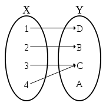
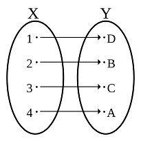
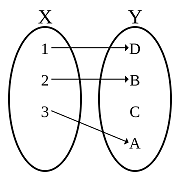
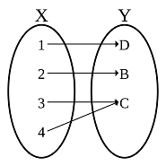

# 基數

## 基數\(cardinal number\)

在數學上，基數\(cardinal number\)或勢\(cardinality\)，即集合中包含的元素的「個數」。

* 有限集合的基數是該集合的元素個數，是一個自然數，其大小標誌著該集合裡元素的數量。
* 無限集合的基數\(勢\)，其意義在於比較兩個集的大小。如整數集和有理數集的基數相同，是因它們是一樣大\(等勢\)；整數集的勢比實數集的小；是因後者是比較大的集合。
  * 勢\(cardinality\)的概念只用於比較兩個無窮集的元素多寡，而不能直接指稱某集合的「元素個數」。

## 等價集合、相似集合\(equivalent set, similar set\)

> 若兩個集合$$X,Y$$有\(有限集合\)相同基數或\(無限集合\)同勢時，稱兩集合為等價集合，記為$$X\sim Y$$。
>
> 兩集合為等價集合，則兩集合等勢，即。等勢的概念只能說明兩個（有限或無限）集合的元素是否「一樣多」的問題。

**等價集合中，必定存在一對一且映成的函數，可將兩集合內的所有元素一對一對完全對應。因此兩個集合的基數\(勢\)自然相同**。使用此方法即可比較任意有限與無窮集合的大小。

* 函數的定義中，定義域的所有元素只能對應到在值域的唯一元素 \($$\forall x \in X \ \exists! y \in Y \ni f(x)=y$$ \)，但無法保證所有值域的元素都會被對應。

* 函數必須是一對一且映成才能保證$$X, Y$$兩集合中的每一個元素均有唯一的對應關係。

*  最先被考慮的無窮集合是自然數集$$\mathbb{N}$$及其無限子集合。把所有與$$\mathbb{N}$$能夠一一對應的集合定義為**可數集\(countable set\)**。
*  自然數$$\mathbb{N}$$的基數記為$$\aleph _{0}$$\(aleph null\)，是最小的阿列夫數。
* Cantor證明**有理數集合與代數數集合也是可數**的。
  在1874年初，他嘗試證明是否所有無限集合均是可數，其後他得出了**實數集不可數**的結論。

### 等價集合的性質

等價關係$$\sim$$滿足反身性、對稱性、遞移性。

> * 反身性：對於任意的集合$$X$$, $$X \sim X$$。
> * 對稱性：對於任意的集合$$X,Y$$，若 $$X\sim Y$$，則$$Y \sim X$$。
> * 遞移性：對於任意的集合$$X,Y,Z$$，若$$X \sim Y$$且$$Y \sim Z$$，則$$X \sim Z$$。

#### 整數與自然數集合等價

$$\mathbb{Z} \sim \mathbb{N}$$，定義函數$$f: \mathbb{N} \rightarrow \mathbb{Z}$$, $$\forall n \in \mathbb{N}$$, $$f(n) = \frac{n}{2} \text{ if n is even}, \frac{-(n-1)}{2}, \text{ if n is odd}$$。

#### 自然數平面與自然數等價

$$\mathbb{N} \times \mathbb{N} \sim \mathbb{N}$$, 函數$$f: \mathbb{N} \times \mathbb{N} \rightarrow \mathbb{N}$$, $$\forall (m.n) \in \mathbb{N} \times \mathbb{N}$$, $$f(m,n) =(m+n-2)(m+n-1)/2 +m$$。

#### 實數集與\(-1,1\)等價

$$f(x)=\frac{x}{1+|x|}$$ 或$$g(x) = \frac{2}{\pi} \tan^{-1}(x)$$

#### 任意實數開區間\(a,b\)與\(0,1\)等價

$$f(x) = \frac{(x-a)}{(b-a)}$$

## 使用函數判斷集合勢的大小

> 如果存在從$$X$$到$$Y$$的一個單射（一對一映射），則集合$$ Y$$大於等於一個集合$$X$$，
記為$$ |Y| \geq |X|$$，或稱集合$$Y$$有大於等於$$X$$的勢。

一對一函數 \($$f(x_1) = f(x_2) \Rightarrow x_1 = x_2$$\)中，值域$$Y$$可能有部份的元素沒有被定義域$$X$$的元素對應，因此集合$$Y$$有大於等於$$X$$的勢，即$$|Y| \geq |X|$$。

映成函數\($$\forall y \in Y\ \exists x \in X \ni f(x)=y$$\) 可判斷集合的勢 $$|X|  \geq |Y|$$。

因此一對一且映成的函數，可保證 $$|X| \geq |Y|$$ 且 $$|Y| \geq |X| $$，因此 $$|X| = |Y|$$。

### Cantor-Bernstein-Schroeder定理

兩集合$$X, Y$$ 若 $$|X| \leq |Y|$$且 $$|X| \geq |Y| \Leftrightarrow |X| = |Y|$$

## 有限集合的基數

自然數的子集合的基數是$$ |\{\}|=0$$，$$|\{1,2\}|=2, \cdots, |\{1,2,\cdots, N\}|=N$$，可得自然數$$N$$ 等勢的集合必定有$$N$$個元素。

#### 有限集合的等價定義

* 與某個自
  然數等勢。
* 只有一個等勢的序數，就是該集合的基數。
* **不存在等勢的真子集**。\(有限集合的真子集基數必小於該集合\)。

## 無限集合的基數

* 最小的無限集合是自然數$$\mathbb{N}$$。
* **一個無限集合可以和它的一個真子集有相同的基數**。
  * 如$$\{1,2,\cdots, n,\cdots\}$$
    與 $$\{2,4,\cdots, 2n, \cdots\}$$基數相同，因為在兩個集合之間，存在$$f(n)=2n$$為1-1且onto的函數。

#### 無限集合的等價定義

* 集合不與任何自然數$$n\in \mathbb{N}$$等勢。
* 它有至少一個真子集和它等勢。
* 存在自然數集合到它的\(子集\)的單射。

## 基數算術

給定兩集合$$X, Y$$，定義 $$X+Y =\{(x,0), x\in X \} \cup {(y,1), y \in Y}$$。

* 基數和 $$|X+Y| = |X| + |Y| $$
* 基數積 $$|X| |Y| = | X \times Y|$$，其中 $$X \times Y$$為卡式積。
* 基數指數 $$|X|^{|Y|} = |X^Y|$$，其中 $$X^Y$$為所有 $$Y \mapsto X$$函數的集合。

當集合$$X, Y$$均為有限集合時

* 基數加法與乘法滿足交換律
  * $$|X| + |Y| = |Y| + |X|$$
  * $$|X|  |Y| = |Y|  |X|$$
* • 基數加法與乘法滿足結合律
  * $$(|X| + |Y|) + |Z| = |X| +( |Y|+|Z|)$$
  * $$(|X|  |Y|)|Z| =  |X| (|Y| |Z|)$$
* 分配律
  * $$(|X| + |Y|)  |Z| = |X| |Z|+ |Y||Z|$$
* 指數

  * $$|X|^{|Y| +  |Z|} = |X|^{|Y|} |X|^{|Z|}$$
  * $$|X|^{|Y||Z|} = (|X|^{|Y|})^{|Z|}$$
  * $$(|X||Y|)^{|Z|} = |X|^{|Z|} |Y|^{|Z|}$$

 若集合$$X,Y$$皆非空集合且其中之一為無限集，則
 $$|X| + |Y| = |X||Y| = \max \{|X|, |Y| \}$$

## 基數指數的性質

* $$|X|^0 = 1$$
* $$0^{|Y|}=0, Y\neq \emptyset$$
* $$1^{|Y|} = 1$$
* $$|X| \leq |Y| \Rightarrow |X|^{|Z|} \leq |Y|^{|Z|} $$
* 若 $$ 1 < |X| < \infty, 1 < |Y| < \infty$$且 $$Z$$為無窮集，則 $$|X|^{|Z|} = |Y|^{|Z|}$$
* 若$$X$$為無窮集而$$Y$$為有限非空集，則 $$|X|^{|Y|} = |X|$$

