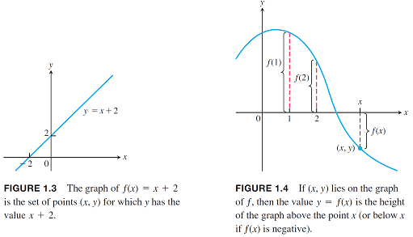
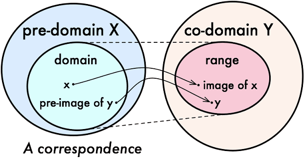

# 函數中的集合

## 簡介

此處討論是一般函數的集合，如果是線性函數的討論在線性代數中的[核空間及像集](../../linear-algebra/linear-transform/kernel-space-and-image.md)有深入討論。

## 關係(relation)

> $$X$$為一集合，若$$\mathbf{R}\subseteq X \times X$$，稱$$\mathbf{R}$$為集合$$X$$的一個關係。
>
> 若$$(x,y)\in \mathbf{R}$$，稱$$x$$與$$y$$具有$$\mathbf{R}$$的關係，記為$$x\mathbf{R}y$$。

note: relation比function更一般化，因為可為一對多的對應。

.png>)

### 等價關係(equivalence relation)

> 令$$\mathbb{R}$$為集合$$X$$的關係，且滿足
>
> * \[反身性, reflexive] $$\forall x \in X,\ x \mathbf{R}x$$
> * \[對稱性, symmetric] $$x,y\in X, \ x\mathbf{R}y \Leftrightarrow y \mathbf{R}x$$
> * \[遞移性, transitive] $$x,y,z \in X, \  x \mathbf{R}y\ \land \ y \mathbf{R} z \Rightarrow x  \mathbf{R} z$$

例如$$n \in \mathbb{N},\ X \in \mathbb{Z}, \mathbf{R} = \{ (x-y) \ \vert \ n(x-y) \}$$為等價關係，$$\mathbb{N} \sim \mathbb{Z}$$。

## 函數、映射 (function, mapping)

> $$X,Y$$為兩集合(相同或相異均可)，函數$$f: X \rightarrow Y$$定義對於$$X$$中的每一個元素$$x$$，均存在唯一的函數值$$f(x) \in Y$$。$$\forall x \in X, \exists! y \in Y \ni f(x)=y$$
>
> * $$X$$為函數$$f$$的定義域(domain)。
> * $$Y$$為函數$$f$$的對應域(codomain)。
> * $$f(X) = \{ f(x)\ \vert \ x\in X \} \subseteq Y$$為函數$$f$$的值域，其中等號成立於$$f$$為映成函數。

.png>)

### 函數相等

兩函數$$f,g: X \rightarrow Y$$相等若且唯若

1. 兩函數的定義域相等
2. $$f(x)=g(x), \forall x \in X$$

### 函數的圖形&#x20;

以$$x$$軸做垂直線，如果一個映射$$f$$對映的$$f(x)$$
有兩點以上，則$$f$$不滿足函數的定義。

### 一對一與映成函數(one-to-one and mapping function)

一對一和映成函數可判斷兩集合(定義域和對應域)的勢，詳見[基數](cardinal-number.md#shi-yong-han-shu-pan-duan-ji-he-shi-de-da-xiao)。

* 一對一函數(單射)(one-to-one function, injection, injective mapping)
  * $$\forall x,y\in X, \ f(x)=f(y) \Rightarrow x = y$$
  * 等價於 $$\forall x,y \in X, x\neq y \Rightarrow f(x) \neq f(y)$$
  * <mark style="color:blue;">可保證值域和定義域等勢</mark>，$$|f(X)| = |X|$$，<mark style="color:blue;">因此對應域的勢大於等於定義域</mark>，即 $$|X| \leq |Y|$$。

.png>)

* 映成函數(滿射)(onto function,  surjection, surjective mapping)
  * $$\forall y \in Y \ \exists x \in X \ni f(x)=y$$
  * 等價於 $$\forall y \in Y, f^{-1}(y) \subseteq X \neq \emptyset$$
  * 對應域中每一個元素都被對應到，因此值域等於對應域，即$$|f(X)| = |Y|$$。
  * 可保證對應域每一個元素都被對應，但可能是多對一的關係，<mark style="color:blue;">因此定義域的勢大於等於對應域，即</mark>$$|X| \geq |Y|$$。

由上述條件可知當$$f$$為一對一且映成函數(bijection, bijective mapping)時，定義域與對應域等勢，即$$|X|  = |Y|$$。

## 可逆函數(invertible function)

> $$f: X \rightarrow Y$$be a function, if there is a function $$g: Y \rightarrow X$$ such that $$g \circ f = I_X$$ and $$f \circ g = I_Y$$, then $$f$$ is invertible.

* 反函數(inverse function) 若存在時必唯一，記為 $$g \equiv f^{-1}$$
* 反函數存在時，$$(f^{-1})^{-1} = f$$
* 反函數與前像(preimage)為不同的概念，反函數$$f^{-1}$$為函數，而前像$$f^{-1}(Y)$$為集合。

### 一對一函數的反向關係為函數

> 函數$$f: X \rightarrow Y$$為一對一函數，即$$f(x_1)=f(x_2) \Rightarrow x_1 = x_2, ~ \forall x_1, x_2 \in X$$，則反向關係$$f^{-1}: f(Y) \rightarrow  X$$為函數，即$$x_1 = x_2 \Rightarrow f(x_1) = f(x_2), \forall f(x_1), f(x_2) \in Y$$。

註：反向關係的定義域是$$f(X)$$而不是$$X$$。

### 可逆函數等價於一對一且映成函數

> 此處的映成是指整個對應域$$Y$$

proof:&#x20;

$$\Leftarrow$$可由定義直接得出。

$$\Rightarrow$$

* 若$$f$$不為一對一函數，則 $$\exists x_1, x_2 \in X, \ x_1 \neq x_2 \ni f(x_1) = f(x_2)$$
* 因此關係$$g(f(x_1)), g(f(x_2))$$為一對多的映射，不滿足函數的定義。
* 若$$f$$不為映成函數，則 $$\exists y \in Y \ni f^{-1}(y) = \emptyset$$，因此關係$$g(y)$$存在部份定義域的元素無函數值，不滿足函數的定義 (QED)。

## 函數的映像與前像

令$$f: X \rightarrow Y$$，則定義域為$$X$$，對應域為$$Y$$，值域(映像)為$$f(X)$$。給定$$D \subseteq Y$$，則$$f^{-1}(D) = \{x \in X \ \vert \ f(x) \in D \}$$為此集合的前像，在此$$f^{-1}$$只代表該值域的**前像集合(pre-image)**，不是函數。

| 函數類型              | 值域元素                 | 前像元素                          |
| ----------------- | -------------------- | ----------------------------- |
| 映成(surjection)    | $$\forall y\in Y$$   | $$f^{-1}(y)$$至少有一個元素。         |
| 一對一(injection)    |  $$\forall y \in Y$$ | $$f^{-1}(y)$$最多只有一個元素，可能為空集合。 |
| 一對一且映成(bijection) | $$\forall y\in Y$$   | $$f^{-1}(y)$$剛好只有一個元素。        |

### 函數前像與映像的性質

令$$A, B \subseteq X$$，$$C,D \subseteq Y$$，$$f$$為函數，因為$$f$$可能有元素多對一，因此$$f^{-1}$$為前像集合但不一定是函數。

### 子集合經函數轉換值域仍為子集合

> $$A \subseteq B \Rightarrow f(A) \subseteq f(B)$$&#x20;

proof:&#x20;

$$f(A) = \{f(x) \vert x \in A \}, \ f(B) = \{ f(x) | x \in B\}$$

$$\because A\subseteq B \therefore x \in A \Rightarrow x \in B$$

$$\therefore f(A) \subseteq f(B)$$ (QED)

### 值域中子集合的前像仍為子集合

> $$C \subseteq D \Rightarrow f^{-1}(C) \subseteq f^{-1}(D)$$

proof:

$$f^{-1}(C) = \{x\in X | f(x) \in C\}$$, $$f^{-1}(D) = \{x\in X | f(x) \in D\}$$

$$\because C \subseteq D \therefore f(x) \in C \Rightarrow f(x) \in D$$

$$\therefore f^{-1}(C) \subseteq f^{-1}(D)$$

### 聯集經函數轉換為個別集合值域的聯集

> * $$f(A \cup B) = f(A) \cup f(B)$$
> * 可擴展至 $$\displaystyle f\left(\bigcup_{i =1}^{\infty} A_i \right) = \bigcup_{i=1}^\infty f(A_i)$$

* 證明 $$f(A \cup B) \subseteq f(A) \cup f(B)$$且 $$f(A) \cup f(B) \subseteq f(A \cup B)$$

> $$f^{-1}(C \cup D) = f^{-1}(C) \cup f^{-1}(D)$$

* 證明 $$f^{-1}(C \cup D) \subseteq f^{-1}(C) \cup f^{-1}(D)$$且 $$f^{-1}(C) \cup f^{-1}(D) \subseteq f^{-1}(C \cup D)$$

> * $$f(A \cap B) \subseteq f(A) \cap f(B)$$
> * 可擴展至 $$\displaystyle f\left(\bigcap_{i =1}^{\infty} A_i \right) = \bigcap_{i=1}^\infty f(A_i)$$

> $$f^{-1}(C \cap D) = f^{-1}(C) \cap f^{-1}(D)$$

> $$f(A) \setminus f(B) \subset f(A \setminus B) \subset f(A)$$

> $$f^{-1}(C \setminus D) = f^{-1}(C) \setminus f^{-1}(D)$$

> $$A \subseteq f^{-1}(f(A))$$

> $$f(f^{-1}((f(A)))=f(A)$$

> $$f(f^{-1}(C)) \subseteq C$$
>
> 若$$f$$為映成函數，則$$f(f^{-1}(C)) = C$$

$$f^{-1}(f(f^{-1}(C)))=f^{-1}(C)$$

> 若$$f$$為一對一函數，則以下敘述等價：
>
> * $$A=f^{-1}(f(A))$$
> * $$f(A\cap B) = f(A) \cap f(B)$$
> * $$A \cap B= \emptyset \Rightarrow$$$$f(A) \cap f(B) = \emptyset$$
> * $$B \subseteq A \Rightarrow f(A-B) = f(A) - f(B)$$

> 若$$f: X \rightarrow Y$$為一對一函數，則存在函數$$g: Y \rightarrow X$$使得$$g \circ f (X)\equiv g(f(X))=X$$

> 若$$f: X \rightarrow Y$$為映成函數，則存在函數$$h: Y \rightarrow X$$使得 $$f \circ h(Y) \equiv f(h(Y))=Y$$。

> $$g:Y \rightarrow Z$$為任意函數。
>
> 若$$g \circ f$$為一對一函數，則$$f$$為一對一函數。
>
> 若$$g \circ f$$為映成函數，則$$g$$為映成函數。
