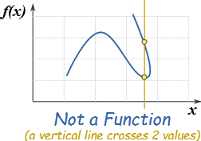
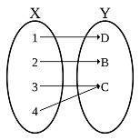

# 函數\(function\)

## 關係\(relation\)

> $$X$$為一集合，若$$\mathbf{R}\subseteq X \times X$$，稱$$\mathbf{R}$$為集合$$X$$的一個關係。
>
> 若$$(x,y)\in \mathbf{R}$$，稱$$x$$與$$y$$具有$$\mathbf{R}$$的關係，記為$$x\mathbf{R}y$$。

note: relation比function更一般化，因為可為一對多的對應。

### 等價關係\(equivalence relation\)

> 令$$\mathbb{R}$$為集合$$X$$的關係，且滿足
>
> * \[反身性, reflexive\] $$\forall x \in X,\ x \mathbf{R}x$$
> * \[對稱性, symmetric\] $$x,y\in X, \ x\mathbf{R}y \Leftrightarrow y \mathbf{R}x$$
> * \[遞移性, transitive\] $$x,y,z \in X, \  x \mathbf{R}y\ \land \ y \mathbf{R} z \Rightarrow x  \mathbf{R} z $$

e.g. $$ n \in \mathbb{N},\ X \in \mathbb{Z}, \mathbf{R} = \{ (x-y) \ \vert \ n(x-y) \}$$為等價關係。

## 函數、映射 \(function, mapping\)

> $$X,Y$$為兩集合\(相同或相異均可\)，函數$$f: X \rightarrow Y$$定義對於$$X$$中的每一個元素$$x$$，均存在唯一的函數值$$f(x) \in Y$$。$$\forall x \in X, \exists! y \in Y \ni f(x)=y$$
>
> * $$X$$為函數$$f$$的定義域\(domain\)。
> * $$Y$$為函數$$f$$的對應域\(codomain\)。
> * $$f(X) = \{ f(x), x\in X \} \subseteq Y$$為函數$$f$$的值域，其中等號成立於$$f$$為映成函數。

• 以$$x$$軸做垂直線，如果一個映射$$f$$對映的$$f(x)$$
有兩點以上，則$$f$$不滿足函數的定義。

### 一對一與映成函數\(one-to-one and mapping function\)

一對一和映成函數可判斷兩集合\(定義域和對應域\)的勢，詳見[基數](cardinal-number.md#shi-yong-han-shu-pan-duan-ji-he-shi-de-da-xiao)。

* 一對一函數\(單射\)\(one-to-one function, injection, injective mapping\)
  * $$\forall x,y\in X, \ f(x)=f(y) \Rightarrow x = y$$
  * 等價於 $$\forall x,y \in X, x\neq y \Rightarrow f(x) \neq f(y)$$
  * 可保證值域和定義域等勢，$$|f(X)| = |X|$$，因此對應域的勢大於等於定義域，即 $$ |X| \leq |Y|$$。

* 映成函數\(滿射\)\(onto function,  surjection, surjective mapping\)
  * $$\forall y \in Y \ \exists x \in X \ni f(x)=y$$
  * 等價於 $$\forall y \in Y, f^{-1}(y) \subseteq X \neq \emptyset$$
  * 對應域中每一個元素都被對應到，因此值域等於對應域，即$$|f(X)| = |Y|$$。
  * 可保證對應域每一個元素都被對應，但可能是多對一的關係，因此定義域的勢大於等於對應域，即$$|X| \geq |Y|$$。

由上述條件可知當$$f$$為一對一且映成函數\(bijection, bijective mapping\)時，定義域與對應域等勢，即$$|X|  = |Y|$$。

### 可逆函數\(invertible function\)

> $$f: X \rightarrow Y$$be a function, if there is a function $$g: Y \rightarrow X$$ such that $$ g \circ f = I_X$$ and $$ f \circ g = I_Y$$, then $$f$$ is invertible.

* 反函數\(inverse function\) 若存在時必唯一，記為 $$g \equiv f^{-1}$$
* 反函數存在時，$$(f^{-1})^{-1} = f$$
* 反函數與前像\(preimage\)為不同的概念，反函數$$f^{-1}$$為函數，而前像$$f^{-1}(Y)$$為集合。

### 可逆函數等價於一對一且映成函數

proof: 

$$\Leftarrow$$可由定義直接得出。

$$\Rightarrow$$

* 若$$f$$不為一對一函數，則 $$\exists x_1, x_2 \in X, \ x_1 \neq x_2 \ni f(x_1) = f(x_2)$$
* 因此關係$$g(f(x_1)), g(f(x_2)) $$為一對多的映射，不滿足函數的定義。
* 若$$f$$不為映成函數，則 $$\exists y \in Y \ni f^{-1}(y) = \emptyset$$，因此關係$$g(y)$$存在部份定義域的元素無函數值，不滿足函數的定義 \(QED\)。

## 函數的映像與前像

令$$f: X \rightarrow Y$$，則定義域為$$X$$，對應域為$$Y$$，值域\(映像\)為$$f(X)$$。給定$$D \subseteq Y$$，則$$f^{-1}(D)$$為此集合的前像，在此$$f^{-1}$$只代表該值域的**前像集合\(pre-image\)**，不是函數。

令$$A, B \subset X$$，$$C,D \subset Y$$

* $$A \subset B \Rightarrow f(A) \subset f(B)$$ \[反向不成立，因為函數可為多對一\]
* $$C \subset D \Rightarrow f^{-1}(C) \subset f^{-1}(D)$$
* $$f(A \cup B) = f(A) \cup f(B)$$
* $$f^{-1}(C \cup D) = f^{-1}(C) \cup f^{-1}(D)$$
* $$f(A \cap B) \subset f(A) \cap f(B)$$
* 若$$f$$為一對一函數，則$$f(A\cap B) = f(A) \cap f(B)$$
* $$f^{-1}(C \cap D) = f^{-1}(C) \cap f^{-1}(D)$$
* $$f(A) \setminus f(B) \subset f(A \setminus B) \subset f(A)$$
* $$f^{-1}(C \setminus D) = f^{-1}(C) \setminus f^{-1}(D)$$
* $$A \subset f^{-1}(f(A))$$
* 若$$f$$為一對一函數，則$$A=f^{-1}(f(A))$$
* $$f(f^{-1}(C)) \subset C$$
* 若$$f$$為映成函數，則$$f(f^{-1}(C)) = C$$
* 若$$f: X \rightarrow Y$$為一對一函數，則存在函數$$g: Y \rightarrow X$$使得$$g \circ f (X)\equiv g(f(X))=X$$
* 若$$f: X \rightarrow Y$$為映成函數，則存在函數$$h: Y \rightarrow X$$使得 $$f \circ h(Y) \equiv f(h(Y))=Y$$。
* $$g:Y \rightarrow Z$$為任意函數。

  * 若$$g \circ f$$為一對一函數，則$$f$$為一對一函數。
  * 若$$g \circ f$$為映成函數，則$$g$$為映成函數。

