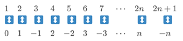

# 無限集合

## 可數集合 \(countable set\)

> 集合$$S$$與自然數集合$$\mathbb{N}$$存在單射\(一對一\)關係時，則該集合為可數集。
>
> 如果$$S$$與$$\mathbb{N}$$是一對一且滿射關係時，則$$S$$為無限可數集。

* 可數集合可分為有限個元素\(有限集\)或是無限集\(無限可數集\)。
* 最小的無限集合為自然數，為可數無限集合。

## 不可數\(無限\)集合\(uncountable \(infinite\) set\)

> 不是可數集的無限集稱為**不可數集**。不可數集合與自然數集合$$\mathbb{N}$$不存在一對一且映成的關係，而且**不可數集合嚴格大於自然數集合的勢**$$\aleph_0$$。

不可數集合必為無限集合。

## 無限集合 \(infinite set\)

> 無限集合是由無限個元素組成的集合。

> * 它有至少一個真子集和它等勢。
> * 存在自然數集合到它的\(子集\)的單射\(一對一函數\)。

無限集可分為可數集與不可數集。

無限集合有至少一個真子集合它等勢，其中一個例子是整數集合$$\mathbb{Z}$$與自然數集合$$\mathbb{N}$$等勢，兩者間存在一對一且映成的函數$$f=\Bigg\{ \begin{align}& \frac{n}{2} &,& n \text { is even} \\ &-\frac{n-1}{2} &,& n \text { is odd} \\ \end{align} $$

## 可數集合的無限子集合仍為可數集

proof:

* 令$$S$$為可數集，且$$E \subset S$$。
* 因為$$S$$為可數集，將$$S$$內的相異元素由小至大排列，形成數列$$\{s_n\}$$。
* 建構數列 $$\{n_k\}$$如下：
  * 令$$n_1$$

## 實數上有限區間的實數集合不可數

