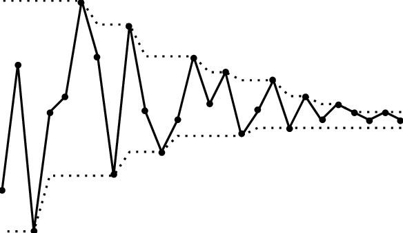

# 集合序列的極限

## 簡介

* <mark style="color:red;">集合</mark>$$A, B$$<mark style="color:red;">的最小上界可視為</mark>$$A \cup B$$（因為$$A,B \subseteq A \cup B$$且任何同時包含$$A,B$$的集合均比$$A\cup B$$大），<mark style="color:red;">而最大下界可視為</mark>$$A\cap B$$（同理$$A \cap B \subseteq A, B$$且同時包含$$A,B$$共同元素的集集合均比$$A\cap B$$小）。
* 函數序列上下極限的定義，其關鍵之處在於尋找到函數數列上下確界的相似概念，這與找出集合論中與大小關係類似的運算，即集合的包含關係。<mark style="color:red;">且集合序列的上、下極限</mark>_<mark style="color:red;">只考慮集合序列極限的元素</mark>_<mark style="color:red;">，而非全部的集合元素，可忽略掉前面有限次集合序列的元素</mark>。
* 按照集合的包含關係，所謂集合序列的「最小上界(sup)」是包含所有$$A_n$$的集合中最小的那個集合，顯而易見，這個集合就是所有$$A_n$$的聯集$$\bigcup_n A_n$$。 類似的概念可找出找出集合序列的「最大下界(inf)」，為所有$$A_n$$ 的交集$$\bigcap_n A_n$$。
* **集合序列的上極限集中的元素屬於集合序列的無窮多個集合，也不屬於無窮多個集合；由定義可知**<mark style="color:red;">**上極限集中的元素，在觀察集合多次後(可忽略前面的集合)，會經常出現在部份集合中(聯集的概念)**</mark>。
* **集合序列的下極限集中的元素屬於集合序列的無數個集合，僅不屬於有限多個集合；由定義可知**<mark style="color:red;">**下極限集中的元素，在觀察集合多次後(可忽略在前面的集合)，會出現在全部的集合中(交集的概念)**</mark>。
* **可以看出上極限集中的元素數量大於等於下極限集中的元素數量。如果二者相等，他們的值就被定義為集合列的極限，和數列極限的概念一致**。

## 單調集合序列(monotonic sequence of set)

> $$\{E_n \}_{n \in \mathbb{N}}$$ 為
>
> * 遞增(increasing)序列若 $$E_n \subseteq E_{n+1}, ~ \forall n \in \mathbb{N}$$。
> * 遞減(decreasing)序列若$$E_n \supseteq E_{n+1}, ~ \forall n \in \mathbb{N}$$。
>
> 註：單調序列在證明中經常使用，以人工方式建構而成。

E.g. $$E_n= \{k \in \mathbb{N} | k\leq n \}$$

## 單調有界集合序列極限必定存在

### 遞增集合序列的極限為所有集合的聯集

> 遞增集合序列$$E_n \subseteq E_{n+1}, ~ \forall n$$（因為$$E_n$$ 為宇集合$$X$$的子集合，因此$$X$$為所有集合的上界） 則 $$\displaystyle \lim_{n \rightarrow \infty} E_n =\bigcup_{n=1}^\infty E_n$$

proof：a=b 若且唯若a \subseteq b且b \subseteq a。

因為$$\displaystyle x \in \bigcup_{n=1}^\infty E_n$$，必定存在$$n_0 \in \mathbb{N}$$使得$$x \in E_{n_0}$$，因為$$E_n \subseteq E_{n+1}~\forall n$$，所以可得$$x \in E_n$$因此$$\displaystyle x \in \liminf_{n \rightarrow \infty}E_n$$，即$$\displaystyle \bigcup_{n=1}^\infty E_n \subseteq \liminf_{n \rightarrow \infty}E_n$$--(1)

又因為對於所有的集合$$\displaystyle \bigcap_{n=1}^\infty E_n \subseteq \liminf_{n \rightarrow \infty} E_n \subseteq \limsup_{n \rightarrow \infty} E_n  \subseteq \bigcup_{n=1}^\infty E_n$$--(2)

由(1)(2)得$$\displaystyle \lim_{n \rightarrow \infty} E_n =\bigcup_{n=1}^\infty E_n$$(QED)

### 遞減集合序列的極限為所有集合的交集

> 遞減集合序列$$E_n \supseteq E_{n+1}, ~\forall n$$，則 $$\displaystyle \lim_{n \rightarrow \infty} E_n=\bigcap_{n=1}^\infty E_n$$（空集合為任意集合的子集合，因此可為所有集合的下界）

對於遞增集合序列，$$\displaystyle \bigcap_{j \geq n} E_j = \bigcap_{j \geq 1}E_j$$且 $$\bigcup_{j \geq n}E_j = E_n$$。可得$$\displaystyle \lim_{n \rightarrow \infty} E_n = \bigcup_{n=1}^\infty E_n$$

對於遞減集合序列，$$\bigcap_{j \geq n}E_j=E_n$$且$$\bigcup_{j \geq n} E_j=\bigcup_{j\geq 1}E_j$$。可得 $$\displaystyle \lim_{n \rightarrow \infty} E_n = \bigcap_{n=1}^\infty E_n$$

### 範例：遞減集合序列的極限

$$E_n=[n,\infty), ~\forall n \in \mathbb{N}$$為遞減集合序列，則$$\displaystyle \lim_{n \rightarrow \infty} E_n=\bigcap_{n=1}^\infty E_n=\phi$$

### 範例：開區間逼近閉區間

測度證明中常用給定$$c \in \mathbb{R}$$，區間$$\displaystyle (-\infty, c]=\bigcap_{n=1}^\infty (-\infty, c+\frac{1}{n}) = \lim_{n \rightarrow \infty} (-\infty, c+\frac{1}{n})$$

## 集合序列上、下極限的圖解

$$\displaystyle \limsup_{n \rightarrow \infty}⁡ E_n =\bigcap_{n=1}^\infty \bigcup_{k=n}^\infty E_k$$, $$\displaystyle \limsup_{n \rightarrow \infty} x_n=\inf_{n \geq 0}\sup_{ k \geq n} x_k = \inf_{n \geq 0}\{\sup_{k \geq n} x_k\}$$

* 令 $$E_1 = \{x_1\}, \dots,E_{n+1} = E_{n} \cup \{x_{n+1}\}$$所以$$E_n$$為遞增集合
* $$M_1 = (E_1 \cup E_2 \cup E_3 \cup \ldots)=\{x_k\}_{k=1}^\infty$$
* $$M_2 = (E_2 \cup E_3 \cup \ldots)=\{x_k\}_{k=2}^\infty$$
* 可得$$M_1 \supseteq M_2 \supseteq\ldots$$為遞減集合序列
* $$\displaystyle \limsup_{n \rightarrow \infty}⁡ E_n =\bigcap_{n=1}^\infty \bigcup_{k=n}^\infty E_k = \lim_{n \rightarrow \infty}⁡ M_n = \bigcap_{n=1}^\infty M_n$$

$$\displaystyle \liminf_{n \rightarrow \infty}⁡ E_n =\bigcup_{n=1}^\infty \bigcap_{k=n}^\infty E_k$$, $$\displaystyle \liminf_{n \rightarrow \infty} x_n=\sup_{n \geq 0}\inf_{ k \geq n} x_k = \sup_{n \geq 0}\{\inf_{k \geq n} x_k\}$$

## 集合序列的上極限(superior limit of sequence of set)

> $$\{E_n\}_{n \in \mathbb{N}}$$ 為集合序列，則：
>
> * $$\displaystyle \limsup_{n \rightarrow \infty}⁡ E_n =\{x \in X |\forall n \in \mathbb{N} ~\exists k>n∋x∈E_k \}$$稱為上極限集，屬於集合序列$$\{E_n\}$$<mark style="color:red;">中</mark><mark style="color:red;">**無限多個集合的元素**</mark><mark style="color:red;">的全體組成的集合就是集合序列的上限集</mark>。
> * 等價於$$\displaystyle \limsup_{n \rightarrow \infty}⁡ E_n =\bigcap_{n=1}^\infty \bigcup_{k=n}^\infty E_k$$，集合序列的上限集中的元素屬於集合列的無窮多個集合，同時也不屬於無窮多個集合。
>   * 令$$x \in \lim\sup_{n \rightarrow \infty} E_n$$
>     * $$\displaystyle M_n=\bigcup_{k=n}^\infty E_k$$因此$$x$$存在於$$M_n$$的部份集合當中。
>     * $$\displaystyle \bigcap_{n=1}^\infty M_n$$可將不屬於所有$$M_n$$的元素排除了，只留下共有的元素。
> * <mark style="color:red;">對於上極限集中的元素</mark>$$x$$，<mark style="color:red;">在任意給定一個索引值</mark>$$n$$<mark style="color:red;">之後</mark>，<mark style="color:red;">我們總能在</mark>$$n$$<mark style="color:red;">後（即</mark>$$k > n$$）<mark style="color:red;">找到一個集合</mark>$$E_k$$<mark style="color:red;">包含</mark>$$x$$，<mark style="color:red;">這就保證了</mark>$$x$$<mark style="color:red;">屬於無限個集合</mark>。和數列的上極限定義類似。

$$\displaystyle \limsup_{n \rightarrow \infty}⁡ E_n =\bigcap_{n=1}^\infty \bigcup_{k=n}^\infty E_k =(E_1 \cup E_2\cup \ldots) \cap (E_2 \cup E_3 \cup \ldots )\cap \ldots$$

* 令$$\forall n \in \mathbb{N}, ~M_n = E_n \cup E_{n+1} \cup \ldots$$為從第$$n$$個集合元素的聯集（上界）。
  * $$M_1 = (E_1 \cup E_2 \cup E_3 \cup \ldots)$$
  * $$M_2 = (E_2 \cup E_3 \cup \ldots)$$
  * 可得 $$M_1 \supseteq M_2 \supseteq\ldots$$為遞減集合序列。
  * 可得$$\displaystyle \limsup_{n \rightarrow \infty}⁡ E_n =\bigcap_{n=1}^\infty \bigcup_{k=n}^\infty E_k = \lim_{n \rightarrow \infty}⁡ M_n = \bigcap_{n=1}^\infty M_n$$，為遞減集合序列的交集。
  * 若$$\displaystyle x\in \bigcap_{n=1}^\infty M_n$$，依交集的性質可得$$x$$存在於全部的$$M_n$$ 中，但因為$$\{M_n\}$$ 為遞減集合序列，因此較前面的$$M_1,M_2, \ldots$$可能不包含$$x$$，因此$$x$$不必存在於全部的集合中，只需存在於可數個集合中即可。
* $$(E_k \cup E_{k+1} \cup \cdots \cup E_n) \cap(E_{k+1} \cup E_{k+2} \cup \cdots \cup E_n) = (E_{k+1} \cup E_{k+2} \cup \cdots \cup E_n)$$，<mark style="color:blue;">每次交集都會把最開頭的元素從聯集中排除，因此如果元素只存在序列前面某些集合中時，則經過一連串的交集會把這些不是存在後面集合的元素給排除掉</mark>。

proof：定義等價性 =>

* 假設$$x$$屬於$$\{E_n\}$$中無限多個集合，令$$x$$同時屬於$$E_{n_1}, E_{n_2}, \ldots$$，其中$$n_1 < n_2 < \ldots$$
* 因此對於任意自然數$$n$$，均可取到滿足條件的自然數$$\{j \in \mathbb{N} | j \geq n, x\in E_j \subseteq \bigcup_{k=j}^\infty E_k\}$$，因此$$\displaystyle x \in \bigcap_{n=1}^\infty \bigcup_{k=n}^\infty E_k$$(QED)

proof: 定義等價性 <=

* 如果$$x\in \displaystyle \limsup_{n \rightarrow \infty}⁡ E_n=\bigcap_{n=1}^\infty \bigcup_{k=n}^\infty E_k$$，要說明$$\{E_n\}$$中有無限多個集合含有$$x$$。
* 取$$n=1$$，則$$x \in \bigcup_{k=1}^\infty E_k$$，則存在$$n_1 \in \mathbb{N} \ni x \in E_{n_1}$$。
* 取$$n = j+1$$時，則$$x \in \bigcup_{k=j+1}^\infty E_k$$，也存在$$n_2 \in \mathbb{N}, n_2\geq n_1 \ni x \in E_{n_2}$$。
* 以此類推可得一系列自然數 $$n_1, n_2, \ldots$$對應的無限多個集合$$E_{n_1}, E_{n_2},\ldots$$均含有$$x$$。 (QED)

## 集合序列的下極限(inferior limit of sequence of set)

> $$\{E_n\}_{n \in \mathbb{N}}$$ 為集合序列，則：
>
> * $$\displaystyle \liminf_{n \rightarrow \infty}⁡ E_n =\{x \in X |\exists n \in \mathbb{N} \ni \forall k > n, x \in E_k\}$$稱為下極限集，除去集合序列$$\{E_n\}$$ 中的有限多個集合外，被其餘集合均包含的元素的全體組成的集合就是集合序列的下限集。
> * 等價於$$\displaystyle \liminf_{n \rightarrow \infty}⁡ E_n =\bigcup_{n=1}^\infty \bigcap_{k=n}^\infty E_k$$，集合列的下極限集中的元素屬於集合序列的無數個集合，僅不屬於有限多個集合。
> * 而對於下極限集中的元素$$x$$，我們總能找到一個數$$n$$，當$$k > n$$時，都有$$x$$屬於$$E_k$$，即$$x$$屬於$$E_k$$後的所有集合，這就保證了$$x$$只不屬於有限個集合。

proof：定義等價性 =>

* 假設存在自然數$$n$$使得$$\forall k >n$$時，$$x \in E_k$$，即$$\displaystyle x \in \bigcap_{k=n}^\infty E_k$$。
* 因此 $$\displaystyle x \in \bigcup_{n=1}^\infty \bigcap_{k=n}^\infty E_k$$(QED)

proof：定義等價性 <=

* 若$$x \in \displaystyle \liminf_{n \rightarrow \infty}⁡ E_n =\bigcup_{n=1}^\infty \bigcap_{k=n}^\infty E_k$$，則存在自然數$$n$$使得$$\displaystyle x \in \bigcap_{k=n}^\infty E_k$$，因此$$x$$不存在於$$E_1, \ldots E_{n-1}$$有限個集合中，但屬於$$E_n, E_{n+1},\dots$$所有集合中 (QED)。

### 範例

* $$E_1=\{2,4\}, E_2=\{1,3\}, E_3=\{2,3\}, E_4=\{1,3\}, E_5=\{2,3\}, \cdots$$
* $$M_n = \bigcup_{k=n}^\infty E_k$$
  * $$n=1$$, $$M_1=\{1,2,3,4\}$$
  * $$n=2$$, $$M_2=\{1,2,3\}$$
  * $$n=3$$, $$M_3=\{1,2,3\}$$，假設$$M_{n \geq 3}=\{1,2,3\}$$
* 上極限 $$\displaystyle \limsup_{n \rightarrow \infty}⁡ E_n =\bigcap_{n=1}^\infty M_n =\{1,2,3\}$$
* $$m_n = \bigcap_{k=n}^\infty E_k$$
  * $$n=1$$, $$m_1=\emptyset$$
  * $$n=2$$, $$m_2=\{3\}$$
  * $$n=3$$, $$m_3=\{3\}$$，假設$$m_{ n\geq 3}=\{3\}$$
* 下極限$$\displaystyle \liminf_{n \rightarrow \infty}⁡ E_n =\bigcup_{n=1}^\infty m_n =\{3\}$$

## 集合序列的關係

> 對於任意的集合序列，以下關係成立
>
> $$\displaystyle \bigcap_{n=1}^\infty E_n \subseteq \liminf_{n \rightarrow \infty} E_n \subseteq \limsup_{n \rightarrow \infty} E_n  \subseteq \bigcup_{n=1}^\infty E_n$$

## 集合序列的極限

> $$\{E_n\}_{n \in \mathbb{N}}$$ 的極限存在若序列上極限等於下極限 $$\displaystyle \limsup_{n \rightarrow \infty} ⁡E_n = \liminf_{n \rightarrow \infty} ⁡E_n$$，記為$$\displaystyle \lim_{n \rightarrow \infty} E_n$$

上極限與下限集均為集合，因此$$\displaystyle \limsup_{n \rightarrow \infty} ⁡E_n = \liminf_{n \rightarrow \infty} ⁡E_n$$表示 $$\displaystyle\limsup_{n \rightarrow \infty} ⁡E_n \subseteq \liminf_{n \rightarrow \infty} ⁡E_n$$且 $$\displaystyle\limsup_{n \rightarrow \infty} ⁡E_n \supseteq \liminf_{n \rightarrow \infty} ⁡E_n$$。

#### 範例1

* 集合$$E_n=(\frac{−1}{n},1−\frac{1}{n}]$$
* $$\displaystyle \limsup_{n \rightarrow \infty} E_n =\bigcap_{n=1}^\infty \bigcup_{k=n}^\infty (\frac{−1}{k},1−\frac{1}{k}]=\bigcap_{n=1}^\infty (\frac{−1}{n},1)=[0,1)$$
* $$\displaystyle \liminf_{n \rightarrow \infty} E_n =\bigcup_{n=1}^\infty \bigcap_{k=n}^\infty (\frac{−1}{k},1−\frac{1}{n}]=\bigcup_{k=1}^\infty [0,1−\frac{1}{k}]=[0,1)$$

#### 範例2

* 給定兩集合$$A,B$$，令$$E_n=A$$若$$n$$為偶數，否則$$E_n=B$$。可得$$\{E_n\}=\{ B,A,B,A,\cdots\}$$
* $$\displaystyle \limsup_{n \rightarrow \infty} E_n =\bigcap_{n=1}^\infty \bigcup_{k=n}^\infty =(E_1 \cup E_2 \cup \ldots)\cap (E_2 \cup E_3 \cup \ldots) \cap \ldots =(A \cup B)$$
* $$\displaystyle \liminf_{n \rightarrow \infty} E_n =\bigcup_{n=1}^\infty \bigcap_{k=n}^\infty =(E_1 \cap E_2 \cap \ldots)\cup (E_2 \cap E_3 \cap \ldots) \cup \ldots =(A \cap B)$$
* 如果$$\displaystyle \lim_{n \rightarrow \infty} E_n$$存在時，可得$$A=B$$。

#### 範例3

* $$E_1=[2,3]$$，$$E_2=\{4\}$$，$$E_n=[-1, \frac{1}{n}], \forall n \geq 3$$，可得$$\bigcap_{n \in \mathbb{N}}E_n = \emptyset$$。
* 全部集合交集的結果為空集合是因為$$E_1$$ 與$$E_2$$ 與其它$$E_n$$的區間不一致，若排除$$E_1, E_2$$可得$$\bigcap_{n\geq 3} E_n=[−1,0]$$。
* 下極限(liminf)的概念就是要排除如上因為有限個集合造成下界變動的情形。
* 因此我們考慮的不是存在於所有集合$$E_n$$ 中的元素，而是從某一點$$k$$開始之後集合的交集($$n \in \mathbb{N}, \bigcap_{k \geq n} E_n$$), ，因此下極限中的點只會出現在$$k\geq n$$之後的(可數多個)所有集合當中，而非全部的集合中。

#### 範例4

* $$E_1=[0,1], E_2=[−1,0], E_n=\{3(−1)^n\}, \forall n \geq 3$$
* $$E_3=E_5=E_7=\cdots=\{−3\}$$, $$E_4=E_6=E_8=\cdots=\{3\}$$
* $$\bigcup_{n \in \mathbb{N}} E_n=[−1,1]∪\{−3,3\}$$
* 但是$$[−1,1]$$僅僅是$$E_1 \cup E_2$$ 的結果，與之後一般化的結果完全不同，而上極限考慮的是聯集在無限多個集合$$E_n$$ 中的"essential part"，因此上極限集合中的點只會出現在$$k \geq n$$之後的至少一個(可數多個)集合當中，而不一定在（但有可能）所有的集合中。
* $$\displaystyle \limsup_{n \rightarrow \infty} E_n=\bigcap_{n=1}^\infty \bigcup_{k=n}^\infty E_k=\{−3,3\}$$，$$-3$$只出現在$$k \geq n$$後, $$k$$為奇數的集合；$$3$$只出現在$$k \geq n$$後, $$k$$為偶數的集合。

#### 範例5

* $$E_{2n−1}=(−1+1/n,1+1/n), E_{2n}=(−n, n), ~\forall n \in \mathbb{N}$$
* 則 $$\displaystyle \limsup_{n \rightarrow \infty}⁡ E_n= \bigcap_{n=1}^\infty \bigcup_{k=n}^\infty E_k = (−\infty, \infty)$$(因為$$E_{2n}$$不斷聯集到無窮大)
* $$\displaystyle \liminf_{n \rightarrow \infty}⁡ E_n= \bigcup_{n=1}^\infty \bigcap_{k=n}^\infty E_k = (-1,1]$$

#### 範例

$$\displaystyle \bigcup_{n=1}^\infty (1-\frac{1}{n}, \frac{1}{n}]=(0,1]$$

令$$\displaystyle \bigcup_{n=1}^\infty (1-\frac{1}{n}, \frac{1}{n}]=S$$

在$$n=1$$時，$$I_1=(0,1] \subseteq S$$

而且可得$$S\subseteq (0,1]$$因為$$1-\frac{1}{n} \geq 0$$且$$\frac{1}{n} >0 ~ \forall \mathbb{N}$$.

#### 範例：閉區間的無窮交集仍為閉區間

$$\displaystyle \bigcap_{n=1}^\infty [a+\frac{1}{n}, b-\frac{1}{n}] = [a+1, b-1]$$

#### 範例：閉區間的無窮聯集可能為開集

$$\displaystyle \bigcup_{n=1}^\infty [a+\frac{1}{n}, b-\frac{1}{n}] = (a, b)$$

#### 範例

$$A_n = \left( \frac{1}{n}, 1+\frac{1}{n} \right)$$, 則$$\displaystyle \lim_{n \rightarrow \infty} A_n = (0, 1]$$

#### 範例：有理數集合序列的上、下極限

$$A_n = \{\frac{m}{n} ~|~ m \in \mathbb{Z} \}$$, 則

* $$\displaystyle \limsup_{n \rightarrow \infty} A_n = \mathbb{Q}$$
* $$\displaystyle \liminf_{n \rightarrow \infty} A_n = \mathbb{Z}$$,

## 集合序列上、下極限的補集

> * $$\displaystyle \left( \limsup_{n \rightarrow \infty}⁡ E_n \right)^c = \liminf_{n \rightarrow \infty}⁡ E_n^c$$
> * $$\displaystyle \left( \liminf_{n \rightarrow \infty}⁡ E_n \right)^c = \limsup_{n \rightarrow \infty}⁡ E_n^c$$

Proof: DeMorgan's property用於集合序列極限的定義

$$\displaystyle \limsup_{n \rightarrow \infty} E_n=\bigcap_{n=1}^\infty \bigcup_{k=n}^\infty E_k=(E_1 \cup E_2 \cup \ldots)\cap (E_2 \cup E_3 \cup \ldots) \cap (E_3\cup E_4\cup \ldots) \cap \ldots$$

由DeMorgan's property得 $$\displaystyle( \limsup_{n \rightarrow \infty} E_n )^c=(E_1^c \cap E_2^c \cap \ldots)\cup (E_2^c \cap E_3^c \cap \ldots)\cup\ldots=\bigcup_{n=1}^\infty \bigcap_{k=n}^\infty E_k^c=\liminf_{n \rightarrow \infty} E_n^c$$ (QED)

