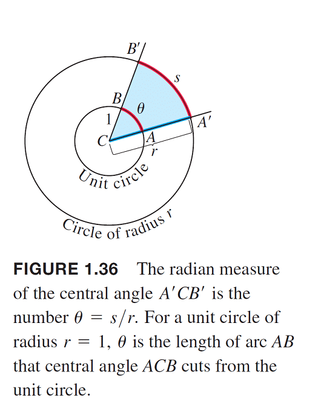
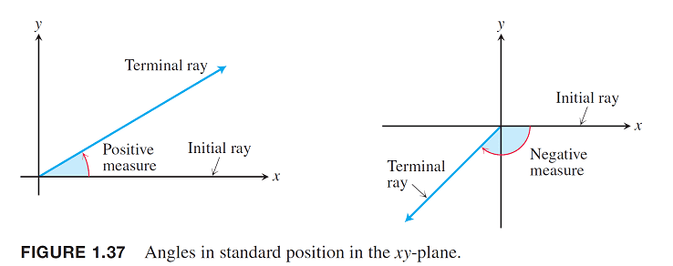
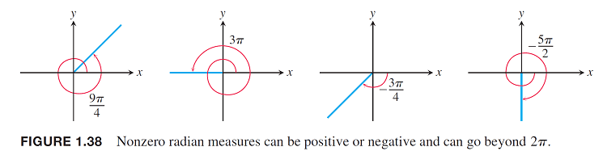
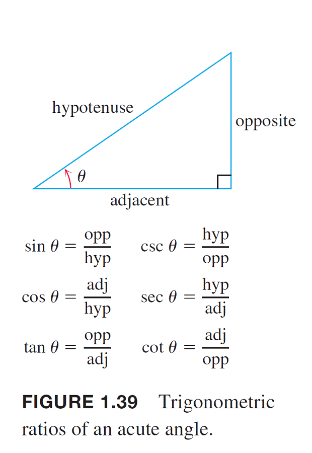
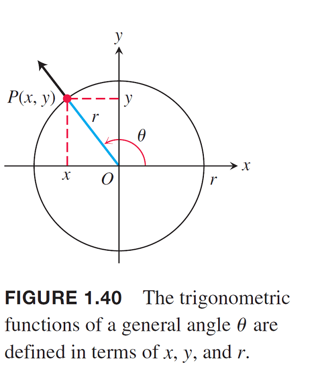
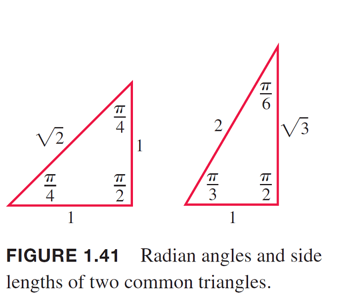

# 三角函數

## 徑度與弧度（radius and arc）

* 徑度\(radians\)等於弧長\(arc\)除以半徑\(radius\)
  ，$$\theta = \frac{s}{r}$$

### 角度與徑度的對應關係

* 徑度$$\pi$$等於角度$$180\degree$$。
* 一正圓內，角度$$0\degree \sim 180 \degree$$是以逆時鐘方向看，對應徑度$$0 \sim \pi$$。而角度$$0\degree \sim -180 \degree$$是以順時鐘方向看，對應徑度$$0 \sim -\pi$$。

## 三角函數

* hypotenuse: 斜邊，opposite: 對邊，adjacent: 鄰邊。

* $$\sin \theta = \frac{y}{r}$$, $$\cos \theta = \frac{x}{r}$$
* $$\tan \theta = \frac{y}{x}$$, $$\cot \theta = \frac{x}{y}$$
* $$\sec \theta = \frac{r}{x}$$, $$csc \theta = \frac{r}{y}$$

可得關係：

* $$\tan \theta =  \frac{\sin \theta} {\cos \theta}$$, $$\cot \theta = \frac{1}{\tan \theta} = \frac{\cos \theta} {\sin \theta}$$
* $$\sec \theta = \frac{1}{\cos \theta}$$, $$\csc \theta = \frac{1}{\sin \theta}$$

