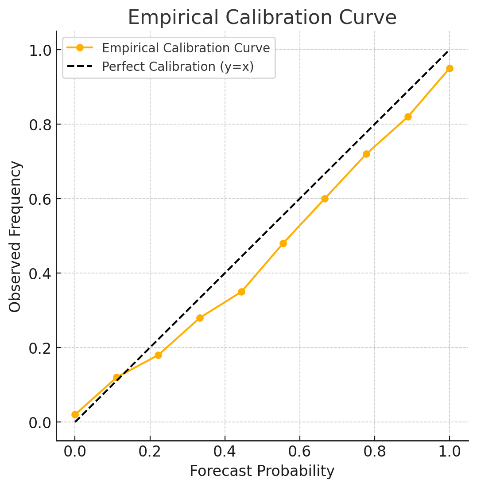

# The Well-Calibrated Bayesian

## 摘要

假設一個預測者依次為事件分配機率。如果例如他對某些事件分配了 30% 的機率，而這些事件在長期中實際發生的比例確實為 30%，那麼他就被認為是**良好校準的（well calibrated）** 。我們證明了一個定理，表明一個一致的貝氏預測者期望自己是良好校準的，並探討這對於一致性理論的潛在破壞性影響。

### 重點筆記

**註：**<mark style="background-color:red;">**calibration（校準）**</mark> <mark style="background-color:red;"></mark><mark style="background-color:red;">是指一個預測者的預測機率與實際結果的長期頻率相符的程度</mark>。在這篇文章中，校準是用來評估主觀機率預測（subjective probability forecasting）是否可靠的一個標準，特別是在序列預測（如每天預報天氣）的情境下。

總結衝突：若預測者是人，應像對待統計系統一樣，根據現實校準表現調整主觀機率Π，但這是不一致的。提出一致性與校準無法完全調和，建議類似古典假設檢驗的實證方法。

一致性是理性信念的基石，但若現實顯示誤校準，預測者無法在保持一致性的同時承認並修正這一點，導致理論與實踐脫節。例如天氣預報等序列預測中，經驗校準是評估預測品質的重要標準，但一致性理論無法解釋或容納校準失敗的情況。

Dawid 認為，一致的貝氏預測者在理論上無法接受自己可能誤校準，這是序列預測中一致性框架的侷限。<mark style="color:red;">他質疑純粹一致性理論的普適性，提出預測者應像科學家一樣，根據實證結果（如校準表現）調整信念，即使這意味著放棄嚴格一致性</mark>。這種衝突類似於貝氏主義與頻率主義的對立，Dawid 傾向於折衷，承認現實校準的重要性。

## 簡介

主觀機率預測已在美國的氣象學界廣泛應用（Murphy & Winkler, 1977）。氣象預報員常提供機率性天氣預測，例如：「今日丹佛降水機率為 30%。」這些機率反映的是預報員在當前資訊下的**主觀信念程度**，而非來自明確建模的客觀機率。這些資訊可能包括來自氣候分析或電腦預測系統的**客觀預測**，但不一定涉及明確的數學模型。

此類機率預測符合 Bayesian 概念（de Finetti, 1975），其中「一致的主觀貝氏學派」認為可以對所有可能觀察的資料建立聯合機率分佈。預<mark style="color:red;">測本質上是根據現有資訊對未觀察資料進行條件機率推斷</mark>。

雖然本文主要討論天氣預測，但這種方法適用於任何需要反覆進行機率預測的領域。

***

**機率預測的評估標準**

根據 Murphy & Epstein (1967)，機率預測可透過多種標準來評估，本文**專注於校準性（calibration）**，又稱<mark style="color:red;">**可靠性（reliability）**</mark>：

* 若在長期（理論上無限次）天氣預報中，針對所有「降水機率為 𝜃%」的日子，實際降水比例為 p，則繪製 p 對 𝜃 的圖表稱為<mark style="color:red;">**經驗校準曲線**</mark><mark style="color:red;">（empirical calibration curve）</mark>。
* 若曲線為對角線（即 p=𝜃），則預測被稱為<mark style="color:red;">**經驗上良好校準**</mark><mark style="color:red;">（empirically well calibrated）。</mark>
* 相同概念適用於<mark style="color:red;">**信賴區間預測**</mark><mark style="color:red;">（credible interval forecasts）</mark>，例如若 75% 可信區間長期內能精準覆蓋 75% 的真實值，則稱其為良好校準。

校準標準與**頻率派（frequentist）機率定義相似**，但不需假設恆定條件下的重複試驗。此外：

* 主觀機率預測通常不被解釋為客觀機率估計，而是事件發生的「指標」（indicator）。
* 傳統頻率派試圖透過選取「所有條件相同的日子」來界定「真實機率」，但此方法在實務上困難且主觀，因為不同預報員可能會對「相同條件」的定義產生分歧。

<figure><figcaption>
經驗校準曲線（Empirical Calibration Curve）。 實心線：表示某位預測員的經驗校準曲線。 虛線（y=x）：表示完美校準，即預測機率與實際發生率完全匹配。
</figcaption></figure>

***

**氣象預報員的校準與應用**

研究顯示**有經驗的氣象預報員通常校準良好**（Murphy & Winkler, 1977）。然而，<mark style="color:red;">良好校準並不意味著預測本身「優秀」，因為即使一個預測員</mark><mark style="color:red;">**只提供長期平均降水機率**</mark><mark style="color:red;">，仍然可能表現為良好校準。</mark>

其他研究（Lichtenstein et al., 1977）則發現部分預測結果校準較差。因此，有人建議（如 Cox, 1958）**對校準不佳的機率預測進行轉換**：

* 例如，若預測員對某天的降水機率估計為 30%，但歷史資料顯示這類預測日的實際降水率為 20%，則使用者應將該預測視為 20%。

不過，如何最佳利用他人的機率預測仍屬於獨立研究領域（Morris, 1974; Lindley et al., 1979）。

***

**預報員的視角與一致性問題**

本文探討**預報員如何看待自身的校準性**，並指出：

* 若預報員**具有一致性（coherence）**，則他應該期望自己是良好校準的。
* 這對「一致性理論」（coherence theory）產生挑戰，因為理論上，一致的貝氏預測員不應預期自己的機率預測會出現系統性偏差，但現實中部分預測員的校準性仍存問題。

這可能意味著，**即使在一致性框架下，仍可能需要機制來修正個別預測員的偏誤**，這是本文探討的重要議題之一。

### **重點整理**

1. **主觀機率預測** ：
   * 主觀機率預測已在氣象學家中廣泛應用，特別是在美國。
   * 預測員基於個人的主觀信念（degree of belief）提供機率，這些信念可能來自氣候分析或電腦預測系統。
2. **貝氏框架** ：
   * 貝氏主義者對所有可觀察量有一個聯合機率分佈。
   * 預測只是根據當前資訊總結未觀察到的條件分佈。
3. **校準標準** ：
   * 校準是指預測的機率是否與實際發生的頻率一致。
   * 如果預測的降雨機率為 30%，而實際降雨的比例也接近 30%，則預報員是良好校準的。
4. **經驗校準曲線** ：
   * 繪製預測機率與實際發生比例的關係曲線。
   * 如果曲線接近對角線，則預報員是良好校準的。
5. **信賴區間校準** ：
   * 信賴區間預測的校準要求預測的覆蓋率與宣告的機率一致（例如 75% 的可信區間應覆蓋 75% 的實際值）。
6. <mark style="color:red;">**校準 vs. 客觀機率**</mark> <mark style="color:red;"></mark><mark style="color:red;">：</mark>
   * <mark style="color:red;">校準標準不依賴於重複試驗或客觀機率。</mark>
   * <mark style="color:red;">主觀機率更適合視為對事件本身的估計，而非對「真實」機率的估計。</mark>
7. **經驗結果** ：
   * Murphy 和 Winkler 發現經驗豐富的預報員通常是良好校準的。
   * 校準不佳的預測可能需要調整（例如將 30% 的機率調整為 20%）。
8. **一致性與校準的矛盾** ：
   * 如果預報員是一致的，則他相信自己是良好校準的。
   * 這對一致性理論提出了挑戰，因為現實中可能存在校準失敗的情況。

***

## **獨立性與回饋**

* **獨立性假設問題** ：傳統方法假設不同事件是相互獨立的，但這可能不適用於序列預測（如天氣預報）。<mark style="color:red;">序列預測中，預測者會根據過去的經驗與結果調整未來的預測</mark>。
* **反饋效應** ：預測者每天都會根據截至今天的累積經驗進行明天的預測（例如是否下雨）來更新自己的預測模型。
* Harrison（1977)**的結論** ：認為潛在的未校準個體不可能保持一致性，因為他們無法完全信任未來的主觀機率分配。

數學結構如下。預測依序在第 0、1、2、... 天進行，每個預測指的是下一日可觀測到結果的事件或數量。

令$$\mathcal{B}_i$$為預測者在第$$i$$已知的資訊(σ代數，natural filtration)，可得$$\mathcal{B}_0 \subseteq \mathcal{B}_1 \subseteq \dots$$。

預測者的主觀機率分佈$$\Pi$$定義在$$\mathcal{B}_\infty =\bigcup_{i=0}^\infty \mathcal{B}_i$$上。預測者在第$$i-1$$日以條件機率$$\Pi(\cdot~|~ \mathcal{B}_{i-1})$$預測定義在$$\mathcal{B}_{i}$$上的事件或數量(註：以現在的所有知識估計未來事件的機率)。

令$$X_i$$為$$\mathcal{B}_i$$可測的數量$$i \in \mathbb{N}$$，例如台北第$$i$$日的最高氣溫，且令$$m_i$$為預測者在$$i-1$$日對$$X_i$$分佈評估的中位數。

令$$S_i$$為$$X_i > m_i$$的事件，則依定義$$\Pi(S_i ~|~ \mathcal{B}_{i-1})=\Pi(X_i > m_i ~|~ \mathcal{B}_{i-1})=1/2$$(預測者在$$i-1$$日對事件$$S_i$$的條件機率，因為$$m_i$$為$$X_i$$分佈的中位數，因此$$X_i > m_i$$的機率為1/2)。

* 因為$$(S_1, S_2, \dots, S_{i-1}) \in \mathcal{B}_{i-1}$$，而$$\Pi$$是預測者對所有可觀測量的聯合分佈。根據一致性（coherence），$$\Pi$$必須滿足機率的基本性質，例如條件機率的定義和馬可夫性質（在序列預測中）。
* 根據 Pratt (1962) 的結果，這些$$S_i$$在$$\Pi$$下是獨立的，且每個$$\Pi(S_i)=1/2$$。因為每次預測的中位數$$m_i$$是基於$$\mathcal{B}_{i-1}$$計算的，而$$S_i$$的機率完全由條件分佈$$\Pi(\cdot|\mathcal{B}_{i-1})$$決定。在一致的框架下，過去的結果$$(S_1, S_2, \dots, S_{i-1})$$不會改變中位數定義的基本性質，因此$$S_i$$與過去的$$S_j, j<i$$獨立。
* 如果預測者是「well-calibrated」（校準良好的），那麼長期來看，事件$$S_i$$發生的比例應該接近他預測的機率1/2。例如，若他預測了 1000 天，其中每天$$X_i > m_i$$的機率都是1/2，那麼大約 500 天應該滿足這個條件。
* 若實際上有 80% 的天數$$X_i$$超過$$𝑚_i$$，則預測者的校準顯然失敗，這與他認為自己機率1/2的預測相矛盾。這揭示了 coherence 和 calibration 之間的潛在衝突。

## **通用的校準定理**

在本節中，我們提出一個非常通用的結果，進一步擴展了前述關於一致性（coherence）與校準（calibration）之間的聯繫。我們再次假設預測是根據一個固定的機率分佈\
$$\Pi$$按序列進行的，但不再做其他假設。

對於每一天$$𝑖$$，我們有一個相關的事件$$S_i \in \mathcal{B}_i$$，例如第$$i$$天的降雨事件(註：第$$i$$天才發生的事件在事前無法精確得知，只能估計)。

以$$Y_i$$做為$$S_i$$的指標(indicator)，且$$\hat{Y}_i = \Pi(S_i ~|~ \mathcal{B}_{i-1}) = \mathrm{E}(S_i ~|~ \mathcal{B}_{i-1})$$，即在第$$(i-1)$$日對$$S_i$$的機率預測。

比較預測與現實的一種方法是選出某個相當隨意的測試集合，並在該集合中比較：

1. 相關事件實際發生的日子比例$$p$$。
2. 與這些日子平均預測機率$$\pi$$。形式上，我們引入指示變數$$\xi_1, \xi_2, \dots$$由預測者自行選擇，來表示某特定日子$$i$$ 是否包含在測試集合中：若包含，則$$\xi_i=1$$，；若不包含，則$$\xi_i=0$$。

我們可以事先一次性選定測試集合。然而，允許$$\xi_i$$按序列逐步確定是一個有用的擴展；因此，是否包含第$$i$$天的決定只需在第$$(i−1)$$天做出，並可根據截至第$$(i−1)$$ 天的知識任意決定。形式上，$$\xi_i$$必須是$$\mathcal{B}_{i-1}$$-可測的（measurable）。除此之外，對測試集合的日子選擇沒有限制。我們稱這種選擇過程為<mark style="color:red;">「可接受的」（admissible）</mark>。

整理：

* $$S_i$$：第$$i$$ 天的某事件（如降雨），屬於$$\mathcal{B}_i$$可測（第$$𝑖$$ 天可知資訊，在發生之前無法得知）。
* $$Y_i$$：$$S_i$$的指標（事件發生為 1，未發生為 0）。
* $$\hat{Y}_i=\Pi(S_i| \mathcal{B}_{i-1})$$：第$$i-1$$天對$$S_i$$的預測機率。
* $$\xi_i$$：指示第$$i$$天是否被選入測試集合，必須基於$$\mathcal{B}_{i-1}$$（即前一天資訊）決定，稱為「可接受的」（admissible），不可依賴於未來的資訊(即不可依賴於$$\mathcal{B}_j, ~j \geq i$$)。

限定在截至第$$k$$天被選入測試集合的日子中：

* $$\displaystyle v_k=\sum_{i=1}^k \xi_i$$，為被選入測試集日子數量。
* $$\displaystyle p_k = \frac{\sum_{i=1}^k \xi_i Y_i}{v_k}$$，為相關事件實際發生的比例。
* $$\displaystyle \pi_k = \frac{\sum_{i=1}^k \xi_i \hat{Y}_i}{v_k}$$，為平均預測機率。

則有以下定理：

> **定理**：一致預測者的預測機率長期會與實際頻率吻合
>
> 假設預測是根據一致的主觀機率分佈 $$\Pi$$序列進行的，並且沒有其他假設。
>
> 設選擇過程$$\{\xi_i\}$$ 是可接受的(選擇樣本只依歷史資訊，不會用到未來的事件)。以$$\Pi$$機率 1，若$$v_k \to \infty$$，則$$p_k - \pi_k \to 0$$。
>
> 長期來看，實際發生比例$$𝑝_𝑘$$平均預測機率$$\pi_k$$的差異會趨於 0(以預測者的主觀機率分佈\
> Π 的機率 1）。
>
> 這個定理不僅限於天氣預報，而是適用於所有序列主觀機率預測的情境。
>
> 若觀察時間有限（$$v_k$$不趨於無窮），結論不保證。

proof: 鞅（martingale）收斂定理和 Kronecker 引理

**鞅（Martingale）構造** ：通過構造一個鞅序列，利用其收斂性證明極限行為。

因為$$Y_i - \hat{Y}_i$$是偏差量，其條件期望值為0(因為$$\hat{Y}_i$$是最佳預測)。將其加權累加($$U_k$$)形成鞅，其性質保證偏差不會無限放大，而是穩定下來。

**變異數控制** ：通過控制鞅的**變異數**，確保其收斂。$$\beta_i=1/v_i$$隨$$v_i$$增加而減小，後期偏差的貢獻越來越小。變異數有界$$\pi^2/24$$，確保波動不會失控，鞅收斂定理保證$$U_k$$有極限。

**Kronecker引理** ：將鞅的收斂性轉化為目標結論 Pk​−πk​→0。

給定輔助變數$$\beta_i= \begin{cases} \frac{1}{v_i},& \text{ if } v_i = \sum_{j=1}^i \xi_j > 0, \\ 0,& \text{ if } v_i = 0. \end{cases}$$是截至第$$i$$天選入測試集日期數量的倒數，用以標準化計算。

令$$X_i = \beta_i \xi_i (Y_i - \hat{Y}_i)$$：

* $$Y_i -\hat{Y}_i$$是實際結果與預測機率的偏差。
* $$\xi_i$$決定是否選入當日(1或0)。
* $$\beta_i$$調整權重，使選入的日期數增加而減小。

***

定義$$U_k = \sum_{i=1}^k X_i$$，要證明$$U_k$$為鞅序列。

因為$$\beta_i, \xi_i, \hat{Y}_i$$都是$$\mathcal{B}_{i-1}$$可測(基於第$$i-1$$日的資訊，已知)，且$$\hat{Y}_i   = \mathrm{E}(Y_i | \mathcal{B}_{i-1})$$。

所以$$\mathrm{E}(Y_i - \hat{Y}_i| \mathcal{B}_{i-1}) =  \mathrm{E}(Y_i | \mathcal{B}_{i-1}) - \mathrm{E}(\hat{Y}_i| \mathcal{B}_{i-1}) =  \mathrm{E}(Y_i | \mathcal{B}_{i-1}) - \hat{Y}_i =  \hat{Y}_i - \hat{Y}_i = 0$$。

可得$$\mathrm{E}(X_i|\mathcal{B}_{i-1})=\beta_i \xi_i \cdot 0 = 0$$&#x20;

$$\mathrm{E}(U_k | \mathcal{B}_{k-1})= U_{k-1} + \mathrm{E}(X_k | \mathcal{B}_{k-1}) = U_{k-1} + 0 = U_{k-1}$$，因此$$\{U_k\}$$為相對於flibration $$\{\mathcal{B}_k\}$$的martingle。

***

計算$$U_k$$的二階動差並證明有界性

$$\mathrm{E}(X_i^2) = \mathrm{E}((\beta_i \xi_i)^2 (Y_i - \hat{Y}_i)^2)$$，因為$$\beta_i, \xi_i, \hat{Y}_i$$都是$$\mathcal{B}_{i-1}$$可測，由重複期望值定理可得：$$\begin{aligned} \mathrm{E}(X_i^2) &= \mathrm{E}(\mathrm{E}((\beta_i \xi_i)^2 (Y_i - \hat{Y}_i)^2~|~ \mathcal{B}_{i-1})) \\ & = \mathrm{E}((\beta_i \xi_i)^2  \mathrm{E}((Y_i - \hat{Y}_i)^2~|~ \mathcal{B}_{i-1})  ) \\ & = \mathrm{E}((\beta_i \xi_i)^2  \mathrm{Var}(Y_i ~|~ \mathcal{B}_{i-1})  ) \\  \end{aligned}$$

因為$$Y_i$$取值為0或1，因此變異數最大值為1/4，$$\mathrm{Var}(Y_i| \mathcal{B}_{i-1}) = \hat{Y}_i (1- \hat{Y}_i) \leq 1/4$$。

可得$$\mathrm{E}(X_i^2) \leq \mathrm{E}((\beta_i \xi_i)^2 \cdot 1/4) = \frac{1}{4} \mathrm{E}((\beta_i \xi_i)^2)$$

得總和變數量$$\mathrm{E}(U_k^2) = \sum_{i=1}^k \mathrm{E}(X_i^2) \leq  \frac{1}{4} \mathrm{E}( \sum_{i=1}^k(\beta_i \xi_i)^2)$$--(1)

由於$$\xi_i$$取值也為0或1，所以$$(\beta_i \xi_i)^2 = \begin{cases} (\beta_i)^2, & \text{ if } \xi_i = 1, \\ 0, & \text{ if } \xi_i = 0. \end{cases}$$

其中非零項的序列如$$1, (1/2)^2, (1/3)^2, \dots$$

可得不等式$$\sum_{i=1}^k (\beta_i \xi_i)^2 \leq \sum_{n=1}^\infty \frac{1}{n^2} = \pi^2/6$$--(2)

由(1,2)得$$\mathrm{E}(U_k^2) \leq \frac{1}{4} \cdot \frac{\pi^2}{6} = \frac{\pi^2}{24}$$，因此有上界且獨立於$$k$$，即變異數有界(可控)--(3)。

因為$$\{U_k\}$$為martingle且$$\mathrm{E}(U_k^2)$$有界，由martingle convergence theorem得$$U_k$$幾乎必然（almost surely）收斂到某有限極限。

因此以$$\Pi$$機率1，$$U_k = \sum_{i=1}^k \beta_i \xi_i (Y_i -\hat{Y}_i)$$收斂。--(4)

***

應用 Kronecker 引理

**Kronecker 引理**（Feller 1971）：若 $$\sum a_i$$ 收斂，且 $$\{b_i\}$$ 單調趨於 0，則 $$b_k \sum_{i=1}^k a_i \to 0$$。此處：

* $$a_i = \xi_i(Y_i - \hat{Y}_i)$$，$$U_k = \sum_{i=1}^k \beta_i a_i$$收斂。
* $$b_k = \beta_k =\frac{1}{v_k}$$ (若$$v_k >0$$)，當$$v_k \to \infty$$時，$$\beta_k$$單調趨近於0。
* 因此$$p_k - \pi_k = \frac{1}{v_k} \sum_{i=1}^k \xi_i (Y_i - \hat{Y}i)=\beta_kU_k \to 0$$ (以$$\Pi$$機率1)。

因此當$$v_k \to 0$$，$$p_k - \pi_k \to 0$$幾乎必然成立。

注意，如果$$\xi_i$$依賴於$$Y_i$$(not admissible)，則$$\mathrm{E}(X_i| \mathcal{B}_{i-1}) \neq 0$$，martingle性質不成立，結論可能失效。

(QED)

若允許$$\xi_i$$依賴於$$Y_i$$(根據事件是否發生來選擇日子)，則此結果一般不成立，因為這樣可以強制$$p_k=0$$(人為操縱結果)。

<mark style="background-color:red;">這個定理的目的在於從數學上證明並闡述一個一致的貝氏預測者（即其機率分佈Π 遵循機率論規則）在序列預測中預期自己是校準良好的（well-calibrated）</mark>。

定理展示了「一致性」（coherence，指預測者的主觀機率分佈Π 符合機率論公理）與「校準」（calibration，指預測機率與實際頻率長期一致）之間的理論聯絡。它表明，若預測者是一致的，他的主觀分佈Π 認為誤校準（miscalibration，即$$𝑝_k$$長期偏離$$\pi_k$$）的機率為 0。

定理不限定具體事件或假設，只需預測基於固定分佈Π並按序列進行，因此適用於各種主觀機率預測場景（如天氣預報、經濟預測等）。

例如：天氣預報員每天預測明天有 30% 機率下雨，然後挑出所有他預測 30% 的日子（假設有很多天），定理說，根據他的信念（Π），這些日子中實際下雨的比例應該趨近 30%。這就像他相信自己的預報長期是「準的」，但現實是否如此，定理不保證——這也是論文反思的重點。

### 主觀分佈Π 與實際分佈𝑃不同時仍收斂

結論在預測者的主觀機率分佈Π 與實際事件的機率分佈（假設存在一個客觀分佈P）不同的情況下仍然成立，但前提是Π 必須滿足一致性（coherence）。這一點是理解定理及其與現實衝突的關鍵。

只要Π 符合機率論規則（非負性、規範化、可加性、條件機率規則），證明中的鞅性質和收斂結論就成立。

證明的關鍵是$$\hat{Y}_i=\mathrm{E}_{\Pi}(Y_i ~|~ \mathcal{B}_{i-1})$$(在$$\Pi$$的條件期望下)，而$$\mathrm{E}_{\Pi}(\xi_i(Y_i - \hat{Y}_i) ~|~ \mathcal{B}_{i-1})=0$$(因為$$\xi_i$$是$$\mathcal{B}_{i-1}$$可測)，這不涉及實際分佈$$P$$。這種信念是Π 內部的，不需要$$\Pi$$與現實吻合。

定理描述的是在Π 所定義的「主觀世界」中，$$p_k$$（作為隨機變數）長期趨近於$$\pi_k$$。這裡的$$Y_i$$雖然是實際觀測結果，但證明分析的是$$Y_i$$在$$\Pi$$下的行為($$𝑌_i$$的實際值由現實決定，但其統計性質（如期望、變異數）是按\
$$\Pi$$評估的。)，而不是在$$P$$下的行為。

若存在一個客觀分佈$$𝑃$$（即$$𝑌_i$$的真實生成分佈），且$$P \neq \Pi$$，則在$$P$$測度下，$$p_k$$可能收斂到與$$\pi_k$$相異值。但這不影響定理，因為定理只關心Π-機率，而非P-機率。

假設天氣預報員預測下雨：

* **主觀分佈** $$\Pi$$：他認為每天降雨機率固定為 30%（$$\hat{Y}_i = 0.3$$），且 $$\Pi$$ 是一致的。
* **實際分佈**$$P$$：真實世界中，每天降雨機率是 50%（$$P(S_i) = 0.5$$）。
* **測試**：選所有日子（$$\xi_i = 1$$），$$v_k = k$$。
  * $$\pi_k = 0.3$$（固定）。
  * 在 $$\Pi$$ 下，$$p_k \to 0.3$$（以 $$\Pi$$-機率 1），他相信自己校準良好。
  * 但在 $$P$$ 下，$$p_k \to 0.5$$（以$$P$$-機率 1），實際頻率偏離。

**定理成立**：在 $$\Pi$$ 的信念中，$$p_k - \pi_k \to 0$$，因為證明只依賴 $$\Pi$$的內部一致性。\
**現實衝突**：在$$P$$ 下，$$p_k - \pi_k \to 0.5 - 0.3 = 0.2$$，顯示誤校準，但這不影響定理的結論。

**定理的局限**：定理只證明了預測者的主觀信念（$$\Pi$$-機率 1 下校準良好），但不保證現實中的校準性。如果 $$\Pi \neq P$$，實際頻率可能偏離預測機率。

### 預測者如何檢查與實際分佈的符合性？

1. 觀察經驗校準曲線（Empirical Calibration Curve）
2. 使用統計方法（如卡方檢驗或 Kolmogorov-Smirnov 檢驗）比較$$p_k$$與$$\pi_k$$是否顯著不同。
3. 重新校準（Recalibration），但序列預測中重新校準與一致性衝突，因為過去經驗已包含在\
   Π 中，調整會破壞內部邏輯。解決方案：放棄嚴格一致性，採用實證方法。
4. 外部驗證與模型比較：將Π 的預測與其他來源（如氣象模型、專家意見）或實際結果進行比較。若\
   Π 預測偏離現實或不如其他模型，可懷疑Π 不準確。
5. 長時間觀察與反饋：持續觀察$$p_k$$與$$\pi_k$$的差異，隨著數據增加，若偏差持續存在，表明Π 不符\
   合P。利用反饋更新信念。

### 一致性(coherence)

一致性（Coherence）在機率預測和主觀機率的背景下，是指個人的機率評估必須滿足某些基本的邏輯和數學條件，以確保這些評估在內部是一致的且沒有矛盾。具體來說，一致性要求個人對事件的主觀機率分配遵循機率論的基本規則。

一致性是從 de Finetti 等主觀機率學派的理論中借來的，指的是預測者的機率賦值（probability assignments）應該是「理性的」。以下是幾個關鍵點：

1. **無荷蘭賭（No Dutch Book）** ：如果一個人的機率評估是一致的，那麼就不應該存在一種賭博組合（即所謂的“荷蘭賭”），使得無論結果如何，這個人總是輸錢。換句話說，一致性確保了個人的賭注行為不會導致必然的財務損失。
2. **機率法則** ：一致性的機率評估必須符合機率論的標準規則，例如：
   * 機率值必須在0到1之間。
   * 必然事件的機率為1，不可能事件的機率為0。
   * 如果兩個事件互斥，那麼它們的聯合機率等於各自機率之和。
3. **條件機率** ：一致性還涉及條件機率的正確應用。例如，如果一個事件A在已知事件B的條件下發生的機率是P(A|B)，那麼這個機率評估也必須與其他相關事件的機率評估保持一致。
4. **貝氏更新** ：當新的資訊到達時，一致性的機率評估需要通過貝氏定理進行適當的更新，以保持與新資訊的一致性。
5. **理性行為** ：從決策理論的角度來看，一致性反映了理性行為。它假設個體根據其當前資訊做出最優選擇，並且這些選擇在邏輯上是自洽的。

總之，一致性是一種最低限度的要求，確保個人的主觀機率評估在邏輯上合理、無矛盾，並且符合機率論的基本原則。它是建構可靠和可信的機率預測的基礎。

### 一致性在本文中的具體含義

**序列預測中的一致性**：文章假設預測者有一個固定的主觀機率分佈$$\Pi$$，涵蓋所有可觀測量，並按序列做出預測。例如，第$$(i-1)$$天預測第 $$i$$ 天的事件 $$S_i$$​，機率為 $$\Pi(S_i | \mathcal{B}_{i-1})$$。一致性要求這些條件機率與 $$\Pi$$ 的整體結構相符，不能自相矛盾。

<mark style="background-color:red;">文章的核心論點是，一致的預測者預期自己是校準良好的（well-calibrated），如上定理所述</mark>。但這也帶來悖論：一致性要求$$\Pi$$給予誤校準（miscalibration）的機率為 0，即使現實中可能發生。

簡單的說，一致性就像是預測者的「內在邏輯性」：

* 如果他說某事有 30% 的機率發生，他不能同時說相反的事有 80% 的機率（因為總和不能超過 100%）。
* 他的所有預測必須像一個完整的拼圖，彼此吻合，不能有漏洞。
* 在賭博比喻中，他定的機率得讓人無法設計出一個「必輸」的賭局來坑他。

## 應用

上述的的定理是一個通用的數學結果，描述了一致的貝氏預測者（coherent Bayesian forecaster）在序列預測中預期自己長期校準良好的性質，而在此則具體展示了如何將這個定理應用到不同情境中，進一步闡釋其含義與實用性。

### **經驗校準(empirical Calibration)**

**目標：**&#x5177;體探討「經驗校準」（empirical calibration），即預測機率與實際發生頻率的長期一致性。以天氣預報為例，驗證預測者是否能在特定機率值（如ω）附近保持校準。

經驗校準是衡量預測者表現的直觀標準，例如天氣預報員說「降雨機率 30%」的日子，長期應有約 30% 下雨。定理表明，一致的貝氏預測者（coherent Bayesian）主觀認為自己必然滿足這種校準，因為$$\Pi$$給予誤校準的機率為 0。

給定固定的目標機率值 $$\omega \in (0,1)$$，與允許偏差範圍$$\delta > 0$$，並定義$$\xi_i = 1$$，若且唯若$$|\hat{Y}_i - \omega| \leq \delta$$，即在第$$i$$天滿足誤差條件時，選入測試集合中。

也就是說，我們的測試日子集合僅包括那些相關事件的評估機率與某個給定值 $$\omega$$ 足夠接近的日子。這是可接受的（admissible），因為決定 $$\xi_i$$​ 的條件可以在第 $$(i-1)$$天確定。對於這種選擇，$$|\pi_k - \omega| \leq \delta$$。因此，由定理可知，以 $$\Pi$$-機率 1，假設選擇條件被無窮多次滿足，則對於所有足夠大的$$k$$，$$p_k$$​ 將接近$$\omega$$。換句話說，一致的序列預測者相信他將會是經驗上校準良好的（empirically well calibrated）。

進一步的擴展是，當選擇$$\xi_i = 1$$ 時，條件為$$|\hat{Y}_i - \omega| \leq \delta_i$$​，其中$$\delta_i$$ 可以依據截至第 $$(i-1)$$天的資訊而變動，且$$\delta_i \to 0$$。結論是，以 $$\Pi$$-機率 1，若選中的日子序列是無窮的，則 $$p_k \to \omega$$。

### 範例：天氣預報

假設一位天氣預報員每天根據當前資訊（如氣象數據、歷史記錄）預測下一天下雨的機率。我們用這個例子來測試他的校準性。

預報員每天給出降雨機率（如 25% 到 35%）。挑出他說「大約 30%」的日子，看實際下雨比例。如果他是一致的（coherent），定理預測長期下雨比例會接近 30%，就像他在 200 天中得到 32% 或 30% 的結果。若實際比例偏離（如 50%），則可能暗示他的主觀機率 Π 與現實不符，這是論文後續討論的衝突點。

**情境設定**

* **預測任務**：預報員每天（第 $$i-1$$ 天）預測第 $$i$$ 天是否下雨，給出機率 $$\hat{Y}_i = \Pi(S_i | \mathcal{B}_{i-1})$$，其中 $$S_i$$​ 是「第 $$i$$ 天下雨」的事件。
* **觀察期間**：假設我們觀察了 1000 天（$$k=1000$$）。
* **目標機率**：設 $$\omega = 0.3$$（30%），即我們想檢查他預測 30% 下雨機率的日子是否校準良好。
* **偏差範圍**：設 $$\delta = 0.05$$，即選出 $$\hat{Y}_i$$ 在 25% 到 35% 之間的日子（$$|\hat{Y}_i - 0.3| \leq 0.05$$）。

**選擇測試日子**：

* 定義$$\xi_i = 1$$，當 $$0.25 \leq \hat{Y}_i \leq 0.35$$；否則 $$\xi_i = 0$$。
* 假設在 1000 天中，有 200 天滿足這個條件（即 $$v_{1000} = 200$$）。這些日子是測試集合。

**計算平均預測機率 πk\pi\_kπk​**：

* 假設這 200 天的 $$\hat{Y}_i$$ 值分佈均勻在 0.25 到 0.35 之間，平均值為： $$\pi_{1000} = \frac{1}{200} \sum_{i: \xi_i=1} \hat{Y}_i \approx \frac{0.25 + 0.35}{2} = 0.3$$。
* 實際上，$$\pi_{1000}$$可能略有偏差，但因 $$|\hat{Y}_i - 0.3| \leq 0.05$$，$$\pi_{1000}$$ 在 0.25 到 0.35 之間，這與 $$|\pi_k - \omega| \leq \delta$$ 一致。

**計算實際下雨比例** $$p_k$$**​**：

* 記錄這 200 天中實際下雨的天數。假設有 64 天真的下雨（根據 $$Y_i = 1$$）。
* 則： $$p_{1000} = \frac{1}{200} \sum_{i: \xi_i=1} Y_i = \frac{64}{200} = 0.32$$。
* 實際頻率 $$p_{1000} = 0.32$$，接近 $$\pi_{1000} \approx 0.3$$。
* **驗證定理**：
  * 定理預測：若 $$v_k \to \infty$$，則 $$p_k - \pi_k \to 0$$。
  * 這裡 $$v_{1000} = 200$$ 雖然不是無窮，但已足夠大。$$p_{1000} - \pi_{1000} = 0.32 - 0.3 = 0.02$$，偏差很小，趨近於 0。
  * 若觀察更長時間（如 10,000 天，選出 2000 天），偏差可能進一步縮小，例如$$p_k = 0.305$$，更接近 0.3。

擴展對應

**動態** $$\delta_i$$**​**：若我們進一步要求更精確，例如 $$\delta_i = 0.05, 0.04, 0.03, \ldots$$逐步縮減，只選 $$\hat{Y}_i$$​ 越來越接近 0.3 的日子：

* 假設最終只選$$\hat{Y}_i = 0.3$$的日子，找到 100 天，其中 31 天下雨。
* $$p_{100} = 31/100 = 0.31$$，仍接近 0.3，且隨時間更精確。
* 這對應理論的擴展：若 $$delta_i \to 0$$，$$p_k \to \omega$$。

### 可變事件校準(v**ariable Event Calibration)**

可變事件校準」（variable event calibration），即事件$$S_i$$不是固定的，而是由預測者在預測時動態選擇的情況。

例如，天氣預報員每天給出「75% 機率溫度在 63°F 至 67°F 之間」，長期應有 75% 的日子滿足此預測。

$$X_i$$為台北第$$i$$天的最高溫度。預測者基於$$\mathcal{B}_{i-1}$$(前一天的資訊)計算$$X_i$$的條件分佈，並構造一個75%的信賴區間$$A_i$$。

定義$$S_i="X_i \in A_i"$$，事件定義為$$X_i$$落在該區間中。需確保$$S_i$$的定義不依賴當天結果$$Y_i$$，否則可能違反「可接受性」條件。

$$\hat{Y}_i=\Pi(S_i|\mathcal{B}_{i-1})=0.75$$，因為$$A_i$$為75%的信賴區間。

乍看之下，$$S_i$$是動態選擇的，似乎超出定理範圍。但因$$S_i$$在第$$𝑖$$ 天確定並屬於$$\mathcal{B}_i$$\
，且$$\hat{Y}_i$$基於$$\mathcal{B}_{i-1}$$，仍滿足定理的條件（$$\xi_i$$可接受性）。

唯一要求是$$S_i$$的選擇在第$$i$$天之前完成（例如在第$$𝑖−1$$天根據條件分佈確定\
$$A_i$$），這在例子中已滿足。

#### 實際範例：天氣預報員的溫度可信區間預測

假設一位天氣預報員每天預測下一天的最高溫度，並給出一個 75% 可信區間（credible interval），我們用這個例子來測試他的校準性。

**情境設定**

* **預測任務**：預報員每天（第 i−1i-1i−1 天）根據當前資訊 Bi−1\mathscr{B}\_{i-1}Bi−1​（如氣象模型、歷史數據）預測第 iii 天丹佛的最高溫度 XiX\_iXi​，並給出一個 75% 可信區間 AiA\_iAi​。
* **事件定義**：Si="Xi∈Ai"S\_i = "X\_i \in A\_i"Si​="Xi​∈Ai​"，即實際溫度落在預測區間內。
* **預測機率**：因 AiA\_iAi​ 是 75% 可信區間，Y^i=Π(Si∣Bi−1)=0.75\hat{Y}\_i = \Pi(S\_i | \mathscr{B}\_{i-1}) = 0.75Y^i​=Π(Si​∣Bi−1​)=0.75。
* **觀察期間**：假設觀察 1000 天（k=1000k = 1000k=1000）。
* **選擇過程**：為簡單起見，設 ξi=1\xi\_i = 1ξi​=1（選入所有日子），即測試整個序列的校準性。

**步驟**

1. **構造可信區間**：
   * 假設預報員根據 Π(⋅∣Bi−1)\Pi(\cdot | \mathscr{B}\_{i-1})Π(⋅∣Bi−1​) 計算 XiX\_iXi​ 的條件分佈（例如正態分佈）。
   * 每天給出 AiA\_iAi​，例如：
     * 第 1 天：A1=\[62°F,68°F]A\_1 = \[62°F, 68°F]A1​=\[62°F,68°F]，預測 X1X\_1X1​ 有 75% 機率在此區間。
     * 第 2 天：A2=\[60°F,66°F]A\_2 = \[60°F, 66°F]A2​=\[60°F,66°F]，依此類推。
   * AiA\_iAi​ 隨當天資訊（如季節、天氣模式）動態調整。
2. **記錄實際結果**：
   * 觀察 1000 天，每天記錄 XiX\_iXi​ 是否落在 AiA\_iAi​ 內：
     * 若 Xi∈AiX\_i \in A\_iXi​∈Ai​，則 Yi=1Y\_i = 1Yi​=1；否則 Yi=0Y\_i = 0Yi​=0。
   * 假設在 1000 天中，有 760 天滿足 Xi∈AiX\_i \in A\_iXi​∈Ai​（即 Yi=1Y\_i = 1Yi​=1 的天數為 760）。
3. **計算平均預測機率 πk\pi\_kπk​**：
   * 每一天 Y^i=0.75\hat{Y}\_i = 0.75Y^i​=0.75（因構造時固定為 75% 可信區間）。
   * ξi=1\xi\_i = 1ξi​=1（全選），則： π1000=11000∑i=11000ξiY^i=11000∑i=110000.75=0.75\pi\_{1000} = \frac{1}{1000} \sum\_{i=1}^{1000} \xi\_i \hat{Y}\_i = \frac{1}{1000} \sum\_{i=1}^{1000} 0.75 = 0.75π1000​=10001​i=1∑1000​ξi​Y^i​=10001​i=1∑1000​0.75=0.75
4. **計算實際比例 pkp\_kpk​**：
   * v1000=∑i=11000ξi=1000v\_{1000} = \sum\_{i=1}^{1000} \xi\_i = 1000v1000​=∑i=11000​ξi​=1000（選入所有 1000 天）。
   * p1000=11000∑i=11000ξiYi=7601000=0.76p\_{1000} = \frac{1}{1000} \sum\_{i=1}^{1000} \xi\_i Y\_i = \frac{760}{1000} = 0.76p1000​=10001​∑i=11000​ξi​Yi​=1000760​=0.76。
   * 實際比例 76%，接近 75%。
5. **驗證定理**：
   * 定理預測：若 vk→∞v\_k \to \inftyvk​→∞，則 pk−πk→0p\_k - \pi\_k \to 0pk​−πk​→0。
   * 這裡 v1000=1000v\_{1000} = 1000v1000​=1000 已相當大，p1000−π1000=0.76−0.75=0.01p\_{1000} - \pi\_{1000} = 0.76 - 0.75 = 0.01p1000​−π1000​=0.76−0.75=0.01，偏差很小。
   * 若觀察更長時間（如 10,000 天，假設 7550 天落在區間內），則 p10000=0.755p\_{10000} = 0.755p10000​=0.755，更接近 0.75。
6. **結論**：
   * 在這個例子中，預報員預測 75% 可信區間的日子，實際有 76% 的日子溫度落在區間內，接近 75%，顯示他大致校準良好。
   * 這符合 4.2 節的論述：以 Π\PiΠ-機率 1，pk→0.75p\_k \to 0.75pk​→0.75，預報員預期他的可信區間預測長期校準。

***

#### 更現實的模擬數據

假設部分具體數據如下：

* 第 1 天：A1=\[62°F,68°F]A\_1 = \[62°F, 68°F]A1​=\[62°F,68°F]，X1=65°FX\_1 = 65°FX1​=65°F，Y1=1Y\_1 = 1Y1​=1。
* 第 2 天：A2=\[60°F,66°F]A\_2 = \[60°F, 66°F]A2​=\[60°F,66°F]，X2=58°FX\_2 = 58°FX2​=58°F，Y2=0Y\_2 = 0Y2​=0。
* 第 3 天：A3=\[64°F,70°F]A\_3 = \[64°F, 70°F]A3​=\[64°F,70°F]，X3=66°FX\_3 = 66°FX3​=66°F，Y3=1Y\_3 = 1Y3​=1。
* ……
* 總計 1000 天，760 天 Yi=1Y\_i = 1Yi​=1。

計算：

* π1000=0.75\pi\_{1000} = 0.75π1000​=0.75（固定）。
* p1000=0.76p\_{1000} = 0.76p1000​=0.76。

偏差 0.76−0.75=0.010.76 - 0.75 = 0.010.76−0.75=0.01，趨近 0，與定理一致。

***

#### 與 4.2 節的特色對應

* **可變事件**：Si="Xi∈Ai"S\_i = "X\_i \in A\_i"Si​="Xi​∈Ai​" 不是固定事件（如「下雨」），而是每天根據 Bi−1\mathscr{B}\_{i-1}Bi−1​ 動態定義的區間。這正是 4.2 節強調的「variable event」。
* **條件滿足**：AiA\_iAi​ 在第 (i−1)(i-1)(i−1) 天確定，Si∈BiS\_i \in \mathscr{B}\_iSi​∈Bi​，選擇 ξi=1\xi\_i = 1ξi​=1 是可接受的，定理適用。
* **伯努利試驗**：如 4.2 節提到的，Π\PiΠ 下 (Si)(S\_i)(Si​) 類似機率 0.75 的獨立伯努利試驗，長期頻率應趨近 0.75，這裡的 0.76 符合預期。

***

#### 實際意義

這個範例模擬了天氣預報員的溫度區間預測：

* 他每天給出一個 75% 可信區間（如「75% 機率溫度在 62°F 到 68°F 之間」）。
* 我們檢查所有日子，看實際溫度落在此區間的比例。
* 如果他是一致的，定理預測長期比例接近 75%，就像這裡的 76%。
* 若比例偏離（如只有 50%），則可能暗示他的 Π\PiΠ 與現實不符，這是論文後續討論的衝突點。

**4.3 Model-Based Forecasts**

* **基於模型的預測** ：如果資料來自某客觀分佈P，且模型包含真實分佈，則預測將是良好校準的。
* **反例** ：若校準失敗，則整個模型可能需要被修正。

***

#### **5. Recalibration?**

* **重新校準的挑戰** ：如果預測者的經驗校準曲線偏離理想對角線，是否可以通過重新校準改進？
* **矛盾** ：重新校準會導致不一致性，因為它意味著對同一事件賦予兩個不同的機率。
* **結論** ：即使重新校準成功，也不能保證對任意選擇過程都成立。

***

#### **6. Coherence and Cromwell's Rule**

* **一致性與零機率** ：理論上，一致性要求預測者不能對可能事件賦予零機率（即遵循Cromwell法則）。
* **悖論** ：然而，在現實中，預測者通常對非忽視事件（如未校準）賦予零機率，這與Cromwell法則衝突。
* **反思** ：作者對一致性理論的普遍適用性提出質疑，認為現有理論尚不足以處理複雜引數空間的統計模型。

***

#### **7. Coherence or Calibration?**

* **兩難困境** ：一致性與校準之間存在衝突。預測者可能需要在兩者之間做出取捨。
* **建議** ：預測者應像對待外部統計系統一樣，以暫時的方式對待自己的主觀分佈II。當發現未校準時，應修改或替換該分佈。
* **未來方向** ：探討如何設計一個既能保持一致性又能自我校準的分佈。

***

#### **Appendix: Proof of Theorem**

* **技術細節** ：附錄提供了定理的數學證明，基於鞅收斂定理和Kronecker引理。
* **結論** ：證明了在適當條件下，預測者的實際表現將收斂到其預測機率。

***

#### **References**

* 文章引用了多篇相關文獻，涵蓋決策分析、貝葉斯統計、校準理論等領域。

***

#### **Comment by Joseph B. Kadane**

* Kadane教授對文章進行了評論，指出：
  1. 完全一致性分佈的構建在實踐中幾乎不可能實現。
  2. 預測者需考慮所有可能的未來資料與發現，這超出了人類能力範圍。
  3. 即使如此，文章的結論（預測者相信自己將是良好校準的）仍具有合理性。

***

總結：本文的核心在於探討貝葉斯預測者的一致性與校準之間的關係，並提出了校準定理，揭示了兩者之間的矛盾與挑戰，同時呼籲進一步完善一致性理論以解決現實問題。

## **例子：天氣預報**

假設有一位天氣預報員每天預測某地「降雨機率」，並根據他的預測記錄一段時間內的結果。

**步驟 1：收集資料**

* 預報員在過去一年中做了 365 次降雨預測。
* 我們將這些預測分組，例如：
  * 當他預測「降雨機率為 30%」時，這類預測總共出現了 100 天。
  * 在這 100 天中，實際上降雨的天數是 30 天。

**步驟 2：計算實際發生的比例**

* 對於「降雨機率為 30%」的預測，實際降雨的比例是：實際降雨比例=總天數降雨天數​=10030​=0.3
* 也就是說，實際降雨的比例（30%）與預測的降雨機率（30%）是一致的。

**步驟 3：檢查其他機率**

* 再來看其他機率的情況：
  * 如果預報員預測「降雨機率為 70%」的天數有 50 天，其中降雨的天數是 35 天，則實際降雨比例為：5035​=0.7這也與預測的 70% 一致。

**步驟 4：繪製校準曲線**

* 為了更直觀地檢查校準性，我們可以繪製一條「校準曲線」：
  * 橫軸：預測的降雨機率（例如 30%、50%、70% 等）。
  * 縱軸：實際降雨的比例。
* 如果預測是良好校準的，那麼這條曲線應該接近對角線（即預測值 = 實際值）。

***

#### **結論**

* 如果預測者的校準曲線接近對角線，表示他是「良好校準」的。
* 如果曲線偏離對角線，例如預測的降雨機率總是高於實際降雨比例，則表示預測者過於樂觀（或保守），需要調整預測方法。

#### **應用到其他領域**

這個概念不僅適用於天氣預報，還可以用於其他領域，例如：

* **醫療診斷** ：醫生預測某患者患病的機率，並檢查這些預測是否與實際診斷結果一致。
* **金融預測** ：分析師預測某股票上漲的機率，並檢查這些預測是否與實際市場走勢相符。

## 參考資料

* &#x20;A. Philip. Dawid, "The well-calibrated Bayesian," _Journal of the American statistical Association_ Vol.77, No.379,pp. 605-610, 1982.
