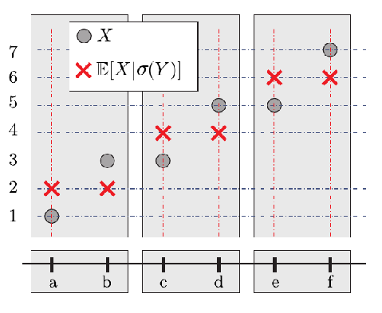
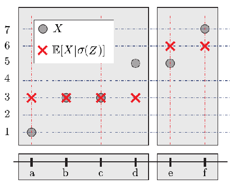

# 一般化的條件期望值

## 簡介

在機率論中，可定義某個事件(隨機變數)相對另一個事件(隨機變數)的條件機率，比如P(骰子點數是3或4|骰子點數是偶數)。其實就是把原先的樣本空間$$\Omega$$限制到給定條定件的事件上做正規化，視為一個新的機率空間。於是有貝氏公式 $$\mathrm{P}(X|Y)=\frac{\mathrm{P}(X \cap Y)}{\mathrm{P}(Y)} = \frac{\mathrm{E}(X \mathbf{1}_Y)}{\mathrm{P}(Y)}, ~ \mathrm{P}(Y) > 0$$。

可得$$\displaystyle \mathrm{E}_\Omega(X|Y) = \frac{\mathrm{P}_\Omega(X \cap Y)}{\mathrm{P}_\Omega(Y)} = \frac{\mathrm{E}_\Omega(X I_Y)}{\mathrm{P}_\Omega(Y)}$$。

<mark style="color:blue;">但貝氏公式無法處理零機率的事件的條件機率，即無法計算</mark>$$\mathrm{P}(Y=y_i)=0$$<mark style="color:blue;">的條件機率</mark>。

條件期望值可分為以下幾類：

1. 依賴隨機變數的特定實現值$$\mathrm{E}(X|Y=y)$$，為一常數值。
2. 依賴於隨機變數的值域$$\mathrm{E}(X|Y)=g(y)$$，為隨機變數。
3. 依賴於給定的σ域  $$\mathrm{E}(X|\sigma(Y))$$，為隨機變數，該定義的主要優點是它允許我們以零機率事件為條件。

註：給定隨機變數$$Y$$與給定事件集合$$B$$的條件期望值意義相同，因為兩者均是對宇集合$$\Omega$$做分割，只是兩者的分割條件不同。例如離散隨機變數$$A_i=\{\omega \in \Omega ~|~ Y=y_i\}$$，$$B=\{\omega \in B\}$$。

一般化的條件期望值通常無法計算(除了有限個取值的離散隨機變數)，因此知道一般化條件期望值的特性比計算重要，特別是在隨機過程中常使用遞增的σ域(filitration)時條件期望值會因給定的條件不同而異。

<mark style="background-color:red;">一般化期望值為隨機變數，但因為名稱和考慮全體σ域時計算時為常數，容易誤解為常數</mark>。

## 事件的條件機率為期望值的特例

對於事件集合$$E \subseteq \Omega$$，考慮其指示(示性)函數（為隨機變數）$$\mathbf{1}_E(\omega) = \left\{  \begin{aligned} 1, \text{ if } \omega \in E \\  0,  \text{ if } \omega \not \in E \end{aligned}\right.$$。可得$$\mathrm{P}(E) = \mathrm{E}(\mathbf{1}_E)$$。同理可得$$\mathrm{P}(E|F)=\mathrm{E}(\mathbf{1}_E|F)$$。<mark style="color:blue;">所以條件機率只是條件期望值的一個特例，以下我們只考慮條件期望值</mark>。

目前為止，條件期望只是把原先的變數限制在$$\Omega$$的一個子集上，把機率正規化了之後求期望值，為一實數值。

## 隨機變數的條件期望值

定義在機率空間$$(\Omega, \mathcal{F}, \mathrm{P})$$的隨機變數$$X$$的期望值$$\displaystyle \mathrm{E}_{\Omega}(X)\equiv \int_\Omega X d \mathrm{P} \equiv \int_\Omega X(\omega) d \mathrm{P}(\omega)$$為所有樣本的均值。

對於離散隨機變數$$X,Y$$，條件期望值$$\mathrm{E}(X|Y=y)$$也是一樣的道理，限制在子集$$\{ \omega ~|~ Y(\omega)=y\}$$上求$$X(\omega)$$的均值，而連續隨機變數也只是限制在$$\{\omega ~|~ a \leq Y(\omega) \leq b\}$$，概念相同。<mark style="color:red;">但注意到條件期望值之值依賴於</mark>$$Y$$<mark style="color:red;">的實現值，因此期望值是</mark>$$y$$<mark style="color:red;">的函數，即</mark>$$f(y)=\mathrm{E}(X|Y=y)$$。於是我們可以把$$\mathrm{E}(X|Y)$$看做$$Y$$的函數，一個隨機變數$$f(Y)$$。

即使取$$X$$的函數值$$g(X)$$，條件期望值仍然為$$Y$$的函數，即$$\mathrm{E}(g(X)|Y)=h(Y)$$為$$Y$$的隨機變數。

## 隨機變數σ域的條件期望值

在隨機變數的條件期望值中，兩個結果$$\omega_1, \omega_2$$是否有相同的條件期望值，取決於$$Y(\omega_1)$$是否與$$Y(\omega_2)$$有相同的函數值。因此不必考慮$$Y(\omega_1)$$的實際值為何，只需考慮$$\omega$$如何對宇集合$$\Omega$$做分割(partition)。

<mark style="color:red;">而能夠記錄</mark>$$Y$$<mark style="color:red;">的相異取值而不記錄實際取值為何，就是</mark>$$\sigma(Y)$$<mark style="color:red;">，即宇集合</mark>$$\Omega$$<mark style="color:red;">中使得</mark>$$Y$$<mark style="color:red;">可測的最小的σ域，其包含了</mark>$$Y$$<mark style="color:red;">相異取值的結構(事件集合)。因此</mark>$$\mathrm{E}(g(X)|Y)$$<mark style="color:red;">可寫成</mark>$$\mathrm{E}(g(X)|\sigma(Y))$$，即$$\mathrm{E}(g(X)|Y)\equiv \mathrm{E}(g(X)|\sigma(Y))$$。

既然條件期望值只用了σ域的資訊，那麼不必管這個σ域是由那個隨機變數生成，直接對σ域定義條件期望即可。

## 將σ域解釋為資訊集合

令$$Y, Y_1, Y_2$$為可測空間$$(\Omega, \mathcal{F})$$隨機變數、隨機向量或隨機過程。則：

* 若$$\sigma(Y) \subseteq \mathcal{F}$$，則稱$$Y$$的資訊已包含在$$\mathcal{F}$$內(the information of Y is contained in F)，或者說$$Y$$沒有比$$\mathcal{F}$$更多的資訊。<mark style="color:blue;">也可說成</mark>$$Y$$<mark style="color:blue;">為</mark>$$\mathcal{F}$$<mark style="color:blue;">可測</mark>。
* 若$$\sigma(Y_1) \subseteq \sigma(Y_2)$$，則 <mark style="color:blue;">稱</mark>$$Y_2$$<mark style="color:blue;">比</mark>$$Y_1$$<mark style="color:blue;">有更多的資訊量</mark>。

由於知道了更多的資訊可知如何將$$Y_1$$中的事件分割更細得到$$Y_2$$，因此可得$$\sigma(Y_1) \subseteq \sigma(Y_2)$$。

## 一般σ域的條件期望值

給定隨機變數$$Y$$的條件期望值與給定$$\sigma(Y)$$的條件期望值等價，如果考慮更大的資訊集合$$\mathcal{G}$$的條件期望值時，需要更一般化的定義。

考慮測度空間$$(\Omega, \mathcal{F}, \mathrm{P})$$的隨機變數$$X$$，且$$\mathrm{E}(|X|) < \infty$$或寫成$$X \in L^1$$ 即Lebesgue可積函數。

#### 條件期望值隨機變數的存在性

> 考慮子σ域$$\mathcal{G} \subset \mathcal{F}$$且$$\mathrm{E}(|X|) < \infty$$。若條件期望$$\mathrm{E}(X|\mathcal{G})=Z$$為$$Z$$的隨機變數，且滿足：
>
> 1. 隨機變數$$Z$$在$$\mathcal{G}$$可測；或者寫成$$\sigma(Z) \subseteq \mathcal{G}$$。
> 2. $$\forall A \in \mathcal{G}$$，可得$$\displaystyle \int_A X d\mathrm{P} = \int_A Z d\mathrm{P}\equiv \int_A\mathrm{E}(X|\mathcal{G})dP$$或寫成$$\mathrm{E}(X\mathbf{1}_A)=\mathrm{E}(Z\mathbf{1}_A)$$。
>
> 稱隨機變數$$Z$$為$$X$$相對於$$\mathcal{G}$$的條件期望值。

<mark style="color:red;">而</mark>$$\mathrm{E}(I_A|\mathcal{G})=\mathrm{P}(A|\mathcal{G})$$<mark style="color:red;">稱為事件</mark>$$A\in \mathcal{F}$$<mark style="color:red;">相對於</mark>$$\mathcal{G}$$<mark style="color:red;">的條件機率</mark>。

<mark style="color:red;">條件期望值不唯一，對於任意的隨機變數，只要滿足條件(1,2)都是條件期望值的一個版本(a version of</mark> $$\mathrm{E}(X|\mathcal{G})$$。

<mark style="color:red;">而任兩個版本的條件期望值只在零測集上相異(</mark>$$Z_1 = Z_2$$ <mark style="color:red;">almost surely)。令</mark>$$\mathrm{Q}$$<mark style="color:red;">為測度</mark>$$\mathrm{P}$$<mark style="color:red;">在</mark>$$\mathcal{G}$$<mark style="color:red;">的測度，若隨機變數</mark>$$Z_1, Z_2$$<mark style="color:red;">均滿足條件(1,2)，則</mark>$$\mathrm{Q}(Z_1 \neq Z_2)=0$$。

對於滿足條件的條件期望$$Z$$與$$\mathrm{E}(X|\mathcal{G})$$是在相同的資訊集$$\mathcal{G}$$幾乎處處相等，而$$X$$是在更大的資訊集$$\mathcal{F}$$的隨機變數，因此$$\mathrm{E}(X|\mathcal{G})$$可解釋為$$X$$在資訊集$$\mathcal{G}$$的最佳預測值($$L^2$$空間中， $$X$$在資訊集$$\mathcal{G}$$的投影向量）。

proof: 條件期望值存在性會用到Raydon-Nikodym定理

<mark style="color:blue;">測度絕對連續</mark>：

令$$\mu, \nu$$分別為可測空間$$(\Omega, \mathcal{F})$$上的符號測度與測度，若$$\forall A \in \mathcal{F}$$，可得$$\mu(A) =0 \Rightarrow \nu(A)=0$$，則稱$$\nu$$

對$$\mu$$絕對連續，記為$$\nu \ll \mu$$。

<mark style="color:blue;">Ryadon-Nikodym定理</mark>

令$$\mu, \nu$$為可測空間$$(\Omega, \mathcal{F})$$上的兩個σ-finite測度。

如果$$\nu \ll \mu$$ ($$\nu$$對$$\mu$$絕對連續，$$\forall A \in \mathcal{F}$$，若$$\mu(A)=0$$可得$$\nu(A)=0$$)

則存在$$\mathcal{F}$$可測的函數$$f: \mathcal{F}\rightarrow [0, \infty)$$使得$$\forall A \in \mathcal{F}$$，有$$\displaystyle \int_Af d\mu=\nu(A)$$，$$f$$記為$$\displaystyle \frac{d\nu}{d\mu}$$稱為Randon-Nikodym導數。

常見範例。$$f$$為在實數區間$$A$$有定義的連續函數，$$\mu$$為Lebesgue測度，則$$\int_Af d\mu$$為函數在區間$$A$$的積分值，而$$\nu(A)$$可解釋為某函數在此區間$$A$$的面積。

<mark style="color:blue;">proof</mark>:

假設隨機變數$$X \geq 0$$ a.s.且可積分，令$$\mu = \mathrm{P}$$，$$\displaystyle  \nu(A)=\int_A X d \mathrm{P},~ \forall A \in \mathcal{F}$$

可得$$\nu$$為σ-finite測度且當$$\mathrm{P}(A)=0$$時，可得$$\nu(A)=0$$，因此$$\nu \ll \mathrm{P}$$ 。

由Raydon-Nikodym定理可得存在可測函數$$\displaystyle \frac{d \nu}{d \mu}= Z \equiv \mathrm{E}(X|\mathcal{G})$$使得$$\displaystyle \int_A \mathrm{E}(X|\mathcal{G}) dP = \nu(A) = \int_A X dP$$

可得$$Z$$為所求的條件期望。

對於$$X \in \mathbb{R}$$的情形，只要使用$$X=X^{+} - X^{-}$$的性質即為所求。

(QED)

### 隨機變數的條件期望值與條件機率為一般σ域的條件期望值的特例

> 考慮測度空間$$(\Omega, \mathcal{F}, \mathrm{P})$$上的隨機變數$$X, Y$$，則條件期望值$$\mathrm{E}(X|Y) = \mathrm{E}(X|\sigma(Y))$$。
>
> 給定可測事件集合$$A,B \subseteq  \Omega$$，可得$$\displaystyle \mathrm{P}(A|B)=\frac{\mathrm{P}(A \cap B)}{\mathrm{P}(B)}$$

#### 給定離散隨機變數的條件期望值範例

給定離散隨機變數$$Y=\{y_1, y_2, \dots\}$$有可數個取值，令集合$$A_i=\{\omega \in \Omega ~|~ Y(\omega)=y_i\}$$。此處依定義可得$$A_i \cap A_j =\emptyset, ~ \forall i \neq j$$為宇集合$$\Omega$$的分割。可得$$\displaystyle A=\bigcup_{i \in \mathbb{N}} A_i = \bigcup_{i \in \mathbb{N}}\{  \omega \in \Omega ~|~ Y(\omega)=y_i\}$$。

因此可得$$\displaystyle I_A = \sum_{i \in \mathbb{N}} I_{A_i}$$--(1)

令隨機變數$$Z = \mathrm{E}(X~|~Y)$$，而$$Z$$的實際取值因$$Y=y_i$$而異，因此可得：$$Z(\omega)=\mathrm{E}(X~|~Y=y_i)=\mathrm{E}(X~|~A_i) ~ \forall \omega  \in A_i, ~i \in \mathbb{N}$$，--(2)

注意此處$$\mathrm{E}(X~|~A_i)$$是常數值而非隨機變數，且$$Z(\omega)$$為隨機變數在特定結果$$\omega$$的取值。

因此$$Z$$為$$Y$$的函數，即$$Z=g(Y)$$，因為函數變換不會提供關於$$Y$$結構新的訊息，可得$$\sigma(Z) \subseteq \sigma(Y)$$--(3)。

由於$$A_i$$為分割，由(1)與期望值的線性性質得：$$\displaystyle \mathrm{E}(XI_A)=\mathrm{E}(X \sum_{i \in \mathbb{N}} I_{A_i})=\sum_{i \in \mathbb{N}} E(XI_{A_i})$$--(4)。

由(2)與$$\mathrm{E}(X|A_i)=\frac{\mathrm{E}(XI_{A_i})}{\mathrm{P}(A_i)}$$，可得$$\displaystyle \mathrm{E}(ZI_A)= \sum_{i \in \mathbb{N}} \mathrm{E}(X|A_i) \mathrm{P}(A_i) = \sum_{i \in \mathbb{N}} \mathrm{E}(X I_{A_i})$$--(5)

由(3)與(4)==(5)可知$$Z=\mathrm{E}(X~|\sigma(Y))$$ (QED)

#### 事件集合條件機率的範例

不失一般性令$$B \subseteq \Omega$$且$$\mathrm{P}(B) > 0, ~ \mathrm{P}(B^c) > 0$$，可得σ域$$\mathcal{F}_B=\{\emptyset, \Omega, B, B^c\}$$。

由上例得$$\mathrm{E}(X|\mathcal{F}_B)(\omega)=\mathrm{E}(X|B), ~\forall \omega \in B$$ 為傳統條件期望值的定義。

若令$$X=I_A, ~ A \subseteq \Omega$$，則可得$$\mathrm{E}(I_A|\mathcal{F}_B)(\omega)=\mathrm{E}(I_A|B)=\frac{\mathrm{P}(A \cap B)}{\mathrm{P}(B)}$$為傳統條件機率的定義。

#### 構造性定義

令σ域$$\mathcal{F}$$中的可測序數$$\{B_n, n\in \mathbb{N}\}$$是宇集合$$\Omega$$的一組分割。令$$\mathcal{g}=\sigma(\{B_n, n \in \mathbb{N}\})$$為此序列生成的σ域。令隨機變數$$X$$的積分存在，則：

$$\displaystyle \mathrm{E}(X|\mathcal{g}) = \sum_{j=1}^\infty \left(  \frac{1}{\mathrm{P}(B_j)} \int_{B_j} X(\omega)d\mathrm{P}(\omega)  \right) \mathbf{I}_{B_j} = \sum_{j=1}^\infty \mathrm{E(X| B_j)}\mathbf{I}_{B_j}$$

### 範例

給定測度空間$$(\Omega, \mathcal{F}, \mathrm{P})$$，$$\Omega=[0,1]$$，$$\mathrm{P}$$為Lebesgue測度。

令σ域$$A=\mathcal{F}$$，$$B$$為由終端端點$$\{0, 1/4, 1/2, 3/4,1\}$$的區間形成的σ域，$$C$$由終端端點$$\{0, 1/2, 1\}$$的區間形成的σ域。

即$$B=\sigma([0,1/4], [1/4,1/2], [1/2, 3/4], [3/4, 1])$$，$$C=\sigma([0,1/2], [1/2,1])$$。

因為$$X \in \mathcal{F}$$，所以$$\mathrm{E}(X|A)=X$$

$$\displaystyle \begin{aligned} \mathrm{E}(X|B)  	& =\mathrm{E}(X|[0,1/4])\cdot\mathbf{1}_{[0,1/4]}  \\ 	& +\mathrm{E}(X|[1/4,1/2])\cdot\mathbf{1}_{[1/4,1/2]} \\ 	& +\mathrm{E}(X|[1/2,3/4])\cdot\mathbf{1}_{[1/2,3/4]} \\ 	& +\mathrm{E}(X|[3/4,1])\cdot\mathbf{1}_{[3/4,1]} \\ 	& = 4 \int_{0}^{1/4} X(x)dx \cdot\mathbf{1}_{[0,1/4]} \\ 	& + 4 \int_{1/4}^{1/2} X(x)dx \cdot\mathbf{1}_{[1/4, 1/2]} \\ 	& + 4 \int_{1/2}^{3/4} X(x)dx \cdot\mathbf{1}_{[1/2, 3/4]} \\ 	& + 4 \int_{3/4}^{1} X(x)dx \cdot\mathbf{1}_{[3/4, 1]} \\ \end{aligned}$$

## 範例1

令$$\Omega=\{1,2,\dots, 12\}$$，$$\mathcal{F}=\text{power set of }\Omega$$，$$\mathrm{P}(\{1\})=\dots=\mathrm{P}(\{12\})=1/12$$。

定義隨機變數：

$$Y = \mathrm{ceil}(\frac{\omega}{4}) =  \left\{ \begin{aligned} 1,& \text{ if } \omega =1,2,3,4, \\  2,& \text{ if } \omega =5,6,7,8, \\ 3,& \text{ if } \omega =9,10,11,12, \\  \end{aligned} \right.$$

$$X = \mathrm{ceil}(\frac{\omega}{2}) =  \left\{ \begin{aligned} 1,& \text{ if } \omega =1,2, \\  2,& \text{ if } \omega =3,4 \\ 3,& \text{ if } \omega =5,6, \\ 4,& \text{ if } \omega =7,8, \\ 5,& \text{ if } \omega =9,10, \\ 6,& \text{ if } \omega =11,12, \\  \end{aligned} \right.$$

可得$$\begin{aligned} \sigma(Y) &=\sigma(Y^{-1}(B(\mathbb{R})) \\&= \sigma(\{1,2,3,4\},\{5,6,7,8\},\{9,10,11,12\}) \\ 	& = \{\empty, \{1,2,3,4\}, \{5,6,7,8\}, \{9,10,11,12\}, \\ 	 &\{1,2,3,4,5,6,7,8\}, \{1,2,3,4,9,10,11,12\}, \{5,6,7,8,9,10,11,12\}, \Omega\} \end{aligned}$$

同理可得：$$\begin{aligned} \sigma(X) &=\sigma(X^{-1}(B(\mathbb{R})) \\&= \sigma(\{1,2\},\{3,4\},\{5,6\},\{7,8\},\{9,10\},\{11,12\}) \\ 	 \end{aligned}$$

性質如下：

* $$Y$$為$$\sigma(Y)$$可測(由定義可得)。
* $$Y$$為$$\sigma(X)$$可測(因為$$\sigma(X) \subset \sigma(Y)$$)
* $$X$$為$$\sigma(X)$$可測(由定義可得)。
* $$X$$不是$$\sigma(Y)$$可測，因為$$X^{-1}(\{1\})=\{1,2\} \notin \sigma(Y)$$。

## 範例2

給定機率空間$$(\Omega, \mathcal{F}, \mathrm{P})$$，$$\Omega=\{a,b,c,d,e,f\}$$，$$\mathcal{F}=2^\Omega$$為冪集合，$$\mathrm{P}$$為均勻分佈。$$X,Y,Z$$為隨機變數如下：

$$X=\begin{pmatrix} a & b&c&d&e& f \\ 1 & 3 & 3& 5 & 5& 7 \end{pmatrix}$$，$$Y=\begin{pmatrix} a & b&c&d&e& f \\ 2 & 2 & 1 & 1 & 7 & 7 \end{pmatrix}$$，$$Z=\begin{pmatrix} a & b&c&d&e& f \\ 3 & 3 & 3 & 3 & 2 & 2 \end{pmatrix}$$

給定資訊$$\mathcal{G}=\sigma(Y)=\sigma(\{ \{a,b\}, \{c,d\}, \{e,f\} \})$$，為資訊為$$Y$$的實際取值，即可知$$A_i=\{\omega \in \Omega ~|~ Y(\omega)=y_i\}$$的資訊。

* 當$$Y=2$$，可得$$A_1=\{a,b\}$$，因此$$\mathrm{E}(X|Y=2) =\mathrm{E}(X|\\sigma({a,b\})) =\frac{1}{2} X(a) + \frac{1}{2} X(b)=2$$$$\mathrm{E}(X|Y=2) =\frac{1}{2} X(a) + \frac{1}{2} X(b)=2$$。
* 當$$Y=1$$，可得$$A_2=\{c,d\}$$，因此$$\mathrm{E}(X|Y=1)=\frac{1}{2}X(c)+\frac{1}{2}X(d)=4$$。
* 當$$Y=7$$，可得$$A_3=\{e,f\}$$，可得$$\mathrm{E}(X|Y=7)=\frac{1}{2}X(e)+\frac{1}{2}X(f)=6$$。

將上述$$Y$$相異值的期望值記為期望值$$W=\begin{pmatrix} a & b&c&d&e& f \\ 2 & 2 & 4 & 4 & 6 & 6 \end{pmatrix}$$

顯然$$W$$為$$\sigma(Y)$$-可測函數。

再檢查$$\forall A \in \sigma(Y), \mathrm{E}(WI_A)=\mathrm{E}(XI_A)$$。

由於$$\sigma(Y)=\sigma(\{ \{a,b\}, \{c,d\}, \{e,f\} \})$$，所有$$\sigma(Y)$$中的元素都是由$$A_1=\{a,b\}$$, $$A_2=\{c,d\}$$, $$A_3=\{e,f\}$$聯集、交集或補集求得，因此只要考慮$$A_1, A_2, A_3$$的情形即可。

由於$$\displaystyle  \mathrm{E}(X | I_{A_i}) = \frac{\mathrm{E}(X I_{A_i})}{\mathrm{P}(A_i)} ~, i=1,2,3$$

$$\displaystyle   \begin{aligned} & \mathrm{E}(XI_A) \\ & =\mathrm{E}( X (I_{A_1} + I_{A_2} +I_{A_3})) \\  & =\mathrm{E}(X I_{A_1}) +\mathrm{E}(X I_{A_2}) + \mathrm{E}(X I_{A_3}) \\ & = \mathrm{E}(X | I_{A_1})\mathrm{P}(A_1) + \mathrm{E}(X | I_{A_2})\mathrm{P}(A_2) + \mathrm{E}(X | I_{A_3})\mathrm{P}(A_3)  \end{aligned}$$而$$W$$的取值，也是依$$Y=y_i$$而異，即事件集合$$A_1, A_2, A_3$$而異，且在$$A_i$$上的值為$$\mathrm{E}(X|Y=y_i)$$，因此：$$\displaystyle   W(\omega)=   \begin{cases}  \mathrm{E}(X|Y=2)=\mathrm{E}(X|A_1)=2, &  \omega \in \{a,b\} \\  \mathrm{E}(X|Y=1)=\mathrm{E}(X|A_2)=4, & \omega \in \{c,d\} \\  \mathrm{E}(X|Y=7)=\mathrm{E}(X|A_3)=6, & \omega \in \{e,f\}   \end{cases}$$

$$\displaystyle    \begin{aligned} & \mathrm{E}(W I_A)  \\ & = \mathrm{E}(X | I_{A_1})\mathrm{P}(A_1) + \mathrm{E}(X | I_{A_2})\mathrm{P}(A_2) + \mathrm{E}(X | I_{A_3})\mathrm{P}(A_3)   \end{aligned}$$因此$$W=\mathrm{E}(X|Y) \equiv \mathrm{E}(X| \sigma(Y))$$。

<figure><figcaption>
給定Y的資訊(sigma域)後的條件期望值，為Y中事件相異取值的平均值
</figcaption></figure>

##

<figure><figcaption>
給定Z的資訊(sigma域)後的條件期望值，為Z中事件相異取值的平均值
</figcaption></figure>

## 條件期望值為線性

> 考慮測度空間$$(\Omega, \mathcal{F}, \mathrm{P})$$上的隨機變數$$X_1, X_2$$與$$c_1, c_2 \in \mathbb{R}$$，則：
>
> $$\mathrm{E}(c1 X_1 + c_2 X_2 | \mathcal{F})=c_1 \mathrm{E}(X_1 | \mathcal{F}) + c_2 \mathrm{E}(X_2 | \mathcal{F})$$

## 重複期望值定理(tower principle)

> 考慮測度空間$$(\Omega, \mathcal{F}, \mathrm{P})$$上的隨機變數$$X$$與$$\mathrm{E}(X|\mathcal{F})$$，則：$$\mathrm{E}(X)=\mathrm{E}(\mathrm{E}(X | \mathcal{F}))$$。
>
> 當子σ域 $$\mathcal{G} \subseteq \mathcal{F}$$時，可得$$\mathrm{E}( X|\mathcal{G}) = \mathrm{E}(\mathrm{E}(X|\mathcal{F})|\mathcal{G}) =\mathrm{E}(\mathrm{E}(X|\mathcal{G})|\mathcal{F})$$

## 條件期望值與~~σ域~~獨立時得期望值

> 考慮測度空間$$(\Omega, \mathcal{F}, \mathrm{P})$$上的隨機變數$$X, Y$$，當$$X$$與$$\mathcal{F}$$獨立時(即σ域$$\mathcal{F}$$中不包含$$X$$的資訊，反之亦然)，則$$\mathrm{E}(X|\mathcal{F})=\mathrm{E}(X)$$。
>
> 若隨機變數$$X,Y$$獨立時，則$$\mathrm{E}(X|Y)=\mathrm{E}(X)$$。

即$$\forall A \in \mathcal{F}$$，隨機變數$$X, I_A$$獨立，因此$$\mathrm{E}(XI_A)=\mathrm{E}(X) \mathrm{E}(I_A)=\mathrm{E}(X)\mathrm{P}(A)=\mathrm{E}((\mathrm{E}(X))I_A)$$

因此由條件期望值的定義得常數$$Z=\mathrm{E}(X)$$為$$\mathrm{E}(X|\mathcal{F})$$的條件期望值。

## 給定較大資訊集合的條件期望值為自身隨機變數

> 考慮測度空間$$(\Omega, \mathcal{F}, \mathrm{P})$$上的隨機變數$$X$$, 若 $$\sigma(X) \subseteq \mathcal{F}$$(即$$\mathcal{F}$$已經提供了隨機變數的必要資訊)，則$$\mathrm{E}(X|\mathcal{F})=X$$。
>
> 同上，對於任意隨機變數$$Z$$，可得$$\mathrm{E}(XZ|\mathcal{F})=X \cdot \mathrm{E}(Z|\mathcal{F})$$。
>
> 若隨機變數$$X$$為隨機變數$$Y$$的函數，即$$X=g(Y)$$，得$$\sigma(X) \subseteq \sigma(Y)$$，則$$\mathrm{E}(X|Y)=X$$且$$\mathrm{E}(XZ|Y)= X \cdot \mathrm{E}(Z|Y)$$。

如果$$\mathcal{F}$$提供了$$X$$的所有訊息，則$$X$$退化為為一常數值，即$$\mathrm{E}(X|\mathcal{F})(\omega)=\mathrm{E}(X(\omega)| \mathcal{F})=X(\omega) \mathrm{E}(1 | \mathcal{F})=X(\omega)$$.&#x20;

## 一般化條件期望值的投影性質

測度空間$$(\Omega, \mathcal{F}, \mathrm{P})$$，令$$L^2(\mathcal{F})$$為$$\Omega$$中滿足以下性質的隨機變數$$Z$$的集合：

* $$Z$$的二階動差有限(存在)，即$$\mathrm{E}(Z^2) < \infty$$。
* $$Z$$的資訊量比$$\mathcal{F}$$少，即$$\sigma(Z) \subseteq \mathcal{F}$$。若$$\mathcal{F}=\sigma(Y)$$，則$$Z$$為$$Y$$的函數。

> 投影性質(projection property)
>
> 令$$X$$為隨機變數且$$\mathrm{E}(X^2)<\infty$$，則條件期望值$$\mathrm{E}(X|\mathcal{F})$$為$$L^2(\mathcal{F})$$中，在均值平方為距離函數時，最接近$$X$$的隨機變數。
>
> 即$$\displaystyle \mathrm{E}(X-\mathrm{E}(X|\mathcal{F}))^2=\min_{Z \in L^2(\mathcal{F})}\mathrm{E}(X-Z)^2$$。
>
> 註：$$L^2$$為內積空間，則$$\mathrm{E}(X|\mathcal{F})$$為隨機變數(向量)$$X$$投影到$$L^2(\mathcal{F})$$的向量，因此$$X-\mathrm{E}(X|\mathcal{F})$$為正交於$$L^2(\mathcal{F})$$的向量，且該向量是$$X$$到$$\mathrm{E}(X|\mathcal{F})$$距離最短的向量。

## 參考資料

* [\[知乎\] 淺談條件期望](https://zhuanlan.zhihu.com/p/23670286)
* [\[知乎\] 條件期望值的初步理解](https://zhuanlan.zhihu.com/p/50757083)
* [\[statlect\] Conditional probability with respect to a sigma-algebra](https://www.statlect.com/fundamentals-of-probability/conditional-probability-as-a-random-variable)
* [\[wiki\] conditional expectation](https://en.wikipedia.org/wiki/Conditional\_expectation#Conditional\_expectation\_with\_respect\_to\_a\_.CF.83-algebra)
* [\[知乎\] 條件期望與全期望公式](https://zhuanlan.zhihu.com/p/417592820)
* [\[知乎\] 重期望公式及實例運用](https://zhuanlan.zhihu.com/p/163363352)
* [\[譚升的部落格\] 條件期望](https://face2ai.com/Math-Probability-4-7-Conditional-Expectation/)
* [Lecture 10 Conditional Expectation](https://web.ma.utexas.edu/users/gordanz/notes/conditional\_expectation.pdf)
  * [https://web.ma.utexas.edu/users/gordanz/lecture\_notes\_page.html](https://web.ma.utexas.edu/users/gordanz/lecture\_notes\_page.html)
* [Conditional expectation toy example](https://people.maths.bris.ac.uk/\~mb13434/cond\_expn\_example\_balazs.pdf)

