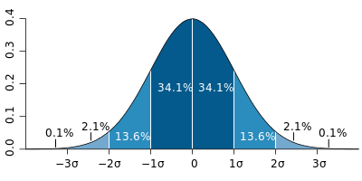

# 連續分佈

## 指數分佈（exponential distribution）

指數分佈可以用來表示獨立隨機事件發生的**時間間隔（**兩次事件發生間的等待時間（週期））、**等待時間或是壽命的模式**。 
比如旅客進入機場的時間間隔、打進客服中心電話的時間間隔、網站新條目出現的時間間隔等等。

令$$X$$ 為某一事件$$E$$ 前後兩次發生的間隔時間，對某一時間$$ t>0$$， 事件發生的時間必定是大於$$t$$或是小於等於$$t$$，即

* $$\mathrm{P}({X \leq t})=1−\mathrm{P}({X>t}) $$
* $$\{X>t\}$$表示事件$$E$$前後兩次發生的時間間隔超過$$t$$。
* 令$$Y \sim P(\lambda)$$，則$$\{X>t\}$$表示$$Y$$在$$[0,t]$$間沒有發生，即$$\mathrm{P}({X＞t})=\mathrm{P}(Y=0|t \in [0,t])=e^{−\lambda} $$。

### 分佈與統計量

* 隨機變數$$X \sim exp(\lambda)$$或$$X \sim exp(\beta)$$
  * 其中$$\lambda > 0$$為每單位時間發生該事件的次數，與卜瓦松分佈的參數意義相同 。
  * $$\beta = \frac{1}{\lambda}$$為事件發生的平均等待時間。
* 機率密度函數：
  * $$f(X| \lambda ) = \bigg\{ \begin{aligned} &\lambda e^{-\lambda} &  x \geq 0 \\& 0 & x < 0 \end{aligned}$$
  * $$f(X| \beta ) = \bigg\{ \begin{aligned} &\frac{1}{\beta} e^{-\frac{1}{\beta}} &  x \geq 0 \\& 0 & x < 0 \end{aligned}$$
* 期望值 $$\mathrm{E}(X) = \frac{1}{\lambda} = \beta$$
* 變異數 $$\mathrm{Var}(X)  = \frac{1}{\lambda^2} = \beta^2$$

### 指數分佈與卜瓦松過程的關係

卜瓦松過程（Poisson process）中，第$$k$$次隨機事件與第$$k+1$$次隨機事件出現的時間間隔服從指數分布。而根據卜瓦松過程的定義，

* 長度為$$t$$的時間段內沒有隨機事件出現的機率等於 $$ \frac{e^{-\lambda t} (\lambda t)^0 }{0!} = e^{-\lambda t}$$。
* 長度為$$t$$的時間段內隨機事件發生一次的機率等於$$ \frac{e^{-\lambda t} (\lambda t)^1 }{1!} = e^{-\lambda t} \lambda t$$
* 所以第$$k$$次隨機事件之後長度為$$t$$的時間段內，第$$k+n$$次 $$(n=1, 2, 3, \ldots)$$隨機事件出現的機率等於$$1-e^{-\lambda t}$$。這是指數分布。這還表明了**卜瓦松過程的無記憶性**。

### 指數分布具有無記憶性的性質（Memoryless Property）

如果一個隨機變數呈指數分布，它的條件機率遵循：$$\displaystyle \mathrm{P}(T>s+t\;|\;T>t)= \mathrm{P}(T>s) ~ \forall s, t  \geq 0$$

## 常態分佈（高斯分佈）\(normal \(Gaussian distribution\)

常態分布在統計學上十分重要，經常用在自然和社會科學來代表一個不明的隨機變數。

* 隨機變數 $$X \sim N(\mu, \sigma^2)$$
* 機率密度函數 $$f(X|\mu, \sigma^2)=\frac {1}{\sqrt {2\pi }\sigma }e^{- \frac {(x-\mu)^{2}}{2\sigma ^{2}}}$$
  * 常態分布的期望值$$\mu$$ 等於位置母數，決定了分布的位置；其變異數$$\sigma ^{2}$$的開平方或標準差$$\sigma$$ 等於尺度母數，決定了分布的幅度（寬度）。
  * 常態分布的機率密度函數曲線呈鐘形，因此人們又經常稱之為**鐘形曲線（bell curve）**。
* 標準常態分布$$N(0,1)$$是位置母數$$\mu =0$$，尺度母數$$\sigma^2 = 1$$的常態分布。$$f(X|0, 1) = \frac {1}{\sqrt {2\pi } }e^{- \frac {x^2}{2}}$$。

### 常態分佈性質

* 密度函數對稱於平均值$$\mu$$（偏度為0）。
* 平均值與它的眾數（statistical mode）以及中位數（median）同一數值。
* 函數曲線下68.27%的面積在平均數左右的一個標準差$$\sigma$$範圍內。
* 95.45%的面積在平均數左右兩個標準差$$ 2 \sigma$$的範圍內。
* 99.73%的面積在平均數左右三個標準差$$3 \sigma$$的範圍內。
* 99.99%的面積在平均數左右四個標準差$$4 \sigma$$的範圍內。
* 函數曲線的反曲點（inflection point）為離平均數一個標準差距離的位置。

### 標準偏誤

在實際應用上，常考慮一組資料具有近似於常態分布的機率分布。若其假設正確，則約68.3%數值分布在距離平均值有1個標準差之內的範圍，約95.4%數值分布在距離平均值有2個標準差之內的範圍，以及約99.7%數值分布在距離平均值有3個標準差之內的範圍。稱為「68-95-99.7法則」或「經驗法則」。

### 常態分佈參數的線性組合

$$X \sim N(\mu, \sigma^2)$$且 $$a,b \in \mathbb{R}$$，則$$aX+b \sim  N(a\mu +b, (a\sigma)^2)$$

### 獨立常態分佈隨機變數的性質

如果$$X \sim N(\mu_X, \sigma^2_X)$$與$$Y \sim N(\mu_Y, \sigma^2_Y)$$是統計獨立的常態隨機變數，那麼：

* 它們的和也滿足常態分布$$U = X + Y \sim N(\mu_X + \mu_Y, \sigma^2_X + \sigma^2_Y) $$。
* 它們的差也滿足常態分布$$V = X - Y \sim N(\mu_X - \mu_Y, \sigma^2_X + \sigma^2_Y)$$。

### 多個獨立常態分佈隨機變數的平方和為卡方分佈

如果$$X_1, X_2,\ldots, X_N$$為獨立標準常態隨機變數，那麼$$X_1^2 + X_2^2+ \ldots + X_N^2$$服從自由度為$$N$$的卡方分布$$\chi^2(N)$$。

