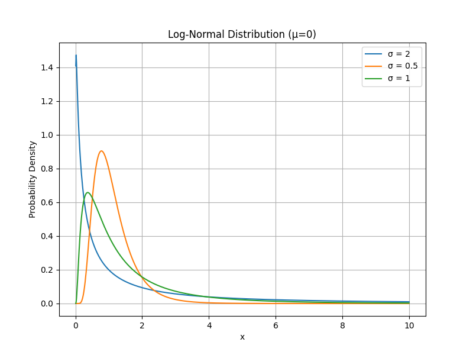

# 對數常態分佈

## 簡介

對數常態分佈其特點是變數的對數服從常態分佈。換句話說，如果一個隨機變數$$X$$服從對數常態分佈，那麼$$\log X$$服從常態分佈。

對數常態分佈只適用於正值 ($$x>0$$)，因此常用來建模非負資料，例如收入、物價、壽命等。且分佈的機率密度函數具有長尾效應，其在經濟學、金融、生物學和工程學等領域中都有應用。

**特性**

* **非負性：**&#x5C0D;數常態分佈的隨機變數只能取正值。
* **偏斜性：**&#x5C0D;數常態分佈通常呈右偏態，即尾部向右延伸。

**應用場景**

* **金融**：股票價格、資產收益率（幾何布朗運動）。
* **生物學**：生物體的尺寸或濃度（如細胞大小）。
* **工程**：壽命資料分析（如疲勞失效時間）。
* **經濟學**：收入分佈（右偏資料）。



<figure><figcaption><p>對數常態分佈。右偏且變異數越大時，長尾越明顯。</p></figcaption></figure>



```python
import matplotlib.pyplot as plt
import numpy as np
from scipy.stats import lognorm

# Parameters
mu = 0
sigmas = [2, 0.5, 1]
x = np.linspace(0.01, 10, 1000)  # Avoid x=0 for log-normal

plt.figure(figsize=(8, 6))

# Plot log-normal distributions for different sigma values
for sigma in sigmas:
    # Compute PDF of log-normal distribution
    pdf = lognorm.pdf(x, s=sigma, scale=np.exp(mu))
    plt.plot(x, pdf, label=f'σ = {sigma}')

# Customize plot
plt.title('Log-Normal Distribution (μ=0)')
plt.xlabel('x')
plt.ylabel('Probability Density')
plt.grid(True)
plt.legend()

# Save the plot
plt.show()
```



## 機率密度函數

> 若 $$Y= \log(X) \sim N(\mu, \sigma^2)$$，則$$X$$服從對數常態分佈，記為$$X \sim \text{LN}(\mu, \sigma^2)$$。
>
> $$X$$的取值範圍為正實數 ($$X>0$$)，因為對數函式只對正數有定義。
>
> 參數：
>
> * $$\mu$$：對數的均值（scale parameter）。
> * $$\sigma$$：對數的標準差（shape parameter）。
>
> 機率密度函式為：
>
> $$f(x) = \frac{1}{x \sigma \sqrt{2\pi}} \exp\left( -\frac{(\log x - \mu)^2}{2\sigma^2} \right), \quad x > 0$$
>
> 其中：$$x \leq 0$$時，$$f(x)=0$$。

若$$X \sim \text{LN}(\mu, \sigma^2)$$，則$$\log(X) \sim N(\mu, \sigma^2)$$。

反之，若$$Y \sim N(\mu, \sigma^2)$$，則$$\exp(Y) \sim \text{LN}(\mu, \sigma^2)$$。

### 主要特性

1. **偏態性**：
   * 對數正態分佈是右偏的（positively skewed），特別適合描述具有長尾的正值資料，例如收入、生物量、股票價格等。
   * 偏態程度隨著$$\sigma$$增加而變大。
   * 當$$\sigma$$較小時，分佈接近正態分佈，但仍限制於正值。
   * 當$$\sigma$$較大時，分佈呈現明顯的右偏，長尾更顯著。
2. **均值與變異數**：
   * 均值：$$E(X) = \exp\left(\mu + \frac{\sigma^2}{2}\right)$$。
   * 變異數：$$\text{Var}(X) = \exp(2\mu + \sigma^2)(\exp(\sigma^2) - 1)$$。
   * 注意：均值和變異數並不直接等於$$\mu$$和$$\sigma^2$$，因為這些引數是對數的性質。
3. **中位數與眾數**：
   * 中位數：$$\exp(\mu)$$。
   * 眾數：$$\exp(\mu - \sigma^2)$$。
