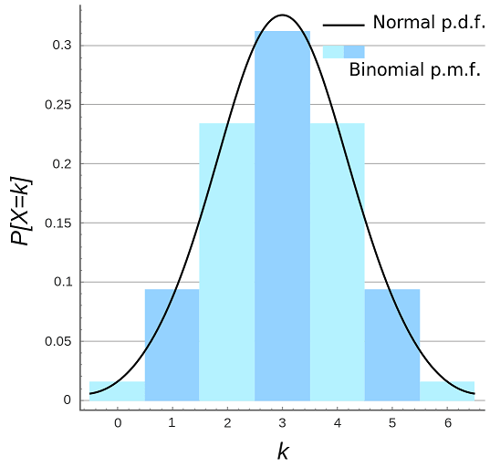

# 離散分佈

## 資料類型

數據類型（統計學裡也叫隨機變數）有兩種。**離散與連續資料**。

離散資料就是資料的取值是不連續的。例如擲硬幣就是一個典型的離散數據，因為拋硬幣的就2種數值（正面或反面）。

連續資料能取任意的數值。例如時間就是一個典型的連續數據1.25分鐘、1.251分鐘，1.2512分鐘，它能無限分割。

資料在統計圖中的形狀，叫做它的**分佈（distribution）**。

## 二項分佈（bionomial distribution）

* 當遇到發生次數固定的事件，而感興趣的是事件成功（或）的次數，那麼就可以用二項分佈的公式快速計算出機率來。
* 假設事件次數$$N$$，令每一次成功的機率都是相等的，成功的機率用$$p$$表示。目標是算出$$N$$次事件中，成功$$k$$次的機率。

### 分佈與統計量

* 隨機變數$$X \sim B(N,p)$$
* 機率質量函數（probability mass function） $$f(k|N,p)=\mathrm{P}(X=k)=\binom{N}{k} p^k (1−p)^{N−k}$$
* 期望值 $$\mathrm{E}(X) = Np$$
* 變異數 $$\mathrm{Var}(X) = Np(1-p)$$
* 偏度 $$\gamma_1 \equiv \mathrm{E} \bigg( (\frac{X-\mu}{\sigma})^3\bigg) = \frac{1-2p}{\sqrt{Np(1-p)}}$$

### 獨立的二項分佈變數之和

$$X \sim B(N_X, p), Y \sim B(N_Y, p)$$且兩隨機變數獨立，則 $$X+Y \sim B( N_X + N_Y, p)$$

### 二項分布可逼近常態分佈

若試驗的次數$$N$$足夠大時，且機率$$p$$固定不變時，二項式分佈近似於常態分佈
。即$$B(N, p) \rightarrow N(Np, Np(1-p))$$as $$ N \rightarrow \infty$$。

## 幾何分佈（geometric distribution）

參數$$N,p$$意義同二次分佈，如果需要知道嘗試多次，能取得第一次成功的機率，則為幾何分佈，如：射擊，首次擊中目標時的次數。有兩種型式：

* 在伯努利試驗中，得到第一次成功所需要的試驗次數$$X$$。$$X$$的值域是$$\{ 1, 2, 3, \ldots \}$$。
  * 如果每次試驗的成功機率是$$p$$，那麼$$k$$次試驗中，第$$k$$次才得到成功的機率是$$\mathrm{P}(X=k)=(1-p)^{k-1}p$$, $$k=1,2,\cdots$$。
* 在得到第一次成功之前所經歷的失敗次數$$Y = X − 1$$。$$Y$$的值域是$$\{0,1,2,3,\ldots\}$$。
  * $$\mathrm{P}(Y=k)=(1-p)^k p$$, $$k=0,1,2,\ldots,$$。

實際使用中指的是哪一個取決於慣例和使用方便。這兩種分布不應該混淆。前一種形式（$$X$$的分布）經常被稱作shifted geometric distribution；但是，為了避免歧義，最好明確地說明取值範圍。

### 分佈與統計量

* 隨機變數 $$X \sim G(p)$$
* 期望值 $$\mathrm{E}(X)=\frac{1}{p}$$
* 變異數 $$\mathrm{Var}(X)=\frac{1-p}{p^2}$$

### 幾何分布具有非記憶性的性質（Memoryless Property）

如果一個隨機變數呈幾何分布，它的條件機率遵循：$$\displaystyle \mathrm{P}(T>s+t\;|\;T>t)= \mathrm{P}(T>s) ~ \forall s, t  \in \mathbb{N}.$$

## 泊松分佈（Poisson distribution）

## 

