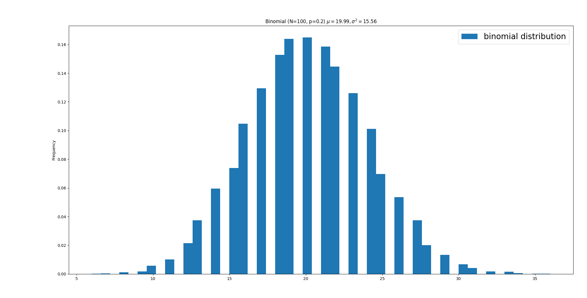
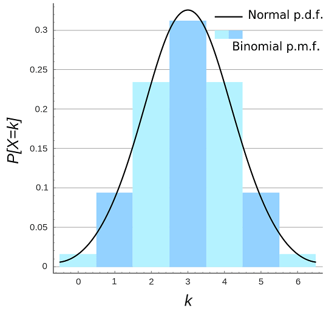

# 二項式分佈

## 簡介

二項分佈是一種描述獨立重複試驗成功次數的分佈。

當遇到發生次數$$N$$固定的獨立事件，而感興趣的是事件成功$$x$$的次數$$k$$，那麼就可以用二項分佈的公式快速計算出機率。

假設獨立事件次數$$N$$，令每一次成功的機率都是相等的，成功的機率用$$p$$表示。目標是算出$$N$$次事件中，成功$$k$$次的機率。

### 與其他分佈的關係

* **伯努利分佈**：二項式分佈是$$N=1$$時的特例。
* **負二項式分佈**：描述達到$$r$$次成功所需的試驗次數。
* **超幾何分佈**：類似二項式，但試驗不獨立（無放回抽樣）。
* **常態分佈**
  ：若試驗的次數$$N$$足夠大時，且機率$$p$$固定不變時(一般$$Np>5$$且$$N(1-p) > 5$$)，二項式分佈近似於常態分佈
  。即$$B(N, p) \rightarrow N(Np, Np(1-p))$$。
* **泊松分佈**：試驗的次數$$N$$足夠大時，且機率$$p$$很小時，$$Np \approx \lambda$$。$$X \sim \text{Poisson}(Np)$$。









```python
import matplotlib.pyplot as plt
import numpy as np
import scipy.stats as spstats

def binomial_distribution(n_point=10000, n=100, p=0.2):
    # 生成二項式分佈隨機變數
    values = np.random.binomial(n, p, n_point)
    q = 1 - p

    # 以套件計算動差
    mu = values.mean()
    var = values.var()
    skew = spstats.skew(values)
    kurt = spstats.kurtosis(values)

    # skewness of scipy, Fisher-Pearson coefficient
    m2 = ((values - mu) ** 2).mean()  # variance
    m3 = ((values - mu) ** 3).mean()
    g1 = m3 / (m2 ** 1.5)
    g1f = (q - p) / np.sqrt(n * p * q)  # 偏度公式與樣本計算值偏差大

    # kurtosis of scipy
    m4 = ((values - mu) ** 4).mean()
    g2 = m4 / m2 / m2 - 3
    g2f = (1 - 6 * p * q) / (n * p * q)  # 峰度公式與樣本計算值偏差大
    print(f"{mu}, var:{var}, m2:{m2} "
          f"skew: {skew}, {g1}, {g1f}, "
          f"kurt:{kurt}, {g2}, {g2f}")

    # 驗證套件與手動計算動差的一致性
    np.testing.assert_approx_equal(mu, n * p, significant=2)
    np.testing.assert_approx_equal(var, n * p * (1 - p), significant=2)
    np.testing.assert_approx_equal(var, m2, significant=7)
    np.testing.assert_approx_equal(skew, g1, significant=7)
    np.testing.assert_approx_equal(kurt, g2, significant=7)
    
    # plot
    fig, ax = plt.subplots()
    ax.hist(values, bins=50, density=True, label='binomial distribution')
    ax.set_ylabel('Frequency')
    ax.set_title(f'Binomial (N=100, p=0.2) $\mu = {mu:.2f}, \sigma^2={var:.2f}$')
    ax.legend(fontsize=20)
    fig.tight_layout()
    plt.show()

if __name__ == '__main__':
    binomial_distribution()

```



### 分佈與統計量

* 隨機變數$$X \sim B(N,p)$$
* 機率質量函數（probability mass function） $$f(k|N,p)=\mathrm{P}(X=k)=\binom{N}{k} p^k (1−p)^{N−k}$$
* 期望值 $$\mathrm{E}(X) = Np$$
* 變異數 $$\mathrm{Var}(X) = Np(1-p)$$
* 偏度 $$\gamma_1 \equiv \mathrm{E} \bigg( (\frac{X-\mu}{\sigma})^3\bigg) = \frac{1-2p}{\sqrt{Np(1-p)}}$$
  * $$p=0.5$$，對稱分佈$$\gamma_1 = 0$$。
  * $$p < 0.5$$，右偏(正偏)。
  * $$p> 0.5)$$，左偏(負偏)。
* 峰度 $$\gamma_2 = \frac{1-6p(1-p)}{np(1-p)}$$ ，當$$n \to \infty$$時，$$\gamma_2 \to 0$$。
  * 或$$\gamma_2 = 3 - \frac{6}{n} + \frac{1}{np(1-p)}$$，當$$n \to \infty$$時，$$\gamma_2 \to 3$$，與常態分佈相同。

### 動差生成函數(moment generating function)

$$M_X(t)= \mathrm{E}(e^{tX}) = (1-p+pe^t)^N$$

## 特徵函數(charcteristic function)

> $$\phi_X(t)= \mathrm{E} (e^{itX})= (1-p+pe^{it})^N$$

## 機率母函式（Probability Generating Function, PGF）

> $$G_X(s)=\mathrm{E}(S^X)=(1-p+ps)^N$$

## 參數對稱性

> 若$$X \sim B(N,p)$$，則$$Y= N - X \sim B(N, 1-p)$$
>
> 這表示成功與失敗是對稱的，可以透過變換來計算失敗次數的分佈。

### 獨立的二項分佈變數之和

$$X \sim B(N_X, p), Y \sim B(N_Y, p)$$且兩隨機變數獨立，則 $$X+Y \sim B( N_X + N_Y, p)$$


### python code

```python
import numpy as np
import scipy.stats as spstats

def independent_binomial_dist(n_point=10000, n1=100, n2=500, p=0.9):
    x1s = np.random.binomial(n1, p, n_point)
    x2s = np.random.binomial(n2, p, n_point)
    x12s = np.random.binomial(n1+n2, p, n_point)

    # 只有一、二階中央動差比較接近
    for k in range(1, 6):
        mk1 = spstats.moment(x1s, k)
        mk2 = spstats.moment(x2s, k)
        mk12 = spstats.moment(x12s, k)
        print(f"{k}th center moment: 
        {mk1}, {mk2}, {mk1+mk2}, {mk12}")

if __name__ == '__main__':
    independent_binomial_dist()
```

### 二項分布可逼近常態分佈

若試驗的次數$$N$$足夠大時，且機率$$p$$固定不變時(一般$$Np>5$$且$$N(1-p) > 5$$)，二項式分佈近似於常態分佈
。

即$$B(N, p) \rightarrow N(Np, Np(1-p))$$as $$N \rightarrow \infty$$。



## 二項分布可逼近泊松分佈

若試驗的次數$$N$$足夠大時，且機率$$p$$很小時，$$Np \approx \lambda$$。$$X \sim \text{Poisson}(Np)$$。

適用於稀有事件，如機器故障率、呼叫中心來電數）。
