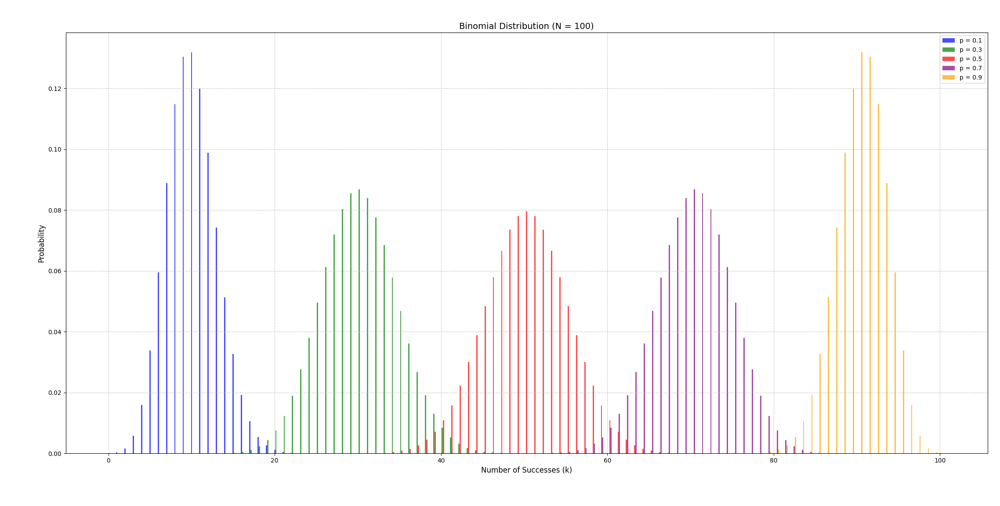
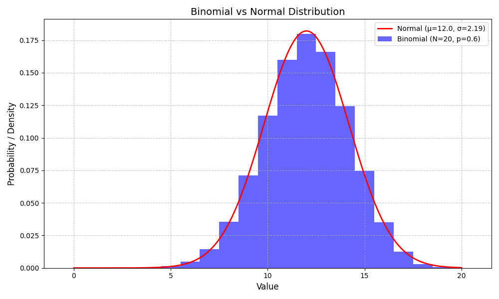
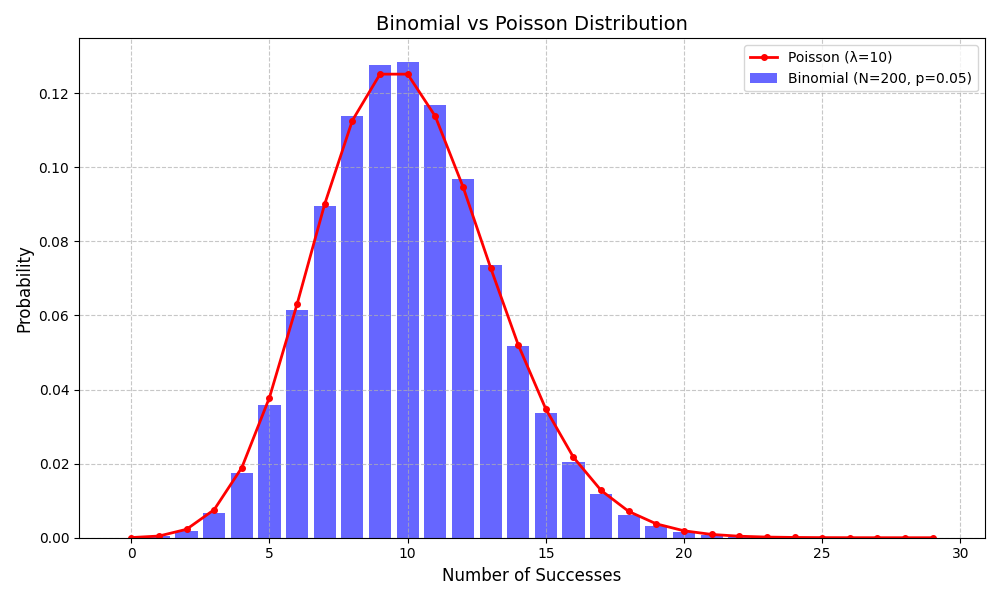

# 二項式分佈

## 簡介

二項分佈是一種描述獨立重複試驗成功次數的分佈。

當遇到發生次數$$N$$固定的獨立事件，而感興趣的是事件成功$$x$$的次數$$k$$，那麼就可以用二項分佈的公式快速計算出機率。

假設獨立事件次數$$N$$，令每一次成功的機率都是相等的，成功的機率用$$p$$表示。目標是算出$$N$$次事件中，成功$$k$$次的機率。

### 與其他分佈的關係

* **伯努利分佈**：二項式分佈是$$N=1$$時的特例。
* **負二項式分佈**：描述達到$$r$$次成功所需的試驗次數。
* **超幾何分佈**：類似二項式，但試驗不獨立（無放回抽樣）。
* **常態分佈**
  ：若試驗的次數$$N$$足夠大時，且機率$$p$$固定不變時(一般$$Np>5$$且$$N(1-p) > 5$$)，二項式分佈近似於常態分佈
  。即$$B(N, p) \rightarrow N(Np, Np(1-p))$$。
* **泊松分佈**：試驗的次數$$N$$足夠大時，且機率$$p$$很小時，$$Np \approx \lambda$$。$$X \sim \text{Poisson}(Np)$$。



<figure><figcaption><p>N=100，p=0.1, 0.3, 0.5, 0.7, 0.9時的二項式分佈</p></figcaption></figure>



```python
import numpy as np
import matplotlib.pyplot as plt
from scipy.stats import binom

# 參數設定
N = 100  # 試驗次數
p_values = [0.1, 0.3, 0.5, 0.7, 0.9]  # 不同成功概率
colors = ['blue', 'green', 'red', 'purple', 'orange']  # 對應顏色

# 創建 x 軸範圍（成功次數 k 的可能值）
x = np.arange(0, N + 1)

# 創建圖形
plt.figure(figsize=(12, 6))

# 繪製每個 p 值的二項式分佈柱狀圖
width = 0.15  # 柱寬
for i, (p, color) in enumerate(zip(p_values, colors)):
    # 計算二項式分佈的 PMF
    pmf = binom.pmf(x, N, p)
    # 繪製柱狀圖，偏移位置避免重疊
    plt.bar(x + i * width, pmf, width=width, color=color, label=f'p = {p}', alpha=0.7)

# 添加圖表元素
plt.title(f'Binomial Distribution (N = {N})', fontsize=14)
plt.xlabel('Number of Successes (k)', fontsize=12)
plt.ylabel('Probability', fontsize=12)
plt.grid(True, linestyle='--', alpha=0.7)
plt.legend()  # 添加圖例
plt.tight_layout()

# 顯示圖表
plt.show()
```



### 分佈與統計量

* 隨機變數$$X \sim B(N,p)$$
* 機率質量函數（probability mass function） $$f(k|N,p)=\mathrm{P}(X=k)=\binom{N}{k} p^k (1−p)^{N−k}$$
* 期望值 $$\mathrm{E}(X) = Np$$
* 變異數 $$\mathrm{Var}(X) = Np(1-p)$$
* 偏度 $$\gamma_1 \equiv \mathrm{E} \bigg( (\frac{X-\mu}{\sigma})^3\bigg) = \frac{1-2p}{\sqrt{Np(1-p)}}$$
  * $$p=0.5$$，對稱分佈$$\gamma_1 = 0$$。
  * $$p < 0.5$$，右偏(正偏)。
  * $$p> 0.5)$$，左偏(負偏)。
* 峰度 $$\gamma_2 = \frac{1-6p(1-p)}{np(1-p)}$$ ，當$$n \to \infty$$時，$$\gamma_2 \to 0$$。
  * 或$$\gamma_2 = 3 - \frac{6}{n} + \frac{1}{np(1-p)}$$，當$$n \to \infty$$時，$$\gamma_2 \to 3$$，與常態分佈相同。

### 動差生成函數(moment generating function)

$$M_X(t)= \mathrm{E}(e^{tX}) = (1-p+pe^t)^N$$

## 特徵函數(charcteristic function)

> $$\phi_X(t)= \mathrm{E} (e^{itX})= (1-p+pe^{it})^N$$

## 機率母函式（Probability Generating Function, PGF）

> $$G_X(s)=\mathrm{E}(S^X)=(1-p+ps)^N$$

## 參數對稱性

> 若$$X \sim B(N,p)$$，則$$Y= N - X \sim B(N, 1-p)$$
>
> 這表示成功與失敗是對稱的，可以透過變換來計算失敗次數的分佈。

### 獨立的二項分佈變數之和

$$X \sim B(N_X, p), Y \sim B(N_Y, p)$$且兩隨機變數獨立，則 $$X+Y \sim B( N_X + N_Y, p)$$


### python code

```python
import numpy as np
import scipy.stats as spstats

def independent_binomial_dist(n_point=10000, n1=100, n2=500, p=0.9):
    x1s = np.random.binomial(n1, p, n_point)
    x2s = np.random.binomial(n2, p, n_point)
    x12s = np.random.binomial(n1+n2, p, n_point)

    # 只有一、二階中央動差比較接近
    for k in range(1, 6):
        mk1 = spstats.moment(x1s, k)
        mk2 = spstats.moment(x2s, k)
        mk12 = spstats.moment(x12s, k)
        print(f"{k}th center moment: 
        {mk1}, {mk2}, {mk1+mk2}, {mk12}")

if __name__ == '__main__':
    independent_binomial_dist()
```

### 二項分布可逼近常態分佈

若試驗的次數$$N$$足夠大時，且機率$$p$$固定不變時(一般$$Np>5$$且$$N(1-p) > 5$$)，二項式分佈近似於常態分佈
。

即$$B(N, p) \rightarrow N(Np, Np(1-p))$$as $$N \rightarrow \infty$$。




<figure><figcaption><p>二項式分佈逼近常態分佈</p></figcaption></figure>



```python
import numpy as np
import matplotlib.pyplot as plt
from scipy.stats import binom, norm

# 參數設定
N = 20  # 二項式分佈的試驗次數
p = 0.6  # 二項式分佈的成功概率
mu_normal = N*p  # 正態分佈均值
sigma_normal = np.sqrt(N*p*(1-p))  # 正態分佈標準差

# 創建 x 軸範圍
x_binom = np.arange(0, N + 1)  # 二項式分佈的 k 值
x_normal = np.linspace(0, 20, 1000)  # 正態分佈的連續範圍，涵蓋二項式範圍

# 計算分佈
binom_pmf = binom.pmf(x_binom, N, p)  # 二項式分佈 PMF
normal_pdf = norm.pdf(x_normal, mu_normal, sigma_normal)  # 正態分佈 PDF

# 創建圖形
plt.figure(figsize=(10, 6))

# 繪製二項式分佈（柱狀圖）
plt.bar(x_binom, binom_pmf, width=1.0, color='blue', alpha=0.6, label=f'Binomial (N={N}, p={p})')

# 繪製正態分佈（曲線）
plt.plot(x_normal, normal_pdf, color='red', linewidth=2, label=f'Normal (μ={mu_normal}, σ={sigma_normal:.2f})')

# 添加圖表元素
plt.title('Binomial vs Normal Distribution', fontsize=14)
plt.xlabel('Value', fontsize=12)
plt.ylabel('Probability / Density', fontsize=12)
plt.grid(True, linestyle='--', alpha=0.7)
plt.legend()
plt.tight_layout()

# 顯示圖表
plt.show()
```



## 二項分布可逼近泊松分佈

若試驗的次數$$N$$足夠大時(一般建議$$𝑁\geq 20$$，最好$$𝑁 \geq 100$$)，且機率$$p$$很小時(建議$$p \leq 0.1$$)，$$Np \approx \lambda$$(通常$$\lambda \leq 20$$或更小)。$$X \sim \text{Poisson}(Np)$$。

適用於稀有事件，如機器故障率、呼叫中心來電數）。

當$$p > 0.1$$時，逼近效果變差，因為變異數差異顯著，且二項式分佈趨向正態分佈而非泊松分佈。



<figure><figcaption><p>二項式分佈逼近泊松分佈</p></figcaption></figure>



```python
import numpy as np
import matplotlib.pyplot as plt
from scipy.stats import binom, poisson

# 參數設定
N = 200  # 二項式分佈的試驗次數
p = 0.05  # 二項式分佈的成功概率
lambda_poisson = 10  # 泊松分佈的參數

# 創建 x 軸範圍
x_binom = np.arange(0, 30)  # 二項式分佈的 k 值，限制在 0-30（涵蓋主要概率區域）
x_poisson = np.arange(0, 30)  # 泊松分佈的離散範圍

# 計算分佈
binom_pmf = binom.pmf(x_binom, N, p)  # 二項式分佈 PMF
poisson_pmf = poisson.pmf(x_poisson, lambda_poisson)  # 泊松分佈 PMF

# 創建圖形
plt.figure(figsize=(10, 6))

# 繪製二項式分佈（柱狀圖）
plt.bar(x_binom, binom_pmf, width=0.8, color='blue', alpha=0.6, label=f'Binomial (N={N}, p={p})')

# 繪製泊松分佈（點圖連線）
plt.plot(x_poisson, poisson_pmf, color='red', linewidth=2, marker='o', markersize=4, 
         label=f'Poisson (λ={lambda_poisson})')

# 添加圖表元素
plt.title('Binomial vs Poisson Distribution', fontsize=14)
plt.xlabel('Number of Successes', fontsize=12)
plt.ylabel('Probability', fontsize=12)
plt.grid(True, linestyle='--', alpha=0.7)
plt.legend()
plt.tight_layout()

# 顯示圖表
plt.show()
```


